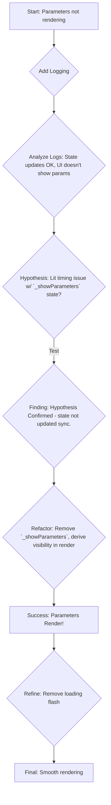

# Redux Migration: Phase 3-6 Summary & Parameter Refactor

This document summarizes the significant refactoring effort undertaken during Phases 3 through 6 of the Redux migration. This phase marked a shift from initial component adaptation towards a deeper integration, involving the removal of core legacy services and direct component connection to the Redux store.

## Context: The Shift to Full Redux

Initial phases focused on establishing the Redux foundation and using adapter patterns for gradual integration. Phases 3-6 represent a deeper commitment, moving beyond adapters to:

*   Deconstruct and replace the monolithic `ParameterService`.
*   Refactor core layout components to consume Redux state directly.
*   Implement data fetching, updates, and complex logic (like parameter condition evaluation) within the Redux ecosystem (slices, thunks, selectors).
*   Address the cascading challenges and bugs arising from removing tightly coupled legacy services.

This was a complex and challenging phase, but ultimately resulted in a more robust, maintainable, and purely Redux-driven state management system.

## Phase 3.5/4: Deconstructing `ParameterService`

The legacy `ParameterService` was a central hub for parameter data fetching, caching, condition evaluation, and API updates. Migrating its responsibilities was a critical step.

**Goals:**

*   Move data fetching logic to Redux async thunks.
*   Store parameter data and loading states in a dedicated Redux slice.
*   Re-implement condition evaluation logic using Redux selectors.
*   Handle API updates for parameters via thunks.

**Implementation:**

1.  **Redux Structure:** Created `parameterActions.ts`, `parameterThunks.ts`, `parametersSlice.ts`, and `parameterSelectors.ts`.
2.  **Data Fetching:** Implemented `fetchParametersForPart` and `fetchParametersForReferencedParts` thunks using `InvenTreeDirectAPI`, handling loading/error states per part.
3.  **Data Updating:** Implemented `updateParameterValue` thunk for API interaction.
4.  **State Management (`parametersSlice`):**
    *   Normalized parameter data storage (`parameterValues`).
    *   Managed granular loading/error states (`loadingStatus`).
    *   Handled thunk lifecycle actions via `extraReducers`.
5.  **Condition Logic (`parameterSelectors`):**
    *   Ported helper functions (`compareValues`, `applyAction`).
    *   Implemented `resolveParameterValue` to handle local and cross-part parameter lookups (`part:<id>:<param_name>`).
    *   Created `selectVisualModifiers` and `selectPartVisibility` selectors to compute UI changes based on conditions and Redux state.

**Parameter Data Flow (Simplified):**

```mermaid
graph LR
    A[Component (e.g., detail-layout)] -- Dispatches --> B(fetchParameters Thunk);
    B -- Initiates API Call --> C{InvenTree API};
    C -- Returns Data --> B;
    B -- Dispatches Fulfilled Action --> D[parametersSlice Reducer];
    D -- Updates State --> E((Redux Store));
    F[Component Selector (e.g., selectParametersForPart)] -- Reads State --> E;
    F -- Provides Data --> A;
    A -- Renders --> G[UI Display];
```

**Challenges:**

*   Initial failures in fetching due to missing API configuration access in thunks after `configSlice` removal (resolved by creating `apiSlice`).
*   Incorrect API endpoint used for parameter fetching (corrected in `api.ts`).

## Phase 3/4: Component Refactoring

With parameter logic moving to Redux, core layout components needed refactoring.

**Goals:**

*   Remove dependencies on `ParameterService`, `InventreeState`.
*   Utilize `ReduxLitElement` base class.
*   Connect components directly to Redux using selectors for data and status.
*   Dispatch Redux actions/thunks for interactions (e.g., button clicks).

**Key Changes:**

*   **Layouts (`detail`, `grid`, `list`, `parts`, `variant`):** Updated to use `selectVisualModifiers`, `selectPartVisibility`, `selectParametersForPart`, etc. Replaced direct service calls with Redux dispatches.
*   **`BaseLayout` Removal:** The common base layout became redundant and was removed.

**Challenges:**

*   Extensive build errors after removing legacy slices (`configSlice`) due to lingering imports across multiple files.

## Phase 6: Cleanup & Debugging Deep Dive

This phase focused on stabilizing the system after major refactoring.

**Key Debugging Efforts:**

1.  **`configSlice` Removal Fallout:**
    *   **Problem:** Deleting `configSlice` caused widespread TS2307 build errors (module not found) as many components/services still imported it or its selectors.
    *   **Resolution:** Systematically removed imports and updated logic in numerous files (`detail-layout`, `list-layout`, `parts-layout`, `variant-layout`, `inventree-card`, `websocketMiddleware`, etc.) to use `this.config` or data passed via props/other slices. Required significant manual intervention due to the interconnectedness.

2.  **Parameter Fetching Runtime Errors:**
    *   **Problem:** `Failed to fetch parameters` errors at runtime.
    *   **Root Cause:** Thunks lost access to API URL/Key after `configSlice` removal.
    *   **Resolution:** Created `apiSlice` to store API configuration, updated `inventree-card.ts` to populate it, and modified thunks to select credentials from `apiSlice`. Also corrected the API endpoint in `api.ts`.

3.  **Parameter Rendering in `detail-layout`:**
    *   **Problem:** Parameters fetched successfully and state updated, but the UI section didn't render the data.
    *   **Investigation & Resolution:** (Detailed in the diagram below)
        *   Added extensive logging, confirming state updates reached the component.
        *   Identified a LitElement lifecycle timing issue: an internal state variable (`_showParameters`) used for visibility wasn't updating reliably when the parameter status changed asynchronously.
        *   Refactored to remove the intermediate state, deriving visibility directly from config and parameter status within the render cycle.
        *   Further refined rendering to handle background refreshes smoothly without flashing a "Loading..." state.

**Parameter Rendering Debug Flow:**



## Current Status & Future Vision

We have successfully navigated a complex refactoring phase, resulting in:

*   Removal of the legacy `ParameterService`.
*   Direct integration of core components with Redux.
*   Robust parameter fetching, updating, and condition evaluation within Redux.
*   Resolution of significant build and runtime errors.
*   Implementation of cross-part parameter condition evaluation.

A solid foundation is now in place. The successful implementation of dynamic cross-part conditions (like the `part:146:microwavables` example) opens up exciting possibilities for creating highly interactive and context-aware dashboard elements, as envisioned with the "microwave dashboard" concept. This demonstrates the power and flexibility of the new architecture.

This phase was a significant undertaking, but the resulting codebase is cleaner, more aligned with Redux principles, and better positioned for future development. 