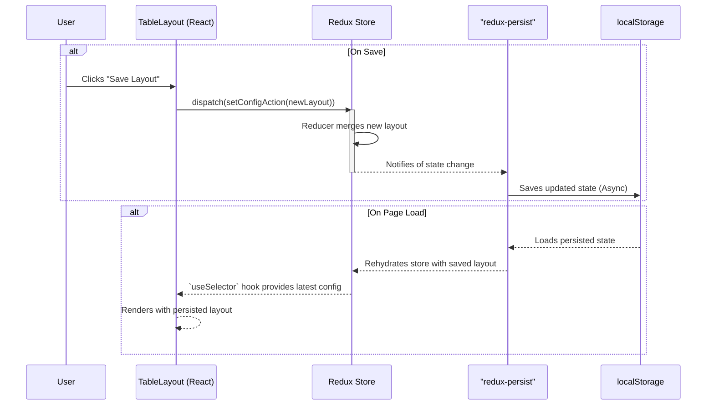

# Debugging Grid Layout Persistence - v2 (The Redux Saga)

This document outlines the final architecture and debugging history for the layout persistence feature.

## 1. The Goal

When a user in the `TableLayout` view drags/drops cells, resizes them, or reorders columns and clicks "Save," the new layout should be visually updated immediately and persist across page reloads.

## 2. Final Architecture: Redux Persist

The solution uses `redux-persist` to save the relevant part of the Redux store to the browser's `localStorage`. This decouples the UI state from Home Assistant's configuration, providing a more robust and responsive experience.

### Data Flow

## 3. The Debugging Journey: A Series of Fixes

Achieving the final architecture required solving several nested issues:

1.  **Shallow Merge Bug:** The `configSlice` reducer was initially performing a shallow merge, which overwrote the entire `layout` object instead of merging changes.
    *   **Fix:** Switched to a `mergeDeep` utility to correctly combine the existing and new configurations.

2.  **Read-Only State Error:** Redux freezes state objects in development. The `react-grid-layout` component tried to modify this frozen state directly, causing a crash.
    *   **Fix:** Created a deep copy (`JSON.parse(JSON.stringify(...))`) of the layout from the Redux store before passing it to the grid component.

3.  **Initial Config Race Condition:** On page load, Home Assistant would send the "clean" config from `ui-lovelace.yaml`, and our reducer would use it to overwrite the already-rehydrated state from `redux-persist`.
    *   **Fix:** Made the reducer smarter. It now checks if a persisted layout exists and prevents the incoming "clean" config from overwriting it.

4.  **Stale Props Race Condition:** Even with the reducer fixed, the `TableLayout` component was sometimes rendering with stale props passed down from its Lit parent before the Redux state was fully updated.
    *   **Fix:** Refactored `TableLayout` to ignore the `config` prop and **always** get its state directly from the Redux store using the `useSelector` hook. This ensures it's always using the single source of truth.

5.  **Regressions & Feature Gaps:**
    *   **Column Order:** The save function was only persisting cell positions, not the order of the columns themselves.
    *   **Thumbnails:** A fix inadvertently broke the initial generation of the layout, causing the thumbnail column to disappear.
    *   **Fix:** Enhanced the save function to persist the `columns` array alongside the `layout_overrides`. Modified the initial layout generation logic to correctly use the `columns` from the component's state.

## 4. Current Status & Next Steps

All known bugs have been addressed and the corresponding fixes have been implemented and built.

-   [ ] **Verify Thumbnail Display:** Confirm thumbnails render correctly in the `TableLayout`.
-   [ ] **Verify Layout Persistence:** Confirm that dragging/dropping/resizing cells, saving, and reloading correctly restores the layout.
-   [ ] **Verify Column Order Persistence:** Confirm that reordering columns, saving, and reloading correctly restores the new column order.
-   [ ] **Cleanup:** Once all functionality is verified, remove all temporary `console.log` statements from the codebase.
-   [ ] **Close Issue:** Mark the bug as resolved.
