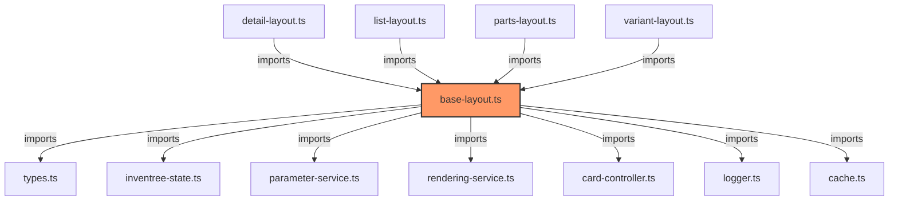

# base-layout.ts

**Path:** `components/common/base-layout.ts`  
**Line Count:** 849  
**Functions:** 17  

## Overview

This component is part of the `components/common` directory.

## Lifecycle Methods

- `connectedCallback`
- `disconnectedCallback`
- `updated`

## Event Handlers

- `addListener`
- `addListener`

## Component Dependencies

## Detailed Documentation

For full implementation details, see the [base-layout.ts](../files/base-layout.md) file documentation.

