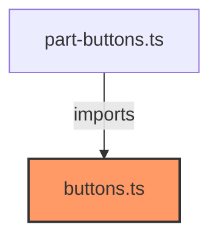

# buttons.ts

**Path:** `styles/components/buttons.ts`  
**Line Count:** 75  
**Functions:** 0  

## Overview

This component is part of the `styles/components` directory.

## Component Dependencies

## Detailed Documentation

For full implementation details, see the [buttons.ts](../files/buttons.md) file documentation.

