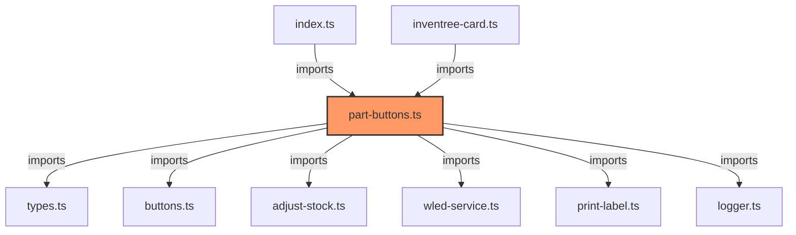

# part-buttons.ts

**Path:** `components/part/part-buttons.ts`  
**Line Count:** 351  
**Functions:** 9  

## Overview

This component is part of the `components/part` directory.

## Lifecycle Methods

- `updated`
- `connectedCallback`
- `render`

## Event Handlers

- `handleClick`

## Component Dependencies

## Detailed Documentation

For full implementation details, see the [part-buttons.ts](../files/part-buttons.md) file documentation.

