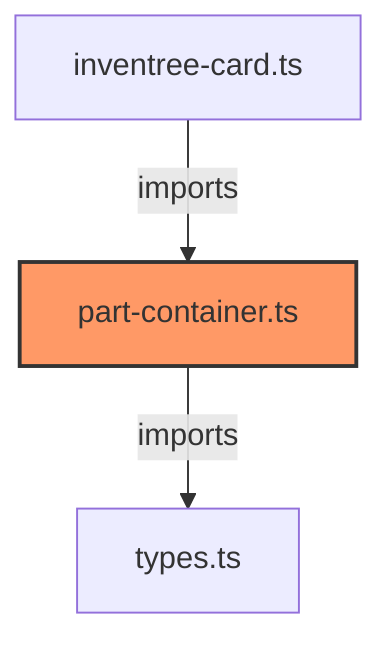

# part-container.ts

**Path:** `components/part/part-container.ts`  
**Line Count:** 238  
**Functions:** 3  

## Overview

This component is part of the `components/part` directory.

## Lifecycle Methods

- `updated`
- `render`

## Component Dependencies

## Detailed Documentation

For full implementation details, see the [part-container.ts](../files/part-container.md) file documentation.

