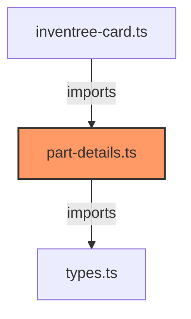

# part-details.ts

**Path:** `components/part/part-details.ts`  
**Line Count:** 96  
**Functions:** 1  

## Overview

This component is part of the `components/part` directory.

## Lifecycle Methods

- `render`

## Component Dependencies

## Detailed Documentation

For full implementation details, see the [part-details.ts](../files/part-details.md) file documentation.

