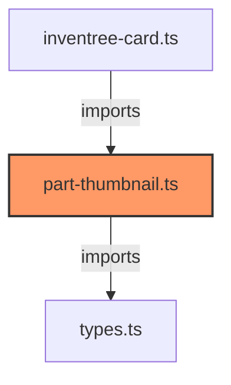

# part-thumbnail.ts

**Path:** `components/part/part-thumbnail.ts`  
**Line Count:** 84  
**Functions:** 1  

## Overview

This component is part of the `components/part` directory.

## Lifecycle Methods

- `render`

## Component Dependencies

## Detailed Documentation

For full implementation details, see the [part-thumbnail.ts](../files/part-thumbnail.md) file documentation.

