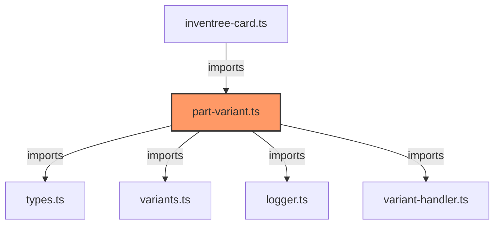

# part-variant.ts

**Path:** `components/part/part-variant.ts`  
**Line Count:** 227  
**Functions:** 6  

## Overview

This component is part of the `components/part` directory.

## Lifecycle Methods

- `updated`
- `render`

## Component Dependencies

## Detailed Documentation

For full implementation details, see the [part-variant.ts](../files/part-variant.md) file documentation.

