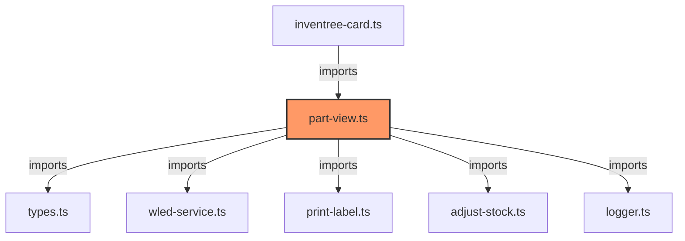

# part-view.ts

**Path:** `components/part/part-view.ts`  
**Line Count:** 272  
**Functions:** 7  

## Overview

This component is part of the `components/part` directory.

## Lifecycle Methods

- `updated`
- `render`

## Component Dependencies

## Detailed Documentation

For full implementation details, see the [part-view.ts](../files/part-view.md) file documentation.

