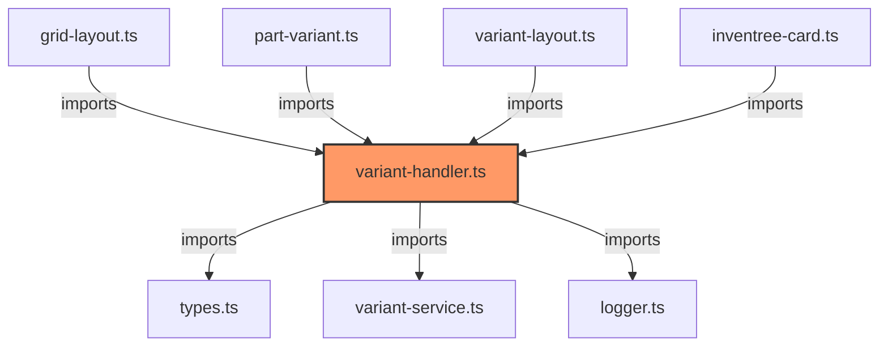

# variant-handler.ts

**Path:** `components/common/variant-handler.ts`  
**Line Count:** 165  
**Functions:** 5  

## Overview

This component is part of the `components/common` directory.

## Component Dependencies

## Detailed Documentation

For full implementation details, see the [variant-handler.ts](../files/variant-handler.md) file documentation.

