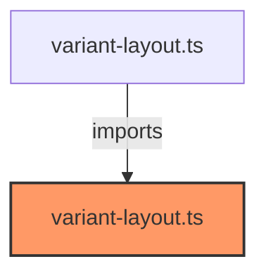

# variant-layout.ts

**Path:** `styles/layouts/variant-layout.ts`  
**Line Count:** 219  
**Functions:** 0  

## Overview

This component is part of the `styles/layouts` directory.

## Component Dependencies

## Detailed Documentation

For full implementation details, see the [variant-layout.ts](../files/variant-layout.md) file documentation.

