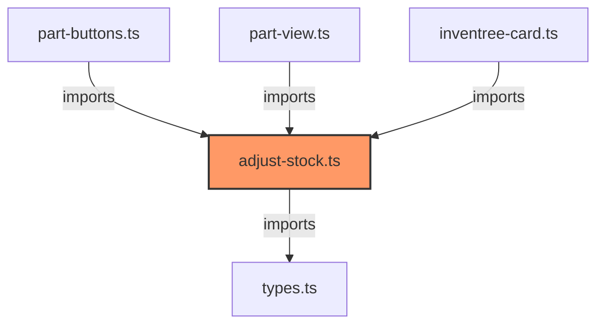

# adjust-stock.ts

**Path:** `services/adjust-stock.ts`  
**Line Count:** 45  
**Functions:** 2  

## Overview

This file is part of the `services` directory.

## Imports

- custom-card-helpers: HomeAssistant
- [[types|types]]: InvenTreePart

## Exports

- `StockService`

## Functions

### Class: StockService

### `adjustStock` (🌐 Public) {#adjustStock}

**Parameters:**

- `part`: `InvenTreePart`
- `amount`: `number`

**Returns:** `Promise<void>`

**Calls:**

- [[adjust-stock|adjust-stock]]#getEntityId
- `this.hass.states[entity_id].attributes.items.map`
- `this.hass.callService`

**Called By:**

- From [[part-buttons|part-buttons]]:
  - `handleClick`
- From [[part-view|part-view]]:
  - `_adjustStock`

**Call Graph:**

```mermaid
flowchart LR
    adjustStock[adjustStock]:::current
    this_getEntityId[this.getEntityId]
    adjustStock -->|calls| this_getEntityId
    this_hass_states_entity_id__attributes_items_map[this.hass.states[entity_id].attributes.items.map]
    adjustStock -->|calls| this_hass_states_entity_id__attributes_items_map
    this_hass_callService[this.hass.callService]
    adjustStock -->|calls| this_hass_callService
    handleClick[handleClick]
    handleClick -->|calls| adjustStock
    _adjustStock[_adjustStock]
    _adjustStock -->|calls| adjustStock
    classDef current fill:#f96,stroke:#333,stroke-width:2px;
```

### `getEntityId` (🌐 Public) {#getEntityId}

**Parameters:**

- `part`: `InvenTreePart`

**Returns:** `string | null`

**Calls:**

- `Object.entries(this.hass.states).find`
- `Object.entries`
- `state.attributes?.items.some`

**Called By:**

- From [[adjust-stock|adjust-stock]]:
  - `adjustStock`

**Call Graph:**

```mermaid
flowchart LR
    getEntityId[getEntityId]:::current
    Object_entries_this_hass_states__find[Object.entries(this.hass.states).find]
    getEntityId -->|calls| Object_entries_this_hass_states__find
    Object_entries[Object.entries]
    getEntityId -->|calls| Object_entries
    state_attributes__items_some[state.attributes?.items.some]
    getEntityId -->|calls| state_attributes__items_some
    adjustStock[adjustStock]
    adjustStock -->|calls| getEntityId
    classDef current fill:#f96,stroke:#333,stroke-width:2px;
```

## Dependencies



