# api.ts

**Path:** `services/api.ts`  
**Line Count:** 869  
**Functions:** 24  

## Overview

This file is part of the `services` directory.

## Imports

- [[logger|logger]]: Logger

## Exports

- `InvenTreeDirectAPI`

## Functions

### Class: InvenTreeDirectAPI

### `setParameterService` (🌐 Public) {#setParameterService}

**Parameters:**

- `service`: `any`

**Returns:** `void`

### `getParameterValue` (🌐 Public) {#getParameterValue}

**Parameters:**

- `partId`: `number`
- `paramName`: `string`
- `fallbackData`: `any`

**Returns:** `Promise<string | null>`

**Calls:**

- [[logger|logger]]#log
- `Date.now`
- `setTimeout`
- `performance.now`
- `url.endsWith`
- `headers.append`
- `fetch`
- `response.json`
- `Math.round`
- `data.find`
- `templateName.toLowerCase`
- `paramName.toLowerCase`
- [[parameter-service|parameter-service]]#syncApiDataToEntityState
- [[api|api]]#notifyParameterChanged
- `data.forEach`

**Called By:**

- From [[inventree-state|inventree-state]]:
  - `findParameterInAllEntities`
- From [[inventree-card|inventree-card]]:
  - `_testSpecificParameter`
- From [[api|api]]:
  - `fetchParameterData`

**Call Graph:**

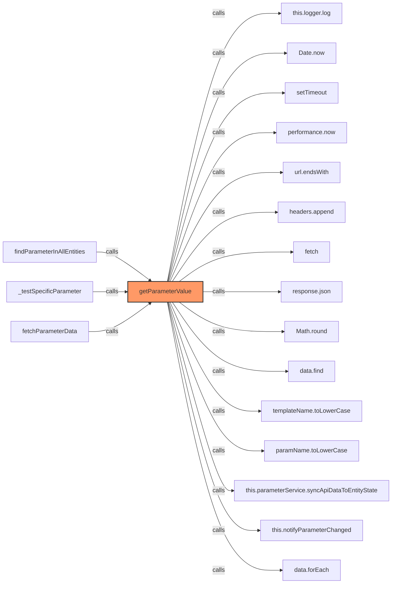

### `getFallbackParameterValue` (🌐 Public) {#getFallbackParameterValue}

**Parameters:**

- `paramName`: `string`
- `fallbackData`: `any`

**Returns:** `string | null`

**Calls:**

- [[logger|logger]]#log
- `Array.isArray`
- `part.parameters.find`
- `p.template_detail?.name.toLowerCase`
- `paramName.toLowerCase`

**Call Graph:**

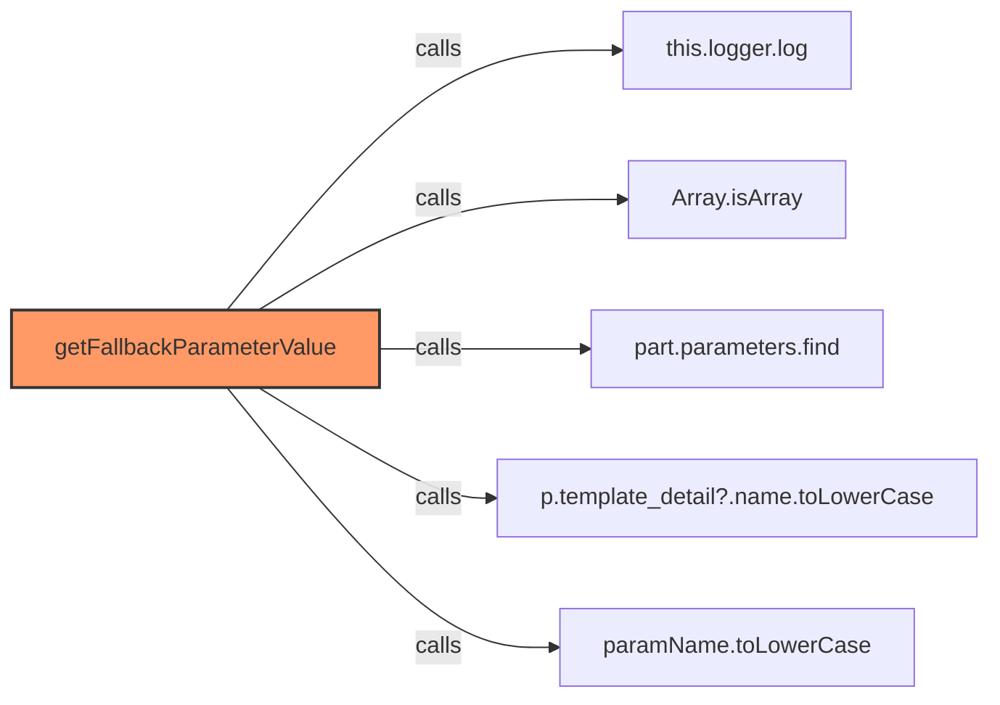

### `setFallbackEnabled` (🌐 Public) {#setFallbackEnabled}

**Parameters:**

- `enabled`: `boolean`

**Returns:** `void`

**Called By:**

- From [[api|api]]:
  - `testConnection`
  - `testParameterAPI`

**Call Graph:**

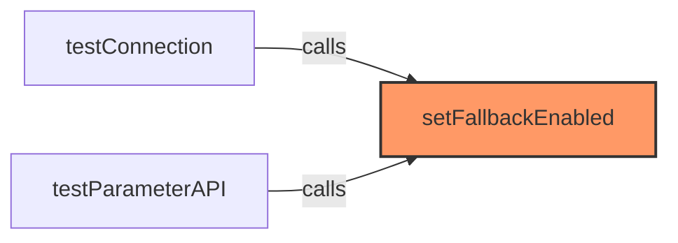

### `testConnection` (🌐 Public) {#testConnection}

**Parameters:**

- `quiet`: `boolean`

**Returns:** `Promise<boolean>`

**Calls:**

- `this.apiUrl.endsWith`
- `headers.append`
- `fetch`
- `paramHeaders.append`
- [[api|api]]#setFallbackEnabled
- `response.text`

**Call Graph:**

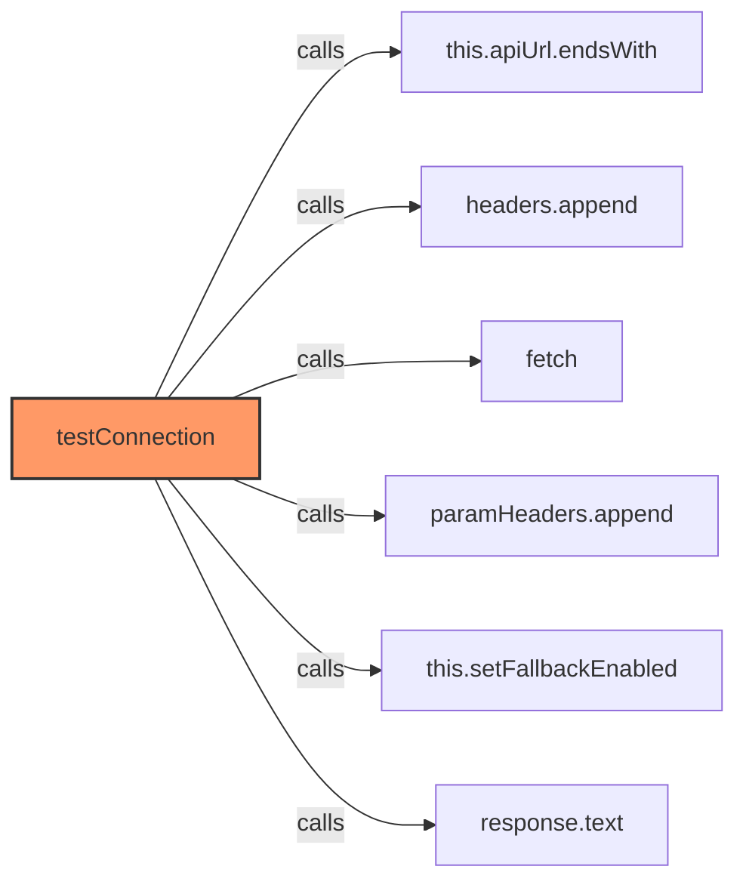

### `getApiStats` (🌐 Public) {#getApiStats}

**Returns:** `{ apiCalls: number, fallbackCalls: number }`

**Called By:**

- From [[parameter-service|parameter-service]]:
  - `getApiStats`

**Call Graph:**

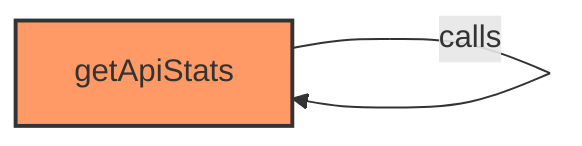

### `getApiUrl` (🌐 Public) {#getApiUrl}

**Returns:** `string`

### `testBasicAuth` (🌐 Public) {#testBasicAuth}

**Parameters:**

- `username`: `string`
- `password`: `string`

**Returns:** `Promise<boolean>`

**Calls:**

- `this.apiUrl.endsWith`
- [[logger|logger]]#log
- `btoa`
- `fetch`
- [[logger|logger]]#error

**Call Graph:**

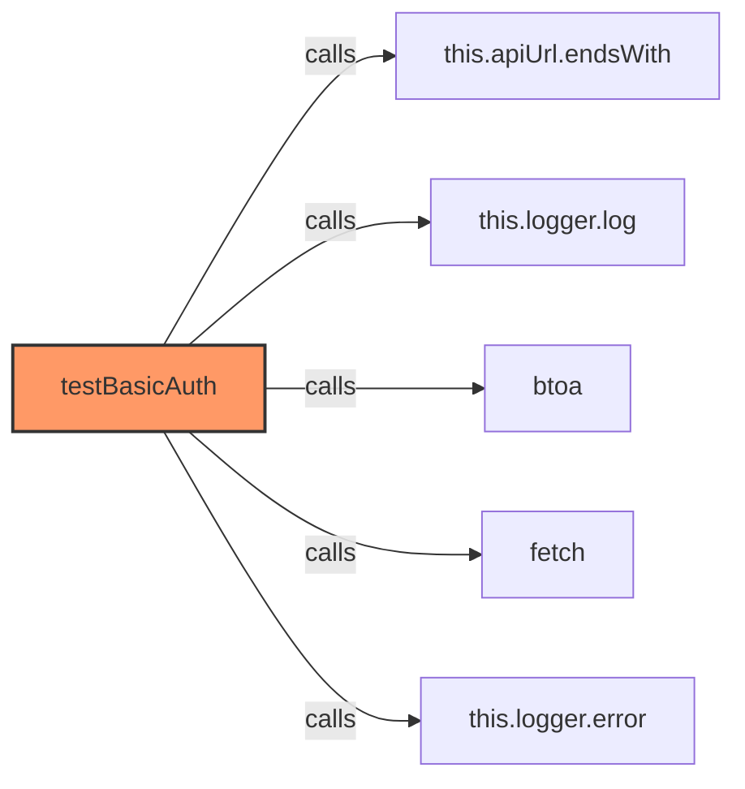

### `getPartParameters` (🌐 Public) {#getPartParameters}

**Parameters:**

- `partId`: `number`

**Returns:** `Promise<any[]>`

**Calls:**

- `url.startsWith`
- `url.replace`
- `url.endsWith`
- [[logger|logger]]#log
- `fetch`
- [[logger|logger]]#error
- `response.json`

**Call Graph:**

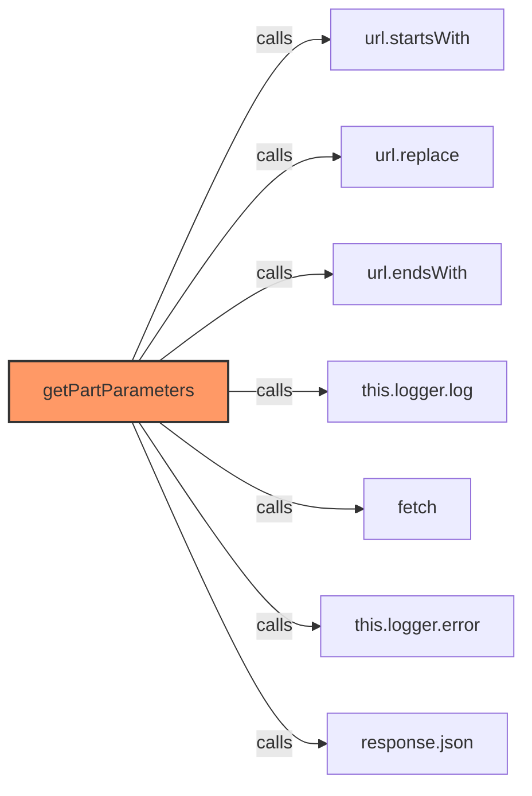

### `testBasicAuthWithEndpoint` (🌐 Public) {#testBasicAuthWithEndpoint}

**Parameters:**

- `username`: `string`
- `password`: `string`
- `endpoint`: `string`

**Returns:** `Promise<any>`

**Calls:**

- `this.apiUrl.endsWith`
- `btoa`
- `fetch`
- `response.json`

**Call Graph:**

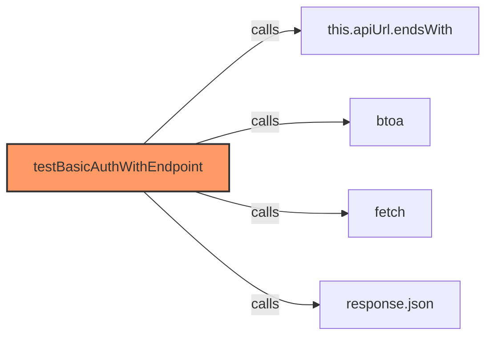

### `testConnectionExactFormat` (🌐 Public) {#testConnectionExactFormat}

**Parameters:**

- `quiet`: `boolean`

**Returns:** `Promise<boolean>`

**Calls:**

- `this.apiUrl.endsWith`
- `this.apiUrl.slice`
- `fetch`
- `response.json`
- [[api|api]]#testParameterAPI

**Call Graph:**

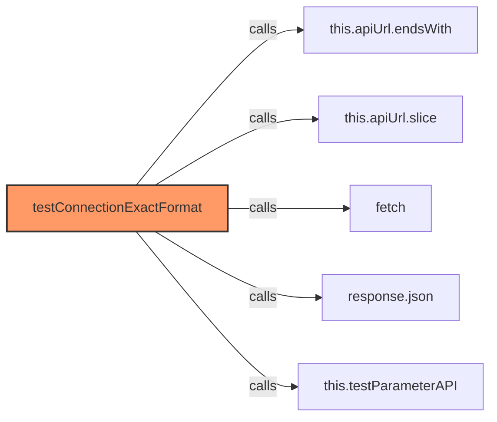

### `testParameterAPI` (🌐 Public) {#testParameterAPI}

**Parameters:**

- `quiet`: `boolean`

**Returns:** `Promise<boolean>`

**Calls:**

- `this.apiUrl.endsWith`
- `this.apiUrl.slice`
- `fetch`
- `response.json`
- [[api|api]]#setFallbackEnabled

**Called By:**

- From [[api|api]]:
  - `testConnectionExactFormat`

**Call Graph:**

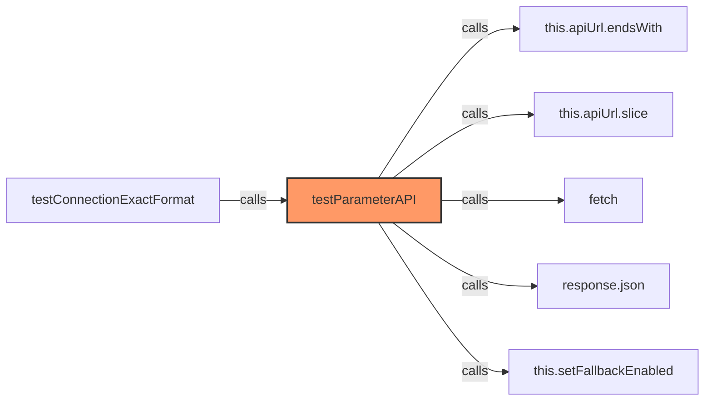

### `destroy` (🌐 Public) {#destroy}

**Returns:** `void`

**Calls:**

- `clearInterval`

**Called By:**

- From [[inventree-card|inventree-card]]:
  - `disconnectedCallback`

**Call Graph:**

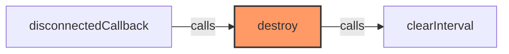

### `logApiStats` (🌐 Public) {#logApiStats}

**Returns:** `void`

**Calls:**

- [[logger|logger]]#log

**Called By:**

- From [[inventree-card|inventree-card]]:
  - `_runApiDiagnostics`
  - `_resetApiFailures`
- From [[card-controller|card-controller]]:
  - `resetApiFailures`

**Call Graph:**

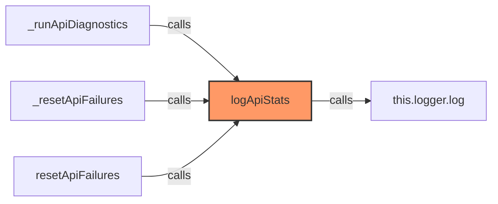

### `updateParameterDirectly` (🌐 Public) {#updateParameterDirectly}

**Parameters:**

- `partId`: `number`
- `parameterId`: `number`
- `value`: `string`

**Returns:** `Promise<boolean>`

**Calls:**

- `this.apiUrl.endsWith`
- `this.apiUrl.slice`
- [[logger|logger]]#log
- `fetch`
- `JSON.stringify`
- [[logger|logger]]#error
- `response.text`

**Call Graph:**

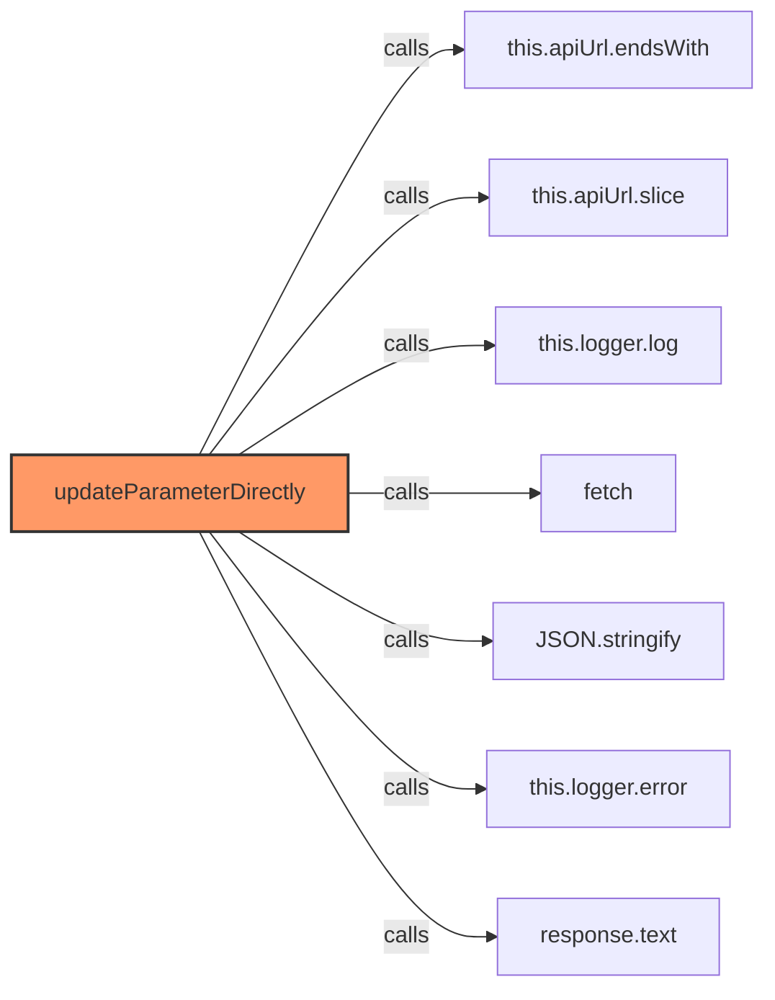

### `getPerformanceStats` (🌐 Public) {#getPerformanceStats}

**Returns:** `{ 
    apiCalls: number, 
    successes: number, 
    failures: number, 
    fallbackCalls: number, 
    avgCallTime: number 
  }`

**Calls:**

- `Math.round`

**Call Graph:**

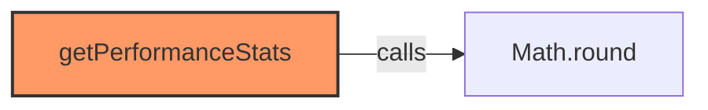

### `getLastKnownParameterValue` (🌐 Public) {#getLastKnownParameterValue}

**Parameters:**

- `partId`: `number`
- `paramName`: `string`

**Returns:** `string`

**Calls:**

- [[cache|cache]]#get

**Call Graph:**

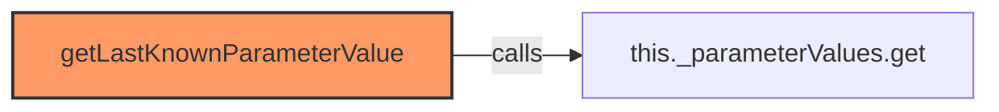

### `updateLastKnownParameterValue` (🌐 Public) {#updateLastKnownParameterValue}

**Parameters:**

- `partId`: `number`
- `paramName`: `string`
- `value`: `string`

**Returns:** `void`

**Calls:**

- [[cache|cache]]#set

**Call Graph:**

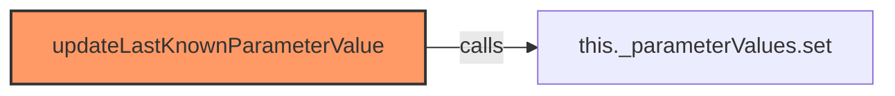

### `notifyParameterChanged` (🌐 Public) {#notifyParameterChanged}

**Parameters:**

- `partId`: `number`
- `paramName`: `string`
- `value`: `string`

**Returns:** `void`

**Calls:**

- [[cache|cache]]#has
- [[logger|logger]]#log
- `this._sentNotifications.add`
- `setTimeout`
- [[cache|cache]]#delete

**Called By:**

- From [[api|api]]:
  - `getParameterValue`
  - `updateParameter`

**Call Graph:**

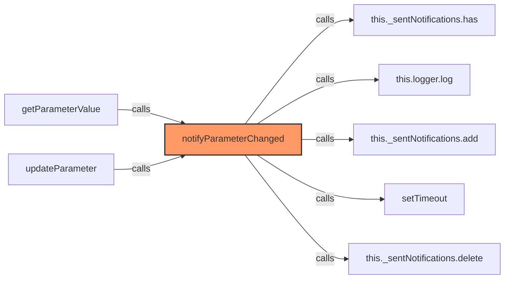

### `isFallbackEnabled` (🌐 Public) {#isFallbackEnabled}

**Returns:** `boolean`

### `resetRateLimiting` (🌐 Public) {#resetRateLimiting}

**Returns:** `void`

**Calls:**

- [[logger|logger]]#log

**Called By:**

- From [[inventree-card|inventree-card]]:
  - `_testSpecificParameter`

**Call Graph:**

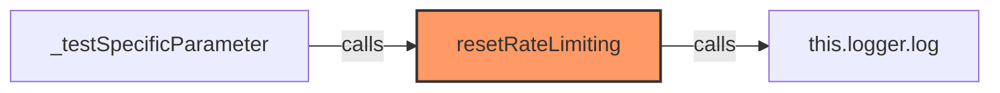

### `updateParameter` (🌐 Public) {#updateParameter}

**Parameters:**

- `partId`: `number`
- `paramName`: `string`
- `value`: `string`

**Returns:** `Promise<boolean>`

**Calls:**

- [[logger|logger]]#log
- `Date.now`
- `setTimeout`
- `url.endsWith`
- `headers.append`
- `fetch`
- [[logger|logger]]#error
- `response.json`
- `data.find`
- `templateName.toLowerCase`
- `paramName.toLowerCase`
- [[logger|logger]]#warn
- `JSON.stringify`
- `updateResponse.json`
- [[parameter-service|parameter-service]]#syncApiDataToEntityState
- [[api|api]]#notifyParameterChanged

**Called By:**

- From [[inventree-card|inventree-card]]:
  - `_handleStockAdjustment`
  - `updateParameterWithImmediateRefresh`
- From [[card-controller|card-controller]]:
  - `handleWebSocketMessage`
- From [[parameter-service|parameter-service]]:
  - `updateParameter`
  - `syncApiDataToEntityState`
- From [[websocket-plugin|websocket-plugin]]:
  - `_handleParameterUpdate`

**Call Graph:**

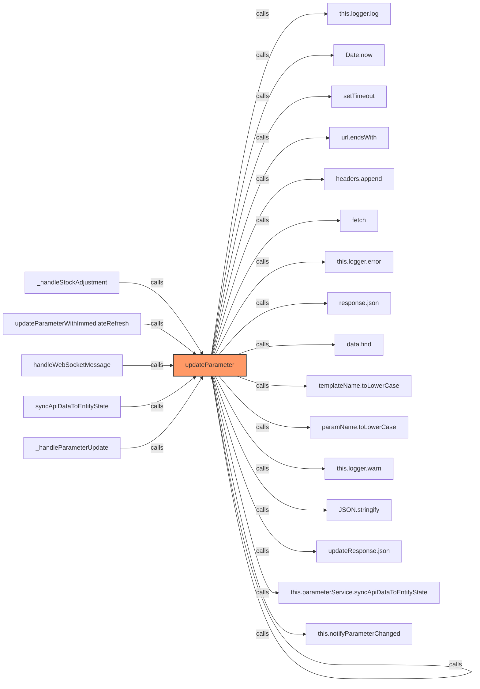

### `fetchParameterData` (🌐 Public) {#fetchParameterData}

**Parameters:**

- `partId`: `number`
- `parameterName`: `string`

**Returns:** `Promise<void>`

**Calls:**

- [[logger|logger]]#log
- [[inventree-state|inventree-state]]#getParameterValue
- [[logger|logger]]#error

**Called By:**

- From [[inventree-card|inventree-card]]:
  - `refreshParameterData`
  - `_fetchAllParameters`
- From [[parameter-service|parameter-service]]:
  - `fetchParameterData`

**Call Graph:**

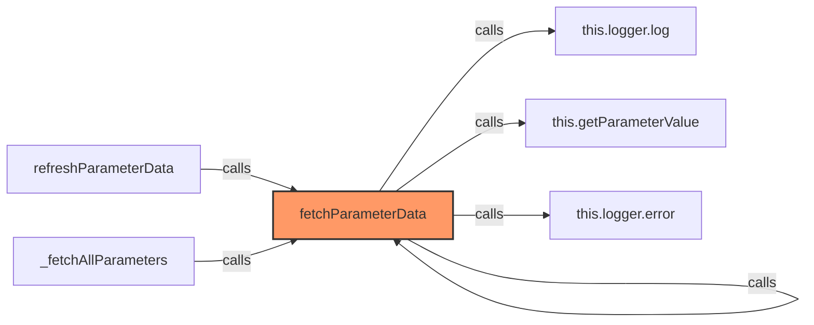

### `isApiConnected` (🌐 Public) {#isApiConnected}

**Returns:** `boolean`

**Called By:**

- From [[inventree-card|inventree-card]]:
  - `_renderDiagnosticTools`
- From [[card-controller|card-controller]]:
  - `handleWebSocketMessage`
- From [[parameter-service|parameter-service]]:
  - `isApiConnected`
  - `updateParameter`
  - `fetchParameterData`

**Call Graph:**

```mermaid
flowchart LR
    isApiConnected[isApiConnected]:::current
    _renderDiagnosticTools[_renderDiagnosticTools]
    _renderDiagnosticTools -->|calls| isApiConnected
    handleWebSocketMessage[handleWebSocketMessage]
    handleWebSocketMessage -->|calls| isApiConnected
    isApiConnected[isApiConnected]
    isApiConnected -->|calls| isApiConnected
    updateParameter[updateParameter]
    updateParameter -->|calls| isApiConnected
    fetchParameterData[fetchParameterData]
    fetchParameterData -->|calls| isApiConnected
    classDef current fill:#f96,stroke:#333,stroke-width:2px;
```

## Dependencies

```mermaid
flowchart TD
    api[api.ts]:::current
    logger[logger.ts]
    api -->|imports| logger
    inventree_card[inventree-card.ts]
    inventree_card -->|imports| api
    card_controller[card-controller.ts]
    card_controller -->|imports| api
    parameter_service[parameter-service.ts]
    parameter_service -->|imports| api
    websocket[websocket.ts]
    websocket -->|imports| api
    classDef current fill:#f96,stroke:#333,stroke-width:2px;
```

