# base-layout.ts

**Path:** `components/common/base-layout.ts`  
**Line Count:** 849  
**Functions:** 17  

## Overview

This file is part of the `components/common` directory.

## Imports

- lit: LitElement, PropertyValues
- lit/decorators.js: property, state
- custom-card-helpers: HomeAssistant
- [[types|types]]: InventreeItem, InventreeCardConfig
- [[inventree-state|inventree-state]]: InventTreeState
- [[parameter-service|parameter-service]]: ParameterService
- [[rendering-service|rendering-service]]: RenderingService
- [[card-controller|card-controller]]: CardController
- [[logger|logger]]: Logger
- [[cache|cache]]: CacheService

## Exports

- `BaseLayout`

## Functions

### Class: BaseLayout

### `_safeGetParameterService` (🔒 Private) {#_safeGetParameterService}

**Returns:** `ParameterService | undefined`

**Calls:**

- [[inventree-state|inventree-state]]#getInstance
- [[inventree-state|inventree-state]]#getInstance
- [[card-controller|card-controller]]#getParameterService
- [[logger|logger]]#log
- [[logger|logger]]#warn
- [[parameter-service|parameter-service]]#hasInstance
- [[inventree-state|inventree-state]]#getInstance
- [[logger|logger]]#error

**Called By:**

- From [[base-layout|base-layout]]:
  - `connectedCallback`
  - `_scheduleParameterServiceRetry`

**Call Graph:**

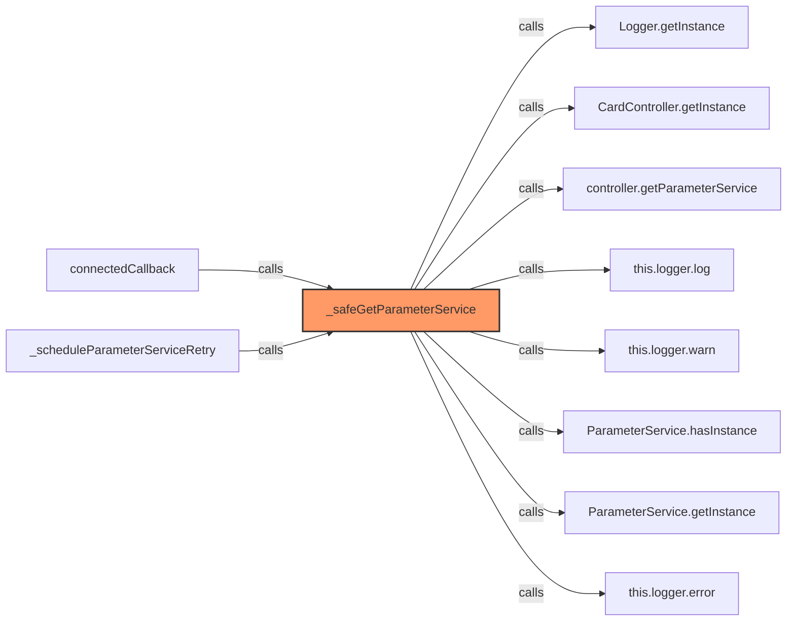

### `connectedCallback` (🌐 Public) {#connectedCallback}

**Returns:** `void`

**Calls:**

- [[base-layout|base-layout]]#connectedCallback
- [[base-layout|base-layout]]#_safeGetParameterService
- [[logger|logger]]#warn
- [[base-layout|base-layout]]#_scheduleParameterServiceRetry
- [[logger|logger]]#log
- [[rendering-service|rendering-service]]#registerRenderCallback
- [[base-layout|base-layout]]#requestUpdate
- [[base-layout|base-layout]]#subscribeToState
- [[base-layout|base-layout]]#_loadData

**Called By:**

- From [[grid-layout|grid-layout]]:
  - `connectedCallback`
- From [[part-buttons|part-buttons]]:
  - `connectedCallback`
- From [[variant-layout|variant-layout]]:
  - `connectedCallback`
- From [[inventree-card|inventree-card]]:
  - `connectedCallback`

**Call Graph:**

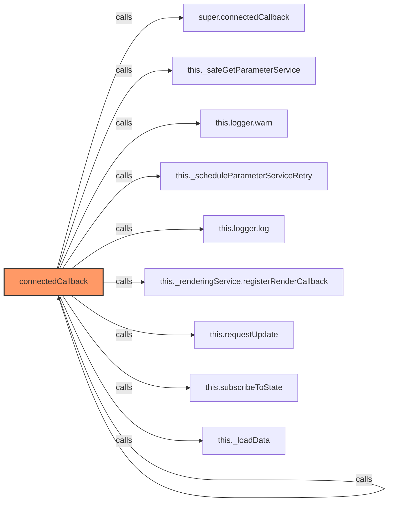

### `_scheduleParameterServiceRetry` (🔒 Private) {#_scheduleParameterServiceRetry}

**Parameters:**

- `attempt`: `number`

**Returns:** `void`

**Calls:**

- [[logger|logger]]#error
- `Math.min`
- `setTimeout`
- [[logger|logger]]#log
- [[base-layout|base-layout]]#_safeGetParameterService
- [[parameter-service|parameter-service]]#updateHass
- [[base-layout|base-layout]]#_loadData
- [[base-layout|base-layout]]#requestUpdate
- [[base-layout|base-layout]]#_scheduleParameterServiceRetry

**Called By:**

- From [[base-layout|base-layout]]:
  - `connectedCallback`

**Call Graph:**

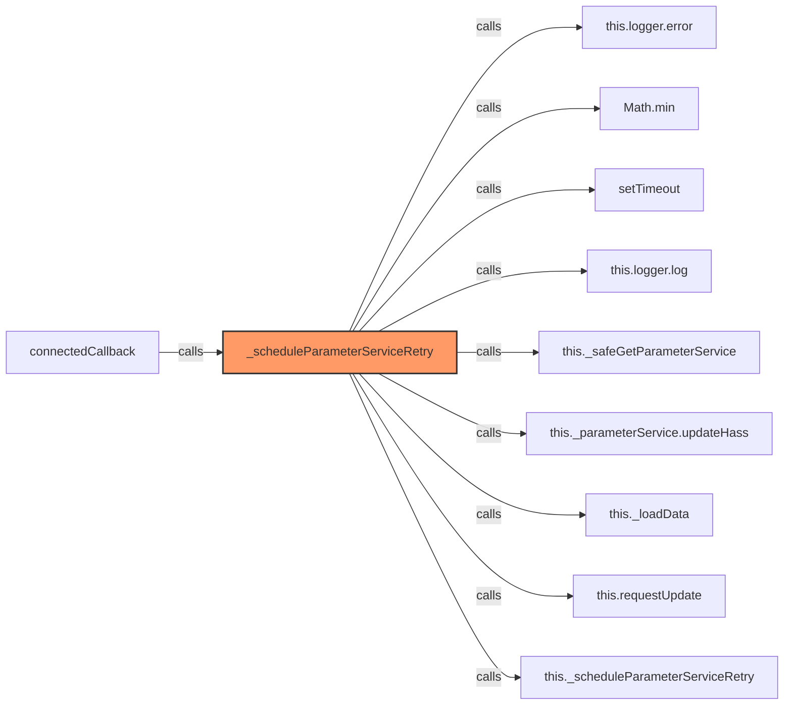

### `disconnectedCallback` (🌐 Public) {#disconnectedCallback}

**Returns:** `void`

**Calls:**

- [[base-layout|base-layout]]#disconnectedCallback
- `this._boundHandlers.forEach`
- `this._renderUnsubscribe`

**Called By:**

- From [[grid-layout|grid-layout]]:
  - `disconnectedCallback`
- From [[variant-layout|variant-layout]]:
  - `disconnectedCallback`
- From [[inventree-card|inventree-card]]:
  - `disconnectedCallback`

**Call Graph:**

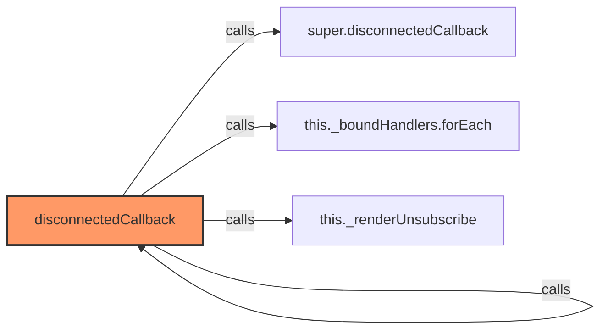

### `subscribeToState` (🌐 Public) {#subscribeToState}

**Returns:** `void`

**Called By:**

- From [[base-layout|base-layout]]:
  - `connectedCallback`

**Call Graph:**

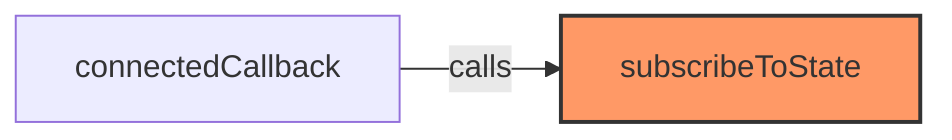

### `addListener` (🌐 Public) {#addListener}

**Parameters:**

- `event`: `string`
- `callback`: `() => void`

**Returns:** `void`

**Calls:**

- `callback`
- `this._boundHandlers.push`

**Call Graph:**

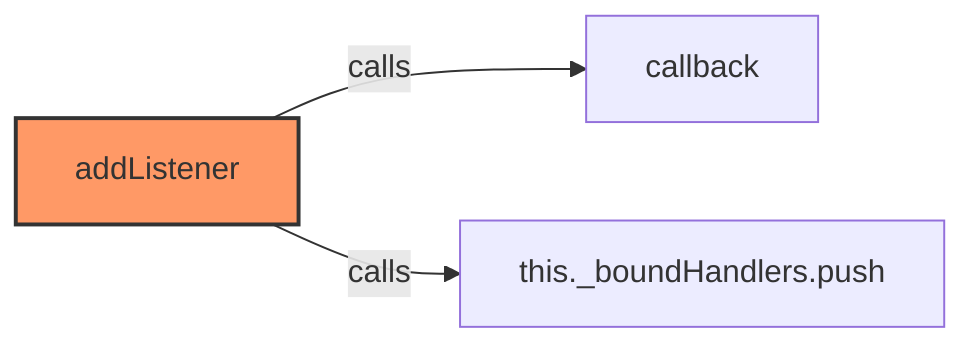

### `addListener` (🌐 Public) {#addListener}

**Parameters:**

- `event`: `string`
- `callback`: `() => void`

**Returns:** `void`

**Calls:**

- `callback`
- `this._boundHandlers.push`

**Call Graph:**


### `_loadData` (🔒 Private) {#_loadData}

**Returns:** `Promise<void>`

**Calls:**

- [[logger|logger]]#log
- [[base-layout|base-layout]]#_computePartsHash
- [[cache|cache]]#get
- [[base-layout|base-layout]]#_applyParameterFiltering
- [[inventree-state|inventree-state]]#getInstance
- [[inventree-state|inventree-state]]#getWebSocketData
- [[inventree-state|inventree-state]]#getApiData
- [[inventree-state|inventree-state]]#getHassData
- [[inventree-state|inventree-state]]#getNewestData
- [[inventree-state|inventree-state]]#getInstance
- [[base-layout|base-layout]]#getParts
- [[base-layout|base-layout]]#getParts
- [[inventree-state|inventree-state]]#getNewestData
- [[cache|cache]]#set

**Called By:**

- From [[base-layout|base-layout]]:
  - `connectedCallback`
  - `_scheduleParameterServiceRetry`
  - `refreshData`
  - `updated`

**Call Graph:**

```mermaid
flowchart LR
    _loadData[_loadData]:::current
    this_logger_log[this.logger.log]
    _loadData -->|calls| this_logger_log
    this__computePartsHash[this._computePartsHash]
    _loadData -->|calls| this__computePartsHash
    this_cache_get[this.cache.get]
    _loadData -->|calls| this_cache_get
    this__applyParameterFiltering[this._applyParameterFiltering]
    _loadData -->|calls| this__applyParameterFiltering
    InventTreeState_getInstance[InventTreeState.getInstance]
    _loadData -->|calls| InventTreeState_getInstance
    state_getWebSocketData[state.getWebSocketData]
    _loadData -->|calls| state_getWebSocketData
    state_getApiData[state.getApiData]
    _loadData -->|calls| state_getApiData
    state_getHassData[state.getHassData]
    _loadData -->|calls| state_getHassData
    state_getNewestData[state.getNewestData]
    _loadData -->|calls| state_getNewestData
    CardController_getInstance[CardController.getInstance]
    _loadData -->|calls| CardController_getInstance
    controller_getParts[controller.getParts]
    _loadData -->|calls| controller_getParts
    CardController_getInstance___getParts[CardController.getInstance().getParts]
    _loadData -->|calls| CardController_getInstance___getParts
    InventTreeState_getInstance___getNewestData[InventTreeState.getInstance().getNewestData]
    _loadData -->|calls| InventTreeState_getInstance___getNewestData
    this_cache_set[this.cache.set]
    _loadData -->|calls| this_cache_set
    connectedCallback[connectedCallback]
    connectedCallback -->|calls| _loadData
    _scheduleParameterServiceRetry[_scheduleParameterServiceRetry]
    _scheduleParameterServiceRetry -->|calls| _loadData
    refreshData[refreshData]
    refreshData -->|calls| _loadData
    updated[updated]
    updated -->|calls| _loadData
    classDef current fill:#f96,stroke:#333,stroke-width:2px;
```

### `_applyParameterFiltering` (🔒 Private) {#_applyParameterFiltering}

**Parameters:**

- `parts`: `InventreeItem[]`

**Returns:** `Promise<InventreeItem[]>`

**Calls:**

- [[logger|logger]]#log
- [[logger|logger]]#warn
- `JSON.stringify`
- [[base-layout|base-layout]]#_computePartsHash
- [[cache|cache]]#get
- `this.config.parameters.conditions.filter`
- `filterConditions.filter`
- `showConditions.filter`
- [[inventree-state|inventree-state]]#isDirectPartReference
- `parseInt`
- `condition.parameter.split`
- `isNaN`
- [[inventree-state|inventree-state]]#getParameterValueWithDirectReference
- [[parameter-service|parameter-service]]#compareValues
- `parts.find`
- `partsToShow.push`
- [[logger|logger]]#error
- [[parameter-service|parameter-service]]#matchesConditionSyncVersion
- `resultParts.filter`
- `partsToShow.includes`
- `hideConditions.filter`
- `partsToHide.push`
- `partsToHide.includes`
- [[cache|cache]]#set

**Called By:**

- From [[base-layout|base-layout]]:
  - `_loadData`

**Call Graph:**

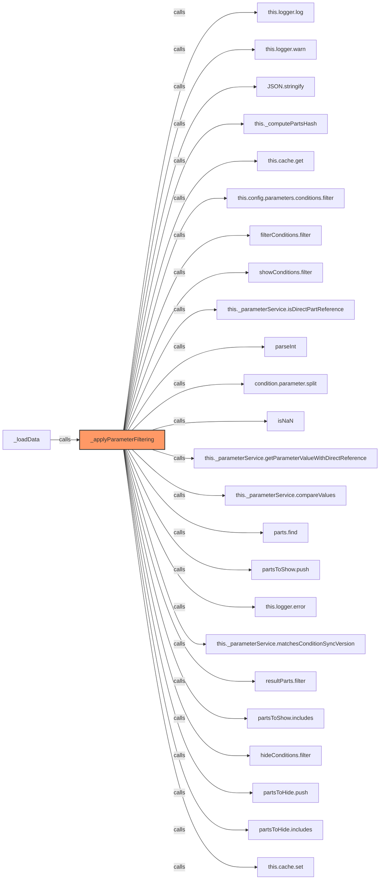

### `getParts` (🌐 Public) {#getParts}

**Returns:** `InventreeItem[]`

**Calls:**

- [[inventree-state|inventree-state]]#getInstance
- [[inventree-state|inventree-state]]#getNewestData

**Called By:**

- From [[base-layout|base-layout]]:
  - `_loadData`
- From [[grid-layout|grid-layout]]:
  - `_checkAndRecoverState`
- From [[list-layout|list-layout]]:
  - `render`
- From [[inventree-card|inventree-card]]:
  - `render`

**Call Graph:**

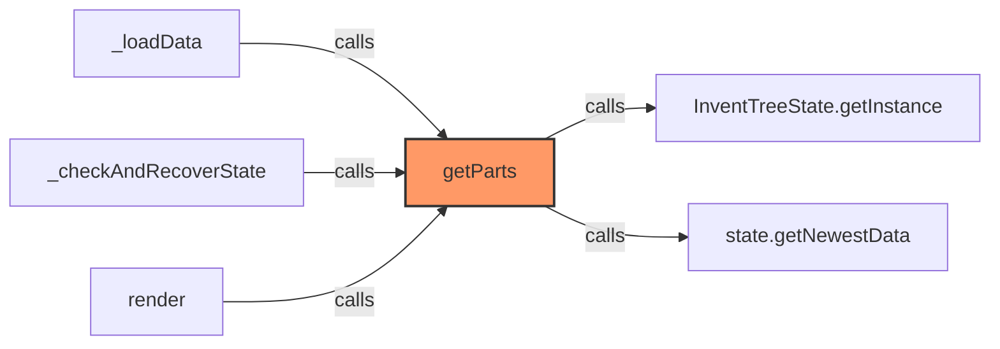

### `refreshData` (🌐 Public) {#refreshData}

**Returns:** `Promise<void>`

**Calls:**

- [[base-layout|base-layout]]#_loadData
- [[base-layout|base-layout]]#requestUpdate

**Call Graph:**

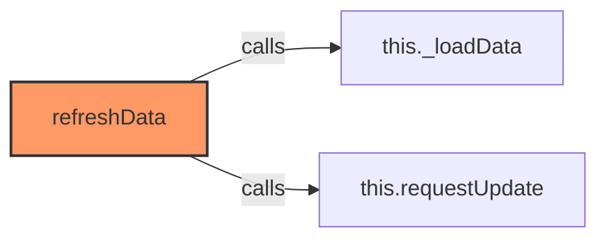

### `_computePartsHash` (🔒 Private) {#_computePartsHash}

**Parameters:**

- `parts`: `InventreeItem[]`

**Returns:** `string`

**Calls:**

- `parts.map(part => 
      `${part.pk}:${part.in_stock || 0}:${part.name}`
    ).join`
- `parts.map`

**Called By:**

- From [[base-layout|base-layout]]:
  - `_loadData`
  - `_applyParameterFiltering`
  - `updated`
  - `requestUpdate`

**Call Graph:**

```mermaid
flowchart LR
    _computePartsHash[_computePartsHash]:::current
    parts_map_part______________part_pk____part_in_stock____0____part_name_________join[parts.map(part => 
      `${part.pk}:${part.in_stock || 0}:${part.name}`
    ).join]
    _computePartsHash -->|calls| parts_map_part______________part_pk____part_in_stock____0____part_name_________join
    parts_map[parts.map]
    _computePartsHash -->|calls| parts_map
    _loadData[_loadData]
    _loadData -->|calls| _computePartsHash
    _applyParameterFiltering[_applyParameterFiltering]
    _applyParameterFiltering -->|calls| _computePartsHash
    updated[updated]
    updated -->|calls| _computePartsHash
    requestUpdate[requestUpdate]
    requestUpdate -->|calls| _computePartsHash
    classDef current fill:#f96,stroke:#333,stroke-width:2px;
```

### `updated` (🌐 Public) {#updated}

**Parameters:**

- `changedProps`: `PropertyValues`

**Returns:** `void`

**Calls:**

- [[base-layout|base-layout]]#updated
- [[logger|logger]]#log
- [[logger|logger]]#warn
- [[base-layout|base-layout]]#_updateVisualModifiers
- [[cache|cache]]#has
- [[parameter-service|parameter-service]]#updateHass
- `this._loadData().catch`
- [[base-layout|base-layout]]#_loadData
- [[logger|logger]]#error
- [[base-layout|base-layout]]#_computePartsHash
- [[inventree-state|inventree-state]]#getInstance
- [[inventree-state|inventree-state]]#setWebSocketData
- [[inventree-state|inventree-state]]#setApiData
- [[inventree-state|inventree-state]]#setHassData

**Called By:**

- From [[detail-layout|detail-layout]]:
  - `updated`
- From [[grid-layout|grid-layout]]:
  - `updated`
- From [[list-layout|list-layout]]:
  - `updated`
- From [[part-buttons|part-buttons]]:
  - `updated`
- From [[part-container|part-container]]:
  - `updated`
- From [[part-view|part-view]]:
  - `updated`
- From [[parts-layout|parts-layout]]:
  - `updated`
- From [[variant-layout|variant-layout]]:
  - `updated`
- From [[inventree-card|inventree-card]]:
  - `updated`

**Call Graph:**

```mermaid
flowchart LR
    updated[updated]:::current
    super_updated[super.updated]
    updated -->|calls| super_updated
    this_logger_log[this.logger.log]
    updated -->|calls| this_logger_log
    this_logger_warn[this.logger.warn]
    updated -->|calls| this_logger_warn
    this__updateVisualModifiers[this._updateVisualModifiers]
    updated -->|calls| this__updateVisualModifiers
    changedProps_has[changedProps.has]
    updated -->|calls| changedProps_has
    this__parameterService_updateHass[this._parameterService.updateHass]
    updated -->|calls| this__parameterService_updateHass
    this__loadData___catch[this._loadData().catch]
    updated -->|calls| this__loadData___catch
    this__loadData[this._loadData]
    updated -->|calls| this__loadData
    this_logger_error[this.logger.error]
    updated -->|calls| this_logger_error
    this__computePartsHash[this._computePartsHash]
    updated -->|calls| this__computePartsHash
    InventTreeState_getInstance[InventTreeState.getInstance]
    updated -->|calls| InventTreeState_getInstance
    state_setWebSocketData[state.setWebSocketData]
    updated -->|calls| state_setWebSocketData
    state_setApiData[state.setApiData]
    updated -->|calls| state_setApiData
    state_setHassData[state.setHassData]
    updated -->|calls| state_setHassData
    updated[updated]
    updated -->|calls| updated
    classDef current fill:#f96,stroke:#333,stroke-width:2px;
```

### `requestUpdate` (🌐 Public) {#requestUpdate}

**Parameters:**

- `name`: `PropertyKey`
- `oldValue`: `unknown`

**Returns:** `void`

**Calls:**

- [[base-layout|base-layout]]#_computePartsHash
- [[rendering-service|rendering-service]]#shouldRender
- [[base-layout|base-layout]]#requestUpdate
- [[logger|logger]]#log

**Called By:**

- From [[base-layout|base-layout]]:
  - `connectedCallback`
  - `_scheduleParameterServiceRetry`
  - `refreshData`
- From [[grid-layout|grid-layout]]:
  - `_actuallyFilterParts`
  - `updated`
  - `_checkAndRecoverState`
  - `_handleResetFilters`
- From [[part-container|part-container]]:
  - `updated`
- From [[variant-layout|variant-layout]]:
  - `_setupEntityListener`
  - `_setupIdleRenderTimer`
  - `_handleWebSocketMessage`
  - `_handleParameterChange`
  - `_toggleGroup`
- From [[editor|editor]]:
  - `_editCondition`
  - `_closeConditionDialog`
  - `_editAction`
  - `_closeActionDialog`
  - `_renderActionDialog`
  - `_parameterTypeChanged`
- From [[inventree-card|inventree-card]]:
  - `subscribe`
  - `debouncedRender`
  - `_handleStockAdjustment`
  - `connectedCallback`
  - `updateParameterWithImmediateRefresh`

**Call Graph:**

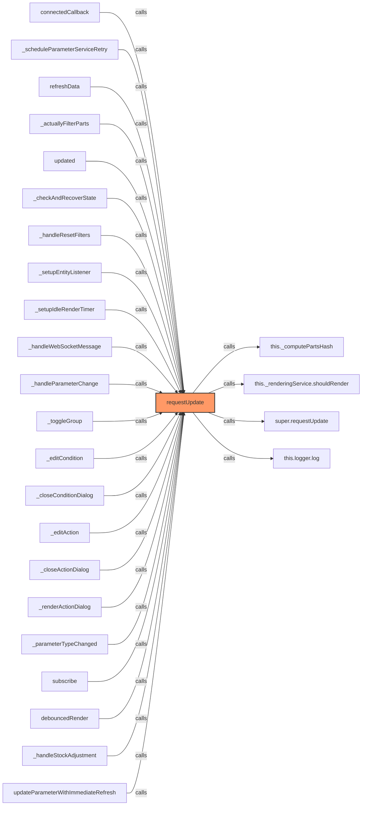

### `_updateVisualModifiers` (🔒 Private) {#_updateVisualModifiers}

**Returns:** `void`

**Called By:**

- From [[base-layout|base-layout]]:
  - `updated`
- From [[detail-layout|detail-layout]]:
  - `firstUpdated`
  - `updated`
- From [[grid-layout|grid-layout]]:
  - `updated`
- From [[list-layout|list-layout]]:
  - `updated`
- From [[parts-layout|parts-layout]]:
  - `updated`
  - `loadPartsFromEntities`
- From [[variant-layout|variant-layout]]:
  - `_setupEntityListener`
  - `_setupIdleRenderTimer`
  - `_handleWebSocketMessage`
  - `_handleParameterChange`
  - `updated`

**Call Graph:**

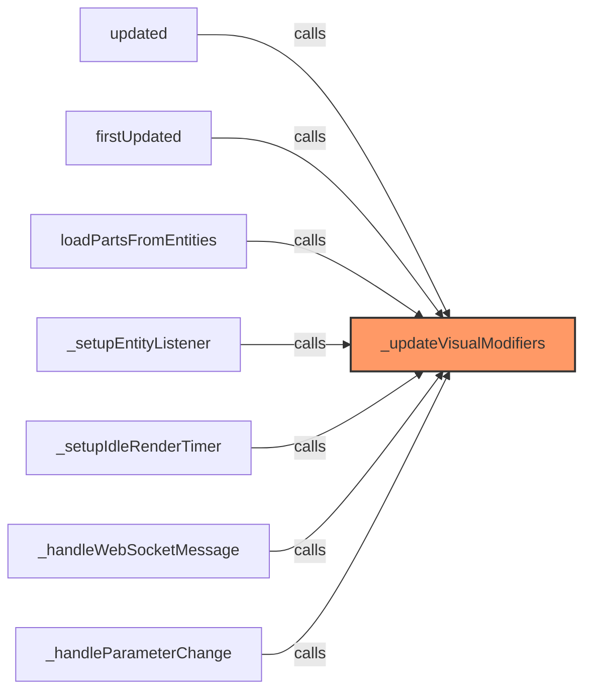

### `updateFilteredParts` (🌐 Public) {#updateFilteredParts}

**Returns:** `Promise<void>`

**Calls:**

- [[logger|logger]]#log
- [[inventree-state|inventree-state]]#getInstance
- [[inventree-state|inventree-state]]#getInstance
- `conditions.filter`
- [[inventree-state|inventree-state]]#isDirectPartReference
- [[inventree-state|inventree-state]]#getParameterValueWithDirectReference
- [[parameter-service|parameter-service]]#checkValueMatch
- `partsToShow.push`
- [[parameter-service|parameter-service]]#matchesCondition
- `filteredParts.filter`
- `partsToShow.includes`
- [[rendering-service|rendering-service]]#notifyRenderComplete

**Call Graph:**

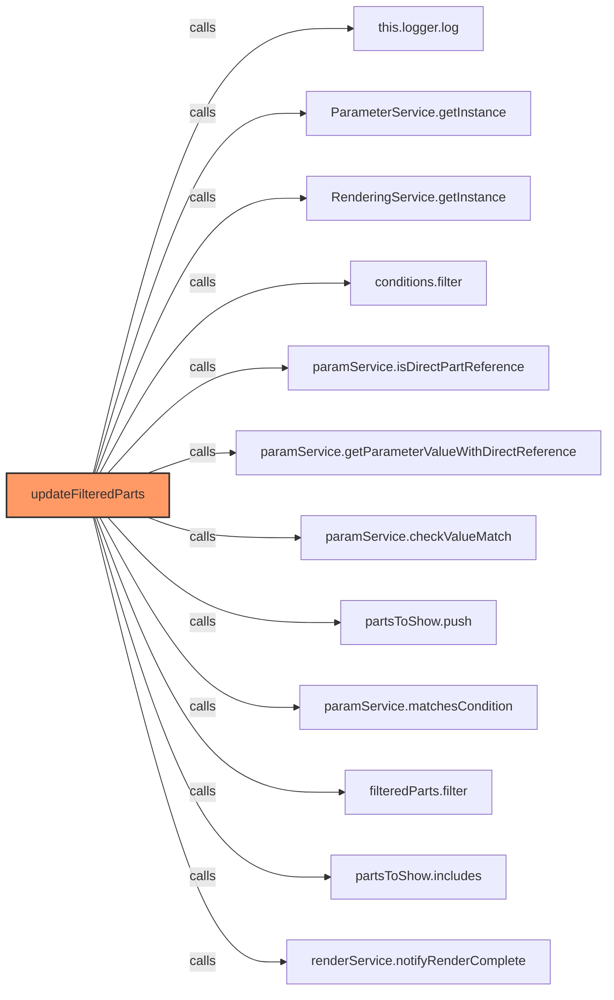

### `_applyParameterFilteringSync` (🔒 Private) {#_applyParameterFilteringSync}

**Parameters:**

- `parts`: `InventreeItem[]`

**Returns:** `InventreeItem[]`

**Calls:**

- `this.config.parameters.conditions.filter`
- [[logger|logger]]#log
- `filterConditions.filter`
- [[parameter-service|parameter-service]]#matchesConditionSyncVersion
- `partsToShow.push`
- `resultParts.filter`
- `partsToShow.includes`

**Call Graph:**

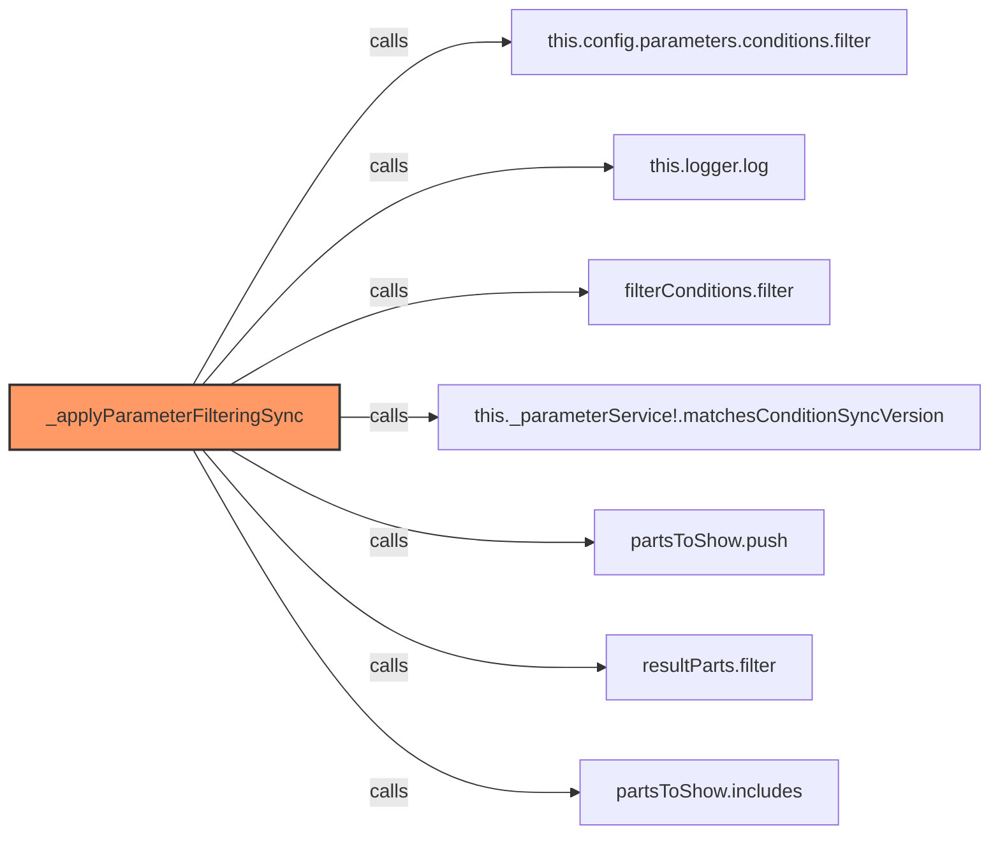

## Dependencies

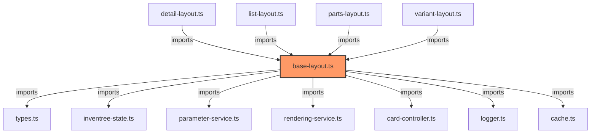

