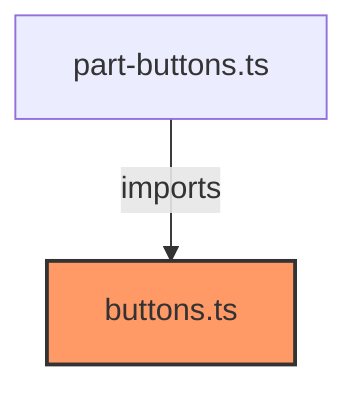

# buttons.ts

**Path:** `styles/components/buttons.ts`  
**Line Count:** 75  
**Functions:** 0  

## Overview

This file is part of the `styles/components` directory.

## Imports

- lit: css

## Exports

- `buttonStyles`

## Dependencies

