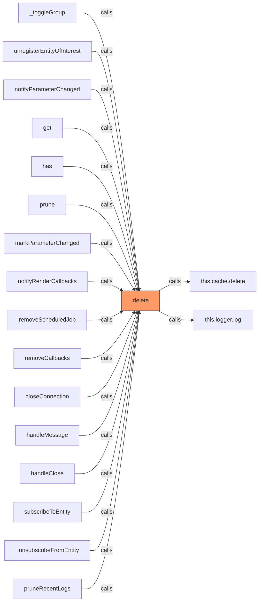
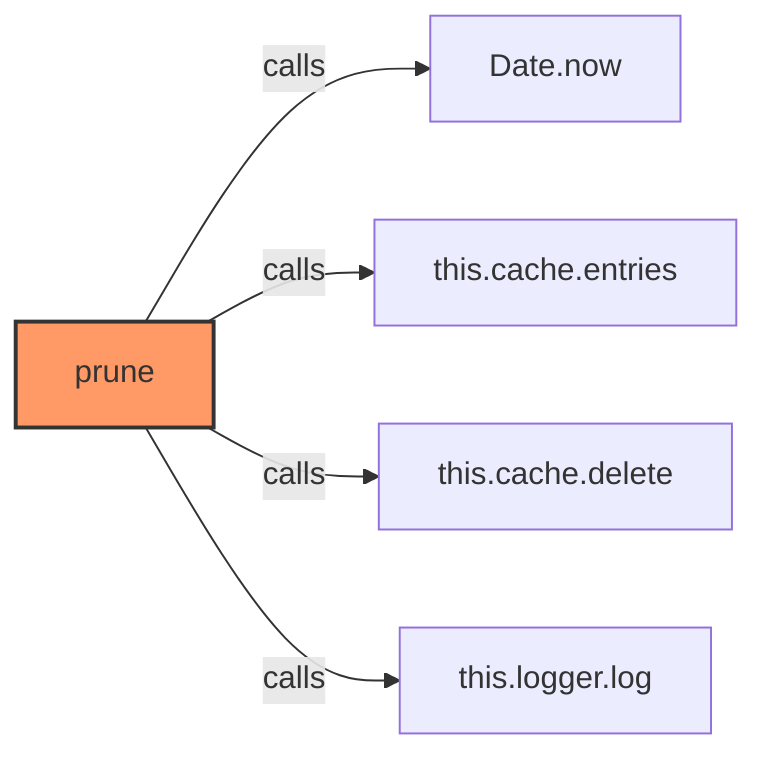
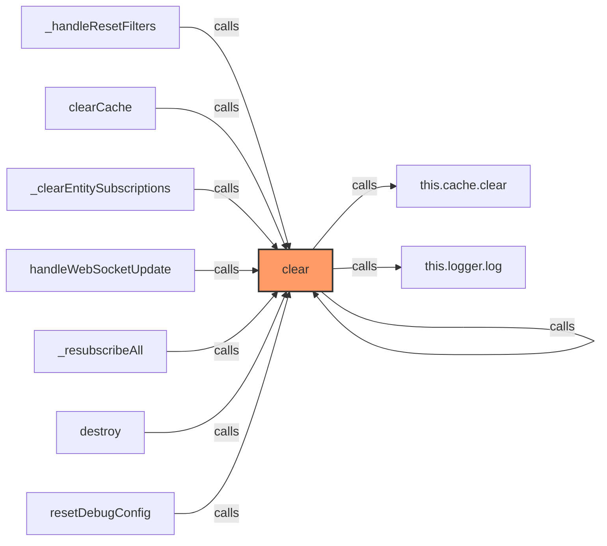
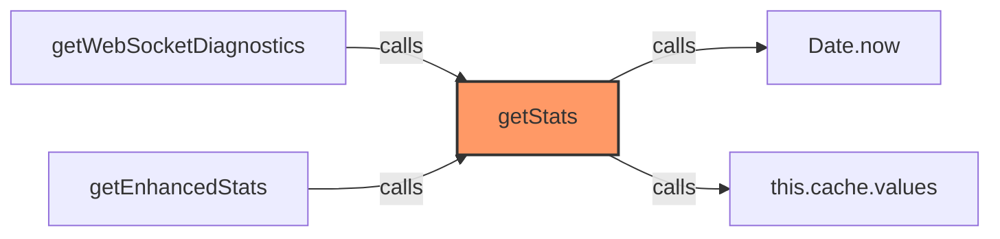
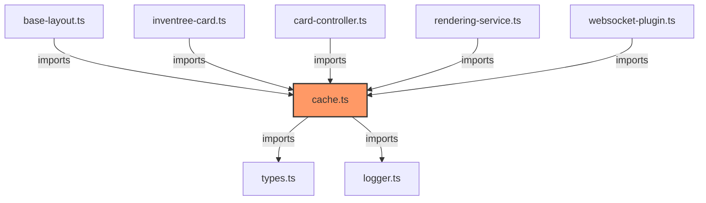

```mermaid
flowchart LR
    getInstance[getInstance]:::current
    _safeGetParameterService[_safeGetParameterService]
    _safeGetParameterService -->|calls| getInstance
    _loadData[_loadData]
    _loadData -->|calls| getInstance
    getParts[getParts]
    getParts -->|calls| getInstance
    updated[updated]
    updated -->|calls| getInstance
    updateFilteredParts[updateFilteredParts]
    updateFilteredParts -->|calls| getInstance
    processItems[processItems]
    processItems -->|calls| getInstance
    _updateVisualModifiers[_updateVisualModifiers]
    _updateVisualModifiers -->|calls| getInstance
    _setupWebSocketConnection[_setupWebSocketConnection]
    _setupWebSocketConnection -->|calls| getInstance
    _cleanupListeners[_cleanupListeners]
    _cleanupListeners -->|calls| getInstance
    _actuallyFilterParts[_actuallyFilterParts]
    _actuallyFilterParts -->|calls| getInstance
    render[render]
    render -->|calls| getInstance
    loadPartsFromEntities[loadPartsFromEntities]
    loadPartsFromEntities -->|calls| getInstance
    _renderDebuggingSection[_renderDebuggingSection]
    _renderDebuggingSection -->|calls| getInstance
    connectedCallback[connectedCallback]
    connectedCallback -->|calls| getInstance
    _resetApiFailures[_resetApiFailures]
    _resetApiFailures -->|calls| getInstance
    _initializeServices[_initializeServices]
    _initializeServices -->|calls| getInstance
    setHass[setHass]
    setHass -->|calls| getInstance
    initializeServices[initializeServices]
    initializeServices -->|calls| getInstance
    loadEntityData[loadEntityData]
    loadEntityData -->|calls| getInstance
    getWebSocketService[getWebSocketService]
    getWebSocketService -->|calls| getInstance
    initializeWebSocketPlugin[initializeWebSocketPlugin]
    initializeWebSocketPlugin -->|calls| getInstance
    handleWebSocketMessage[handleWebSocketMessage]
    handleWebSocketMessage -->|calls| getInstance
    getWebSocketDiagnostics[getWebSocketDiagnostics]
    getWebSocketDiagnostics -->|calls| getInstance
    getParameterValueFromPart[getParameterValueFromPart]
    getParameterValueFromPart -->|calls| getInstance
    isDirectPartReference[isDirectPartReference]
    isDirectPartReference -->|calls| getInstance
    getParameterValueWithDirectReference[getParameterValueWithDirectReference]
    getParameterValueWithDirectReference -->|calls| getInstance
    findEntityForPart[findEntityForPart]
    findEntityForPart -->|calls| getInstance
    storeOrphanedParameter[storeOrphanedParameter]
    storeOrphanedParameter -->|calls| getInstance
    isOrphanedPart[isOrphanedPart]
    isOrphanedPart -->|calls| getInstance
    getOrphanedPartIds[getOrphanedPartIds]
    getOrphanedPartIds -->|calls| getInstance
    getOrphanedPartParameters[getOrphanedPartParameters]
    getOrphanedPartParameters -->|calls| getInstance
    findParameterInWebSocketData[findParameterInWebSocketData]
    findParameterInWebSocketData -->|calls| getInstance
    findParameterInApiData[findParameterInApiData]
    findParameterInApiData -->|calls| getInstance
    findParameterInHassData[findParameterInHassData]
    findParameterInHassData -->|calls| getInstance
    findParameterInAllEntities[findParameterInAllEntities]
    findParameterInAllEntities -->|calls| getInstance
    syncApiDataToEntityState[syncApiDataToEntityState]
    syncApiDataToEntityState -->|calls| getInstance
    getParameterFromEntity[getParameterFromEntity]
    getParameterFromEntity -->|calls| getInstance
    startIdleTimer[startIdleTimer]
    startIdleTimer -->|calls| getInstance
    processVariants[processVariants]
    processVariants -->|calls| getInstance
    _handleParameterUpdate[_handleParameterUpdate]
    _handleParameterUpdate -->|calls| getInstance
    _updateEntityState[_updateEntityState]
    _updateEntityState -->|calls| getInstance
    classDef current fill:#f96,stroke:#333,stroke-width:2px;
```

```mermaid
flowchart LR
    set[set]:::current
    Date_now[Date.now]
    set -->|calls| Date_now
    this_cache_set[this.cache.set]
    set -->|calls| this_cache_set
    this_logger_log[this.logger.log]
    set -->|calls| this_logger_log
    _loadData[_loadData]
    _loadData -->|calls| set
    _applyParameterFiltering[_applyParameterFiltering]
    _applyParameterFiltering -->|calls| set
    _updateDisplayedStock[_updateDisplayedStock]
    _updateDisplayedStock -->|calls| set
    _updateVisualModifiers[_updateVisualModifiers]
    _updateVisualModifiers -->|calls| set
    _processVariants[_processVariants]
    _processVariants -->|calls| set
    trackLastUpdate[trackLastUpdate]
    trackLastUpdate -->|calls| set
    setWebSocketData[setWebSocketData]
    setWebSocketData -->|calls| set
    setApiData[setApiData]
    setApiData -->|calls| set
    setHassData[setHassData]
    setHassData -->|calls| set
    updateParameter[updateParameter]
    updateParameter -->|calls| set
    _updateParameterCache[_updateParameterCache]
    _updateParameterCache -->|calls| set
    storeOrphanedParameter[storeOrphanedParameter]
    storeOrphanedParameter -->|calls| set
    subscribe[subscribe]
    subscribe -->|calls| set
    debouncedRender[debouncedRender]
    debouncedRender -->|calls| set
    getParts[getParts]
    getParts -->|calls| set
    updateLastKnownParameterValue[updateLastKnownParameterValue]
    updateLastKnownParameterValue -->|calls| set
    handleWebSocketMessage[handleWebSocketMessage]
    handleWebSocketMessage -->|calls| set
    set[set]
    set -->|calls| set
    matchesCondition[matchesCondition]
    matchesCondition -->|calls| set
    setupRendering[setupRendering]
    setupRendering -->|calls| set
    handleWebSocketUpdate[handleWebSocketUpdate]
    handleWebSocketUpdate -->|calls| set
    shouldRender[shouldRender]
    shouldRender -->|calls| set
    addScheduledJob[addScheduledJob]
    addScheduledJob -->|calls| set
    getConnection[getConnection]
    getConnection -->|calls| set
    addOpenCallback[addOpenCallback]
    addOpenCallback -->|calls| set
    addMessageCallback[addMessageCallback]
    addMessageCallback -->|calls| set
    handleOpen[handleOpen]
    handleOpen -->|calls| set
    handleError[handleError]
    handleError -->|calls| set
    handleClose[handleClose]
    handleClose -->|calls| set
    setupKeepAlive[setupKeepAlive]
    setupKeepAlive -->|calls| set
    _recordActivity[_recordActivity]
    _recordActivity -->|calls| set
    _handleMessage[_handleMessage]
    _handleMessage -->|calls| set
    subscribeToEntity[subscribeToEntity]
    subscribeToEntity -->|calls| set
    isDuplicate[isDuplicate]
    isDuplicate -->|calls| set
    classDef current fill:#f96,stroke:#333,stroke-width:2px;
```

```mermaid
flowchart LR
    get[get]:::current
    this_cache_get[this.cache.get]
    get -->|calls| this_cache_get
    this_logger_log[this.logger.log]
    get -->|calls| this_logger_log
    Date_now[Date.now]
    get -->|calls| Date_now
    this_cache_delete[this.cache.delete]
    get -->|calls| this_cache_delete
    _loadData[_loadData]
    _loadData -->|calls| get
    _applyParameterFiltering[_applyParameterFiltering]
    _applyParameterFiltering -->|calls| get
    render[render]
    render -->|calls| get
    _getContainerStyle[_getContainerStyle]
    _getContainerStyle -->|calls| get
    _getTextStyle[_getTextStyle]
    _getTextStyle -->|calls| get
    _renderPartWithSize[_renderPartWithSize]
    _renderPartWithSize -->|calls| get
    updated[updated]
    updated -->|calls| get
    _processVariants[_processVariants]
    _processVariants -->|calls| get
    _renderDropdownView[_renderDropdownView]
    _renderDropdownView -->|calls| get
    _renderTabsView[_renderTabsView]
    _renderTabsView -->|calls| get
    _renderListView[_renderListView]
    _renderListView -->|calls| get
    _renderTreeView[_renderTreeView]
    _renderTreeView -->|calls| get
    _renderGridView[_renderGridView]
    _renderGridView -->|calls| get
    getLastUpdate[getLastUpdate]
    getLastUpdate -->|calls| get
    getWebSocketData[getWebSocketData]
    getWebSocketData -->|calls| get
    getApiData[getApiData]
    getApiData -->|calls| get
    getHassData[getHassData]
    getHassData -->|calls| get
    updateParameter[updateParameter]
    updateParameter -->|calls| get
    updateParameterInSource[updateParameterInSource]
    updateParameterInSource -->|calls| get
    _updateParameterCache[_updateParameterCache]
    _updateParameterCache -->|calls| get
    getParameterValue[getParameterValue]
    getParameterValue -->|calls| get
    findEntityForPart[findEntityForPart]
    findEntityForPart -->|calls| get
    findParameterInAllEntities[findParameterInAllEntities]
    findParameterInAllEntities -->|calls| get
    storeOrphanedParameter[storeOrphanedParameter]
    storeOrphanedParameter -->|calls| get
    getOrphanedPartIds[getOrphanedPartIds]
    getOrphanedPartIds -->|calls| get
    getOrphanedPartParameters[getOrphanedPartParameters]
    getOrphanedPartParameters -->|calls| get
    getConfigElement[getConfigElement]
    getConfigElement -->|calls| get
    getParts[getParts]
    getParts -->|calls| get
    getLastKnownParameterValue[getLastKnownParameterValue]
    getLastKnownParameterValue -->|calls| get
    has[has]
    has -->|calls| get
    get[get]
    get -->|calls| get
    matchesCondition[matchesCondition]
    matchesCondition -->|calls| get
    updateScheduledJob[updateScheduledJob]
    updateScheduledJob -->|calls| get
    getScheduledJob[getScheduledJob]
    getScheduledJob -->|calls| get
    getConnection[getConnection]
    getConnection -->|calls| get
    addOpenCallback[addOpenCallback]
    addOpenCallback -->|calls| get
    addMessageCallback[addMessageCallback]
    addMessageCallback -->|calls| get
    removeCallbacks[removeCallbacks]
    removeCallbacks -->|calls| get
    closeConnection[closeConnection]
    closeConnection -->|calls| get
    handleOpen[handleOpen]
    handleOpen -->|calls| get
    handleMessage[handleMessage]
    handleMessage -->|calls| get
    _handleBasicMessage[_handleBasicMessage]
    _handleBasicMessage -->|calls| get
    handleError[handleError]
    handleError -->|calls| get
    handleClose[handleClose]
    handleClose -->|calls| get
    setupKeepAlive[setupKeepAlive]
    setupKeepAlive -->|calls| get
    isConnected[isConnected]
    isConnected -->|calls| get
    getStats[getStats]
    getStats -->|calls| get
    _recordActivity[_recordActivity]
    _recordActivity -->|calls| get
    getEnhancedStats[getEnhancedStats]
    getEnhancedStats -->|calls| get
    subscribeToEntity[subscribeToEntity]
    subscribeToEntity -->|calls| get
    _subscribeToEntity[_subscribeToEntity]
    _subscribeToEntity -->|calls| get
    _unsubscribeFromEntity[_unsubscribeFromEntity]
    _unsubscribeFromEntity -->|calls| get
    isDuplicate[isDuplicate]
    isDuplicate -->|calls| get
    classDef current fill:#f96,stroke:#333,stroke-width:2px;
```

```mermaid
flowchart LR
    has[has]:::current
    this_cache_get[this.cache.get]
    has -->|calls| this_cache_get
    Date_now[Date.now]
    has -->|calls| Date_now
    this_cache_delete[this.cache.delete]
    has -->|calls| this_cache_delete
    updated[updated]
    updated -->|calls| has
    processItems[processItems]
    processItems -->|calls| has
    _updateDisplayedStock[_updateDisplayedStock]
    _updateDisplayedStock -->|calls| has
    _processVariants[_processVariants]
    _processVariants -->|calls| has
    _renderTreeView[_renderTreeView]
    _renderTreeView -->|calls| has
    _toggleGroup[_toggleGroup]
    _toggleGroup -->|calls| has
    getHassData[getHassData]
    getHassData -->|calls| has
    getNewestData[getNewestData]
    getNewestData -->|calls| has
    updateParameter[updateParameter]
    updateParameter -->|calls| has
    _updateParameterCache[_updateParameterCache]
    _updateParameterCache -->|calls| has
    storeOrphanedParameter[storeOrphanedParameter]
    storeOrphanedParameter -->|calls| has
    debouncedRender[debouncedRender]
    debouncedRender -->|calls| has
    notifyParameterChanged[notifyParameterChanged]
    notifyParameterChanged -->|calls| has
    handleWebSocketMessage[handleWebSocketMessage]
    handleWebSocketMessage -->|calls| has
    wasRecentlyChanged[wasRecentlyChanged]
    wasRecentlyChanged -->|calls| has
    setupRendering[setupRendering]
    setupRendering -->|calls| has
    handleWebSocketUpdate[handleWebSocketUpdate]
    handleWebSocketUpdate -->|calls| has
    shouldRender[shouldRender]
    shouldRender -->|calls| has
    processVariantGroups[processVariantGroups]
    processVariantGroups -->|calls| has
    getConnection[getConnection]
    getConnection -->|calls| has
    addOpenCallback[addOpenCallback]
    addOpenCallback -->|calls| has
    addMessageCallback[addMessageCallback]
    addMessageCallback -->|calls| has
    removeCallbacks[removeCallbacks]
    removeCallbacks -->|calls| has
    closeConnection[closeConnection]
    closeConnection -->|calls| has
    handleOpen[handleOpen]
    handleOpen -->|calls| has
    handleMessage[handleMessage]
    handleMessage -->|calls| has
    handleClose[handleClose]
    handleClose -->|calls| has
    setupKeepAlive[setupKeepAlive]
    setupKeepAlive -->|calls| has
    isConnected[isConnected]
    isConnected -->|calls| has
    getStats[getStats]
    getStats -->|calls| has
    _recordActivity[_recordActivity]
    _recordActivity -->|calls| has
    _handleMessage[_handleMessage]
    _handleMessage -->|calls| has
    subscribeToEntity[subscribeToEntity]
    subscribeToEntity -->|calls| has
    classDef current fill:#f96,stroke:#333,stroke-width:2px;
```

# cache.ts

**Path:** `services/cache.ts`  
**Line Count:** 134  
**Functions:** 8  

## Overview

This file is part of the `services` directory.

## Imports

- [[types|types]]: PartData
- [[logger|logger]]: Logger

## Exports

- `CacheService`

## Functions

### Class: CacheService

### `getInstance` (🌐 Public) {#getInstance}

**Returns:** `CacheService`

**Called By:**

- From [[base-layout|base-layout]]:
  - `_safeGetParameterService`
  - `_loadData`
  - `getParts`
  - `updated`
  - `updateFilteredParts`
- From [[variant-handler|variant-handler]]:
  - `processItems`
- From [[detail-layout|detail-layout]]:
  - `_updateVisualModifiers`
- From [[grid-layout|grid-layout]]:
  - `_setupWebSocketConnection`
  - `_cleanupListeners`
  - `_actuallyFilterParts`
  - `_updateVisualModifiers`
  - `render`
- From [[list-layout|list-layout]]:
  - `_updateVisualModifiers`
  - `render`
- From [[parts-layout|parts-layout]]:
  - `loadPartsFromEntities`
  - `_updateVisualModifiers`
- From [[editor|editor]]:
  - `_renderDebuggingSection`
- From [[inventree-card|inventree-card]]:
  - `connectedCallback`
  - `_resetApiFailures`
  - `_initializeServices`
- From [[card-controller|card-controller]]:
  - `setHass`
  - `initializeServices`
  - `loadEntityData`
  - `getParts`
  - `getWebSocketService`
  - `initializeWebSocketPlugin`
  - `handleWebSocketMessage`
  - `getWebSocketDiagnostics`
- From [[parameter-service|parameter-service]]:
  - `getParameterValueFromPart`
  - `isDirectPartReference`
  - `getParameterValueWithDirectReference`
  - `findEntityForPart`
  - `storeOrphanedParameter`
  - `isOrphanedPart`
  - `getOrphanedPartIds`
  - `getOrphanedPartParameters`
  - `findParameterInWebSocketData`
  - `findParameterInApiData`
  - `findParameterInHassData`
  - `findParameterInAllEntities`
  - `syncApiDataToEntityState`
  - `getParameterFromEntity`
- From [[rendering-service|rendering-service]]:
  - `startIdleTimer`
- From [[variant-service|variant-service]]:
  - `processVariants`
- From [[websocket-plugin|websocket-plugin]]:
  - `_handleParameterUpdate`
- From [[websocket|websocket]]:
  - `_updateEntityState`

**Call Graph:**

### `set` (🌐 Public) {#set}

**Parameters:**

- `key`: `string`
- `value`: `any`
- `ttlMs`: `number`

**Returns:** `void`

**Calls:**

- `Date.now`
- [[cache|cache]]#set
- [[logger|logger]]#log

**Called By:**

- From [[base-layout|base-layout]]:
  - `_loadData`
  - `_applyParameterFiltering`
- From [[detail-layout|detail-layout]]:
  - `_updateDisplayedStock`
- From [[grid-layout|grid-layout]]:
  - `_updateVisualModifiers`
- From [[list-layout|list-layout]]:
  - `_updateVisualModifiers`
- From [[parts-layout|parts-layout]]:
  - `_updateVisualModifiers`
- From [[variant-layout|variant-layout]]:
  - `_processVariants`
  - `_updateVisualModifiers`
- From [[inventree-state|inventree-state]]:
  - `trackLastUpdate`
  - `setWebSocketData`
  - `setApiData`
  - `setHassData`
  - `updateParameter`
  - `_updateParameterCache`
  - `storeOrphanedParameter`
- From [[inventree-card|inventree-card]]:
  - `subscribe`
  - `debouncedRender`
  - `getParts`
- From [[api|api]]:
  - `updateLastKnownParameterValue`
- From [[card-controller|card-controller]]:
  - `handleWebSocketMessage`
- From [[parameter-service|parameter-service]]:
  - `set`
  - `matchesCondition`
- From [[rendering-service|rendering-service]]:
  - `setupRendering`
  - `handleWebSocketUpdate`
  - `shouldRender`
  - `addScheduledJob`
- From [[websocket-manager|websocket-manager]]:
  - `getConnection`
  - `addOpenCallback`
  - `addMessageCallback`
  - `handleOpen`
  - `handleError`
  - `handleClose`
  - `setupKeepAlive`
  - `_recordActivity`
- From [[websocket-plugin|websocket-plugin]]:
  - `_handleMessage`
- From [[websocket|websocket]]:
  - `subscribeToEntity`
- From [[logger|logger]]:
  - `isDuplicate`

**Call Graph:**

### `get` (🌐 Public) {#get}

**Parameters:**

- `key`: `string`

**Returns:** `T | undefined`

**Calls:**

- [[cache|cache]]#get
- [[logger|logger]]#log
- `Date.now`
- [[cache|cache]]#delete

**Called By:**

- From [[base-layout|base-layout]]:
  - `_loadData`
  - `_applyParameterFiltering`
- From [[detail-layout|detail-layout]]:
  - `render`
- From [[grid-layout|grid-layout]]:
  - `_getContainerStyle`
  - `_getTextStyle`
  - `render`
- From [[list-layout|list-layout]]:
  - `_renderPartWithSize`
  - `_getContainerStyle`
  - `_getTextStyle`
- From [[part-container|part-container]]:
  - `updated`
- From [[parts-layout|parts-layout]]:
  - `_getContainerStyle`
  - `_getTextStyle`
- From [[variant-layout|variant-layout]]:
  - `_processVariants`
  - `_getContainerStyle`
  - `_getTextStyle`
  - `_renderDropdownView`
  - `_renderTabsView`
  - `_renderListView`
  - `_renderTreeView`
  - `_renderGridView`
- From [[inventree-state|inventree-state]]:
  - `getLastUpdate`
  - `getWebSocketData`
  - `getApiData`
  - `getHassData`
  - `updateParameter`
  - `updateParameterInSource`
  - `_updateParameterCache`
  - `getParameterValue`
  - `findEntityForPart`
  - `findParameterInAllEntities`
  - `storeOrphanedParameter`
  - `getOrphanedPartIds`
  - `getOrphanedPartParameters`
- From [[inventree-card|inventree-card]]:
  - `getConfigElement`
  - `getParts`
- From [[api|api]]:
  - `getLastKnownParameterValue`
- From [[cache|cache]]:
  - `has`
- From [[parameter-service|parameter-service]]:
  - `get`
  - `matchesCondition`
- From [[rendering-service|rendering-service]]:
  - `updateScheduledJob`
  - `getScheduledJob`
- From [[websocket-manager|websocket-manager]]:
  - `getConnection`
  - `addOpenCallback`
  - `addMessageCallback`
  - `removeCallbacks`
  - `closeConnection`
  - `handleOpen`
  - `handleMessage`
  - `_handleBasicMessage`
  - `handleError`
  - `handleClose`
  - `setupKeepAlive`
  - `isConnected`
  - `getStats`
  - `_recordActivity`
  - `getEnhancedStats`
- From [[websocket|websocket]]:
  - `subscribeToEntity`
  - `_subscribeToEntity`
  - `_unsubscribeFromEntity`
- From [[logger|logger]]:
  - `isDuplicate`

**Call Graph:**

### `has` (🌐 Public) {#has}

**Parameters:**

- `key`: `string`

**Returns:** `boolean`

**Calls:**

- [[cache|cache]]#get
- `Date.now`
- [[cache|cache]]#delete

**Called By:**

- From [[base-layout|base-layout]]:
  - `updated`
- From [[variant-handler|variant-handler]]:
  - `processItems`
- From [[detail-layout|detail-layout]]:
  - `updated`
  - `_updateDisplayedStock`
- From [[grid-layout|grid-layout]]:
  - `updated`
- From [[part-buttons|part-buttons]]:
  - `updated`
- From [[part-container|part-container]]:
  - `updated`
- From [[part-variant|part-variant]]:
  - `updated`
- From [[part-view|part-view]]:
  - `updated`
- From [[parts-layout|parts-layout]]:
  - `updated`
- From [[variant-layout|variant-layout]]:
  - `updated`
  - `_processVariants`
  - `_renderTreeView`
  - `_toggleGroup`
- From [[inventree-state|inventree-state]]:
  - `getHassData`
  - `getNewestData`
  - `updateParameter`
  - `_updateParameterCache`
  - `storeOrphanedParameter`
- From [[inventree-card|inventree-card]]:
  - `debouncedRender`
  - `updated`
- From [[api|api]]:
  - `notifyParameterChanged`
- From [[card-controller|card-controller]]:
  - `handleWebSocketMessage`
- From [[parameter-service|parameter-service]]:
  - `wasRecentlyChanged`
- From [[rendering-service|rendering-service]]:
  - `setupRendering`
  - `handleWebSocketUpdate`
  - `shouldRender`
- From [[variant-service|variant-service]]:
  - `processVariantGroups`
- From [[websocket-manager|websocket-manager]]:
  - `getConnection`
  - `addOpenCallback`
  - `addMessageCallback`
  - `removeCallbacks`
  - `closeConnection`
  - `handleOpen`
  - `handleMessage`
  - `handleClose`
  - `setupKeepAlive`
  - `isConnected`
  - `getStats`
  - `_recordActivity`
- From [[websocket-plugin|websocket-plugin]]:
  - `_handleMessage`
- From [[websocket|websocket]]:
  - `subscribeToEntity`

**Call Graph:**

### `delete` (🌐 Public) {#delete}

**Parameters:**

- `key`: `string`

**Returns:** `void`

**Calls:**

- [[cache|cache]]#delete
- [[logger|logger]]#log

**Called By:**

- From [[variant-layout|variant-layout]]:
  - `_toggleGroup`
- From [[inventree-state|inventree-state]]:
  - `unregisterEntityOfInterest`
- From [[api|api]]:
  - `notifyParameterChanged`
- From [[cache|cache]]:
  - `get`
  - `has`
  - `prune`
- From [[parameter-service|parameter-service]]:
  - `get`
  - `markParameterChanged`
- From [[rendering-service|rendering-service]]:
  - `notifyRenderCallbacks`
  - `removeScheduledJob`
- From [[websocket-manager|websocket-manager]]:
  - `removeCallbacks`
  - `closeConnection`
  - `handleMessage`
  - `handleClose`
- From [[websocket|websocket]]:
  - `subscribeToEntity`
  - `_unsubscribeFromEntity`
- From [[logger|logger]]:
  - `pruneRecentLogs`

**Call Graph:**

### `prune` (🌐 Public) {#prune}

**Returns:** `void`

**Calls:**

- `Date.now`
- `this.cache.entries`
- [[cache|cache]]#delete
- [[logger|logger]]#log

**Call Graph:**

### `clear` (🌐 Public) {#clear}

**Returns:** `void`

**Calls:**

- [[cache|cache]]#clear
- [[logger|logger]]#log

**Called By:**

- From [[grid-layout|grid-layout]]:
  - `_handleResetFilters`
- From [[inventree-state|inventree-state]]:
  - `clearCache`
- From [[inventree-card|inventree-card]]:
  - `_clearEntitySubscriptions`
- From [[parameter-service|parameter-service]]:
  - `clear`
  - `clearCache`
- From [[rendering-service|rendering-service]]:
  - `handleWebSocketUpdate`
- From [[websocket|websocket]]:
  - `_resubscribeAll`
  - `destroy`
- From [[logger|logger]]:
  - `resetDebugConfig`

**Call Graph:**

### `getStats` (🌐 Public) {#getStats}

**Returns:** `{ size: number, expired: number }`

**Calls:**

- `Date.now`
- `this.cache.values`

**Called By:**

- From [[card-controller|card-controller]]:
  - `getWebSocketDiagnostics`
- From [[websocket-manager|websocket-manager]]:
  - `getEnhancedStats`

**Call Graph:**

## Dependencies

