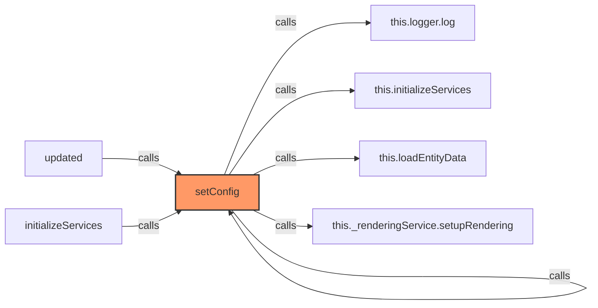
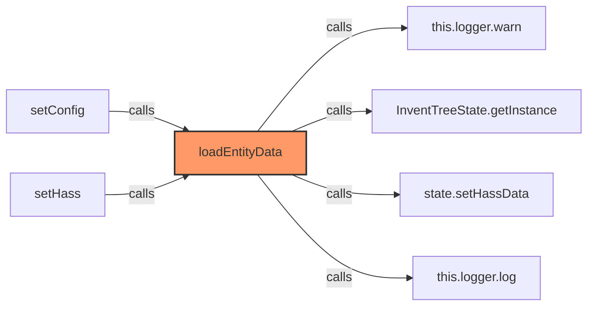
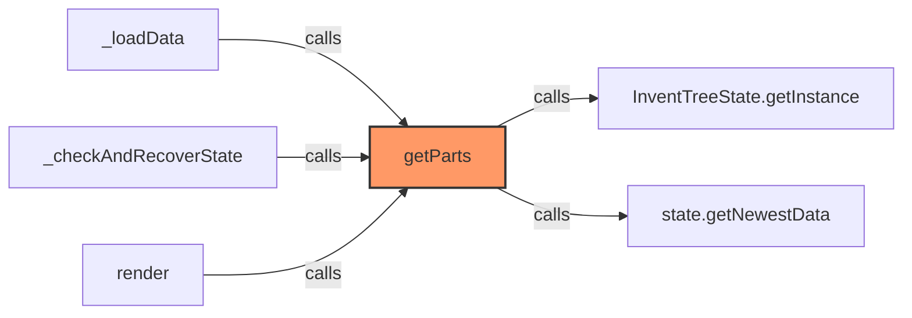
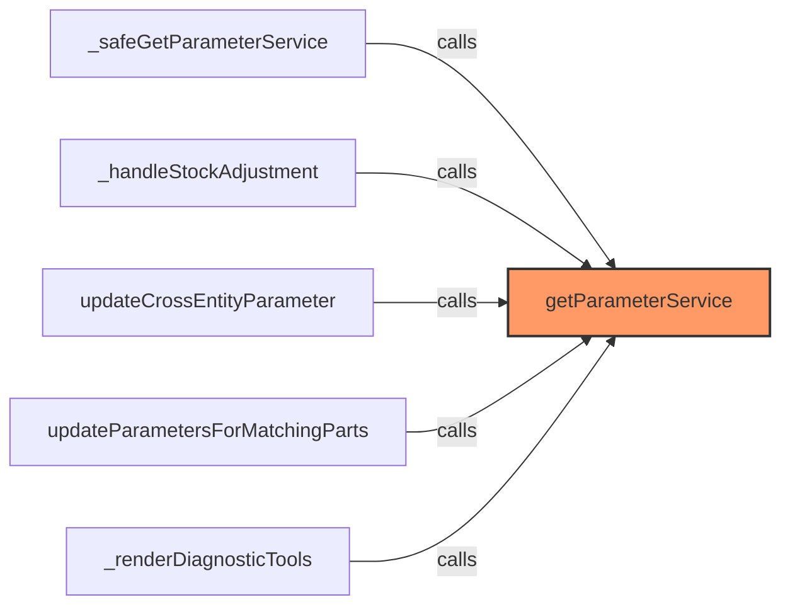
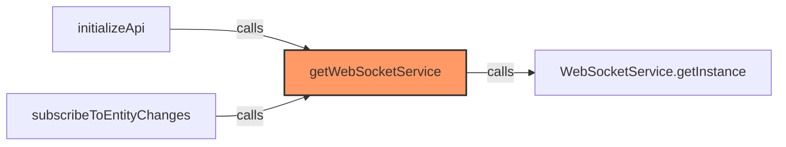
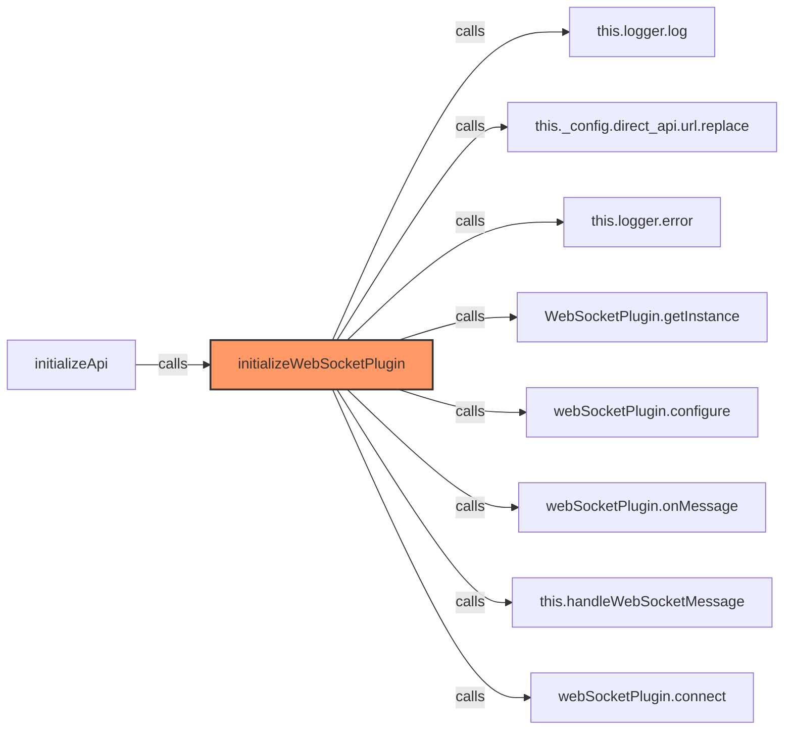
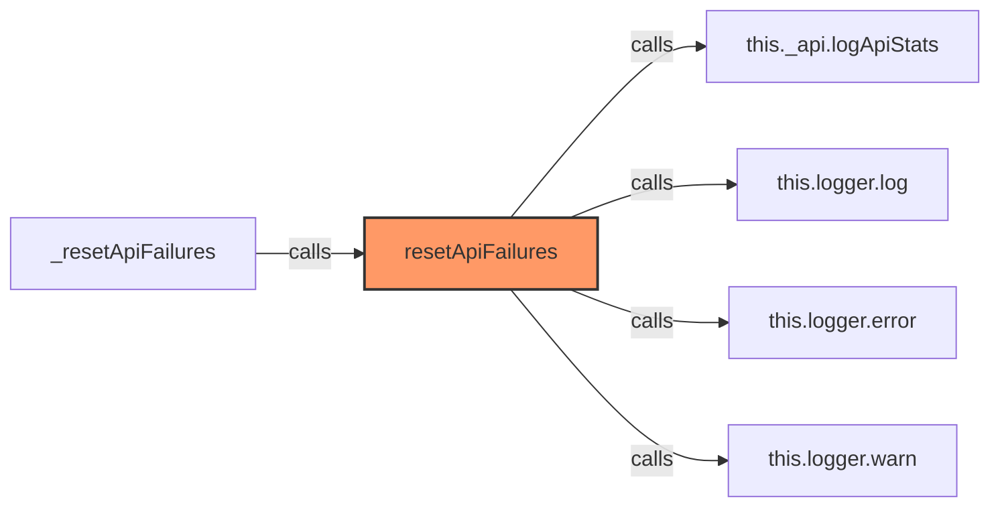
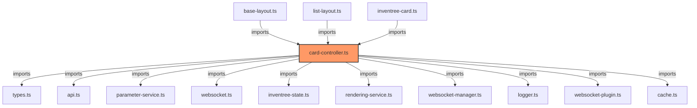

```mermaid
flowchart LR
    getInstance[getInstance]:::current
    _safeGetParameterService[_safeGetParameterService]
    _safeGetParameterService -->|calls| getInstance
    _loadData[_loadData]
    _loadData -->|calls| getInstance
    getParts[getParts]
    getParts -->|calls| getInstance
    updated[updated]
    updated -->|calls| getInstance
    updateFilteredParts[updateFilteredParts]
    updateFilteredParts -->|calls| getInstance
    processItems[processItems]
    processItems -->|calls| getInstance
    _updateVisualModifiers[_updateVisualModifiers]
    _updateVisualModifiers -->|calls| getInstance
    _setupWebSocketConnection[_setupWebSocketConnection]
    _setupWebSocketConnection -->|calls| getInstance
    _cleanupListeners[_cleanupListeners]
    _cleanupListeners -->|calls| getInstance
    _actuallyFilterParts[_actuallyFilterParts]
    _actuallyFilterParts -->|calls| getInstance
    render[render]
    render -->|calls| getInstance
    loadPartsFromEntities[loadPartsFromEntities]
    loadPartsFromEntities -->|calls| getInstance
    _renderDebuggingSection[_renderDebuggingSection]
    _renderDebuggingSection -->|calls| getInstance
    connectedCallback[connectedCallback]
    connectedCallback -->|calls| getInstance
    _resetApiFailures[_resetApiFailures]
    _resetApiFailures -->|calls| getInstance
    _initializeServices[_initializeServices]
    _initializeServices -->|calls| getInstance
    setHass[setHass]
    setHass -->|calls| getInstance
    initializeServices[initializeServices]
    initializeServices -->|calls| getInstance
    loadEntityData[loadEntityData]
    loadEntityData -->|calls| getInstance
    getWebSocketService[getWebSocketService]
    getWebSocketService -->|calls| getInstance
    initializeWebSocketPlugin[initializeWebSocketPlugin]
    initializeWebSocketPlugin -->|calls| getInstance
    handleWebSocketMessage[handleWebSocketMessage]
    handleWebSocketMessage -->|calls| getInstance
    getWebSocketDiagnostics[getWebSocketDiagnostics]
    getWebSocketDiagnostics -->|calls| getInstance
    getParameterValueFromPart[getParameterValueFromPart]
    getParameterValueFromPart -->|calls| getInstance
    isDirectPartReference[isDirectPartReference]
    isDirectPartReference -->|calls| getInstance
    getParameterValueWithDirectReference[getParameterValueWithDirectReference]
    getParameterValueWithDirectReference -->|calls| getInstance
    findEntityForPart[findEntityForPart]
    findEntityForPart -->|calls| getInstance
    storeOrphanedParameter[storeOrphanedParameter]
    storeOrphanedParameter -->|calls| getInstance
    isOrphanedPart[isOrphanedPart]
    isOrphanedPart -->|calls| getInstance
    getOrphanedPartIds[getOrphanedPartIds]
    getOrphanedPartIds -->|calls| getInstance
    getOrphanedPartParameters[getOrphanedPartParameters]
    getOrphanedPartParameters -->|calls| getInstance
    findParameterInWebSocketData[findParameterInWebSocketData]
    findParameterInWebSocketData -->|calls| getInstance
    findParameterInApiData[findParameterInApiData]
    findParameterInApiData -->|calls| getInstance
    findParameterInHassData[findParameterInHassData]
    findParameterInHassData -->|calls| getInstance
    findParameterInAllEntities[findParameterInAllEntities]
    findParameterInAllEntities -->|calls| getInstance
    syncApiDataToEntityState[syncApiDataToEntityState]
    syncApiDataToEntityState -->|calls| getInstance
    getParameterFromEntity[getParameterFromEntity]
    getParameterFromEntity -->|calls| getInstance
    startIdleTimer[startIdleTimer]
    startIdleTimer -->|calls| getInstance
    processVariants[processVariants]
    processVariants -->|calls| getInstance
    _handleParameterUpdate[_handleParameterUpdate]
    _handleParameterUpdate -->|calls| getInstance
    _updateEntityState[_updateEntityState]
    _updateEntityState -->|calls| getInstance
    classDef current fill:#f96,stroke:#333,stroke-width:2px;
```

# card-controller.ts

**Path:** `services/card-controller.ts`  
**Line Count:** 680  
**Functions:** 16  

## Overview

This file is part of the `services` directory.

## Imports

- custom-card-helpers: HomeAssistant
- [[types|types]]: InventreeCardConfig, InventreeItem
- [[api|api]]: InvenTreeDirectAPI
- [[parameter-service|parameter-service]]: ParameterService
- [[websocket|websocket]]: WebSocketService
- [[inventree-state|inventree-state]]: InventTreeState
- [[rendering-service|rendering-service]]: RenderingService
- [[websocket-manager|websocket-manager]]: WebSocketManager
- [[logger|logger]]: Logger
- [[websocket-plugin|websocket-plugin]]: WebSocketPlugin
- [[cache|cache]]: CacheService

## Exports

- `CardController`

## Functions

### Class: CardController

### `getInstance` (🌐 Public) {#getInstance}

**Returns:** `CardController`

**Called By:**

- From [[base-layout|base-layout]]:
  - `_safeGetParameterService`
  - `_loadData`
  - `getParts`
  - `updated`
  - `updateFilteredParts`
- From [[variant-handler|variant-handler]]:
  - `processItems`
- From [[detail-layout|detail-layout]]:
  - `_updateVisualModifiers`
- From [[grid-layout|grid-layout]]:
  - `_setupWebSocketConnection`
  - `_cleanupListeners`
  - `_actuallyFilterParts`
  - `_updateVisualModifiers`
  - `render`
- From [[list-layout|list-layout]]:
  - `_updateVisualModifiers`
  - `render`
- From [[parts-layout|parts-layout]]:
  - `loadPartsFromEntities`
  - `_updateVisualModifiers`
- From [[editor|editor]]:
  - `_renderDebuggingSection`
- From [[inventree-card|inventree-card]]:
  - `connectedCallback`
  - `_resetApiFailures`
  - `_initializeServices`
- From [[card-controller|card-controller]]:
  - `setHass`
  - `initializeServices`
  - `loadEntityData`
  - `getParts`
  - `getWebSocketService`
  - `initializeWebSocketPlugin`
  - `handleWebSocketMessage`
  - `getWebSocketDiagnostics`
- From [[parameter-service|parameter-service]]:
  - `getParameterValueFromPart`
  - `isDirectPartReference`
  - `getParameterValueWithDirectReference`
  - `findEntityForPart`
  - `storeOrphanedParameter`
  - `isOrphanedPart`
  - `getOrphanedPartIds`
  - `getOrphanedPartParameters`
  - `findParameterInWebSocketData`
  - `findParameterInApiData`
  - `findParameterInHassData`
  - `findParameterInAllEntities`
  - `syncApiDataToEntityState`
  - `getParameterFromEntity`
- From [[rendering-service|rendering-service]]:
  - `startIdleTimer`
- From [[variant-service|variant-service]]:
  - `processVariants`
- From [[websocket-plugin|websocket-plugin]]:
  - `_handleParameterUpdate`
- From [[websocket|websocket]]:
  - `_updateEntityState`

**Call Graph:**



### `setConfig` (🌐 Public) {#setConfig}

**Parameters:**

- `config`: `InventreeCardConfig`

**Returns:** `void`

**Calls:**

- [[logger|logger]]#log
- [[card-controller|card-controller]]#initializeServices
- [[card-controller|card-controller]]#loadEntityData
- [[rendering-service|rendering-service]]#setupRendering

**Called By:**

- From [[inventree-card|inventree-card]]:
  - `setConfig`
  - `updated`
- From [[card-controller|card-controller]]:
  - `initializeServices`

**Call Graph:**



### `setHass` (🌐 Public) {#setHass}

**Parameters:**

- `hass`: `HomeAssistant`

**Returns:** `void`

**Calls:**

- [[logger|logger]]#log
- [[inventree-state|inventree-state]]#setHass
- [[inventree-state|inventree-state]]#getInstance
- [[card-controller|card-controller]]#initializeServices
- [[card-controller|card-controller]]#loadEntityData

**Called By:**

- From [[inventree-card|inventree-card]]:
  - `connectedCallback`
  - `_initializeServices`
- From [[card-controller|card-controller]]:
  - `initializeServices`
- From [[state|state]]:
  - `setHass`

**Call Graph:**

```mermaid
flowchart LR
    setHass[setHass]:::current
    this_logger_log[this.logger.log]
    setHass -->|calls| this_logger_log
    InventTreeState_getInstance___setHass[InventTreeState.getInstance().setHass]
    setHass -->|calls| InventTreeState_getInstance___setHass
    InventTreeState_getInstance[InventTreeState.getInstance]
    setHass -->|calls| InventTreeState_getInstance
    this_initializeServices[this.initializeServices]
    setHass -->|calls| this_initializeServices
    this_loadEntityData[this.loadEntityData]
    setHass -->|calls| this_loadEntityData
    connectedCallback[connectedCallback]
    connectedCallback -->|calls| setHass
    _initializeServices[_initializeServices]
    _initializeServices -->|calls| setHass
    initializeServices[initializeServices]
    initializeServices -->|calls| setHass
    setHass[setHass]
    setHass -->|calls| setHass
    classDef current fill:#f96,stroke:#333,stroke-width:2px;
```

### `initializeServices` (🌐 Public) {#initializeServices}

**Returns:** `void`

**Calls:**

- [[logger|logger]]#log
- [[logger|logger]]#warn
- [[inventree-state|inventree-state]]#getInstance
- [[inventree-state|inventree-state]]#setHass
- [[parameter-service|parameter-service]]#hasInstance
- [[inventree-state|inventree-state]]#getInstance
- [[parameter-service|parameter-service]]#updateHass
- [[editor|editor]]#setConfig
- [[logger|logger]]#error
- [[inventree-state|inventree-state]]#setHass
- [[inventree-state|inventree-state]]#getInstance
- [[card-controller|card-controller]]#initializeApi

**Called By:**

- From [[card-controller|card-controller]]:
  - `setConfig`
  - `setHass`

**Call Graph:**

```mermaid
flowchart LR
    initializeServices[initializeServices]:::current
    this_logger_log[this.logger.log]
    initializeServices -->|calls| this_logger_log
    this_logger_warn[this.logger.warn]
    initializeServices -->|calls| this_logger_warn
    InventTreeState_getInstance[InventTreeState.getInstance]
    initializeServices -->|calls| InventTreeState_getInstance
    state_setHass[state.setHass]
    initializeServices -->|calls| state_setHass
    ParameterService_hasInstance[ParameterService.hasInstance]
    initializeServices -->|calls| ParameterService_hasInstance
    ParameterService_getInstance[ParameterService.getInstance]
    initializeServices -->|calls| ParameterService_getInstance
    this__parameterService_updateHass[this._parameterService.updateHass]
    initializeServices -->|calls| this__parameterService_updateHass
    this__parameterService_setConfig[this._parameterService.setConfig]
    initializeServices -->|calls| this__parameterService_setConfig
    this_logger_error[this.logger.error]
    initializeServices -->|calls| this_logger_error
    WebSocketService_getInstance___setHass[WebSocketService.getInstance().setHass]
    initializeServices -->|calls| WebSocketService_getInstance___setHass
    WebSocketService_getInstance[WebSocketService.getInstance]
    initializeServices -->|calls| WebSocketService_getInstance
    this_initializeApi[this.initializeApi]
    initializeServices -->|calls| this_initializeApi
    setConfig[setConfig]
    setConfig -->|calls| initializeServices
    setHass[setHass]
    setHass -->|calls| initializeServices
    classDef current fill:#f96,stroke:#333,stroke-width:2px;
```

### `initializeApi` (🌐 Public) {#initializeApi}

**Returns:** `void`

**Calls:**

- [[logger|logger]]#log
- [[parameter-service|parameter-service]]#setDirectApi
- [[logger|logger]]#warn
- [[logger|logger]]#error
- [[parameter-service|parameter-service]]#setDirectApi
- [[card-controller|card-controller]]#getWebSocketService
- [[parameter-service|parameter-service]]#setStrictWebSocketMode
- [[card-controller|card-controller]]#initializeWebSocketPlugin

**Called By:**

- From [[card-controller|card-controller]]:
  - `initializeServices`

**Call Graph:**

```mermaid
flowchart LR
    initializeApi[initializeApi]:::current
    this_logger_log[this.logger.log]
    initializeApi -->|calls| this_logger_log
    this__parameterService_setDirectApi[this._parameterService.setDirectApi]
    initializeApi -->|calls| this__parameterService_setDirectApi
    this_logger_warn[this.logger.warn]
    initializeApi -->|calls| this_logger_warn
    this_logger_error[this.logger.error]
    initializeApi -->|calls| this_logger_error
    this_getWebSocketService___setDirectApi[this.getWebSocketService().setDirectApi]
    initializeApi -->|calls| this_getWebSocketService___setDirectApi
    this_getWebSocketService[this.getWebSocketService]
    initializeApi -->|calls| this_getWebSocketService
    this__parameterService_setStrictWebSocketMode[this._parameterService.setStrictWebSocketMode]
    initializeApi -->|calls| this__parameterService_setStrictWebSocketMode
    this_initializeWebSocketPlugin[this.initializeWebSocketPlugin]
    initializeApi -->|calls| this_initializeWebSocketPlugin
    initializeServices[initializeServices]
    initializeServices -->|calls| initializeApi
    classDef current fill:#f96,stroke:#333,stroke-width:2px;
```

### `loadEntityData` (🌐 Public) {#loadEntityData}

**Parameters:**

- `entityId`: `string`

**Returns:** `void`

**Calls:**

- [[logger|logger]]#warn
- [[inventree-state|inventree-state]]#getInstance
- [[inventree-state|inventree-state]]#setHassData
- [[logger|logger]]#log

**Called By:**

- From [[card-controller|card-controller]]:
  - `setConfig`
  - `setHass`

**Call Graph:**



### `getParts` (🌐 Public) {#getParts}

**Returns:** `InventreeItem[]`

**Calls:**

- [[inventree-state|inventree-state]]#getInstance
- [[inventree-state|inventree-state]]#getNewestData

**Called By:**

- From [[base-layout|base-layout]]:
  - `_loadData`
- From [[grid-layout|grid-layout]]:
  - `_checkAndRecoverState`
- From [[list-layout|list-layout]]:
  - `render`
- From [[inventree-card|inventree-card]]:
  - `render`

**Call Graph:**



### `getParameterService` (🌐 Public) {#getParameterService}

**Returns:** `ParameterService | null`

**Called By:**

- From [[base-layout|base-layout]]:
  - `_safeGetParameterService`
- From [[inventree-card|inventree-card]]:
  - `_handleStockAdjustment`
  - `updateCrossEntityParameter`
  - `updateParametersForMatchingParts`
  - `_renderDiagnosticTools`

**Call Graph:**



### `getRenderingService` (🌐 Public) {#getRenderingService}

**Returns:** `RenderingService`

### `getWebSocketService` (🌐 Public) {#getWebSocketService}

**Returns:** `WebSocketService`

**Calls:**

- [[inventree-state|inventree-state]]#getInstance

**Called By:**

- From [[card-controller|card-controller]]:
  - `initializeApi`
  - `subscribeToEntityChanges`

**Call Graph:**



### `initializeWebSocketPlugin` (🌐 Public) {#initializeWebSocketPlugin}

**Returns:** `void`

**Calls:**

- [[logger|logger]]#log
- `this._config.direct_api.url.replace`
- [[logger|logger]]#error
- [[inventree-state|inventree-state]]#getInstance
- [[websocket-plugin|websocket-plugin]]#configure
- [[websocket-plugin|websocket-plugin]]#onMessage
- [[card-controller|card-controller]]#handleWebSocketMessage
- [[websocket-plugin|websocket-plugin]]#connect

**Called By:**

- From [[card-controller|card-controller]]:
  - `initializeApi`

**Call Graph:**



### `handleWebSocketMessage` (🌐 Public) {#handleWebSocketMessage}

**Parameters:**

- `message`: `any`

**Returns:** `void`

**Calls:**

- [[logger|logger]]#log
- `JSON.stringify(message).substring`
- `JSON.stringify`
- `message.event.includes`
- [[cache|cache]]#has
- [[cache|cache]]#set
- [[inventree-state|inventree-state]]#getInstance
- [[inventree-state|inventree-state]]#isDirectPartReference
- [[api|api]]#isApiConnected
- `state.getParameterValueWithDirectReference(`part:${partId}:${paramName}`)
               .then(newValue => {
                 if (newValue !== null) {
                   this.logger.log('CardController', `✅ Fast path successful: Got ${paramName}=${newValue} for Part ${partId}`, {
                     category: 'card',
                     subsystem: 'optimization'
                   });
                 }
               }).catch`
- `state.getParameterValueWithDirectReference(`part:${partId}:${paramName}`).then`
- [[inventree-state|inventree-state]]#getParameterValueWithDirectReference
- [[logger|logger]]#error
- [[inventree-state|inventree-state]]#updateParameter
- [[logger|logger]]#warn
- [[inventree-state|inventree-state]]#storeOrphanedParameter

**Called By:**

- From [[card-controller|card-controller]]:
  - `initializeWebSocketPlugin`

**Call Graph:**

```mermaid
flowchart LR
    handleWebSocketMessage[handleWebSocketMessage]:::current
    this_logger_log[this.logger.log]
    handleWebSocketMessage -->|calls| this_logger_log
    JSON_stringify_message__substring[JSON.stringify(message).substring]
    handleWebSocketMessage -->|calls| JSON_stringify_message__substring
    JSON_stringify[JSON.stringify]
    handleWebSocketMessage -->|calls| JSON_stringify
    message_event_includes[message.event.includes]
    handleWebSocketMessage -->|calls| message_event_includes
    this_cache_has[this.cache.has]
    handleWebSocketMessage -->|calls| this_cache_has
    this_cache_set[this.cache.set]
    handleWebSocketMessage -->|calls| this_cache_set
    InventTreeState_getInstance[InventTreeState.getInstance]
    handleWebSocketMessage -->|calls| InventTreeState_getInstance
    state_isDirectPartReference[state.isDirectPartReference]
    handleWebSocketMessage -->|calls| state_isDirectPartReference
    this__parameterService_isApiConnected[this._parameterService.isApiConnected]
    handleWebSocketMessage -->|calls| this__parameterService_isApiConnected
    state_getParameterValueWithDirectReference__part___partId____paramName____________________then_newValue_______________________if__newValue_____null_______________________this_logger_log__CardController______Fast_path_successful__Got___paramName____newValue__for_Part___partId___________________________category___card________________________subsystem___optimization______________________________________________________________catch[state.getParameterValueWithDirectReference(`part:${partId}:${paramName}`)
               .then(newValue => {
                 if (newValue !== null) {
                   this.logger.log('CardController', `✅ Fast path successful: Got ${paramName}=${newValue} for Part ${partId}`, {
                     category: 'card',
                     subsystem: 'optimization'
                   });
                 }
               }).catch]
    handleWebSocketMessage -->|calls| state_getParameterValueWithDirectReference__part___partId____paramName____________________then_newValue_______________________if__newValue_____null_______________________this_logger_log__CardController______Fast_path_successful__Got___paramName____newValue__for_Part___partId___________________________category___card________________________subsystem___optimization______________________________________________________________catch
    state_getParameterValueWithDirectReference__part___partId____paramName____then[state.getParameterValueWithDirectReference(`part:${partId}:${paramName}`).then]
    handleWebSocketMessage -->|calls| state_getParameterValueWithDirectReference__part___partId____paramName____then
    state_getParameterValueWithDirectReference[state.getParameterValueWithDirectReference]
    handleWebSocketMessage -->|calls| state_getParameterValueWithDirectReference
    this_logger_error[this.logger.error]
    handleWebSocketMessage -->|calls| this_logger_error
    state_updateParameter[state.updateParameter]
    handleWebSocketMessage -->|calls| state_updateParameter
    this_logger_warn[this.logger.warn]
    handleWebSocketMessage -->|calls| this_logger_warn
    state_storeOrphanedParameter[state.storeOrphanedParameter]
    handleWebSocketMessage -->|calls| state_storeOrphanedParameter
    initializeWebSocketPlugin[initializeWebSocketPlugin]
    initializeWebSocketPlugin -->|calls| handleWebSocketMessage
    classDef current fill:#f96,stroke:#333,stroke-width:2px;
```

### `getWebSocketDiagnostics` (🌐 Public) {#getWebSocketDiagnostics}

**Returns:** `any`

**Calls:**

- [[inventree-state|inventree-state]]#getInstance
- [[inventree-state|inventree-state]]#getInstance
- [[websocket|websocket]]#getConnectionStatus
- [[websocket|websocket]]#getApiStatus
- [[cache|cache]]#getStats
- [[inventree-state|inventree-state]]#getInstance
- [[cache|cache]]#getStats

**Called By:**

- From [[inventree-card|inventree-card]]:
  - `_renderDiagnosticTools`

**Call Graph:**

```mermaid
flowchart LR
    getWebSocketDiagnostics[getWebSocketDiagnostics]:::current
    WebSocketService_getInstance[WebSocketService.getInstance]
    getWebSocketDiagnostics -->|calls| WebSocketService_getInstance
    WebSocketPlugin_getInstance[WebSocketPlugin.getInstance]
    getWebSocketDiagnostics -->|calls| WebSocketPlugin_getInstance
    wsService_getConnectionStatus[wsService.getConnectionStatus]
    getWebSocketDiagnostics -->|calls| wsService_getConnectionStatus
    wsService_getApiStatus[wsService.getApiStatus]
    getWebSocketDiagnostics -->|calls| wsService_getApiStatus
    WebSocketManager_getInstance___getStats[WebSocketManager.getInstance().getStats]
    getWebSocketDiagnostics -->|calls| WebSocketManager_getInstance___getStats
    WebSocketManager_getInstance[WebSocketManager.getInstance]
    getWebSocketDiagnostics -->|calls| WebSocketManager_getInstance
    webSocketPlugin_getStats[webSocketPlugin.getStats]
    getWebSocketDiagnostics -->|calls| webSocketPlugin_getStats
    _renderDiagnosticTools[_renderDiagnosticTools]
    _renderDiagnosticTools -->|calls| getWebSocketDiagnostics
    classDef current fill:#f96,stroke:#333,stroke-width:2px;
```

### `subscribeToEntityChanges` (🌐 Public) {#subscribeToEntityChanges}

**Parameters:**

- `entityId`: `string`
- `callback`: `() => void`

**Returns:** `() => void`

**Calls:**

- [[websocket|websocket]]#subscribeToParts
- [[card-controller|card-controller]]#getWebSocketService
- `callback`

**Called By:**

- From [[inventree-card|inventree-card]]:
  - `connectedCallback`

**Call Graph:**

```mermaid
flowchart LR
    subscribeToEntityChanges[subscribeToEntityChanges]:::current
    this_getWebSocketService___subscribeToParts[this.getWebSocketService().subscribeToParts]
    subscribeToEntityChanges -->|calls| this_getWebSocketService___subscribeToParts
    this_getWebSocketService[this.getWebSocketService]
    subscribeToEntityChanges -->|calls| this_getWebSocketService
    callback[callback]
    subscribeToEntityChanges -->|calls| callback
    connectedCallback[connectedCallback]
    connectedCallback -->|calls| subscribeToEntityChanges
    classDef current fill:#f96,stroke:#333,stroke-width:2px;
```

### `getWebSocketPlugin` (🌐 Public) {#getWebSocketPlugin}

**Returns:** `WebSocketPlugin`

### `resetApiFailures` (🌐 Public) {#resetApiFailures}

**Returns:** `void`

**Calls:**

- [[api|api]]#logApiStats
- [[logger|logger]]#log
- [[logger|logger]]#error
- [[logger|logger]]#warn

**Called By:**

- From [[inventree-card|inventree-card]]:
  - `_resetApiFailures`

**Call Graph:**



## Dependencies



