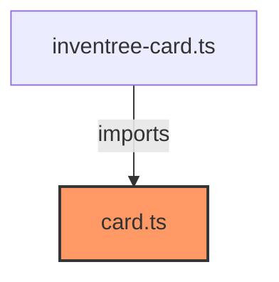

# card.ts

**Path:** `styles/card.ts`  
**Line Count:** 238  
**Functions:** 0  

## Overview

This file is part of the `styles` directory.

## Imports

- lit: css

## Exports

- `cardStyles`

## Dependencies

