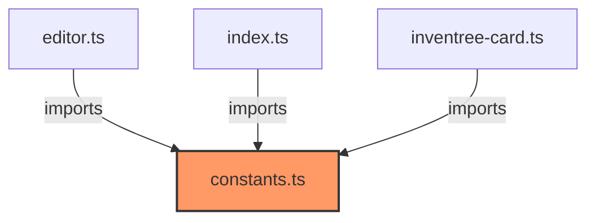

# constants.ts

**Path:** `core/constants.ts`  
**Line Count:** 7  
**Functions:** 0  

## Overview

This file is part of the `core` directory.

## Exports

- `CARD_VERSION`
- `CARD_NAME`
- `CARD_TYPE`
- `EDITOR_NAME`
- `SETTINGS_SCHEMA`

## Dependencies

