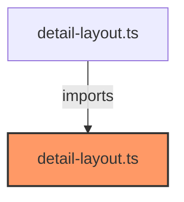

# detail-layout.ts

**Path:** `styles/layouts/detail-layout.ts`  
**Line Count:** 235  
**Functions:** 0  

## Overview

This file is part of the `styles/layouts` directory.

## Imports

- lit: css

## Exports

- `detailStyles`

## Dependencies

