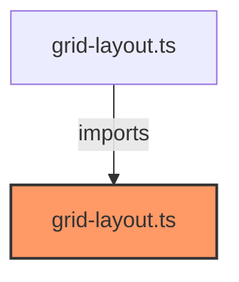

# grid-layout.ts

**Path:** `styles/layouts/grid-layout.ts`  
**Line Count:** 179  
**Functions:** 0  

## Overview

This file is part of the `styles/layouts` directory.

## Imports

- lit: css

## Exports

- `gridLayoutStyles`

## Dependencies

