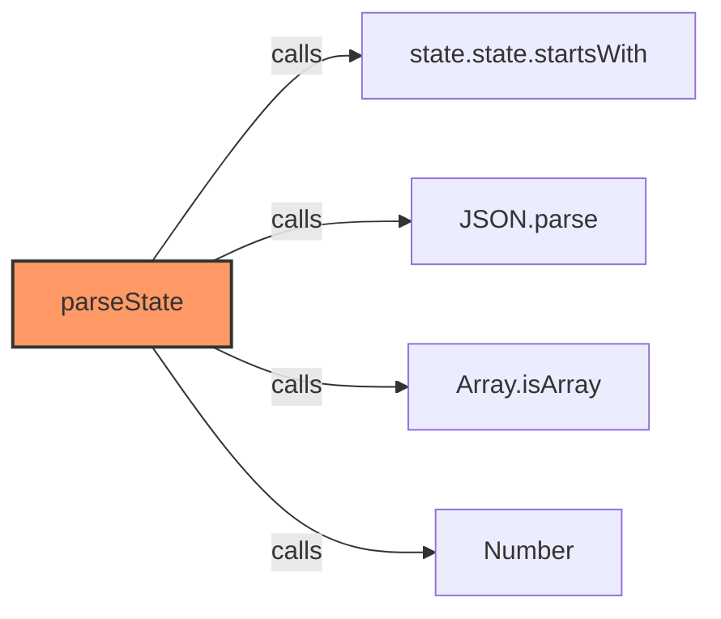
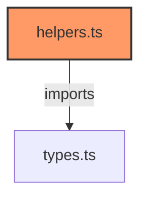

# helpers.ts

**Path:** `utils/helpers.ts`  
**Line Count:** 99  
**Functions:** 2  

## Overview

This file is part of the `utils` directory.

## Imports

- custom-card-helpers: HomeAssistant
- [[types|types]]: InventreeItem

## Exports

- `parseState`
- `shouldUpdate`

## Functions

### `parseState` (🌐 Public) {#parseState}

**Parameters:**

- `hass`: `HomeAssistant`
- `entityId`: `string`

**Returns:** `InventreeItem[]`

**Calls:**

- `state.state.startsWith`
- `JSON.parse`
- `Array.isArray`
- `Number`

**Call Graph:**

### `shouldUpdate` (🌐 Public) {#shouldUpdate}

**Parameters:**

- `newHass`: `HomeAssistant`
- `oldHass`: `HomeAssistant`
- `entityId`: `string`

**Returns:** `boolean`

## Dependencies

