# inventree-card.ts

**Path:** `inventree-card.ts`  
**Line Count:** 1345  
**Functions:** 38  

## Overview

This file is part of the `.` directory.

## Imports

- lit: LitElement, html
- lit/decorators.js: property, state, customElement
- custom-card-helpers: HomeAssistant, LovelaceCard, LovelaceCardEditor
- lit: TemplateResult
- lit: css
- [[card|card]]: cardStyles
- [[constants|constants]]: CARD_NAME, EDITOR_NAME
- [[settings|settings]]: DEFAULT_CONFIG
- [[types|types]]: InventreeCardConfig, PartData, InvenTreePart, ParameterData
- [[editor|editor]]: InventreeCardEditor
- [[grid-layout|grid-layout]]
- [[detail-layout|detail-layout]]
- [[list-layout|list-layout]]
- [[part-view|part-view]]
- [[part-details|part-details]]
- [[part-thumbnail|part-thumbnail]]
- [[part-container|part-container]]
- [[part-buttons|part-buttons]]
- [[adjust-stock|adjust-stock]]
- [[print-label|print-label]]
- [[wled-service|wled-service]]
- [[parameter-service|parameter-service]]
- [[wled-service|wled-service]]: WLEDService
- [[print-label|print-label]]: PrintService
- [[parameter-service|parameter-service]]: ParameterService
- [[api|api]]: InvenTreeDirectAPI
- [[variant-handler|variant-handler]]: VariantHandler
- [[logger|logger]]: Logger
- [[variant-layout|variant-layout]]
- [[part-variant|part-variant]]
- [[parts-layout|parts-layout]]
- [[inventree-state|inventree-state]]: InventTreeState
- [[websocket|websocket]]: WebSocketService
- [[types|types]]: InventreeItem
- [[websocket-manager|websocket-manager]]: WebSocketManager
- [[card-controller|card-controller]]: CardController
- [[websocket-plugin|websocket-plugin]]: WebSocketPlugin
- [[rendering-service|rendering-service]]: RenderingService
- [[cache|cache]]: CacheService

## Exports

- `InventreeCard`

## Functions

### Class: InventreeCard

### `getConfigElement` (🌐 Public) {#getConfigElement}

**Returns:** `Promise<LovelaceCardEditor>`

**Calls:**

- [[cache|cache]]#get

**Call Graph:**

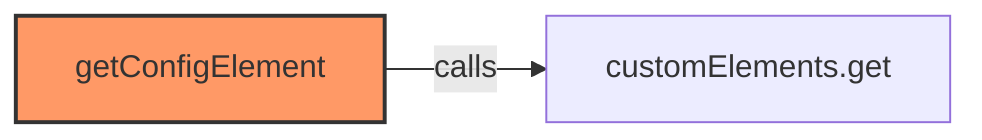

### `getStubConfig` (🌐 Public) {#getStubConfig}

**Parameters:**

- `hass`: `HomeAssistant`

**Returns:** `InventreeCardConfig`

**Calls:**

- `Object.keys(hass.states).find`
- `Object.keys`
- `eid.startsWith`

**Call Graph:**

```mermaid
flowchart LR
    getStubConfig[getStubConfig]:::current
    Object_keys_hass_states__find[Object.keys(hass.states).find]
    getStubConfig -->|calls| Object_keys_hass_states__find
    Object_keys[Object.keys]
    getStubConfig -->|calls| Object_keys
    eid_startsWith[eid.startsWith]
    getStubConfig -->|calls| eid_startsWith
    classDef current fill:#f96,stroke:#333,stroke-width:2px;
```

### `setConfig` (🌐 Public) {#setConfig}

**Parameters:**

- `config`: `InventreeCardConfig`

**Returns:** `void`

**Calls:**

- [[logger|logger]]#log
- [[logger|logger]]#setDebug
- [[logger|logger]]#setEnabled
- [[editor|editor]]#setConfig
- [[inventree-card|inventree-card]]#_initializeServices
- [[inventree-card|inventree-card]]#_setupEntitySubscriptions

**Called By:**

- From [[inventree-card|inventree-card]]:
  - `updated`
- From [[card-controller|card-controller]]:
  - `initializeServices`

**Call Graph:**

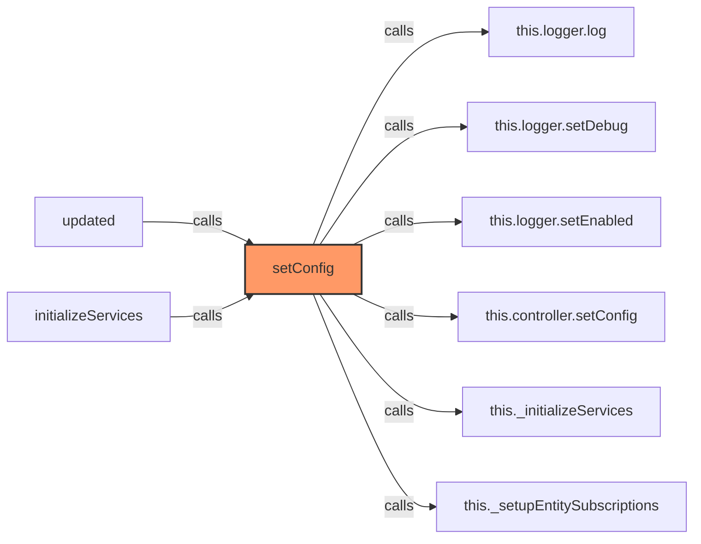

### `_setupEntitySubscriptions` (🔒 Private) {#_setupEntitySubscriptions}

**Returns:** `void`

**Calls:**

- [[inventree-card|inventree-card]]#_clearEntitySubscriptions
- [[logger|logger]]#warn
- [[logger|logger]]#log

**Called By:**

- From [[inventree-card|inventree-card]]:
  - `setConfig`
  - `updated`
  - `connectedCallback`

**Call Graph:**

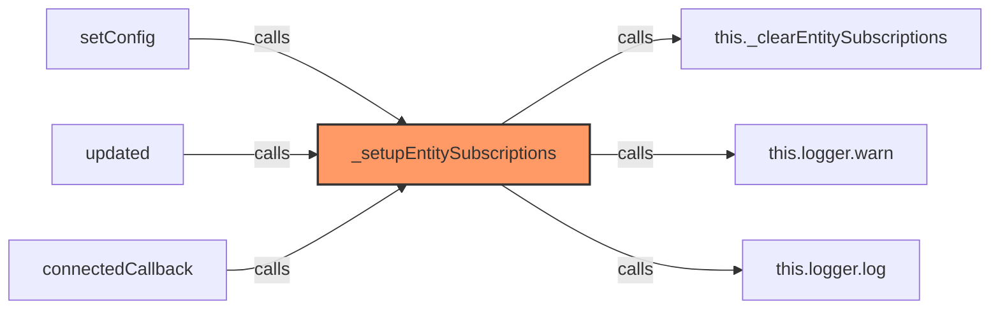

### `subscribe` (🌐 Public) {#subscribe}

**Parameters:**

- `entityIdToSubscribe`: `string`

**Returns:** `void`

**Calls:**

- `this._hass!.connection.subscribeEvents`
- [[logger|logger]]#log
- [[base-layout|base-layout]]#requestUpdate
- [[cache|cache]]#set
- [[logger|logger]]#error

**Call Graph:**

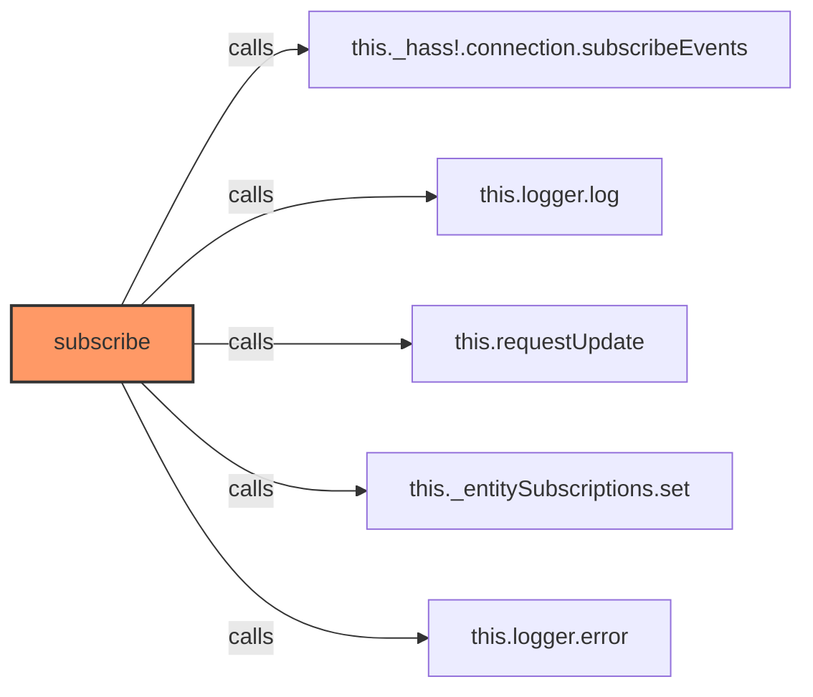

### `subscribe` (🌐 Public) {#subscribe}

**Parameters:**

- `entityIdToSubscribe`: `string`

**Returns:** `void`

**Calls:**

- `this._hass!.connection.subscribeEvents`
- [[logger|logger]]#log
- [[base-layout|base-layout]]#requestUpdate
- [[cache|cache]]#set
- [[logger|logger]]#error

**Call Graph:**


### `_clearEntitySubscriptions` (🔒 Private) {#_clearEntitySubscriptions}

**Returns:** `void`

**Calls:**

- `this._entitySubscriptions.forEach`
- `unsubscribe`
- [[cache|cache]]#clear
- [[inventree-state|inventree-state]]#setHassData

**Called By:**

- From [[inventree-card|inventree-card]]:
  - `_setupEntitySubscriptions`
  - `disconnectedCallback`

**Call Graph:**

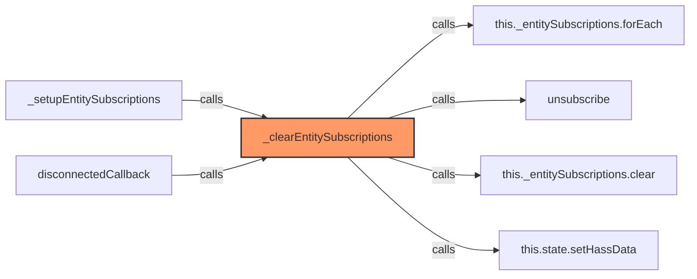

### `debouncedRender` (🌐 Public) {#debouncedRender}

**Returns:** `void`

**Calls:**

- [[cache|cache]]#has
- [[logger|logger]]#log
- [[cache|cache]]#set
- [[base-layout|base-layout]]#requestUpdate
- [[logger|logger]]#warn

**Called By:**

- From [[inventree-card|inventree-card]]:
  - `connectedCallback`

**Call Graph:**

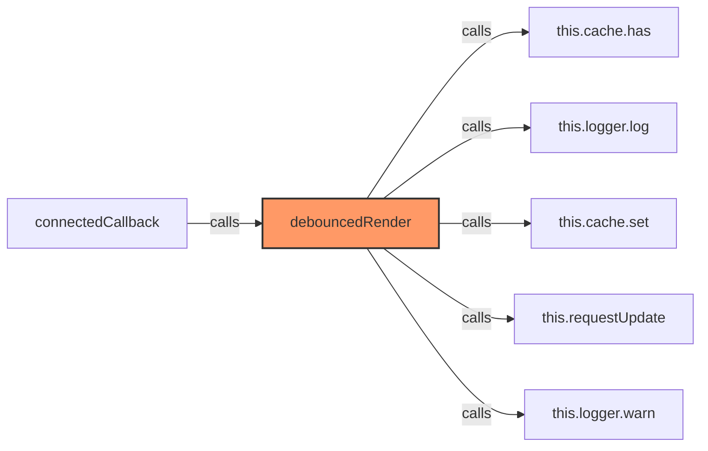

### `updated` (🌐 Public) {#updated}

**Parameters:**

- `changedProps`: `Map<string | number | symbol, unknown>`

**Returns:** `void`

**Calls:**

- [[base-layout|base-layout]]#updated
- [[cache|cache]]#has
- [[editor|editor]]#setConfig
- [[inventree-card|inventree-card]]#_setupEntitySubscriptions
- [[rendering-service|rendering-service]]#setupRendering

**Called By:**

- From [[base-layout|base-layout]]:
  - `updated`
- From [[detail-layout|detail-layout]]:
  - `updated`
- From [[grid-layout|grid-layout]]:
  - `updated`
- From [[list-layout|list-layout]]:
  - `updated`
- From [[part-buttons|part-buttons]]:
  - `updated`
- From [[part-container|part-container]]:
  - `updated`
- From [[part-view|part-view]]:
  - `updated`
- From [[parts-layout|parts-layout]]:
  - `updated`
- From [[variant-layout|variant-layout]]:
  - `updated`

**Call Graph:**

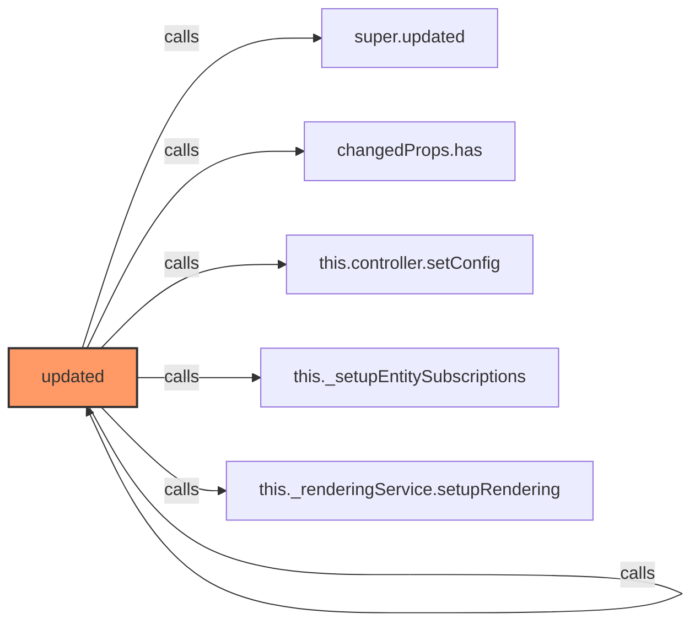

### `render` (🌐 Public) {#render}

**Returns:** `TemplateResult | void`

**Calls:**

- [[base-layout|base-layout]]#getParts
- [[inventree-card|inventree-card]]#_renderDebugInfo
- [[inventree-card|inventree-card]]#getSelectedPart
- [[base-layout|base-layout]]#getParts
- [[logger|logger]]#log
- [[rendering-service|rendering-service]]#notifyRenderComplete

**Call Graph:**

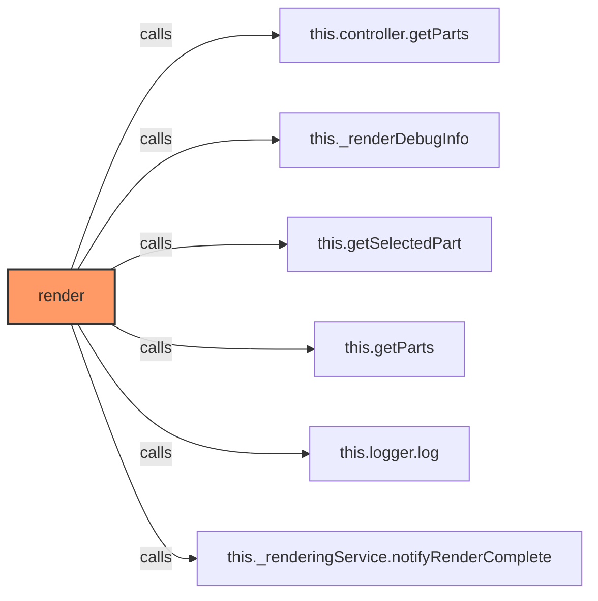

### `_computeHash` (🔒 Private) {#_computeHash}

**Parameters:**

- `str`: `string`

**Returns:** `number`

**Calls:**

- `str.charCodeAt`
- `Math.abs`

**Call Graph:**

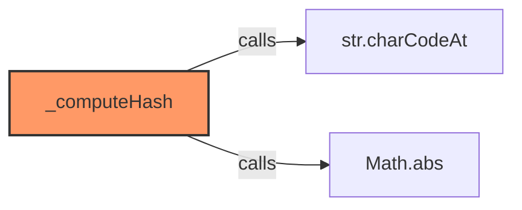

### `getSelectedPart` (🌐 Public) {#getSelectedPart}

**Parameters:**

- `parts`: `PartData[]`

**Returns:** `PartData | undefined`

**Calls:**

- `parts.find`

**Called By:**

- From [[inventree-card|inventree-card]]:
  - `render`

**Call Graph:**

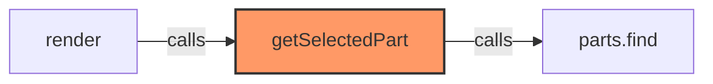

### `getParts` (🌐 Public) {#getParts}

**Returns:** `PartData[]`

**Calls:**

- [[cache|cache]]#get
- [[cache|cache]]#set

**Called By:**

- From [[base-layout|base-layout]]:
  - `_loadData`
- From [[grid-layout|grid-layout]]:
  - `_checkAndRecoverState`
- From [[list-layout|list-layout]]:
  - `render`
- From [[inventree-card|inventree-card]]:
  - `render`

**Call Graph:**

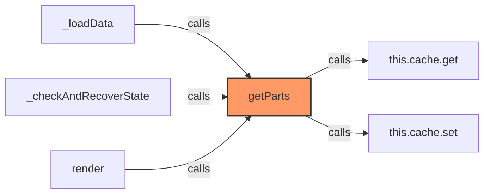

### `getCardSize` (🌐 Public) {#getCardSize}

**Returns:** `number`

**Calls:**

- `JSON.parse`
- `Math.ceil`

**Call Graph:**

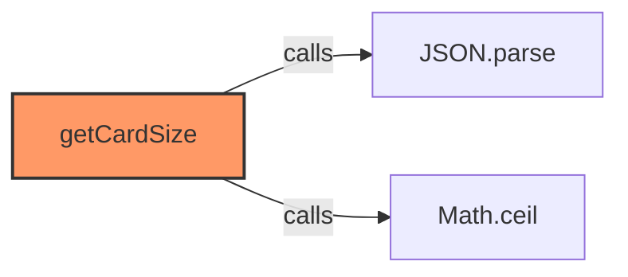

### `handleLocateClick` (🌐 Public) {#handleLocateClick}

**Parameters:**

- `part`: `PartData`

**Returns:** `void`

**Calls:**

- [[inventree-card|inventree-card]]#convertToInvenTreePart
- [[wled-service|wled-service]]#locatePart

**Called By:**

- From [[inventree-card|inventree-card]]:
  - `_renderActionButtons`

**Call Graph:**

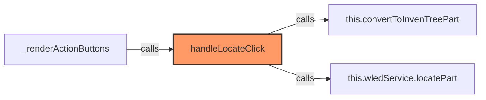

### `convertToInvenTreePart` (🌐 Public) {#convertToInvenTreePart}

**Parameters:**

- `part`: `PartData`

**Returns:** `InvenTreePart`

**Calls:**

- `part.parameters
                    .filter((p): p is NonNullable<typeof p> => p !== null && p !== undefined).map`
- `part.parameters.filter`

**Called By:**

- From [[inventree-card|inventree-card]]:
  - `handleLocateClick`

**Call Graph:**

```mermaid
flowchart LR
    convertToInvenTreePart[convertToInvenTreePart]:::current
    part_parameters______________________filter__p___p_is_NonNullable_typeof_p_____p_____null____p_____undefined__map[part.parameters
                    .filter((p): p is NonNullable<typeof p> => p !== null && p !== undefined).map]
    convertToInvenTreePart -->|calls| part_parameters______________________filter__p___p_is_NonNullable_typeof_p_____p_____null____p_____undefined__map
    part_parameters_filter[part.parameters.filter]
    convertToInvenTreePart -->|calls| part_parameters_filter
    handleLocateClick[handleLocateClick]
    handleLocateClick -->|calls| convertToInvenTreePart
    classDef current fill:#f96,stroke:#333,stroke-width:2px;
```

### `_handleStockAdjustment` (🔒 Private) {#_handleStockAdjustment}

**Parameters:**

- `e`: `CustomEvent`

**Returns:** `void`

**Calls:**

- [[card-controller|card-controller]]#getParameterService
- [[logger|logger]]#error
- `paramService.updateParameter(item, 'stock', String(amount)) // Assuming 'stock' is the correct parameter name
            .then(() => {
                this.logger.log('Card', 'Stock adjustment successful via ParameterService');
                // Optionally trigger a state refresh or rely on state updates
                this.requestUpdate(); 
            }).catch`
- `paramService.updateParameter(item, 'stock', String(amount)).then`
- [[inventree-state|inventree-state]]#updateParameter
- `String`
- [[logger|logger]]#log
- [[base-layout|base-layout]]#requestUpdate

**Call Graph:**

```mermaid
flowchart LR
    _handleStockAdjustment[_handleStockAdjustment]:::current
    this_controller_getParameterService[this.controller.getParameterService]
    _handleStockAdjustment -->|calls| this_controller_getParameterService
    this_logger_error[this.logger.error]
    _handleStockAdjustment -->|calls| this_logger_error
    paramService_updateParameter_item___stock___String_amount______Assuming__stock__is_the_correct_parameter_name______________then_________________________this_logger_log__Card____Stock_adjustment_successful_via_ParameterService_______________________Optionally_trigger_a_state_refresh_or_rely_on_state_updates_________________this_requestUpdate____________________catch[paramService.updateParameter(item, 'stock', String(amount)) // Assuming 'stock' is the correct parameter name
            .then(() => {
                this.logger.log('Card', 'Stock adjustment successful via ParameterService');
                // Optionally trigger a state refresh or rely on state updates
                this.requestUpdate(); 
            }).catch]
    _handleStockAdjustment -->|calls| paramService_updateParameter_item___stock___String_amount______Assuming__stock__is_the_correct_parameter_name______________then_________________________this_logger_log__Card____Stock_adjustment_successful_via_ParameterService_______________________Optionally_trigger_a_state_refresh_or_rely_on_state_updates_________________this_requestUpdate____________________catch
    paramService_updateParameter_item___stock___String_amount___then[paramService.updateParameter(item, 'stock', String(amount)).then]
    _handleStockAdjustment -->|calls| paramService_updateParameter_item___stock___String_amount___then
    paramService_updateParameter[paramService.updateParameter]
    _handleStockAdjustment -->|calls| paramService_updateParameter
    String[String]
    _handleStockAdjustment -->|calls| String
    this_logger_log[this.logger.log]
    _handleStockAdjustment -->|calls| this_logger_log
    this_requestUpdate[this.requestUpdate]
    _handleStockAdjustment -->|calls| this_requestUpdate
    classDef current fill:#f96,stroke:#333,stroke-width:2px;
```

### `_renderActionButtons` (🔒 Private) {#_renderActionButtons}

**Parameters:**

- `part`: `PartData | undefined`

**Returns:** `void`

**Calls:**

- `buttons.push`
- [[inventree-card|inventree-card]]#handleLocateClick
- [[inventree-card|inventree-card]]#_handlePrintLabel

**Call Graph:**

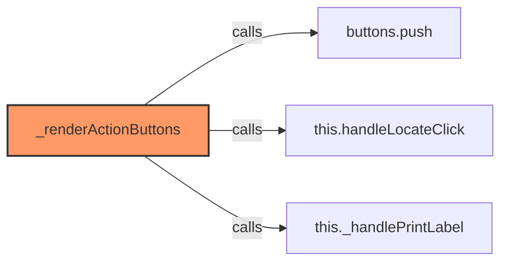

### `_handlePrintLabel` (🔒 Private) {#_handlePrintLabel}

**Parameters:**

- `part`: `PartData`

**Returns:** `void`

**Calls:**

- [[print-label|print-label]]#printLabel
- `String`

**Called By:**

- From [[inventree-card|inventree-card]]:
  - `_renderActionButtons`

**Call Graph:**

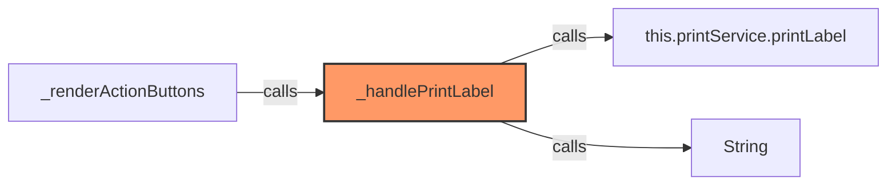

### `getConfigForm` (🌐 Public) {#getConfigForm}

**Returns:** `void`

### `_compareValues` (🔒 Private) {#_compareValues}

**Parameters:**

- `value`: `any`
- `filterValue`: `string`
- `operator`: `string`

**Returns:** `boolean`

**Calls:**

- `String`
- `String(value).toLowerCase().includes`
- `String(value).toLowerCase`
- `filterValue.toLowerCase`
- `Number`

**Call Graph:**

```mermaid
flowchart LR
    _compareValues[_compareValues]:::current
    String[String]
    _compareValues -->|calls| String
    String_value__toLowerCase___includes[String(value).toLowerCase().includes]
    _compareValues -->|calls| String_value__toLowerCase___includes
    String_value__toLowerCase[String(value).toLowerCase]
    _compareValues -->|calls| String_value__toLowerCase
    filterValue_toLowerCase[filterValue.toLowerCase]
    _compareValues -->|calls| filterValue_toLowerCase
    Number[Number]
    _compareValues -->|calls| Number
    classDef current fill:#f96,stroke:#333,stroke-width:2px;
```

### `_renderDebugInfo` (🔒 Private) {#_renderDebugInfo}

**Parameters:**

- `parts`: `PartData[]`

**Returns:** `TemplateResult`

**Calls:**

- `JSON.stringify`

**Called By:**

- From [[inventree-card|inventree-card]]:
  - `render`

**Call Graph:**

```mermaid
flowchart LR
    _renderDebugInfo[_renderDebugInfo]:::current
    JSON_stringify[JSON.stringify]
    _renderDebugInfo -->|calls| JSON_stringify
    render[render]
    render -->|calls| _renderDebugInfo
    classDef current fill:#f96,stroke:#333,stroke-width:2px;
```

### `refreshParameterData` (🌐 Public) {#refreshParameterData}

**Parameters:**

- `partId`: `number`
- `parameterName`: `string`

**Returns:** `Promise<void>`

**Calls:**

- [[logger|logger]]#log
- [[api|api]]#fetchParameterData
- [[logger|logger]]#error

**Call Graph:**

```mermaid
flowchart LR
    refreshParameterData[refreshParameterData]:::current
    this_logger_log[this.logger.log]
    refreshParameterData -->|calls| this_logger_log
    this_parameterService_fetchParameterData[this.parameterService.fetchParameterData]
    refreshParameterData -->|calls| this_parameterService_fetchParameterData
    this_logger_error[this.logger.error]
    refreshParameterData -->|calls| this_logger_error
    classDef current fill:#f96,stroke:#333,stroke-width:2px;
```

### `updateCrossEntityParameter` (🌐 Public) {#updateCrossEntityParameter}

**Parameters:**

- `parameterRef`: `string`
- `value`: `string`

**Returns:** `Promise<void>`

**Calls:**

- [[logger|logger]]#error
- [[card-controller|card-controller]]#getParameterService
- [[logger|logger]]#warn

**Called By:**

- From [[inventree-card|inventree-card]]:
  - `handleParameterUpdateEvent`

**Call Graph:**

```mermaid
flowchart LR
    updateCrossEntityParameter[updateCrossEntityParameter]:::current
    this_logger_error[this.logger.error]
    updateCrossEntityParameter -->|calls| this_logger_error
    this_controller_getParameterService[this.controller.getParameterService]
    updateCrossEntityParameter -->|calls| this_controller_getParameterService
    this_logger_warn[this.logger.warn]
    updateCrossEntityParameter -->|calls| this_logger_warn
    handleParameterUpdateEvent[handleParameterUpdateEvent]
    handleParameterUpdateEvent -->|calls| updateCrossEntityParameter
    classDef current fill:#f96,stroke:#333,stroke-width:2px;
```

### `handleParameterUpdateEvent` (🌐 Public) {#handleParameterUpdateEvent}

**Parameters:**

- `event`: `CustomEvent`

**Returns:** `void`

**Calls:**

- `this.updateCrossEntityParameter(parameterRef, String(value)).catch`
- [[inventree-card|inventree-card]]#updateCrossEntityParameter
- `String`

**Call Graph:**

```mermaid
flowchart LR
    handleParameterUpdateEvent[handleParameterUpdateEvent]:::current
    this_updateCrossEntityParameter_parameterRef__String_value___catch[this.updateCrossEntityParameter(parameterRef, String(value)).catch]
    handleParameterUpdateEvent -->|calls| this_updateCrossEntityParameter_parameterRef__String_value___catch
    this_updateCrossEntityParameter[this.updateCrossEntityParameter]
    handleParameterUpdateEvent -->|calls| this_updateCrossEntityParameter
    String[String]
    handleParameterUpdateEvent -->|calls| String
    classDef current fill:#f96,stroke:#333,stroke-width:2px;
```

### `updateParametersForMatchingParts` (🌐 Public) {#updateParametersForMatchingParts}

**Parameters:**

- `conditionParam`: `string`
- `conditionValue`: `string`
- `updateParam`: `string`
- `updateValue`: `string`

**Returns:** `Promise<void>`

**Calls:**

- [[logger|logger]]#error
- [[card-controller|card-controller]]#getParameterService
- [[logger|logger]]#warn

**Called By:**

- From [[inventree-card|inventree-card]]:
  - `handleParameterUpdate`

**Call Graph:**

```mermaid
flowchart LR
    updateParametersForMatchingParts[updateParametersForMatchingParts]:::current
    this_logger_error[this.logger.error]
    updateParametersForMatchingParts -->|calls| this_logger_error
    this_controller_getParameterService[this.controller.getParameterService]
    updateParametersForMatchingParts -->|calls| this_controller_getParameterService
    this_logger_warn[this.logger.warn]
    updateParametersForMatchingParts -->|calls| this_logger_warn
    handleParameterUpdate[handleParameterUpdate]
    handleParameterUpdate -->|calls| updateParametersForMatchingParts
    classDef current fill:#f96,stroke:#333,stroke-width:2px;
```

### `handleParameterUpdate` (🌐 Public) {#handleParameterUpdate}

**Parameters:**

- `updateParam`: `string`
- `updateValue`: `string`
- `conditionParam`: `string`
- `conditionValue`: `string`

**Returns:** `Promise<void>`

**Calls:**

- [[logger|logger]]#error
- [[inventree-card|inventree-card]]#updateParametersForMatchingParts

**Call Graph:**

```mermaid
flowchart LR
    handleParameterUpdate[handleParameterUpdate]:::current
    this_logger_error[this.logger.error]
    handleParameterUpdate -->|calls| this_logger_error
    this_updateParametersForMatchingParts[this.updateParametersForMatchingParts]
    handleParameterUpdate -->|calls| this_updateParametersForMatchingParts
    classDef current fill:#f96,stroke:#333,stroke-width:2px;
```

### `connectedCallback` (🌐 Public) {#connectedCallback}

**Returns:** `void`

**Calls:**

- [[base-layout|base-layout]]#connectedCallback
- [[logger|logger]]#log
- [[inventree-state|inventree-state]]#getInstance
- [[inventree-state|inventree-state]]#setHass
- [[inventree-state|inventree-state]]#getInstance
- [[parameter-service|parameter-service]]#setDirectApi
- [[parameter-service|parameter-service]]#setDirectApi
- [[parameter-service|parameter-service]]#setStrictWebSocketMode
- [[websocket|websocket]]#subscribeToParts
- [[base-layout|base-layout]]#requestUpdate
- `this._websocketSubscriptions.push`
- `this.handleParameterUpdateEvent.bind`
- [[inventree-card|inventree-card]]#_setupEntitySubscriptions
- [[card-controller|card-controller]]#subscribeToEntityChanges
- [[inventree-card|inventree-card]]#debouncedRender
- [[inventree-state|inventree-state]]#getInstance
- [[websocket-plugin|websocket-plugin]]#configure

**Called By:**

- From [[base-layout|base-layout]]:
  - `connectedCallback`
- From [[grid-layout|grid-layout]]:
  - `connectedCallback`
- From [[part-buttons|part-buttons]]:
  - `connectedCallback`
- From [[variant-layout|variant-layout]]:
  - `connectedCallback`

**Call Graph:**

```mermaid
flowchart LR
    connectedCallback[connectedCallback]:::current
    super_connectedCallback[super.connectedCallback]
    connectedCallback -->|calls| super_connectedCallback
    this_logger_log[this.logger.log]
    connectedCallback -->|calls| this_logger_log
    WebSocketManager_getInstance[WebSocketManager.getInstance]
    connectedCallback -->|calls| WebSocketManager_getInstance
    WebSocketService_getInstance___setHass[WebSocketService.getInstance().setHass]
    connectedCallback -->|calls| WebSocketService_getInstance___setHass
    WebSocketService_getInstance[WebSocketService.getInstance]
    connectedCallback -->|calls| WebSocketService_getInstance
    wsService_setDirectApi[wsService.setDirectApi]
    connectedCallback -->|calls| wsService_setDirectApi
    this_parameterService_setDirectApi[this.parameterService.setDirectApi]
    connectedCallback -->|calls| this_parameterService_setDirectApi
    this_parameterService_setStrictWebSocketMode[this.parameterService.setStrictWebSocketMode]
    connectedCallback -->|calls| this_parameterService_setStrictWebSocketMode
    WebSocketService_getInstance___subscribeToParts[WebSocketService.getInstance().subscribeToParts]
    connectedCallback -->|calls| WebSocketService_getInstance___subscribeToParts
    this_requestUpdate[this.requestUpdate]
    connectedCallback -->|calls| this_requestUpdate
    this__websocketSubscriptions_push[this._websocketSubscriptions.push]
    connectedCallback -->|calls| this__websocketSubscriptions_push
    this_handleParameterUpdateEvent_bind[this.handleParameterUpdateEvent.bind]
    connectedCallback -->|calls| this_handleParameterUpdateEvent_bind
    this__setupEntitySubscriptions[this._setupEntitySubscriptions]
    connectedCallback -->|calls| this__setupEntitySubscriptions
    this_controller_subscribeToEntityChanges[this.controller.subscribeToEntityChanges]
    connectedCallback -->|calls| this_controller_subscribeToEntityChanges
    this_debouncedRender[this.debouncedRender]
    connectedCallback -->|calls| this_debouncedRender
    WebSocketPlugin_getInstance[WebSocketPlugin.getInstance]
    connectedCallback -->|calls| WebSocketPlugin_getInstance
    wsPlugin_configure[wsPlugin.configure]
    connectedCallback -->|calls| wsPlugin_configure
    connectedCallback[connectedCallback]
    connectedCallback -->|calls| connectedCallback
    classDef current fill:#f96,stroke:#333,stroke-width:2px;
```

### `disconnectedCallback` (🌐 Public) {#disconnectedCallback}

**Returns:** `void`

**Calls:**

- [[base-layout|base-layout]]#disconnectedCallback
- [[inventree-card|inventree-card]]#_clearEntitySubscriptions
- `this._websocketSubscriptions.forEach`
- `unsubscribe`
- [[api|api]]#destroy
- `clearTimeout`
- `this._cleanupFunctions.forEach`
- `cleanup`
- [[logger|logger]]#log

**Called By:**

- From [[base-layout|base-layout]]:
  - `disconnectedCallback`
- From [[grid-layout|grid-layout]]:
  - `disconnectedCallback`
- From [[variant-layout|variant-layout]]:
  - `disconnectedCallback`

**Call Graph:**

```mermaid
flowchart LR
    disconnectedCallback[disconnectedCallback]:::current
    super_disconnectedCallback[super.disconnectedCallback]
    disconnectedCallback -->|calls| super_disconnectedCallback
    this__clearEntitySubscriptions[this._clearEntitySubscriptions]
    disconnectedCallback -->|calls| this__clearEntitySubscriptions
    this__websocketSubscriptions_forEach[this._websocketSubscriptions.forEach]
    disconnectedCallback -->|calls| this__websocketSubscriptions_forEach
    unsubscribe[unsubscribe]
    disconnectedCallback -->|calls| unsubscribe
    this__renderingService_destroy[this._renderingService.destroy]
    disconnectedCallback -->|calls| this__renderingService_destroy
    clearTimeout[clearTimeout]
    disconnectedCallback -->|calls| clearTimeout
    this__cleanupFunctions_forEach[this._cleanupFunctions.forEach]
    disconnectedCallback -->|calls| this__cleanupFunctions_forEach
    cleanup[cleanup]
    disconnectedCallback -->|calls| cleanup
    this_logger_log[this.logger.log]
    disconnectedCallback -->|calls| this_logger_log
    disconnectedCallback[disconnectedCallback]
    disconnectedCallback -->|calls| disconnectedCallback
    classDef current fill:#f96,stroke:#333,stroke-width:2px;
```

### `forceUpdateEntity` (🌐 Public) {#forceUpdateEntity}

**Returns:** `Promise<void>`

**Calls:**

- `this._hass.callService`
- [[logger|logger]]#log
- [[logger|logger]]#error

**Call Graph:**

```mermaid
flowchart LR
    forceUpdateEntity[forceUpdateEntity]:::current
    this__hass_callService[this._hass.callService]
    forceUpdateEntity -->|calls| this__hass_callService
    this_logger_log[this.logger.log]
    forceUpdateEntity -->|calls| this_logger_log
    this_logger_error[this.logger.error]
    forceUpdateEntity -->|calls| this_logger_error
    classDef current fill:#f96,stroke:#333,stroke-width:2px;
```

### `_checkForEntityChanges` (🔒 Private) {#_checkForEntityChanges}

**Returns:** `boolean`

### `updateParameterWithImmediateRefresh` (🌐 Public) {#updateParameterWithImmediateRefresh}

**Parameters:**

- `part`: `InventreeItem`
- `paramName`: `string`
- `value`: `string`

**Returns:** `Promise<void>`

**Calls:**

- `part.parameters.find`
- `p.template_detail?.name.toLowerCase`
- `paramName.toLowerCase`
- [[base-layout|base-layout]]#requestUpdate
- [[inventree-state|inventree-state]]#updateParameter
- [[inventree-state|inventree-state]]#updateParameter
- [[logger|logger]]#error
- `hass.callService`

**Call Graph:**

```mermaid
flowchart LR
    updateParameterWithImmediateRefresh[updateParameterWithImmediateRefresh]:::current
    part_parameters_find[part.parameters.find]
    updateParameterWithImmediateRefresh -->|calls| part_parameters_find
    p_template_detail__name_toLowerCase[p.template_detail?.name.toLowerCase]
    updateParameterWithImmediateRefresh -->|calls| p_template_detail__name_toLowerCase
    paramName_toLowerCase[paramName.toLowerCase]
    updateParameterWithImmediateRefresh -->|calls| paramName_toLowerCase
    this_requestUpdate[this.requestUpdate]
    updateParameterWithImmediateRefresh -->|calls| this_requestUpdate
    this_api_updateParameter[this.api.updateParameter]
    updateParameterWithImmediateRefresh -->|calls| this_api_updateParameter
    this_parameterService_updateParameter[this.parameterService.updateParameter]
    updateParameterWithImmediateRefresh -->|calls| this_parameterService_updateParameter
    this_logger_error[this.logger.error]
    updateParameterWithImmediateRefresh -->|calls| this_logger_error
    hass_callService[hass.callService]
    updateParameterWithImmediateRefresh -->|calls| hass_callService
    classDef current fill:#f96,stroke:#333,stroke-width:2px;
```

### `_renderDiagnosticTools` (🔒 Private) {#_renderDiagnosticTools}

**Returns:** `void`

**Calls:**

- [[card-controller|card-controller]]#getWebSocketDiagnostics
- [[api|api]]#isApiConnected
- [[card-controller|card-controller]]#getParameterService
- `JSON.stringify`

**Call Graph:**

```mermaid
flowchart LR
    _renderDiagnosticTools[_renderDiagnosticTools]:::current
    this_controller_getWebSocketDiagnostics[this.controller.getWebSocketDiagnostics]
    _renderDiagnosticTools -->|calls| this_controller_getWebSocketDiagnostics
    this_controller_getParameterService___isApiConnected[this.controller.getParameterService().isApiConnected]
    _renderDiagnosticTools -->|calls| this_controller_getParameterService___isApiConnected
    this_controller_getParameterService[this.controller.getParameterService]
    _renderDiagnosticTools -->|calls| this_controller_getParameterService
    JSON_stringify[JSON.stringify]
    _renderDiagnosticTools -->|calls| JSON_stringify
    classDef current fill:#f96,stroke:#333,stroke-width:2px;
```

### `_runApiDiagnostics` (🔒 Private) {#_runApiDiagnostics}

**Returns:** `void`

**Calls:**

- [[logger|logger]]#log
- [[api|api]]#logApiStats
- `setTimeout`

**Call Graph:**

```mermaid
flowchart LR
    _runApiDiagnostics[_runApiDiagnostics]:::current
    this_logger_log[this.logger.log]
    _runApiDiagnostics -->|calls| this_logger_log
    this_api_logApiStats[this.api.logApiStats]
    _runApiDiagnostics -->|calls| this_api_logApiStats
    setTimeout[setTimeout]
    _runApiDiagnostics -->|calls| setTimeout
    classDef current fill:#f96,stroke:#333,stroke-width:2px;
```

### `_fetchAllParameters` (🔒 Private) {#_fetchAllParameters}

**Returns:** `void`

**Calls:**

- [[logger|logger]]#error
- [[logger|logger]]#log
- [[api|api]]#fetchParameterData

**Call Graph:**

```mermaid
flowchart LR
    _fetchAllParameters[_fetchAllParameters]:::current
    this_logger_error[this.logger.error]
    _fetchAllParameters -->|calls| this_logger_error
    this_logger_log[this.logger.log]
    _fetchAllParameters -->|calls| this_logger_log
    this_parameterService_fetchParameterData[this.parameterService.fetchParameterData]
    _fetchAllParameters -->|calls| this_parameterService_fetchParameterData
    classDef current fill:#f96,stroke:#333,stroke-width:2px;
```

### `_testSpecificParameter` (🔒 Private) {#_testSpecificParameter}

**Returns:** `void`

**Calls:**

- [[logger|logger]]#error
- [[logger|logger]]#log
- [[api|api]]#resetRateLimiting
- [[inventree-state|inventree-state]]#getParameterValue
- [[inventree-state|inventree-state]]#findEntityForPart

**Call Graph:**

```mermaid
flowchart LR
    _testSpecificParameter[_testSpecificParameter]:::current
    this_logger_error[this.logger.error]
    _testSpecificParameter -->|calls| this_logger_error
    this_logger_log[this.logger.log]
    _testSpecificParameter -->|calls| this_logger_log
    this_api_resetRateLimiting[this.api.resetRateLimiting]
    _testSpecificParameter -->|calls| this_api_resetRateLimiting
    this_api_getParameterValue[this.api.getParameterValue]
    _testSpecificParameter -->|calls| this_api_getParameterValue
    this_parameterService_findEntityForPart[this.parameterService.findEntityForPart]
    _testSpecificParameter -->|calls| this_parameterService_findEntityForPart
    classDef current fill:#f96,stroke:#333,stroke-width:2px;
```

### `_resetApiFailures` (🔒 Private) {#_resetApiFailures}

**Returns:** `void`

**Calls:**

- [[api|api]]#logApiStats
- [[logger|logger]]#log
- [[inventree-state|inventree-state]]#getInstance
- [[card-controller|card-controller]]#resetApiFailures

**Call Graph:**

```mermaid
flowchart LR
    _resetApiFailures[_resetApiFailures]:::current
    this_api_logApiStats[this.api.logApiStats]
    _resetApiFailures -->|calls| this_api_logApiStats
    this_logger_log[this.logger.log]
    _resetApiFailures -->|calls| this_logger_log
    CardController_getInstance[CardController.getInstance]
    _resetApiFailures -->|calls| CardController_getInstance
    controller_resetApiFailures[controller.resetApiFailures]
    _resetApiFailures -->|calls| controller_resetApiFailures
    classDef current fill:#f96,stroke:#333,stroke-width:2px;
```

### `_initializeServices` (🔒 Private) {#_initializeServices}

**Returns:** `void`

**Calls:**

- [[logger|logger]]#log
- [[inventree-state|inventree-state]]#setHass
- [[inventree-state|inventree-state]]#getInstance
- [[inventree-state|inventree-state]]#registerEntityOfInterest
- [[inventree-state|inventree-state]]#getInstance
- [[websocket-plugin|websocket-plugin]]#configure
- [[rendering-service|rendering-service]]#setupRendering

**Called By:**

- From [[inventree-card|inventree-card]]:
  - `setConfig`

**Call Graph:**

```mermaid
flowchart LR
    _initializeServices[_initializeServices]:::current
    this_logger_log[this.logger.log]
    _initializeServices -->|calls| this_logger_log
    this_controller_setHass[this.controller.setHass]
    _initializeServices -->|calls| this_controller_setHass
    InventTreeState_getInstance[InventTreeState.getInstance]
    _initializeServices -->|calls| InventTreeState_getInstance
    state_registerEntityOfInterest[state.registerEntityOfInterest]
    _initializeServices -->|calls| state_registerEntityOfInterest
    WebSocketPlugin_getInstance[WebSocketPlugin.getInstance]
    _initializeServices -->|calls| WebSocketPlugin_getInstance
    wsPlugin_configure[wsPlugin.configure]
    _initializeServices -->|calls| wsPlugin_configure
    this__renderingService_setupRendering[this._renderingService.setupRendering]
    _initializeServices -->|calls| this__renderingService_setupRendering
    setConfig[setConfig]
    setConfig -->|calls| _initializeServices
    classDef current fill:#f96,stroke:#333,stroke-width:2px;
```

## Dependencies

```mermaid
flowchart TD
    inventree-card[inventree-card.ts]:::current
    card[card.ts]
    inventree-card -->|imports| card
    constants[constants.ts]
    inventree-card -->|imports| constants
    settings[settings.ts]
    inventree-card -->|imports| settings
    types[types.ts]
    inventree-card -->|imports| types
    editor[editor.ts]
    inventree-card -->|imports| editor
    grid_layout[grid-layout.ts]
    inventree-card -->|imports| grid_layout
    detail_layout[detail-layout.ts]
    inventree-card -->|imports| detail_layout
    list_layout[list-layout.ts]
    inventree-card -->|imports| list_layout
    part_view[part-view.ts]
    inventree-card -->|imports| part_view
    part_details[part-details.ts]
    inventree-card -->|imports| part_details
    part_thumbnail[part-thumbnail.ts]
    inventree-card -->|imports| part_thumbnail
    part_container[part-container.ts]
    inventree-card -->|imports| part_container
    part_buttons[part-buttons.ts]
    inventree-card -->|imports| part_buttons
    adjust_stock[adjust-stock.ts]
    inventree-card -->|imports| adjust_stock
    print_label[print-label.ts]
    inventree-card -->|imports| print_label
    wled_service[wled-service.ts]
    inventree-card -->|imports| wled_service
    parameter_service[parameter-service.ts]
    inventree-card -->|imports| parameter_service
    wled_service[wled-service.ts]
    inventree-card -->|imports| wled_service
    print_label[print-label.ts]
    inventree-card -->|imports| print_label
    parameter_service[parameter-service.ts]
    inventree-card -->|imports| parameter_service
    api[api.ts]
    inventree-card -->|imports| api
    variant_handler[variant-handler.ts]
    inventree-card -->|imports| variant_handler
    logger[logger.ts]
    inventree-card -->|imports| logger
    variant_layout[variant-layout.ts]
    inventree-card -->|imports| variant_layout
    part_variant[part-variant.ts]
    inventree-card -->|imports| part_variant
    parts_layout[parts-layout.ts]
    inventree-card -->|imports| parts_layout
    inventree_state[inventree-state.ts]
    inventree-card -->|imports| inventree_state
    websocket[websocket.ts]
    inventree-card -->|imports| websocket
    types[types.ts]
    inventree-card -->|imports| types
    websocket_manager[websocket-manager.ts]
    inventree-card -->|imports| websocket_manager
    card_controller[card-controller.ts]
    inventree-card -->|imports| card_controller
    websocket_plugin[websocket-plugin.ts]
    inventree-card -->|imports| websocket_plugin
    rendering_service[rendering-service.ts]
    inventree-card -->|imports| rendering_service
    cache[cache.ts]
    inventree-card -->|imports| cache
    index[index.ts]
    index -->|imports| inventree-card
    classDef current fill:#f96,stroke:#333,stroke-width:2px;
```

