# inventree-state.ts

**Path:** `core/inventree-state.ts`  
**Line Count:** 700  
**Functions:** 34  

## Overview

This file is part of the `core` directory.

## Imports

- [[types|types]]: InventreeItem
- custom-card-helpers: HomeAssistant
- [[logger|logger]]: Logger

## Exports

- `InventTreeState`

## Functions

### Class: InventTreeState

### `getInstance` (🌐 Public) {#getInstance}

**Returns:** `InventTreeState`

**Called By:**

- From [[base-layout|base-layout]]:
  - `_safeGetParameterService`
  - `_loadData`
  - `getParts`
  - `updated`
  - `updateFilteredParts`
- From [[variant-handler|variant-handler]]:
  - `processItems`
- From [[detail-layout|detail-layout]]:
  - `_updateVisualModifiers`
- From [[grid-layout|grid-layout]]:
  - `_setupWebSocketConnection`
  - `_cleanupListeners`
  - `_actuallyFilterParts`
  - `_updateVisualModifiers`
  - `render`
- From [[list-layout|list-layout]]:
  - `_updateVisualModifiers`
  - `render`
- From [[parts-layout|parts-layout]]:
  - `loadPartsFromEntities`
  - `_updateVisualModifiers`
- From [[editor|editor]]:
  - `_renderDebuggingSection`
- From [[inventree-card|inventree-card]]:
  - `connectedCallback`
  - `_resetApiFailures`
  - `_initializeServices`
- From [[card-controller|card-controller]]:
  - `setHass`
  - `initializeServices`
  - `loadEntityData`
  - `getParts`
  - `getWebSocketService`
  - `initializeWebSocketPlugin`
  - `handleWebSocketMessage`
  - `getWebSocketDiagnostics`
- From [[parameter-service|parameter-service]]:
  - `getParameterValueFromPart`
  - `isDirectPartReference`
  - `getParameterValueWithDirectReference`
  - `findEntityForPart`
  - `storeOrphanedParameter`
  - `isOrphanedPart`
  - `getOrphanedPartIds`
  - `getOrphanedPartParameters`
  - `findParameterInWebSocketData`
  - `findParameterInApiData`
  - `findParameterInHassData`
  - `findParameterInAllEntities`
  - `syncApiDataToEntityState`
  - `getParameterFromEntity`
- From [[rendering-service|rendering-service]]:
  - `startIdleTimer`
- From [[variant-service|variant-service]]:
  - `processVariants`
- From [[websocket-plugin|websocket-plugin]]:
  - `_handleParameterUpdate`
- From [[websocket|websocket]]:
  - `_updateEntityState`

**Call Graph:**

```mermaid
flowchart LR
    getInstance[getInstance]:::current
    _safeGetParameterService[_safeGetParameterService]
    _safeGetParameterService -->|calls| getInstance
    _loadData[_loadData]
    _loadData -->|calls| getInstance
    getParts[getParts]
    getParts -->|calls| getInstance
    updated[updated]
    updated -->|calls| getInstance
    updateFilteredParts[updateFilteredParts]
    updateFilteredParts -->|calls| getInstance
    processItems[processItems]
    processItems -->|calls| getInstance
    _updateVisualModifiers[_updateVisualModifiers]
    _updateVisualModifiers -->|calls| getInstance
    _setupWebSocketConnection[_setupWebSocketConnection]
    _setupWebSocketConnection -->|calls| getInstance
    _cleanupListeners[_cleanupListeners]
    _cleanupListeners -->|calls| getInstance
    _actuallyFilterParts[_actuallyFilterParts]
    _actuallyFilterParts -->|calls| getInstance
    render[render]
    render -->|calls| getInstance
    loadPartsFromEntities[loadPartsFromEntities]
    loadPartsFromEntities -->|calls| getInstance
    _renderDebuggingSection[_renderDebuggingSection]
    _renderDebuggingSection -->|calls| getInstance
    connectedCallback[connectedCallback]
    connectedCallback -->|calls| getInstance
    _resetApiFailures[_resetApiFailures]
    _resetApiFailures -->|calls| getInstance
    _initializeServices[_initializeServices]
    _initializeServices -->|calls| getInstance
    setHass[setHass]
    setHass -->|calls| getInstance
    initializeServices[initializeServices]
    initializeServices -->|calls| getInstance
    loadEntityData[loadEntityData]
    loadEntityData -->|calls| getInstance
    getWebSocketService[getWebSocketService]
    getWebSocketService -->|calls| getInstance
    initializeWebSocketPlugin[initializeWebSocketPlugin]
    initializeWebSocketPlugin -->|calls| getInstance
    handleWebSocketMessage[handleWebSocketMessage]
    handleWebSocketMessage -->|calls| getInstance
    getWebSocketDiagnostics[getWebSocketDiagnostics]
    getWebSocketDiagnostics -->|calls| getInstance
    getParameterValueFromPart[getParameterValueFromPart]
    getParameterValueFromPart -->|calls| getInstance
    isDirectPartReference[isDirectPartReference]
    isDirectPartReference -->|calls| getInstance
    getParameterValueWithDirectReference[getParameterValueWithDirectReference]
    getParameterValueWithDirectReference -->|calls| getInstance
    findEntityForPart[findEntityForPart]
    findEntityForPart -->|calls| getInstance
    storeOrphanedParameter[storeOrphanedParameter]
    storeOrphanedParameter -->|calls| getInstance
    isOrphanedPart[isOrphanedPart]
    isOrphanedPart -->|calls| getInstance
    getOrphanedPartIds[getOrphanedPartIds]
    getOrphanedPartIds -->|calls| getInstance
    getOrphanedPartParameters[getOrphanedPartParameters]
    getOrphanedPartParameters -->|calls| getInstance
    findParameterInWebSocketData[findParameterInWebSocketData]
    findParameterInWebSocketData -->|calls| getInstance
    findParameterInApiData[findParameterInApiData]
    findParameterInApiData -->|calls| getInstance
    findParameterInHassData[findParameterInHassData]
    findParameterInHassData -->|calls| getInstance
    findParameterInAllEntities[findParameterInAllEntities]
    findParameterInAllEntities -->|calls| getInstance
    syncApiDataToEntityState[syncApiDataToEntityState]
    syncApiDataToEntityState -->|calls| getInstance
    getParameterFromEntity[getParameterFromEntity]
    getParameterFromEntity -->|calls| getInstance
    startIdleTimer[startIdleTimer]
    startIdleTimer -->|calls| getInstance
    processVariants[processVariants]
    processVariants -->|calls| getInstance
    _handleParameterUpdate[_handleParameterUpdate]
    _handleParameterUpdate -->|calls| getInstance
    _updateEntityState[_updateEntityState]
    _updateEntityState -->|calls| getInstance
    classDef current fill:#f96,stroke:#333,stroke-width:2px;
```

### `setPriorityDataSource` (🌐 Public) {#setPriorityDataSource}

**Parameters:**

- `source`: `'websocket' | 'api' | 'hass'`

**Returns:** `void`

**Calls:**

- [[logger|logger]]#log
- [[inventree-state|inventree-state]]#triggerRefresh

**Called By:**

- From [[rendering-service|rendering-service]]:
  - `startIdleTimer`

**Call Graph:**

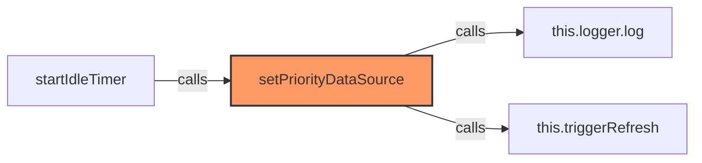

### `trackLastUpdate` (🌐 Public) {#trackLastUpdate}

**Parameters:**

- `source`: `string`
- `entityId`: `string`

**Returns:** `void`

**Calls:**

- `Date.now`
- [[cache|cache]]#set
- [[logger|logger]]#log

**Called By:**

- From [[inventree-state|inventree-state]]:
  - `setWebSocketData`
  - `setApiData`
  - `setHassData`
- From [[websocket|websocket]]:
  - `_updateEntityState`

**Call Graph:**

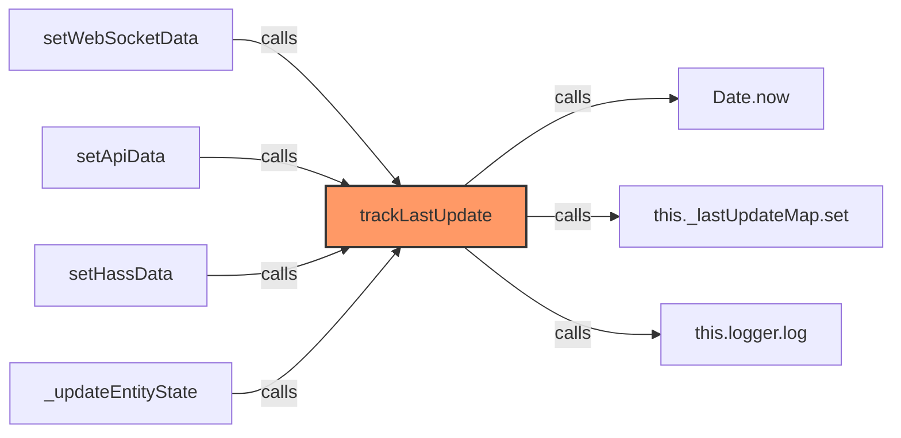

### `getLastUpdate` (🌐 Public) {#getLastUpdate}

**Parameters:**

- `source`: `string`
- `entityId`: `string`

**Returns:** `number`

**Calls:**

- [[cache|cache]]#get

**Called By:**

- From [[inventree-state|inventree-state]]:
  - `getNewestData`

**Call Graph:**

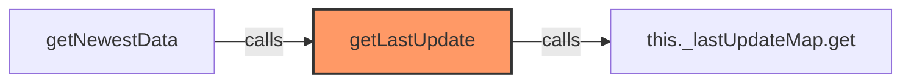

### `setWebSocketData` (🌐 Public) {#setWebSocketData}

**Parameters:**

- `entityId`: `string`
- `data`: `InventreeItem[]`

**Returns:** `void`

**Calls:**

- [[cache|cache]]#set
- [[inventree-state|inventree-state]]#trackLastUpdate
- [[logger|logger]]#log

**Called By:**

- From [[base-layout|base-layout]]:
  - `updated`
- From [[state|state]]:
  - `updateEntityParts`

**Call Graph:**

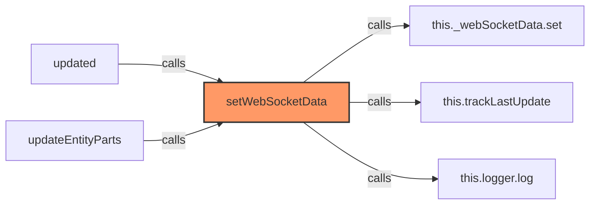

### `setApiData` (🌐 Public) {#setApiData}

**Parameters:**

- `entityId`: `string`
- `data`: `InventreeItem[]`

**Returns:** `void`

**Calls:**

- [[cache|cache]]#set
- [[inventree-state|inventree-state]]#trackLastUpdate
- [[logger|logger]]#log

**Called By:**

- From [[base-layout|base-layout]]:
  - `updated`

**Call Graph:**

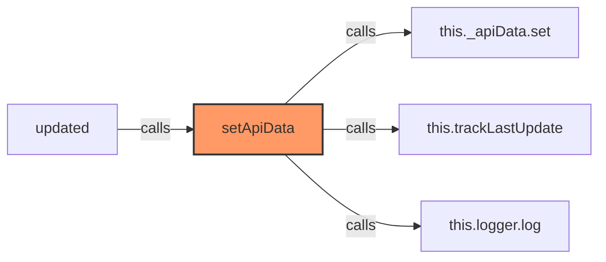

### `setHassData` (🌐 Public) {#setHassData}

**Parameters:**

- `entityId`: `string`
- `data`: `InventreeItem[]`

**Returns:** `void`

**Calls:**

- [[cache|cache]]#set
- [[inventree-state|inventree-state]]#trackLastUpdate
- [[logger|logger]]#log

**Called By:**

- From [[base-layout|base-layout]]:
  - `updated`
- From [[inventree-state|inventree-state]]:
  - `setHass`
  - `getHassData`
- From [[inventree-card|inventree-card]]:
  - `_clearEntitySubscriptions`
- From [[card-controller|card-controller]]:
  - `loadEntityData`
- From [[websocket|websocket]]:
  - `_updateEntityState`

**Call Graph:**

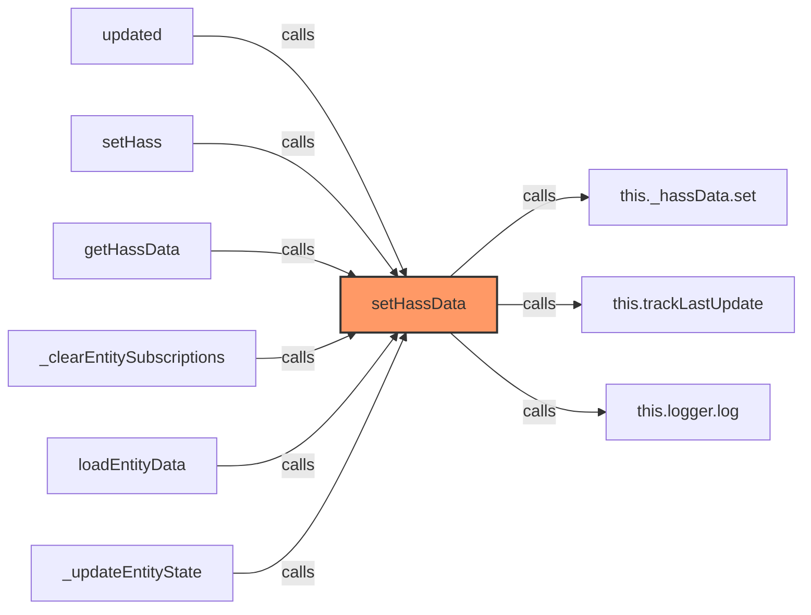

### `registerEntityOfInterest` (🌐 Public) {#registerEntityOfInterest}

**Parameters:**

- `entityId`: `string`

**Returns:** `void`

**Calls:**

- `this._requiredEntities.add`
- [[logger|logger]]#log

**Called By:**

- From [[parts-layout|parts-layout]]:
  - `loadPartsFromEntities`
- From [[inventree-card|inventree-card]]:
  - `_initializeServices`

**Call Graph:**

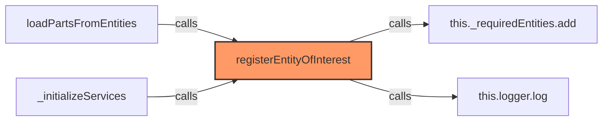

### `setHass` (🌐 Public) {#setHass}

**Parameters:**

- `hass`: `HomeAssistant`

**Returns:** `void`

**Calls:**

- `this._requiredEntities.forEach`
- [[inventree-state|inventree-state]]#setHassData
- [[logger|logger]]#log

**Called By:**

- From [[inventree-card|inventree-card]]:
  - `connectedCallback`
  - `_initializeServices`
- From [[card-controller|card-controller]]:
  - `setHass`
  - `initializeServices`
- From [[state|state]]:
  - `setHass`

**Call Graph:**

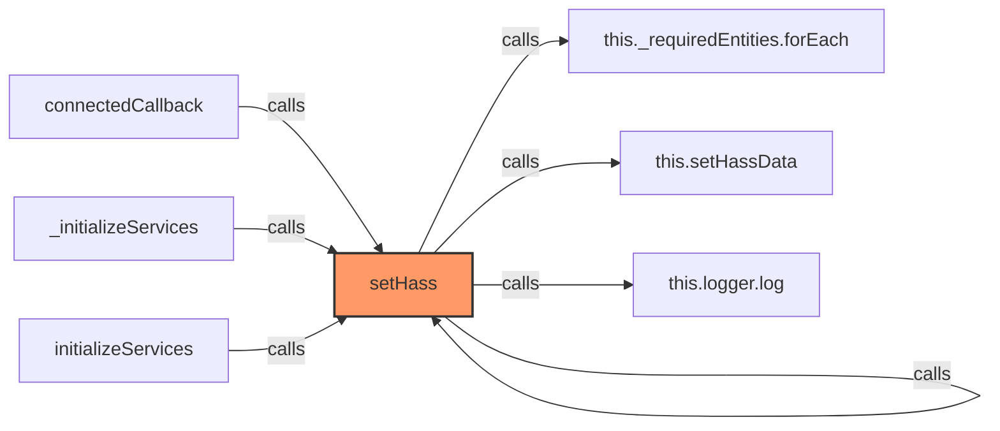

### `getWebSocketData` (🌐 Public) {#getWebSocketData}

**Parameters:**

- `entityId`: `string`

**Returns:** `InventreeItem[]`

**Calls:**

- [[cache|cache]]#get

**Called By:**

- From [[base-layout|base-layout]]:
  - `_loadData`
- From [[inventree-state|inventree-state]]:
  - `getNewestData`

**Call Graph:**

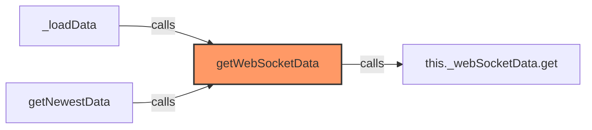

### `getApiData` (🌐 Public) {#getApiData}

**Parameters:**

- `entityId`: `string`

**Returns:** `InventreeItem[]`

**Calls:**

- [[cache|cache]]#get

**Called By:**

- From [[base-layout|base-layout]]:
  - `_loadData`
- From [[inventree-state|inventree-state]]:
  - `getNewestData`

**Call Graph:**

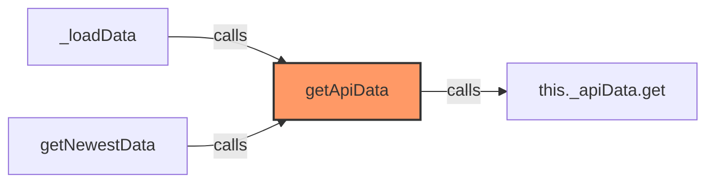

### `getHassData` (🌐 Public) {#getHassData}

**Parameters:**

- `entityId`: `string`

**Returns:** `InventreeItem[]`

**Calls:**

- [[cache|cache]]#has
- [[inventree-state|inventree-state]]#setHassData
- [[cache|cache]]#get

**Called By:**

- From [[base-layout|base-layout]]:
  - `_loadData`
- From [[inventree-state|inventree-state]]:
  - `getNewestData`

**Call Graph:**

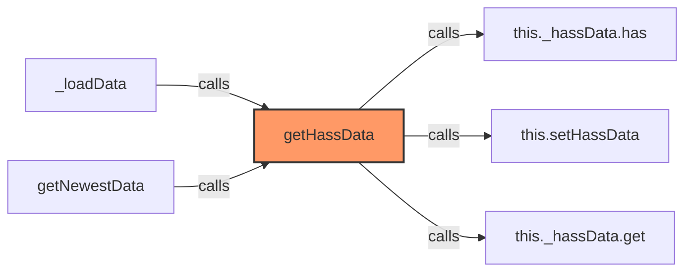

### `getNewestData` (🌐 Public) {#getNewestData}

**Parameters:**

- `entityId`: `string`

**Returns:** `InventreeItem[]`

**Calls:**

- [[cache|cache]]#has
- [[inventree-state|inventree-state]]#getWebSocketData
- [[cache|cache]]#has
- [[inventree-state|inventree-state]]#getApiData
- [[inventree-state|inventree-state]]#getHassData
- [[inventree-state|inventree-state]]#getLastUpdate

**Called By:**

- From [[base-layout|base-layout]]:
  - `_loadData`
  - `getParts`
- From [[parts-layout|parts-layout]]:
  - `loadPartsFromEntities`
- From [[inventree-state|inventree-state]]:
  - `_findPartById`
- From [[card-controller|card-controller]]:
  - `getParts`
- From [[parameter-service|parameter-service]]:
  - `getParameterFromEntity`
- From [[state|state]]:
  - `getFilteredParts`
  - `getAllParts`

**Call Graph:**

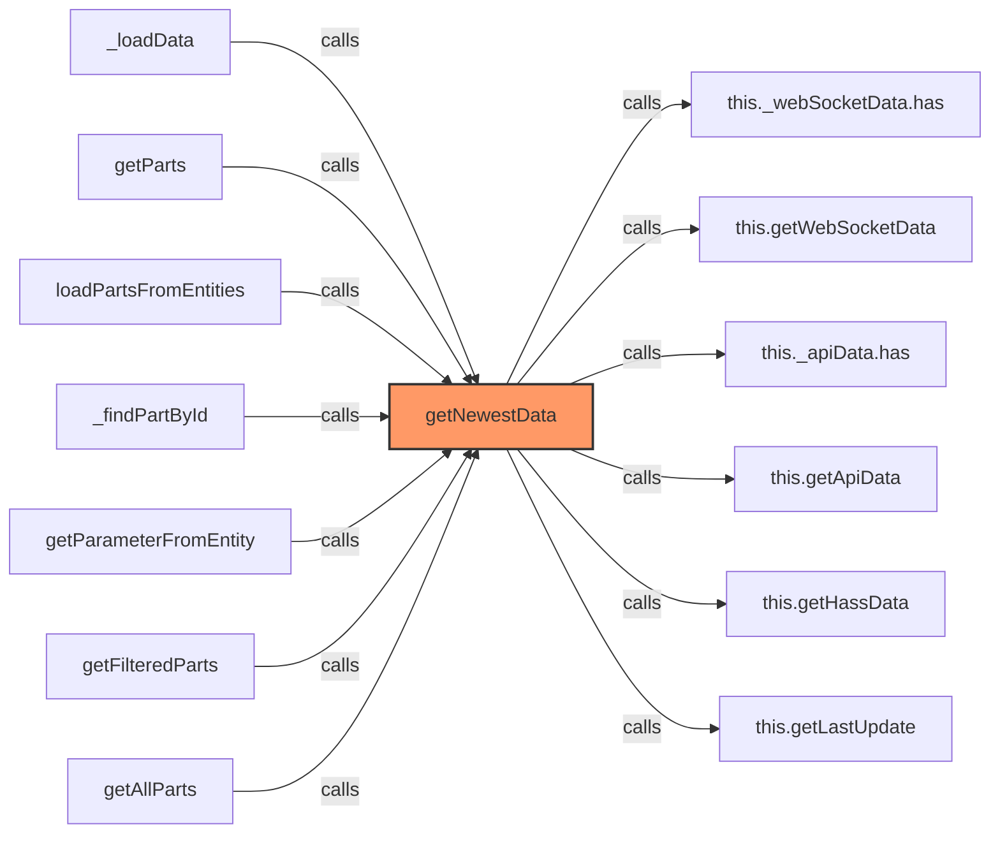

### `updateParameter` (🌐 Public) {#updateParameter}

**Parameters:**

- `partId`: `number`
- `paramName`: `string`
- `value`: `string`

**Returns:** `void`

**Calls:**

- `this._hassData.entries`
- `parts.find`
- [[logger|logger]]#log
- [[cache|cache]]#has
- [[cache|cache]]#set
- [[cache|cache]]#set
- [[cache|cache]]#get
- [[inventree-state|inventree-state]]#updateParameterInSource
- [[inventree-state|inventree-state]]#_updateParameterCache

**Called By:**

- From [[inventree-card|inventree-card]]:
  - `_handleStockAdjustment`
  - `updateParameterWithImmediateRefresh`
- From [[card-controller|card-controller]]:
  - `handleWebSocketMessage`
- From [[parameter-service|parameter-service]]:
  - `updateParameter`
  - `syncApiDataToEntityState`
- From [[websocket-plugin|websocket-plugin]]:
  - `_handleParameterUpdate`

**Call Graph:**

```mermaid
flowchart LR
    updateParameter[updateParameter]:::current
    this__hassData_entries[this._hassData.entries]
    updateParameter -->|calls| this__hassData_entries
    parts_find[parts.find]
    updateParameter -->|calls| parts_find
    this_logger_log[this.logger.log]
    updateParameter -->|calls| this_logger_log
    this__parameterCache_has[this._parameterCache.has]
    updateParameter -->|calls| this__parameterCache_has
    this__parameterCache_set[this._parameterCache.set]
    updateParameter -->|calls| this__parameterCache_set
    this__parameterCache_get_orphanedKey__set[this._parameterCache.get(orphanedKey).set]
    updateParameter -->|calls| this__parameterCache_get_orphanedKey__set
    this__parameterCache_get[this._parameterCache.get]
    updateParameter -->|calls| this__parameterCache_get
    this_updateParameterInSource[this.updateParameterInSource]
    updateParameter -->|calls| this_updateParameterInSource
    this__updateParameterCache[this._updateParameterCache]
    updateParameter -->|calls| this__updateParameterCache
    _handleStockAdjustment[_handleStockAdjustment]
    _handleStockAdjustment -->|calls| updateParameter
    updateParameterWithImmediateRefresh[updateParameterWithImmediateRefresh]
    updateParameterWithImmediateRefresh -->|calls| updateParameter
    handleWebSocketMessage[handleWebSocketMessage]
    handleWebSocketMessage -->|calls| updateParameter
    updateParameter[updateParameter]
    updateParameter -->|calls| updateParameter
    syncApiDataToEntityState[syncApiDataToEntityState]
    syncApiDataToEntityState -->|calls| updateParameter
    _handleParameterUpdate[_handleParameterUpdate]
    _handleParameterUpdate -->|calls| updateParameter
    classDef current fill:#f96,stroke:#333,stroke-width:2px;
```

### `updateParameterInSource` (🌐 Public) {#updateParameterInSource}

**Parameters:**

- `source`: `Map<string, InventreeItem[]>`
- `entityId`: `string`
- `partId`: `number`
- `paramName`: `string`
- `value`: `string`

**Returns:** `void`

**Calls:**

- [[cache|cache]]#get
- `parts.find`
- `part.parameters.find`
- `p.template_detail?.name.toLowerCase`
- `paramName.toLowerCase`

**Called By:**

- From [[inventree-state|inventree-state]]:
  - `updateParameter`

**Call Graph:**

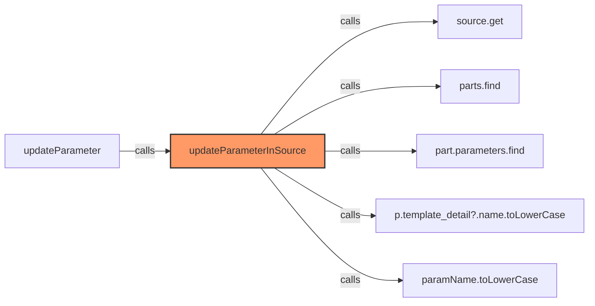

### `_updateParameterCache` (🔒 Private) {#_updateParameterCache}

**Parameters:**

- `entityId`: `string`
- `partId`: `number`
- `paramName`: `string`
- `value`: `string`

**Returns:** `void`

**Calls:**

- [[cache|cache]]#has
- [[cache|cache]]#set
- [[cache|cache]]#set
- [[cache|cache]]#get

**Called By:**

- From [[inventree-state|inventree-state]]:
  - `updateParameter`

**Call Graph:**

```mermaid
flowchart LR
    _updateParameterCache[_updateParameterCache]:::current
    this__parameterCache_has[this._parameterCache.has]
    _updateParameterCache -->|calls| this__parameterCache_has
    this__parameterCache_set[this._parameterCache.set]
    _updateParameterCache -->|calls| this__parameterCache_set
    this__parameterCache_get_entityId__set[this._parameterCache.get(entityId).set]
    _updateParameterCache -->|calls| this__parameterCache_get_entityId__set
    this__parameterCache_get[this._parameterCache.get]
    _updateParameterCache -->|calls| this__parameterCache_get
    updateParameter[updateParameter]
    updateParameter -->|calls| _updateParameterCache
    classDef current fill:#f96,stroke:#333,stroke-width:2px;
```

### `getParameterValue` (🌐 Public) {#getParameterValue}

**Parameters:**

- `entityId`: `string`
- `partId`: `number`
- `paramName`: `string`

**Returns:** `string | null`

**Calls:**

- [[cache|cache]]#get
- [[cache|cache]]#get
- [[cache|cache]]#get

**Called By:**

- From [[inventree-state|inventree-state]]:
  - `findParameterInAllEntities`
- From [[inventree-card|inventree-card]]:
  - `_testSpecificParameter`
- From [[api|api]]:
  - `fetchParameterData`

**Call Graph:**

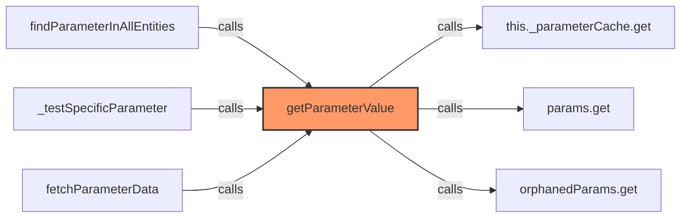

### `findEntityForPart` (🌐 Public) {#findEntityForPart}

**Parameters:**

- `partId`: `number`

**Returns:** `string | undefined`

**Calls:**

- [[cache|cache]]#get
- [[cache|cache]]#get
- [[cache|cache]]#get
- `hassParts.some`
- `apiParts.some`
- `wsParts.some`
- [[cache|cache]]#get
- `orphanedParams.keys`
- `key.startsWith`

**Called By:**

- From [[grid-layout|grid-layout]]:
  - `_handleWebSocketMessage`
- From [[inventree-state|inventree-state]]:
  - `findParameterInAllEntities`
  - `isOrphanedPart`
- From [[inventree-card|inventree-card]]:
  - `_testSpecificParameter`
- From [[parameter-service|parameter-service]]:
  - `findEntityForPart`
  - `syncApiDataToEntityState`
- From [[state|state]]:
  - `findEntityForPart`
- From [[websocket-plugin|websocket-plugin]]:
  - `_handleParameterUpdate`

**Call Graph:**

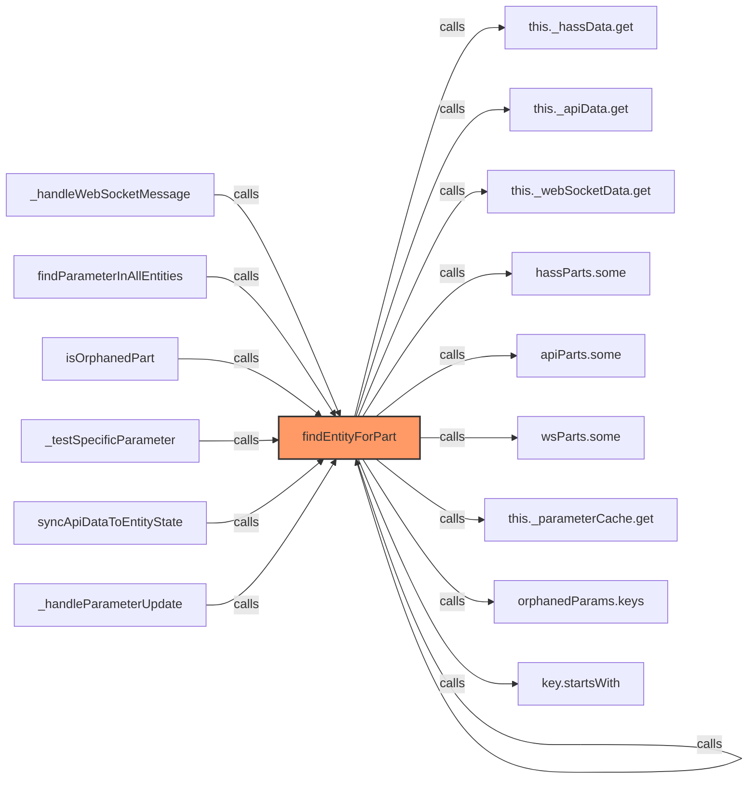

### `clearCache` (🌐 Public) {#clearCache}

**Returns:** `void`

**Calls:**

- [[cache|cache]]#clear
- [[cache|cache]]#clear
- [[cache|cache]]#clear
- [[cache|cache]]#clear
- [[logger|logger]]#log

**Call Graph:**

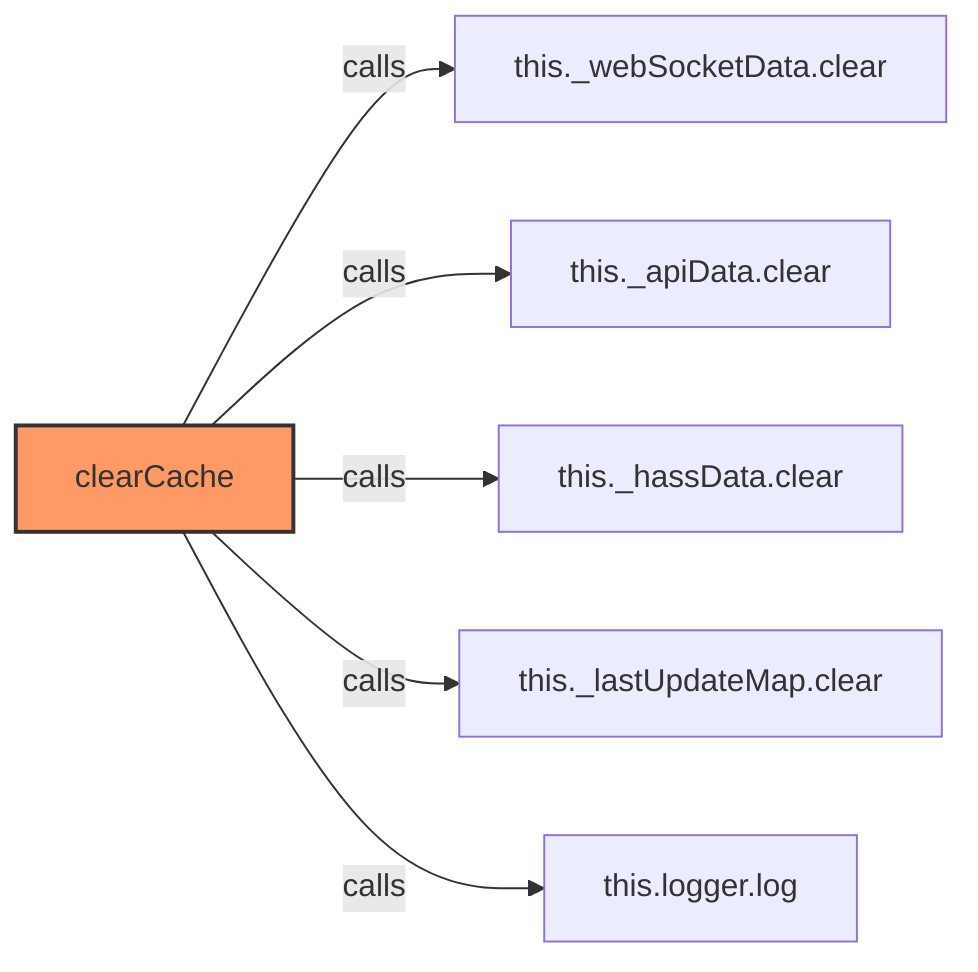

### `unregisterEntityOfInterest` (🌐 Public) {#unregisterEntityOfInterest}

**Parameters:**

- `entityId`: `string`

**Returns:** `void`

**Calls:**

- [[cache|cache]]#delete
- [[cache|cache]]#delete
- [[cache|cache]]#delete
- [[cache|cache]]#delete
- [[logger|logger]]#log

**Call Graph:**

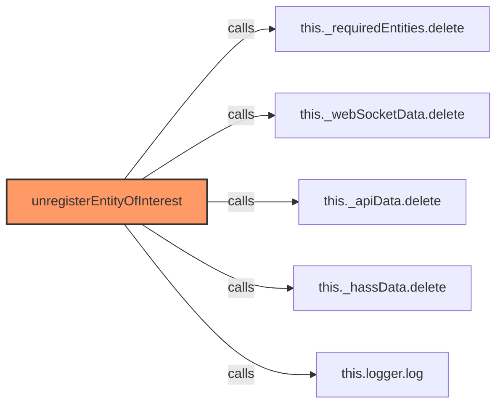

### `getTrackedEntities` (🌐 Public) {#getTrackedEntities}

**Returns:** `string[]`

**Calls:**

- `Array.from`

**Called By:**

- From [[inventree-state|inventree-state]]:
  - `_findPartById`

**Call Graph:**

```mermaid
flowchart LR
    getTrackedEntities[getTrackedEntities]:::current
    Array_from[Array.from]
    getTrackedEntities -->|calls| Array_from
    _findPartById[_findPartById]
    _findPartById -->|calls| getTrackedEntities
    classDef current fill:#f96,stroke:#333,stroke-width:2px;
```

### `triggerRefresh` (🌐 Public) {#triggerRefresh}

**Returns:** `void`

**Called By:**

- From [[inventree-state|inventree-state]]:
  - `setPriorityDataSource`

**Call Graph:**

```mermaid
flowchart LR
    triggerRefresh[triggerRefresh]:::current
    setPriorityDataSource[setPriorityDataSource]
    setPriorityDataSource -->|calls| triggerRefresh
    classDef current fill:#f96,stroke:#333,stroke-width:2px;
```

### `getParameterValueFromPart` (🌐 Public) {#getParameterValueFromPart}

**Parameters:**

- `part`: `InventreeItem`
- `paramName`: `string`

**Returns:** `string | null`

**Calls:**

- `Array.isArray`
- `part.parameters.find`
- `p.template_detail?.name.toLowerCase`
- `paramName.toLowerCase`

**Called By:**

- From [[parts-layout|parts-layout]]:
  - `matchesParameterFilter`
- From [[inventree-state|inventree-state]]:
  - `getParameterValueWithDirectReference`
  - `findParameterInWebSocketData`
  - `findParameterInApiData`
  - `findParameterInHassData`
- From [[parameter-service|parameter-service]]:
  - `matchesConditionSyncVersion`
  - `matchesCondition`
  - `getParameterValueFromPart`
  - `getParameterFromEntity`

**Call Graph:**

```mermaid
flowchart LR
    getParameterValueFromPart[getParameterValueFromPart]:::current
    Array_isArray[Array.isArray]
    getParameterValueFromPart -->|calls| Array_isArray
    part_parameters_find[part.parameters.find]
    getParameterValueFromPart -->|calls| part_parameters_find
    p_template_detail__name_toLowerCase[p.template_detail?.name.toLowerCase]
    getParameterValueFromPart -->|calls| p_template_detail__name_toLowerCase
    paramName_toLowerCase[paramName.toLowerCase]
    getParameterValueFromPart -->|calls| paramName_toLowerCase
    matchesParameterFilter[matchesParameterFilter]
    matchesParameterFilter -->|calls| getParameterValueFromPart
    getParameterValueWithDirectReference[getParameterValueWithDirectReference]
    getParameterValueWithDirectReference -->|calls| getParameterValueFromPart
    findParameterInWebSocketData[findParameterInWebSocketData]
    findParameterInWebSocketData -->|calls| getParameterValueFromPart
    findParameterInApiData[findParameterInApiData]
    findParameterInApiData -->|calls| getParameterValueFromPart
    findParameterInHassData[findParameterInHassData]
    findParameterInHassData -->|calls| getParameterValueFromPart
    matchesConditionSyncVersion[matchesConditionSyncVersion]
    matchesConditionSyncVersion -->|calls| getParameterValueFromPart
    matchesCondition[matchesCondition]
    matchesCondition -->|calls| getParameterValueFromPart
    getParameterValueFromPart[getParameterValueFromPart]
    getParameterValueFromPart -->|calls| getParameterValueFromPart
    getParameterFromEntity[getParameterFromEntity]
    getParameterFromEntity -->|calls| getParameterValueFromPart
    classDef current fill:#f96,stroke:#333,stroke-width:2px;
```

### `isDirectPartReference` (🌐 Public) {#isDirectPartReference}

**Parameters:**

- `reference`: `string`

**Returns:** `boolean`

**Calls:**

- `reference.startsWith`
- `reference.substring(5).includes`
- `reference.substring`

**Called By:**

- From [[base-layout|base-layout]]:
  - `_applyParameterFiltering`
  - `updateFilteredParts`
- From [[inventree-state|inventree-state]]:
  - `getParameterValueWithDirectReference`
- From [[card-controller|card-controller]]:
  - `handleWebSocketMessage`
- From [[parameter-service|parameter-service]]:
  - `matchesCondition`
  - `isDirectPartReference`

**Call Graph:**

```mermaid
flowchart LR
    isDirectPartReference[isDirectPartReference]:::current
    reference_startsWith[reference.startsWith]
    isDirectPartReference -->|calls| reference_startsWith
    reference_substring_5__includes[reference.substring(5).includes]
    isDirectPartReference -->|calls| reference_substring_5__includes
    reference_substring[reference.substring]
    isDirectPartReference -->|calls| reference_substring
    _applyParameterFiltering[_applyParameterFiltering]
    _applyParameterFiltering -->|calls| isDirectPartReference
    updateFilteredParts[updateFilteredParts]
    updateFilteredParts -->|calls| isDirectPartReference
    getParameterValueWithDirectReference[getParameterValueWithDirectReference]
    getParameterValueWithDirectReference -->|calls| isDirectPartReference
    handleWebSocketMessage[handleWebSocketMessage]
    handleWebSocketMessage -->|calls| isDirectPartReference
    matchesCondition[matchesCondition]
    matchesCondition -->|calls| isDirectPartReference
    isDirectPartReference[isDirectPartReference]
    isDirectPartReference -->|calls| isDirectPartReference
    classDef current fill:#f96,stroke:#333,stroke-width:2px;
```

### `getParameterValueWithDirectReference` (🌐 Public) {#getParameterValueWithDirectReference}

**Parameters:**

- `reference`: `string`

**Returns:** `Promise<string | null>`

**Calls:**

- [[inventree-state|inventree-state]]#isDirectPartReference
- `reference.split`
- `parseInt`
- `isNaN`
- [[inventree-state|inventree-state]]#_findPartById
- [[inventree-state|inventree-state]]#getParameterValueFromPart

**Called By:**

- From [[base-layout|base-layout]]:
  - `_applyParameterFiltering`
  - `updateFilteredParts`
- From [[card-controller|card-controller]]:
  - `handleWebSocketMessage`
- From [[parameter-service|parameter-service]]:
  - `matchesCondition`
  - `getParameterValueWithDirectReference`

**Call Graph:**

```mermaid
flowchart LR
    getParameterValueWithDirectReference[getParameterValueWithDirectReference]:::current
    this_isDirectPartReference[this.isDirectPartReference]
    getParameterValueWithDirectReference -->|calls| this_isDirectPartReference
    reference_split[reference.split]
    getParameterValueWithDirectReference -->|calls| reference_split
    parseInt[parseInt]
    getParameterValueWithDirectReference -->|calls| parseInt
    isNaN[isNaN]
    getParameterValueWithDirectReference -->|calls| isNaN
    this__findPartById[this._findPartById]
    getParameterValueWithDirectReference -->|calls| this__findPartById
    this_getParameterValueFromPart[this.getParameterValueFromPart]
    getParameterValueWithDirectReference -->|calls| this_getParameterValueFromPart
    _applyParameterFiltering[_applyParameterFiltering]
    _applyParameterFiltering -->|calls| getParameterValueWithDirectReference
    updateFilteredParts[updateFilteredParts]
    updateFilteredParts -->|calls| getParameterValueWithDirectReference
    handleWebSocketMessage[handleWebSocketMessage]
    handleWebSocketMessage -->|calls| getParameterValueWithDirectReference
    matchesCondition[matchesCondition]
    matchesCondition -->|calls| getParameterValueWithDirectReference
    getParameterValueWithDirectReference[getParameterValueWithDirectReference]
    getParameterValueWithDirectReference -->|calls| getParameterValueWithDirectReference
    classDef current fill:#f96,stroke:#333,stroke-width:2px;
```

### `_findPartById` (🔒 Private) {#_findPartById}

**Parameters:**

- `partId`: `number`

**Returns:** `InventreeItem | null`

**Calls:**

- [[inventree-state|inventree-state]]#getTrackedEntities
- [[inventree-state|inventree-state]]#getNewestData
- `parts.find`

**Called By:**

- From [[inventree-state|inventree-state]]:
  - `getParameterValueWithDirectReference`

**Call Graph:**

```mermaid
flowchart LR
    _findPartById[_findPartById]:::current
    this_getTrackedEntities[this.getTrackedEntities]
    _findPartById -->|calls| this_getTrackedEntities
    this_getNewestData[this.getNewestData]
    _findPartById -->|calls| this_getNewestData
    parts_find[parts.find]
    _findPartById -->|calls| parts_find
    getParameterValueWithDirectReference[getParameterValueWithDirectReference]
    getParameterValueWithDirectReference -->|calls| _findPartById
    classDef current fill:#f96,stroke:#333,stroke-width:2px;
```

### `findParameterInAllEntities` (🌐 Public) {#findParameterInAllEntities}

**Parameters:**

- `partId`: `number`
- `paramName`: `string`

**Returns:** `Promise<string | null>`

**Calls:**

- [[inventree-state|inventree-state]]#findEntityForPart
- [[inventree-state|inventree-state]]#getParameterValue
- [[cache|cache]]#get
- [[cache|cache]]#get
- [[inventree-state|inventree-state]]#findParameterInWebSocketData
- [[inventree-state|inventree-state]]#findParameterInApiData
- [[inventree-state|inventree-state]]#findParameterInHassData

**Called By:**

- From [[parameter-service|parameter-service]]:
  - `findParameterInAllEntities`

**Call Graph:**

```mermaid
flowchart LR
    findParameterInAllEntities[findParameterInAllEntities]:::current
    this_findEntityForPart[this.findEntityForPart]
    findParameterInAllEntities -->|calls| this_findEntityForPart
    this_getParameterValue[this.getParameterValue]
    findParameterInAllEntities -->|calls| this_getParameterValue
    this__parameterCache_get[this._parameterCache.get]
    findParameterInAllEntities -->|calls| this__parameterCache_get
    orphanedParams_get[orphanedParams.get]
    findParameterInAllEntities -->|calls| orphanedParams_get
    this_findParameterInWebSocketData[this.findParameterInWebSocketData]
    findParameterInAllEntities -->|calls| this_findParameterInWebSocketData
    this_findParameterInApiData[this.findParameterInApiData]
    findParameterInAllEntities -->|calls| this_findParameterInApiData
    this_findParameterInHassData[this.findParameterInHassData]
    findParameterInAllEntities -->|calls| this_findParameterInHassData
    findParameterInAllEntities[findParameterInAllEntities]
    findParameterInAllEntities -->|calls| findParameterInAllEntities
    classDef current fill:#f96,stroke:#333,stroke-width:2px;
```

### `findParameterInWebSocketData` (🌐 Public) {#findParameterInWebSocketData}

**Parameters:**

- `partId`: `number`
- `paramName`: `string`

**Returns:** `string | null`

**Calls:**

- `this._webSocketData.entries`
- `parts.find`
- [[inventree-state|inventree-state]]#getParameterValueFromPart

**Called By:**

- From [[inventree-state|inventree-state]]:
  - `findParameterInAllEntities`
- From [[parameter-service|parameter-service]]:
  - `findParameterInWebSocketData`

**Call Graph:**

```mermaid
flowchart LR
    findParameterInWebSocketData[findParameterInWebSocketData]:::current
    this__webSocketData_entries[this._webSocketData.entries]
    findParameterInWebSocketData -->|calls| this__webSocketData_entries
    parts_find[parts.find]
    findParameterInWebSocketData -->|calls| parts_find
    this_getParameterValueFromPart[this.getParameterValueFromPart]
    findParameterInWebSocketData -->|calls| this_getParameterValueFromPart
    findParameterInAllEntities[findParameterInAllEntities]
    findParameterInAllEntities -->|calls| findParameterInWebSocketData
    findParameterInWebSocketData[findParameterInWebSocketData]
    findParameterInWebSocketData -->|calls| findParameterInWebSocketData
    classDef current fill:#f96,stroke:#333,stroke-width:2px;
```

### `findParameterInApiData` (🌐 Public) {#findParameterInApiData}

**Parameters:**

- `partId`: `number`
- `paramName`: `string`

**Returns:** `string | null`

**Calls:**

- `this._apiData.entries`
- `parts.find`
- [[inventree-state|inventree-state]]#getParameterValueFromPart

**Called By:**

- From [[inventree-state|inventree-state]]:
  - `findParameterInAllEntities`
- From [[parameter-service|parameter-service]]:
  - `findParameterInApiData`

**Call Graph:**

```mermaid
flowchart LR
    findParameterInApiData[findParameterInApiData]:::current
    this__apiData_entries[this._apiData.entries]
    findParameterInApiData -->|calls| this__apiData_entries
    parts_find[parts.find]
    findParameterInApiData -->|calls| parts_find
    this_getParameterValueFromPart[this.getParameterValueFromPart]
    findParameterInApiData -->|calls| this_getParameterValueFromPart
    findParameterInAllEntities[findParameterInAllEntities]
    findParameterInAllEntities -->|calls| findParameterInApiData
    findParameterInApiData[findParameterInApiData]
    findParameterInApiData -->|calls| findParameterInApiData
    classDef current fill:#f96,stroke:#333,stroke-width:2px;
```

### `findParameterInHassData` (🌐 Public) {#findParameterInHassData}

**Parameters:**

- `partId`: `number`
- `paramName`: `string`

**Returns:** `string | null`

**Calls:**

- `this._hassData.entries`
- `parts.find`
- [[inventree-state|inventree-state]]#getParameterValueFromPart
- `entity.attributes.items.find`

**Called By:**

- From [[inventree-state|inventree-state]]:
  - `findParameterInAllEntities`
- From [[parameter-service|parameter-service]]:
  - `findParameterInHassData`

**Call Graph:**

```mermaid
flowchart LR
    findParameterInHassData[findParameterInHassData]:::current
    this__hassData_entries[this._hassData.entries]
    findParameterInHassData -->|calls| this__hassData_entries
    parts_find[parts.find]
    findParameterInHassData -->|calls| parts_find
    this_getParameterValueFromPart[this.getParameterValueFromPart]
    findParameterInHassData -->|calls| this_getParameterValueFromPart
    entity_attributes_items_find[entity.attributes.items.find]
    findParameterInHassData -->|calls| entity_attributes_items_find
    findParameterInAllEntities[findParameterInAllEntities]
    findParameterInAllEntities -->|calls| findParameterInHassData
    findParameterInHassData[findParameterInHassData]
    findParameterInHassData -->|calls| findParameterInHassData
    classDef current fill:#f96,stroke:#333,stroke-width:2px;
```

### `storeOrphanedParameter` (🌐 Public) {#storeOrphanedParameter}

**Parameters:**

- `partId`: `number`
- `paramName`: `string`
- `value`: `string`

**Returns:** `void`

**Calls:**

- [[cache|cache]]#has
- [[cache|cache]]#set
- [[cache|cache]]#set
- [[cache|cache]]#get
- [[logger|logger]]#log

**Called By:**

- From [[card-controller|card-controller]]:
  - `handleWebSocketMessage`
- From [[parameter-service|parameter-service]]:
  - `storeOrphanedParameter`
  - `updateParameter`
  - `syncApiDataToEntityState`

**Call Graph:**

```mermaid
flowchart LR
    storeOrphanedParameter[storeOrphanedParameter]:::current
    this__parameterCache_has[this._parameterCache.has]
    storeOrphanedParameter -->|calls| this__parameterCache_has
    this__parameterCache_set[this._parameterCache.set]
    storeOrphanedParameter -->|calls| this__parameterCache_set
    this__parameterCache_get_orphanedKey__set[this._parameterCache.get(orphanedKey).set]
    storeOrphanedParameter -->|calls| this__parameterCache_get_orphanedKey__set
    this__parameterCache_get[this._parameterCache.get]
    storeOrphanedParameter -->|calls| this__parameterCache_get
    this_logger_log[this.logger.log]
    storeOrphanedParameter -->|calls| this_logger_log
    handleWebSocketMessage[handleWebSocketMessage]
    handleWebSocketMessage -->|calls| storeOrphanedParameter
    storeOrphanedParameter[storeOrphanedParameter]
    storeOrphanedParameter -->|calls| storeOrphanedParameter
    updateParameter[updateParameter]
    updateParameter -->|calls| storeOrphanedParameter
    syncApiDataToEntityState[syncApiDataToEntityState]
    syncApiDataToEntityState -->|calls| storeOrphanedParameter
    classDef current fill:#f96,stroke:#333,stroke-width:2px;
```

### `isOrphanedPart` (🌐 Public) {#isOrphanedPart}

**Parameters:**

- `partId`: `number`

**Returns:** `boolean`

**Calls:**

- [[inventree-state|inventree-state]]#findEntityForPart

**Called By:**

- From [[parameter-service|parameter-service]]:
  - `isOrphanedPart`

**Call Graph:**

```mermaid
flowchart LR
    isOrphanedPart[isOrphanedPart]:::current
    this_findEntityForPart[this.findEntityForPart]
    isOrphanedPart -->|calls| this_findEntityForPart
    isOrphanedPart[isOrphanedPart]
    isOrphanedPart -->|calls| isOrphanedPart
    classDef current fill:#f96,stroke:#333,stroke-width:2px;
```

### `getOrphanedPartIds` (🌐 Public) {#getOrphanedPartIds}

**Returns:** `number[]`

**Calls:**

- [[cache|cache]]#get
- `orphanedParams.keys`
- `key.split`
- `parseInt`
- `isNaN`
- `partIds.add`
- `Array.from`

**Called By:**

- From [[parameter-service|parameter-service]]:
  - `getOrphanedPartIds`

**Call Graph:**

```mermaid
flowchart LR
    getOrphanedPartIds[getOrphanedPartIds]:::current
    this__parameterCache_get[this._parameterCache.get]
    getOrphanedPartIds -->|calls| this__parameterCache_get
    orphanedParams_keys[orphanedParams.keys]
    getOrphanedPartIds -->|calls| orphanedParams_keys
    key_split[key.split]
    getOrphanedPartIds -->|calls| key_split
    parseInt[parseInt]
    getOrphanedPartIds -->|calls| parseInt
    isNaN[isNaN]
    getOrphanedPartIds -->|calls| isNaN
    partIds_add[partIds.add]
    getOrphanedPartIds -->|calls| partIds_add
    Array_from[Array.from]
    getOrphanedPartIds -->|calls| Array_from
    getOrphanedPartIds[getOrphanedPartIds]
    getOrphanedPartIds -->|calls| getOrphanedPartIds
    classDef current fill:#f96,stroke:#333,stroke-width:2px;
```

### `getOrphanedPartParameters` (🌐 Public) {#getOrphanedPartParameters}

**Parameters:**

- `partId`: `number`

**Returns:** `Record<string, string> | null`

**Calls:**

- [[cache|cache]]#get
- `orphanedParams.entries`
- `key.split`
- `parseInt`

**Called By:**

- From [[parameter-service|parameter-service]]:
  - `getOrphanedPartParameters`

**Call Graph:**

```mermaid
flowchart LR
    getOrphanedPartParameters[getOrphanedPartParameters]:::current
    this__parameterCache_get[this._parameterCache.get]
    getOrphanedPartParameters -->|calls| this__parameterCache_get
    orphanedParams_entries[orphanedParams.entries]
    getOrphanedPartParameters -->|calls| orphanedParams_entries
    key_split[key.split]
    getOrphanedPartParameters -->|calls| key_split
    parseInt[parseInt]
    getOrphanedPartParameters -->|calls| parseInt
    getOrphanedPartParameters[getOrphanedPartParameters]
    getOrphanedPartParameters -->|calls| getOrphanedPartParameters
    classDef current fill:#f96,stroke:#333,stroke-width:2px;
```

## Dependencies

```mermaid
flowchart TD
    inventree-state[inventree-state.ts]:::current
    types[types.ts]
    inventree-state -->|imports| types
    logger[logger.ts]
    inventree-state -->|imports| logger
    base_layout[base-layout.ts]
    base_layout -->|imports| inventree-state
    detail_layout[detail-layout.ts]
    detail_layout -->|imports| inventree-state
    parts_layout[parts-layout.ts]
    parts_layout -->|imports| inventree-state
    variant_layout[variant-layout.ts]
    variant_layout -->|imports| inventree-state
    inventree_card[inventree-card.ts]
    inventree_card -->|imports| inventree-state
    card_controller[card-controller.ts]
    card_controller -->|imports| inventree-state
    parameter_service[parameter-service.ts]
    parameter_service -->|imports| inventree-state
    rendering_service[rendering-service.ts]
    rendering_service -->|imports| inventree-state
    state[state.ts]
    state -->|imports| inventree-state
    websocket_plugin[websocket-plugin.ts]
    websocket_plugin -->|imports| inventree-state
    websocket[websocket.ts]
    websocket -->|imports| inventree-state
    classDef current fill:#f96,stroke:#333,stroke-width:2px;
```

