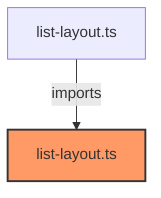

# list-layout.ts

**Path:** `styles/layouts/list-layout.ts`  
**Line Count:** 202  
**Functions:** 0  

## Overview

This file is part of the `styles/layouts` directory.

## Imports

- lit: css

## Exports

- `listLayoutStyles`

## Dependencies

