# logger.ts

**Path:** `utils/logger.ts`  
**Line Count:** 660  
**Functions:** 25  

## Overview

This file is part of the `utils` directory.

## Exports

- `Logger`

## Functions

### Class: Logger

### `getInstance` (🌐 Public) {#getInstance}

**Returns:** `Logger`

**Called By:**

- From [[base-layout|base-layout]]:
  - `_safeGetParameterService`
  - `_loadData`
  - `getParts`
  - `updated`
  - `updateFilteredParts`
- From [[variant-handler|variant-handler]]:
  - `processItems`
- From [[detail-layout|detail-layout]]:
  - `_updateVisualModifiers`
- From [[grid-layout|grid-layout]]:
  - `_setupWebSocketConnection`
  - `_cleanupListeners`
  - `_actuallyFilterParts`
  - `_updateVisualModifiers`
  - `render`
- From [[list-layout|list-layout]]:
  - `_updateVisualModifiers`
  - `render`
- From [[parts-layout|parts-layout]]:
  - `loadPartsFromEntities`
  - `_updateVisualModifiers`
- From [[editor|editor]]:
  - `_renderDebuggingSection`
- From [[inventree-card|inventree-card]]:
  - `connectedCallback`
  - `_resetApiFailures`
  - `_initializeServices`
- From [[card-controller|card-controller]]:
  - `setHass`
  - `initializeServices`
  - `loadEntityData`
  - `getParts`
  - `getWebSocketService`
  - `initializeWebSocketPlugin`
  - `handleWebSocketMessage`
  - `getWebSocketDiagnostics`
- From [[parameter-service|parameter-service]]:
  - `getParameterValueFromPart`
  - `isDirectPartReference`
  - `getParameterValueWithDirectReference`
  - `findEntityForPart`
  - `storeOrphanedParameter`
  - `isOrphanedPart`
  - `getOrphanedPartIds`
  - `getOrphanedPartParameters`
  - `findParameterInWebSocketData`
  - `findParameterInApiData`
  - `findParameterInHassData`
  - `findParameterInAllEntities`
  - `syncApiDataToEntityState`
  - `getParameterFromEntity`
- From [[rendering-service|rendering-service]]:
  - `startIdleTimer`
- From [[variant-service|variant-service]]:
  - `processVariants`
- From [[websocket-plugin|websocket-plugin]]:
  - `_handleParameterUpdate`
- From [[websocket|websocket]]:
  - `_updateEntityState`

**Call Graph:**

```mermaid
flowchart LR
    getInstance[getInstance]:::current
    _safeGetParameterService[_safeGetParameterService]
    _safeGetParameterService -->|calls| getInstance
    _loadData[_loadData]
    _loadData -->|calls| getInstance
    getParts[getParts]
    getParts -->|calls| getInstance
    updated[updated]
    updated -->|calls| getInstance
    updateFilteredParts[updateFilteredParts]
    updateFilteredParts -->|calls| getInstance
    processItems[processItems]
    processItems -->|calls| getInstance
    _updateVisualModifiers[_updateVisualModifiers]
    _updateVisualModifiers -->|calls| getInstance
    _setupWebSocketConnection[_setupWebSocketConnection]
    _setupWebSocketConnection -->|calls| getInstance
    _cleanupListeners[_cleanupListeners]
    _cleanupListeners -->|calls| getInstance
    _actuallyFilterParts[_actuallyFilterParts]
    _actuallyFilterParts -->|calls| getInstance
    render[render]
    render -->|calls| getInstance
    loadPartsFromEntities[loadPartsFromEntities]
    loadPartsFromEntities -->|calls| getInstance
    _renderDebuggingSection[_renderDebuggingSection]
    _renderDebuggingSection -->|calls| getInstance
    connectedCallback[connectedCallback]
    connectedCallback -->|calls| getInstance
    _resetApiFailures[_resetApiFailures]
    _resetApiFailures -->|calls| getInstance
    _initializeServices[_initializeServices]
    _initializeServices -->|calls| getInstance
    setHass[setHass]
    setHass -->|calls| getInstance
    initializeServices[initializeServices]
    initializeServices -->|calls| getInstance
    loadEntityData[loadEntityData]
    loadEntityData -->|calls| getInstance
    getWebSocketService[getWebSocketService]
    getWebSocketService -->|calls| getInstance
    initializeWebSocketPlugin[initializeWebSocketPlugin]
    initializeWebSocketPlugin -->|calls| getInstance
    handleWebSocketMessage[handleWebSocketMessage]
    handleWebSocketMessage -->|calls| getInstance
    getWebSocketDiagnostics[getWebSocketDiagnostics]
    getWebSocketDiagnostics -->|calls| getInstance
    getParameterValueFromPart[getParameterValueFromPart]
    getParameterValueFromPart -->|calls| getInstance
    isDirectPartReference[isDirectPartReference]
    isDirectPartReference -->|calls| getInstance
    getParameterValueWithDirectReference[getParameterValueWithDirectReference]
    getParameterValueWithDirectReference -->|calls| getInstance
    findEntityForPart[findEntityForPart]
    findEntityForPart -->|calls| getInstance
    storeOrphanedParameter[storeOrphanedParameter]
    storeOrphanedParameter -->|calls| getInstance
    isOrphanedPart[isOrphanedPart]
    isOrphanedPart -->|calls| getInstance
    getOrphanedPartIds[getOrphanedPartIds]
    getOrphanedPartIds -->|calls| getInstance
    getOrphanedPartParameters[getOrphanedPartParameters]
    getOrphanedPartParameters -->|calls| getInstance
    findParameterInWebSocketData[findParameterInWebSocketData]
    findParameterInWebSocketData -->|calls| getInstance
    findParameterInApiData[findParameterInApiData]
    findParameterInApiData -->|calls| getInstance
    findParameterInHassData[findParameterInHassData]
    findParameterInHassData -->|calls| getInstance
    findParameterInAllEntities[findParameterInAllEntities]
    findParameterInAllEntities -->|calls| getInstance
    syncApiDataToEntityState[syncApiDataToEntityState]
    syncApiDataToEntityState -->|calls| getInstance
    getParameterFromEntity[getParameterFromEntity]
    getParameterFromEntity -->|calls| getInstance
    startIdleTimer[startIdleTimer]
    startIdleTimer -->|calls| getInstance
    processVariants[processVariants]
    processVariants -->|calls| getInstance
    _handleParameterUpdate[_handleParameterUpdate]
    _handleParameterUpdate -->|calls| getInstance
    _updateEntityState[_updateEntityState]
    _updateEntityState -->|calls| getInstance
    classDef current fill:#f96,stroke:#333,stroke-width:2px;
```

### `isEnabled` (🌐 Public) {#isEnabled}

**Parameters:**

- `system`: `string`
- `subsystem`: `string`

**Returns:** `boolean`

**Calls:**

- [[logger|logger]]#anyCategoryEnabled

**Called By:**

- From [[logger|logger]]:
  - `log`
  - `info`
  - `isCategoryEnabled`

**Call Graph:**

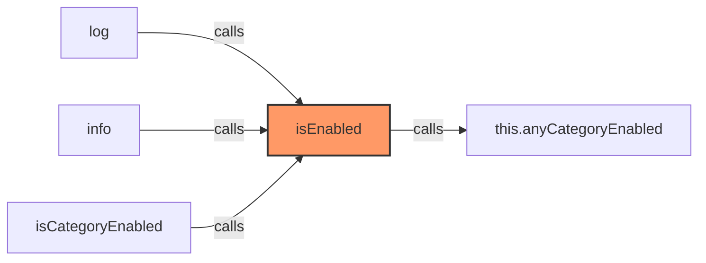

### `anyCategoryEnabled` (🌐 Public) {#anyCategoryEnabled}

**Returns:** `boolean`

**Calls:**

- `Object.keys(this.debugCategories).some`
- `Object.keys`

**Called By:**

- From [[logger|logger]]:
  - `isEnabled`
  - `setDebugConfig`

**Call Graph:**

```mermaid
flowchart LR
    anyCategoryEnabled[anyCategoryEnabled]:::current
    Object_keys_this_debugCategories__some[Object.keys(this.debugCategories).some]
    anyCategoryEnabled -->|calls| Object_keys_this_debugCategories__some
    Object_keys[Object.keys]
    anyCategoryEnabled -->|calls| Object_keys
    isEnabled[isEnabled]
    isEnabled -->|calls| anyCategoryEnabled
    setDebugConfig[setDebugConfig]
    setDebugConfig -->|calls| anyCategoryEnabled
    classDef current fill:#f96,stroke:#333,stroke-width:2px;
```

### `getNextSequence` (🌐 Public) {#getNextSequence}

**Returns:** `number`

**Called By:**

- From [[logger|logger]]:
  - `log`
  - `info`
  - `warn`
  - `error`

**Call Graph:**

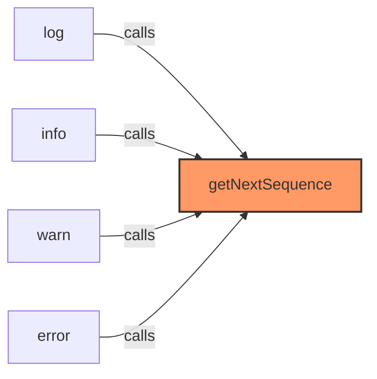

### `setDebug` (🌐 Public) {#setDebug}

**Parameters:**

- `debug`: `boolean`

**Returns:** `void`

**Called By:**

- From [[inventree-card|inventree-card]]:
  - `setConfig`
- From [[logger|logger]]:
  - `setVerboseMode`
  - `setDebugConfig`

**Call Graph:**

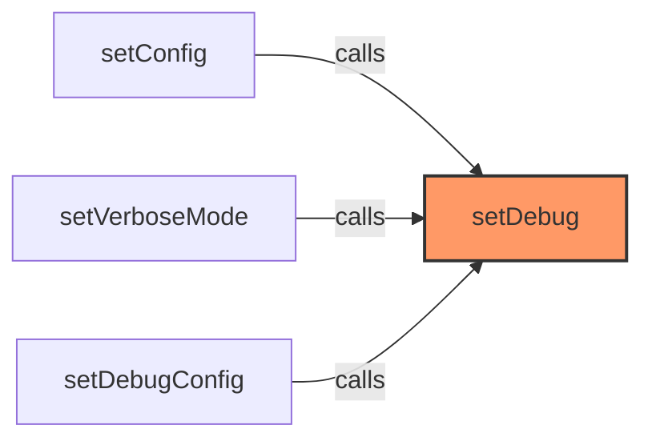

### `setVerboseMode` (🌐 Public) {#setVerboseMode}

**Parameters:**

- `verbose`: `boolean`

**Returns:** `void`

**Calls:**

- [[logger|logger]]#setDebug

**Called By:**

- From [[logger|logger]]:
  - `setDebugConfig`

**Call Graph:**

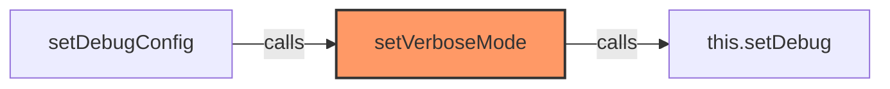

### `setDebugConfig` (🌐 Public) {#setDebugConfig}

**Parameters:**

- `config`: `any`

**Returns:** `void`

**Calls:**

- [[logger|logger]]#setDebug
- [[logger|logger]]#setVerboseMode
- [[logger|logger]]#anyCategoryEnabled
- [[logger|logger]]#setCategoryDebug
- [[logger|logger]]#processHierarchicalConfig
- [[logger|logger]]#formatSystemStatus

**Called By:**

- From [[editor|editor]]:
  - `_updateSubsystem`

**Call Graph:**

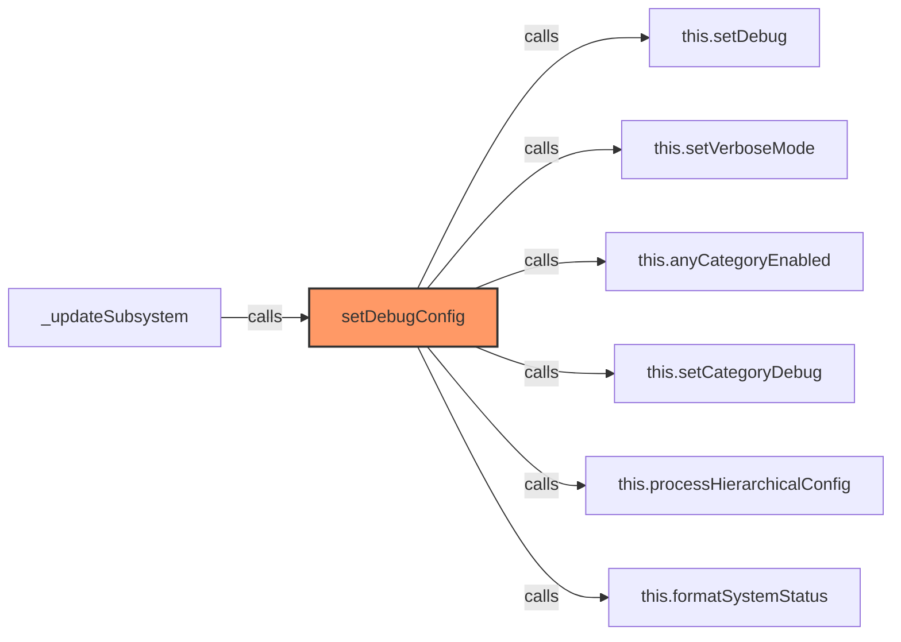

### `processHierarchicalConfig` (🌐 Public) {#processHierarchicalConfig}

**Parameters:**

- `config`: `any`

**Returns:** `void`

**Calls:**

- [[logger|logger]]#setCategoryDebug
- [[logger|logger]]#setSubsystemDebug

**Called By:**

- From [[logger|logger]]:
  - `setDebugConfig`

**Call Graph:**

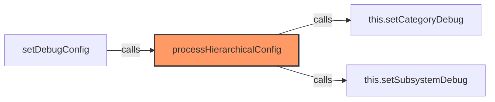

### `formatSystemStatus` (🌐 Public) {#formatSystemStatus}

**Parameters:**

- `system`: `string`

**Returns:** `string`

**Calls:**

- `Object.keys(subsystems).filter(s => subsystems[s]).join`
- `Object.keys(subsystems).filter`
- `Object.keys`

**Called By:**

- From [[logger|logger]]:
  - `setDebugConfig`

**Call Graph:**

```mermaid
flowchart LR
    formatSystemStatus[formatSystemStatus]:::current
    Object_keys_subsystems__filter_s____subsystems_s___join[Object.keys(subsystems).filter(s => subsystems[s]).join]
    formatSystemStatus -->|calls| Object_keys_subsystems__filter_s____subsystems_s___join
    Object_keys_subsystems__filter[Object.keys(subsystems).filter]
    formatSystemStatus -->|calls| Object_keys_subsystems__filter
    Object_keys[Object.keys]
    formatSystemStatus -->|calls| Object_keys
    setDebugConfig[setDebugConfig]
    setDebugConfig -->|calls| formatSystemStatus
    classDef current fill:#f96,stroke:#333,stroke-width:2px;
```

### `setLogLevel` (🌐 Public) {#setLogLevel}

**Parameters:**

- `level`: `'none' | 'error' | 'warn' | 'info' | 'debug'`

**Returns:** `void`

### `setCategoryDebug` (🌐 Public) {#setCategoryDebug}

**Parameters:**

- `category`: `string`
- `enabled`: `boolean`

**Returns:** `void`

**Called By:**

- From [[logger|logger]]:
  - `setDebugConfig`
  - `processHierarchicalConfig`
  - `setEnabled`

**Call Graph:**

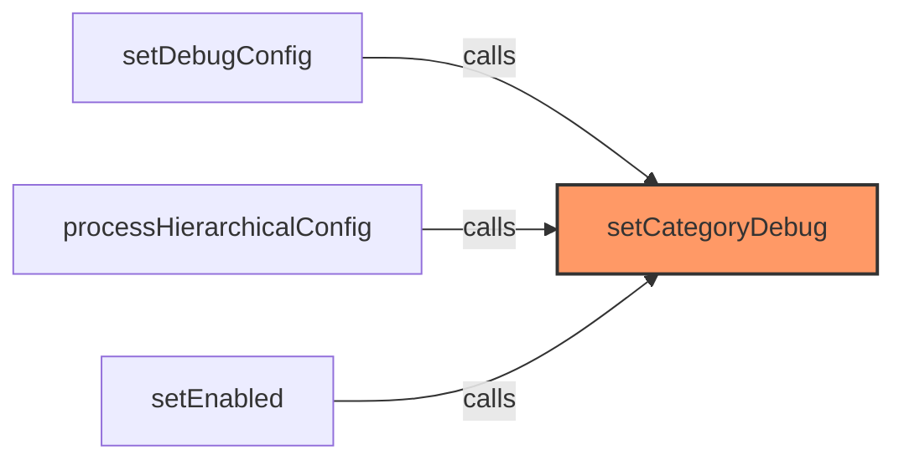

### `setSubsystemDebug` (🌐 Public) {#setSubsystemDebug}

**Parameters:**

- `system`: `string`
- `subsystem`: `string`
- `enabled`: `boolean`

**Returns:** `void`

**Called By:**

- From [[logger|logger]]:
  - `processHierarchicalConfig`

**Call Graph:**

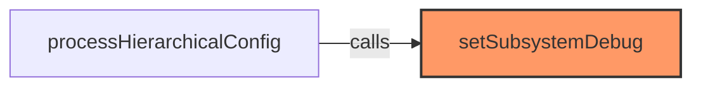

### `isDuplicate` (🌐 Public) {#isDuplicate}

**Parameters:**

- `key`: `string`

**Returns:** `boolean`

**Calls:**

- `Date.now`
- [[cache|cache]]#get
- [[cache|cache]]#set
- [[logger|logger]]#pruneRecentLogs

**Called By:**

- From [[logger|logger]]:
  - `log`

**Call Graph:**

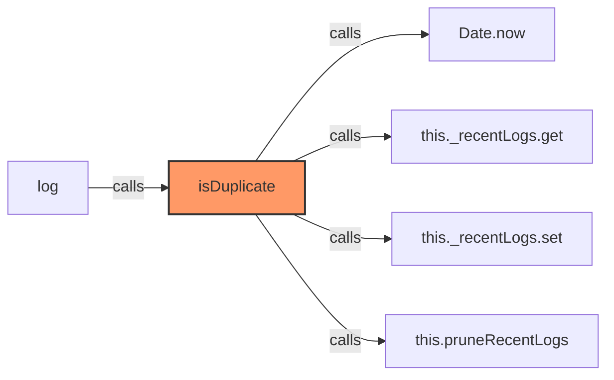

### `pruneRecentLogs` (🌐 Public) {#pruneRecentLogs}

**Returns:** `void`

**Calls:**

- `Date.now`
- `this._recentLogs.entries`
- [[cache|cache]]#delete

**Called By:**

- From [[logger|logger]]:
  - `isDuplicate`

**Call Graph:**

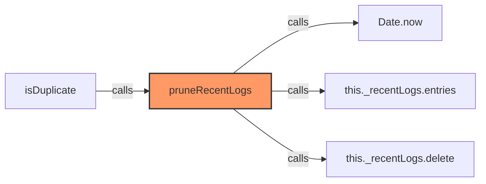

### `log` (🌐 Public) {#log}

**Parameters:**

- `component`: `string`
- `message`: `string`
- `options`: `any`
- `restArgs`: `any[]`

**Returns:** `void`

**Calls:**

- `Array.isArray`
- [[logger|logger]]#isEnabled
- [[logger|logger]]#isDuplicate
- [[logger|logger]]#getNextSequence
- `Date.now`
- `timestamp.toString`
- `duration.toFixed`
- `(Date.now() - startTime).toFixed`

**Called By:**

- From [[base-layout|base-layout]]:
  - `_safeGetParameterService`
  - `connectedCallback`
  - `_scheduleParameterServiceRetry`
  - `_loadData`
  - `_applyParameterFiltering`
  - `updated`
  - `requestUpdate`
  - `updateFilteredParts`
  - `_applyParameterFilteringSync`
- From [[variant-handler|variant-handler]]:
  - `processItems`
- From [[list-layout|list-layout]]:
  - `_updateVisualModifiers`
  - `render`
- From [[part-buttons|part-buttons]]:
  - `updated`
- From [[part-variant|part-variant]]:
  - `updated`
  - `logVariantDetails`
  - `render`
- From [[part-view|part-view]]:
  - `updated`
  - `render`
  - `_adjustStock`
  - `_locateInWLED`
  - `_printLabel`
- From [[parts-layout|parts-layout]]:
  - `loadPartsFromEntities`
- From [[variant-layout|variant-layout]]:
  - `_processVariants`
- From [[inventree-state|inventree-state]]:
  - `setPriorityDataSource`
  - `trackLastUpdate`
  - `setWebSocketData`
  - `setApiData`
  - `setHassData`
  - `registerEntityOfInterest`
  - `setHass`
  - `updateParameter`
  - `clearCache`
  - `unregisterEntityOfInterest`
  - `storeOrphanedParameter`
- From [[editor|editor]]:
  - `_updateConfig`
  - `render`
  - `_valueChanged`
  - `_addFilter`
  - `_addParameterFilter`
- From [[inventree-card|inventree-card]]:
  - `setConfig`
  - `_setupEntitySubscriptions`
  - `subscribe`
  - `debouncedRender`
  - `render`
  - `_handleStockAdjustment`
  - `refreshParameterData`
  - `connectedCallback`
  - `disconnectedCallback`
  - `forceUpdateEntity`
  - `_runApiDiagnostics`
  - `_fetchAllParameters`
  - `_testSpecificParameter`
  - `_resetApiFailures`
  - `_initializeServices`
- From [[api|api]]:
  - `getParameterValue`
  - `getFallbackParameterValue`
  - `testBasicAuth`
  - `getPartParameters`
  - `logApiStats`
  - `updateParameterDirectly`
  - `notifyParameterChanged`
  - `resetRateLimiting`
  - `updateParameter`
  - `fetchParameterData`
- From [[cache|cache]]:
  - `set`
  - `get`
  - `delete`
  - `prune`
  - `clear`
- From [[card-controller|card-controller]]:
  - `setConfig`
  - `setHass`
  - `initializeServices`
  - `initializeApi`
  - `loadEntityData`
  - `initializeWebSocketPlugin`
  - `handleWebSocketMessage`
  - `resetApiFailures`
- From [[parameter-service|parameter-service]]:
  - `compareValues`
  - `diagnosticDump`
  - `clearCache`
  - `updateParameter`
  - `fetchParameterData`
  - `syncApiDataToEntityState`
  - `setStrictWebSocketMode`
- From [[rendering-service|rendering-service]]:
  - `setupRendering`
  - `handleWebSocketUpdate`
  - `startIdleTimer`
  - `notifyRenderCallbacks`
  - `shouldRender`
  - `startScheduler`
  - `stopScheduler`
  - `processScheduledJobs`
  - `addScheduledJob`
  - `removeScheduledJob`
  - `updateScheduledJob`
  - `destroy`
  - `notifyRenderComplete`
- From [[state|state]]:
  - `_getParameterService`
- From [[variant-service|variant-service]]:
  - `detectVariantGroups`
- From [[websocket-manager|websocket-manager]]:
  - `getConnection`
  - `removeCallbacks`
  - `closeAllConnections`
  - `handleOpen`
  - `handleMessage`
  - `handleClose`
- From [[websocket-plugin|websocket-plugin]]:
  - `connect`
  - `disconnect`
  - `_handleOpen`
  - `_handleMessage`
  - `_processMessage`
  - `_handleParameterUpdate`
  - `_scheduleReconnect`
- From [[websocket|websocket]]:
  - `setHass`
  - `subscribeToEntity`
  - `subscribeToParts`
  - `_subscribeToEntity`
  - `_unsubscribeFromEntity`
  - `_resubscribeAll`
  - `destroy`
  - `setDirectApi`
- From [[logger|logger]]:
  - `endPerformance`

**Call Graph:**

```mermaid
flowchart LR
    log[log]:::current
    Array_isArray[Array.isArray]
    log -->|calls| Array_isArray
    this_isEnabled[this.isEnabled]
    log -->|calls| this_isEnabled
    this_isDuplicate[this.isDuplicate]
    log -->|calls| this_isDuplicate
    this_getNextSequence[this.getNextSequence]
    log -->|calls| this_getNextSequence
    Date_now[Date.now]
    log -->|calls| Date_now
    timestamp_toString[timestamp.toString]
    log -->|calls| timestamp_toString
    duration_toFixed[duration.toFixed]
    log -->|calls| duration_toFixed
    _Date_now_____startTime__toFixed[(Date.now() - startTime).toFixed]
    log -->|calls| _Date_now_____startTime__toFixed
    _safeGetParameterService[_safeGetParameterService]
    _safeGetParameterService -->|calls| log
    connectedCallback[connectedCallback]
    connectedCallback -->|calls| log
    _scheduleParameterServiceRetry[_scheduleParameterServiceRetry]
    _scheduleParameterServiceRetry -->|calls| log
    _loadData[_loadData]
    _loadData -->|calls| log
    _applyParameterFiltering[_applyParameterFiltering]
    _applyParameterFiltering -->|calls| log
    updated[updated]
    updated -->|calls| log
    requestUpdate[requestUpdate]
    requestUpdate -->|calls| log
    updateFilteredParts[updateFilteredParts]
    updateFilteredParts -->|calls| log
    _applyParameterFilteringSync[_applyParameterFilteringSync]
    _applyParameterFilteringSync -->|calls| log
    processItems[processItems]
    processItems -->|calls| log
    _updateVisualModifiers[_updateVisualModifiers]
    _updateVisualModifiers -->|calls| log
    render[render]
    render -->|calls| log
    logVariantDetails[logVariantDetails]
    logVariantDetails -->|calls| log
    _adjustStock[_adjustStock]
    _adjustStock -->|calls| log
    _locateInWLED[_locateInWLED]
    _locateInWLED -->|calls| log
    _printLabel[_printLabel]
    _printLabel -->|calls| log
    loadPartsFromEntities[loadPartsFromEntities]
    loadPartsFromEntities -->|calls| log
    _processVariants[_processVariants]
    _processVariants -->|calls| log
    setPriorityDataSource[setPriorityDataSource]
    setPriorityDataSource -->|calls| log
    trackLastUpdate[trackLastUpdate]
    trackLastUpdate -->|calls| log
    setWebSocketData[setWebSocketData]
    setWebSocketData -->|calls| log
    setApiData[setApiData]
    setApiData -->|calls| log
    setHassData[setHassData]
    setHassData -->|calls| log
    registerEntityOfInterest[registerEntityOfInterest]
    registerEntityOfInterest -->|calls| log
    setHass[setHass]
    setHass -->|calls| log
    updateParameter[updateParameter]
    updateParameter -->|calls| log
    clearCache[clearCache]
    clearCache -->|calls| log
    unregisterEntityOfInterest[unregisterEntityOfInterest]
    unregisterEntityOfInterest -->|calls| log
    storeOrphanedParameter[storeOrphanedParameter]
    storeOrphanedParameter -->|calls| log
    _updateConfig[_updateConfig]
    _updateConfig -->|calls| log
    _valueChanged[_valueChanged]
    _valueChanged -->|calls| log
    _addFilter[_addFilter]
    _addFilter -->|calls| log
    _addParameterFilter[_addParameterFilter]
    _addParameterFilter -->|calls| log
    setConfig[setConfig]
    setConfig -->|calls| log
    _setupEntitySubscriptions[_setupEntitySubscriptions]
    _setupEntitySubscriptions -->|calls| log
    subscribe[subscribe]
    subscribe -->|calls| log
    debouncedRender[debouncedRender]
    debouncedRender -->|calls| log
    _handleStockAdjustment[_handleStockAdjustment]
    _handleStockAdjustment -->|calls| log
    refreshParameterData[refreshParameterData]
    refreshParameterData -->|calls| log
    disconnectedCallback[disconnectedCallback]
    disconnectedCallback -->|calls| log
    forceUpdateEntity[forceUpdateEntity]
    forceUpdateEntity -->|calls| log
    _runApiDiagnostics[_runApiDiagnostics]
    _runApiDiagnostics -->|calls| log
    _fetchAllParameters[_fetchAllParameters]
    _fetchAllParameters -->|calls| log
    _testSpecificParameter[_testSpecificParameter]
    _testSpecificParameter -->|calls| log
    _resetApiFailures[_resetApiFailures]
    _resetApiFailures -->|calls| log
    _initializeServices[_initializeServices]
    _initializeServices -->|calls| log
    getParameterValue[getParameterValue]
    getParameterValue -->|calls| log
    getFallbackParameterValue[getFallbackParameterValue]
    getFallbackParameterValue -->|calls| log
    testBasicAuth[testBasicAuth]
    testBasicAuth -->|calls| log
    getPartParameters[getPartParameters]
    getPartParameters -->|calls| log
    logApiStats[logApiStats]
    logApiStats -->|calls| log
    updateParameterDirectly[updateParameterDirectly]
    updateParameterDirectly -->|calls| log
    notifyParameterChanged[notifyParameterChanged]
    notifyParameterChanged -->|calls| log
    resetRateLimiting[resetRateLimiting]
    resetRateLimiting -->|calls| log
    fetchParameterData[fetchParameterData]
    fetchParameterData -->|calls| log
    set[set]
    set -->|calls| log
    get[get]
    get -->|calls| log
    delete[delete]
    delete -->|calls| log
    prune[prune]
    prune -->|calls| log
    clear[clear]
    clear -->|calls| log
    initializeServices[initializeServices]
    initializeServices -->|calls| log
    initializeApi[initializeApi]
    initializeApi -->|calls| log
    loadEntityData[loadEntityData]
    loadEntityData -->|calls| log
    initializeWebSocketPlugin[initializeWebSocketPlugin]
    initializeWebSocketPlugin -->|calls| log
    handleWebSocketMessage[handleWebSocketMessage]
    handleWebSocketMessage -->|calls| log
    resetApiFailures[resetApiFailures]
    resetApiFailures -->|calls| log
    compareValues[compareValues]
    compareValues -->|calls| log
    diagnosticDump[diagnosticDump]
    diagnosticDump -->|calls| log
    syncApiDataToEntityState[syncApiDataToEntityState]
    syncApiDataToEntityState -->|calls| log
    setStrictWebSocketMode[setStrictWebSocketMode]
    setStrictWebSocketMode -->|calls| log
    setupRendering[setupRendering]
    setupRendering -->|calls| log
    handleWebSocketUpdate[handleWebSocketUpdate]
    handleWebSocketUpdate -->|calls| log
    startIdleTimer[startIdleTimer]
    startIdleTimer -->|calls| log
    notifyRenderCallbacks[notifyRenderCallbacks]
    notifyRenderCallbacks -->|calls| log
    shouldRender[shouldRender]
    shouldRender -->|calls| log
    startScheduler[startScheduler]
    startScheduler -->|calls| log
    stopScheduler[stopScheduler]
    stopScheduler -->|calls| log
    processScheduledJobs[processScheduledJobs]
    processScheduledJobs -->|calls| log
    addScheduledJob[addScheduledJob]
    addScheduledJob -->|calls| log
    removeScheduledJob[removeScheduledJob]
    removeScheduledJob -->|calls| log
    updateScheduledJob[updateScheduledJob]
    updateScheduledJob -->|calls| log
    destroy[destroy]
    destroy -->|calls| log
    notifyRenderComplete[notifyRenderComplete]
    notifyRenderComplete -->|calls| log
    _getParameterService[_getParameterService]
    _getParameterService -->|calls| log
    detectVariantGroups[detectVariantGroups]
    detectVariantGroups -->|calls| log
    getConnection[getConnection]
    getConnection -->|calls| log
    removeCallbacks[removeCallbacks]
    removeCallbacks -->|calls| log
    closeAllConnections[closeAllConnections]
    closeAllConnections -->|calls| log
    handleOpen[handleOpen]
    handleOpen -->|calls| log
    handleMessage[handleMessage]
    handleMessage -->|calls| log
    handleClose[handleClose]
    handleClose -->|calls| log
    connect[connect]
    connect -->|calls| log
    disconnect[disconnect]
    disconnect -->|calls| log
    _handleOpen[_handleOpen]
    _handleOpen -->|calls| log
    _handleMessage[_handleMessage]
    _handleMessage -->|calls| log
    _processMessage[_processMessage]
    _processMessage -->|calls| log
    _handleParameterUpdate[_handleParameterUpdate]
    _handleParameterUpdate -->|calls| log
    _scheduleReconnect[_scheduleReconnect]
    _scheduleReconnect -->|calls| log
    subscribeToEntity[subscribeToEntity]
    subscribeToEntity -->|calls| log
    subscribeToParts[subscribeToParts]
    subscribeToParts -->|calls| log
    _subscribeToEntity[_subscribeToEntity]
    _subscribeToEntity -->|calls| log
    _unsubscribeFromEntity[_unsubscribeFromEntity]
    _unsubscribeFromEntity -->|calls| log
    _resubscribeAll[_resubscribeAll]
    _resubscribeAll -->|calls| log
    setDirectApi[setDirectApi]
    setDirectApi -->|calls| log
    endPerformance[endPerformance]
    endPerformance -->|calls| log
    classDef current fill:#f96,stroke:#333,stroke-width:2px;
```

### `info` (🌐 Public) {#info}

**Parameters:**

- `component`: `string`
- `message`: `string`
- `args`: `any[]`

**Returns:** `void`

**Calls:**

- `Array.isArray`
- `args.shift`
- [[logger|logger]]#isEnabled
- `performance?.now().toFixed`
- `performance.now`
- `Date.now`
- [[logger|logger]]#getNextSequence
- `duration.toFixed`
- `(Date.now() - startTime).toFixed`

**Call Graph:**

```mermaid
flowchart LR
    info[info]:::current
    Array_isArray[Array.isArray]
    info -->|calls| Array_isArray
    args_shift[args.shift]
    info -->|calls| args_shift
    this_isEnabled[this.isEnabled]
    info -->|calls| this_isEnabled
    performance__now___toFixed[performance?.now().toFixed]
    info -->|calls| performance__now___toFixed
    performance_now[performance.now]
    info -->|calls| performance_now
    Date_now[Date.now]
    info -->|calls| Date_now
    this_getNextSequence[this.getNextSequence]
    info -->|calls| this_getNextSequence
    duration_toFixed[duration.toFixed]
    info -->|calls| duration_toFixed
    _Date_now_____startTime__toFixed[(Date.now() - startTime).toFixed]
    info -->|calls| _Date_now_____startTime__toFixed
    classDef current fill:#f96,stroke:#333,stroke-width:2px;
```

### `warn` (🌐 Public) {#warn}

**Parameters:**

- `component`: `string`
- `message`: `string`
- `args`: `any[]`

**Returns:** `void`

**Calls:**

- `Array.isArray`
- `args.shift`
- `performance?.now().toFixed`
- `performance.now`
- `Date.now`
- [[logger|logger]]#getNextSequence

**Called By:**

- From [[base-layout|base-layout]]:
  - `_safeGetParameterService`
  - `connectedCallback`
  - `_applyParameterFiltering`
  - `updated`
- From [[inventree-card|inventree-card]]:
  - `_setupEntitySubscriptions`
  - `debouncedRender`
  - `updateCrossEntityParameter`
  - `updateParametersForMatchingParts`
- From [[api|api]]:
  - `updateParameter`
- From [[card-controller|card-controller]]:
  - `initializeServices`
  - `initializeApi`
  - `loadEntityData`
  - `handleWebSocketMessage`
  - `resetApiFailures`
- From [[parameter-service|parameter-service]]:
  - `compareValues`
  - `applyAction`
  - `fetchParameterData`
  - `syncApiDataToEntityState`
  - `getParameterFromEntity`
- From [[variant-service|variant-service]]:
  - `processVariantGroups`
- From [[websocket-plugin|websocket-plugin]]:
  - `connect`
  - `_processMessage`
  - `_handleParameterUpdate`
- From [[websocket|websocket]]:
  - `subscribeToEntity`
  - `_subscribeToEntity`

**Call Graph:**

```mermaid
flowchart LR
    warn[warn]:::current
    Array_isArray[Array.isArray]
    warn -->|calls| Array_isArray
    args_shift[args.shift]
    warn -->|calls| args_shift
    performance__now___toFixed[performance?.now().toFixed]
    warn -->|calls| performance__now___toFixed
    performance_now[performance.now]
    warn -->|calls| performance_now
    Date_now[Date.now]
    warn -->|calls| Date_now
    this_getNextSequence[this.getNextSequence]
    warn -->|calls| this_getNextSequence
    _safeGetParameterService[_safeGetParameterService]
    _safeGetParameterService -->|calls| warn
    connectedCallback[connectedCallback]
    connectedCallback -->|calls| warn
    _applyParameterFiltering[_applyParameterFiltering]
    _applyParameterFiltering -->|calls| warn
    updated[updated]
    updated -->|calls| warn
    _setupEntitySubscriptions[_setupEntitySubscriptions]
    _setupEntitySubscriptions -->|calls| warn
    debouncedRender[debouncedRender]
    debouncedRender -->|calls| warn
    updateCrossEntityParameter[updateCrossEntityParameter]
    updateCrossEntityParameter -->|calls| warn
    updateParametersForMatchingParts[updateParametersForMatchingParts]
    updateParametersForMatchingParts -->|calls| warn
    updateParameter[updateParameter]
    updateParameter -->|calls| warn
    initializeServices[initializeServices]
    initializeServices -->|calls| warn
    initializeApi[initializeApi]
    initializeApi -->|calls| warn
    loadEntityData[loadEntityData]
    loadEntityData -->|calls| warn
    handleWebSocketMessage[handleWebSocketMessage]
    handleWebSocketMessage -->|calls| warn
    resetApiFailures[resetApiFailures]
    resetApiFailures -->|calls| warn
    compareValues[compareValues]
    compareValues -->|calls| warn
    applyAction[applyAction]
    applyAction -->|calls| warn
    fetchParameterData[fetchParameterData]
    fetchParameterData -->|calls| warn
    syncApiDataToEntityState[syncApiDataToEntityState]
    syncApiDataToEntityState -->|calls| warn
    getParameterFromEntity[getParameterFromEntity]
    getParameterFromEntity -->|calls| warn
    processVariantGroups[processVariantGroups]
    processVariantGroups -->|calls| warn
    connect[connect]
    connect -->|calls| warn
    _processMessage[_processMessage]
    _processMessage -->|calls| warn
    _handleParameterUpdate[_handleParameterUpdate]
    _handleParameterUpdate -->|calls| warn
    subscribeToEntity[subscribeToEntity]
    subscribeToEntity -->|calls| warn
    _subscribeToEntity[_subscribeToEntity]
    _subscribeToEntity -->|calls| warn
    classDef current fill:#f96,stroke:#333,stroke-width:2px;
```

### `error` (🌐 Public) {#error}

**Parameters:**

- `component`: `string`
- `message`: `string`
- `args`: `any[]`

**Returns:** `void`

**Calls:**

- `Array.isArray`
- `args.shift`
- `performance?.now().toFixed`
- `performance.now`
- `Date.now`
- [[logger|logger]]#getNextSequence

**Called By:**

- From [[base-layout|base-layout]]:
  - `_safeGetParameterService`
  - `_scheduleParameterServiceRetry`
  - `_applyParameterFiltering`
  - `updated`
- From [[variant-handler|variant-handler]]:
  - `processItems`
- From [[part-variant|part-variant]]:
  - `logVariantDetails`
  - `render`
- From [[inventree-card|inventree-card]]:
  - `subscribe`
  - `_handleStockAdjustment`
  - `refreshParameterData`
  - `updateCrossEntityParameter`
  - `updateParametersForMatchingParts`
  - `handleParameterUpdate`
  - `forceUpdateEntity`
  - `updateParameterWithImmediateRefresh`
  - `_fetchAllParameters`
  - `_testSpecificParameter`
- From [[api|api]]:
  - `testBasicAuth`
  - `getPartParameters`
  - `updateParameterDirectly`
  - `updateParameter`
  - `fetchParameterData`
- From [[card-controller|card-controller]]:
  - `initializeServices`
  - `initializeApi`
  - `initializeWebSocketPlugin`
  - `handleWebSocketMessage`
  - `resetApiFailures`
- From [[parameter-service|parameter-service]]:
  - `matchesConditionSyncVersion`
  - `matchesCondition`
  - `updateParameter`
  - `fetchParameterData`
- From [[rendering-service|rendering-service]]:
  - `executeRenderCallbacks`
  - `processScheduledJobs`
  - `shouldRunJob`
- From [[state|state]]:
  - `_getParameterService`
- From [[variant-service|variant-service]]:
  - `processVariants`
  - `getVariants`
  - `getVariantData`
- From [[websocket-manager|websocket-manager]]:
  - `getConnection`
  - `handleOpen`
  - `handleMessage`
  - `_handleBasicMessage`
  - `handleError`
  - `setupKeepAlive`
- From [[websocket-plugin|websocket-plugin]]:
  - `connect`
  - `_handleMessage`
  - `_handleParameterUpdate`
- From [[websocket|websocket]]:
  - `_handleEntityMessage`
  - `_subscribeToEntity`
  - `_unsubscribeFromEntity`
  - `_resubscribeAll`
  - `_updateEntityState`

**Call Graph:**

```mermaid
flowchart LR
    error[error]:::current
    Array_isArray[Array.isArray]
    error -->|calls| Array_isArray
    args_shift[args.shift]
    error -->|calls| args_shift
    performance__now___toFixed[performance?.now().toFixed]
    error -->|calls| performance__now___toFixed
    performance_now[performance.now]
    error -->|calls| performance_now
    Date_now[Date.now]
    error -->|calls| Date_now
    this_getNextSequence[this.getNextSequence]
    error -->|calls| this_getNextSequence
    _safeGetParameterService[_safeGetParameterService]
    _safeGetParameterService -->|calls| error
    _scheduleParameterServiceRetry[_scheduleParameterServiceRetry]
    _scheduleParameterServiceRetry -->|calls| error
    _applyParameterFiltering[_applyParameterFiltering]
    _applyParameterFiltering -->|calls| error
    updated[updated]
    updated -->|calls| error
    processItems[processItems]
    processItems -->|calls| error
    logVariantDetails[logVariantDetails]
    logVariantDetails -->|calls| error
    render[render]
    render -->|calls| error
    subscribe[subscribe]
    subscribe -->|calls| error
    _handleStockAdjustment[_handleStockAdjustment]
    _handleStockAdjustment -->|calls| error
    refreshParameterData[refreshParameterData]
    refreshParameterData -->|calls| error
    updateCrossEntityParameter[updateCrossEntityParameter]
    updateCrossEntityParameter -->|calls| error
    updateParametersForMatchingParts[updateParametersForMatchingParts]
    updateParametersForMatchingParts -->|calls| error
    handleParameterUpdate[handleParameterUpdate]
    handleParameterUpdate -->|calls| error
    forceUpdateEntity[forceUpdateEntity]
    forceUpdateEntity -->|calls| error
    updateParameterWithImmediateRefresh[updateParameterWithImmediateRefresh]
    updateParameterWithImmediateRefresh -->|calls| error
    _fetchAllParameters[_fetchAllParameters]
    _fetchAllParameters -->|calls| error
    _testSpecificParameter[_testSpecificParameter]
    _testSpecificParameter -->|calls| error
    testBasicAuth[testBasicAuth]
    testBasicAuth -->|calls| error
    getPartParameters[getPartParameters]
    getPartParameters -->|calls| error
    updateParameterDirectly[updateParameterDirectly]
    updateParameterDirectly -->|calls| error
    updateParameter[updateParameter]
    updateParameter -->|calls| error
    fetchParameterData[fetchParameterData]
    fetchParameterData -->|calls| error
    initializeServices[initializeServices]
    initializeServices -->|calls| error
    initializeApi[initializeApi]
    initializeApi -->|calls| error
    initializeWebSocketPlugin[initializeWebSocketPlugin]
    initializeWebSocketPlugin -->|calls| error
    handleWebSocketMessage[handleWebSocketMessage]
    handleWebSocketMessage -->|calls| error
    resetApiFailures[resetApiFailures]
    resetApiFailures -->|calls| error
    matchesConditionSyncVersion[matchesConditionSyncVersion]
    matchesConditionSyncVersion -->|calls| error
    matchesCondition[matchesCondition]
    matchesCondition -->|calls| error
    executeRenderCallbacks[executeRenderCallbacks]
    executeRenderCallbacks -->|calls| error
    processScheduledJobs[processScheduledJobs]
    processScheduledJobs -->|calls| error
    shouldRunJob[shouldRunJob]
    shouldRunJob -->|calls| error
    _getParameterService[_getParameterService]
    _getParameterService -->|calls| error
    processVariants[processVariants]
    processVariants -->|calls| error
    getVariants[getVariants]
    getVariants -->|calls| error
    getVariantData[getVariantData]
    getVariantData -->|calls| error
    getConnection[getConnection]
    getConnection -->|calls| error
    handleOpen[handleOpen]
    handleOpen -->|calls| error
    handleMessage[handleMessage]
    handleMessage -->|calls| error
    _handleBasicMessage[_handleBasicMessage]
    _handleBasicMessage -->|calls| error
    handleError[handleError]
    handleError -->|calls| error
    setupKeepAlive[setupKeepAlive]
    setupKeepAlive -->|calls| error
    connect[connect]
    connect -->|calls| error
    _handleMessage[_handleMessage]
    _handleMessage -->|calls| error
    _handleParameterUpdate[_handleParameterUpdate]
    _handleParameterUpdate -->|calls| error
    _handleEntityMessage[_handleEntityMessage]
    _handleEntityMessage -->|calls| error
    _subscribeToEntity[_subscribeToEntity]
    _subscribeToEntity -->|calls| error
    _unsubscribeFromEntity[_unsubscribeFromEntity]
    _unsubscribeFromEntity -->|calls| error
    _resubscribeAll[_resubscribeAll]
    _resubscribeAll -->|calls| error
    _updateEntityState[_updateEntityState]
    _updateEntityState -->|calls| error
    classDef current fill:#f96,stroke:#333,stroke-width:2px;
```

### `startPerformance` (🌐 Public) {#startPerformance}

**Parameters:**

- `label`: `string`

**Returns:** `number`

**Calls:**

- `Date.now`

**Call Graph:**

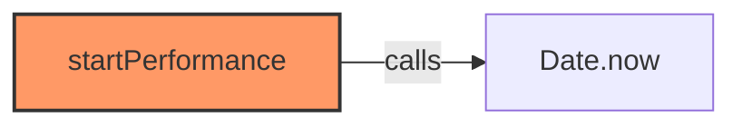

### `endPerformance` (🌐 Public) {#endPerformance}

**Parameters:**

- `component`: `string`
- `message`: `string`
- `startTime`: `number`
- `options`: `{ 
    category?: string, 
    subsystem?: string 
  }`

**Returns:** `void`

**Calls:**

- `Date.now`
- [[logger|logger]]#log

**Call Graph:**

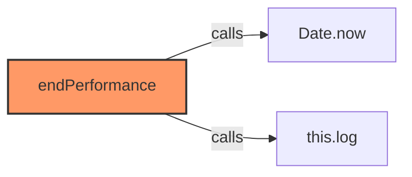

### `resetDebugConfig` (🌐 Public) {#resetDebugConfig}

**Returns:** `void`

**Calls:**

- [[cache|cache]]#clear

**Call Graph:**

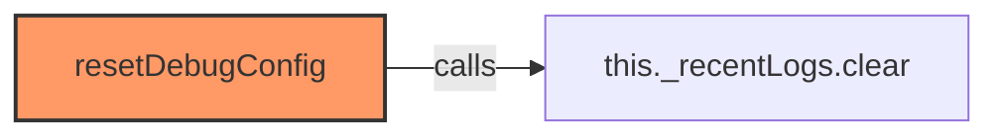

### `setEnabled` (🌐 Public) {#setEnabled}

**Parameters:**

- `category`: `string`
- `enabled`: `boolean`

**Returns:** `void`

**Calls:**

- [[logger|logger]]#setCategoryDebug

**Called By:**

- From [[inventree-card|inventree-card]]:
  - `setConfig`

**Call Graph:**

```mermaid
flowchart LR
    setEnabled[setEnabled]:::current
    this_setCategoryDebug[this.setCategoryDebug]
    setEnabled -->|calls| this_setCategoryDebug
    setConfig[setConfig]
    setConfig -->|calls| setEnabled
    classDef current fill:#f96,stroke:#333,stroke-width:2px;
```

### `getSystemsStatus` (🌐 Public) {#getSystemsStatus}

**Returns:** `Record<string, any>`

### `getSubsystems` (🌐 Public) {#getSubsystems}

**Parameters:**

- `system`: `string`

**Returns:** `string[]`

**Calls:**

- `Object.keys`

**Call Graph:**

```mermaid
flowchart LR
    getSubsystems[getSubsystems]:::current
    Object_keys[Object.keys]
    getSubsystems -->|calls| Object_keys
    classDef current fill:#f96,stroke:#333,stroke-width:2px;
```

### `isCategoryEnabled` (🌐 Public) {#isCategoryEnabled}

**Parameters:**

- `category`: `string`

**Returns:** `boolean`

**Calls:**

- [[logger|logger]]#isEnabled

**Call Graph:**

```mermaid
flowchart LR
    isCategoryEnabled[isCategoryEnabled]:::current
    this_isEnabled[this.isEnabled]
    isCategoryEnabled -->|calls| this_isEnabled
    classDef current fill:#f96,stroke:#333,stroke-width:2px;
```

## Dependencies

```mermaid
flowchart TD
    logger[logger.ts]:::current
    base_layout[base-layout.ts]
    base_layout -->|imports| logger
    variant_handler[variant-handler.ts]
    variant_handler -->|imports| logger
    detail_layout[detail-layout.ts]
    detail_layout -->|imports| logger
    grid_layout[grid-layout.ts]
    grid_layout -->|imports| logger
    part_buttons[part-buttons.ts]
    part_buttons -->|imports| logger
    part_variant[part-variant.ts]
    part_variant -->|imports| logger
    part_view[part-view.ts]
    part_view -->|imports| logger
    parts_layout[parts-layout.ts]
    parts_layout -->|imports| logger
    variant_layout[variant-layout.ts]
    variant_layout -->|imports| logger
    inventree_state[inventree-state.ts]
    inventree_state -->|imports| logger
    editor[editor.ts]
    editor -->|imports| logger
    inventree_card[inventree-card.ts]
    inventree_card -->|imports| logger
    api[api.ts]
    api -->|imports| logger
    cache[cache.ts]
    cache -->|imports| logger
    card_controller[card-controller.ts]
    card_controller -->|imports| logger
    parameter_service[parameter-service.ts]
    parameter_service -->|imports| logger
    rendering_service[rendering-service.ts]
    rendering_service -->|imports| logger
    state[state.ts]
    state -->|imports| logger
    variant_service[variant-service.ts]
    variant_service -->|imports| logger
    websocket_manager[websocket-manager.ts]
    websocket_manager -->|imports| logger
    websocket_plugin[websocket-plugin.ts]
    websocket_plugin -->|imports| logger
    websocket[websocket.ts]
    websocket -->|imports| logger
    classDef current fill:#f96,stroke:#333,stroke-width:2px;
```

