# parameter-service.ts

**Path:** `services/parameter-service.ts`  
**Line Count:** 928  
**Functions:** 45  

## Overview

This file is part of the `services` directory.

## Imports

- custom-card-helpers: HomeAssistant
- [[types|types]]: InventreeItem, ParameterCondition, ParameterAction, ParameterOperator
- [[logger|logger]]: Logger
- [[api|api]]: InvenTreeDirectAPI
- [[inventree-state|inventree-state]]: InventTreeState
- [[types|types]]: InventreeCardConfig

## Exports

- `ParameterService`

## Functions

### Class: ParameterService

### `get` (🌐 Public) {#get}

**Parameters:**

- `key`: `string`

**Returns:** `T | undefined`

**Calls:**

- [[cache|cache]]#get
- `Date.now`
- [[cache|cache]]#delete

**Called By:**

- From [[base-layout|base-layout]]:
  - `_loadData`
  - `_applyParameterFiltering`
- From [[detail-layout|detail-layout]]:
  - `render`
- From [[grid-layout|grid-layout]]:
  - `_getContainerStyle`
  - `_getTextStyle`
  - `render`
- From [[list-layout|list-layout]]:
  - `_renderPartWithSize`
  - `_getContainerStyle`
  - `_getTextStyle`
- From [[part-container|part-container]]:
  - `updated`
- From [[parts-layout|parts-layout]]:
  - `_getContainerStyle`
  - `_getTextStyle`
- From [[variant-layout|variant-layout]]:
  - `_processVariants`
  - `_getContainerStyle`
  - `_getTextStyle`
  - `_renderDropdownView`
  - `_renderTabsView`
  - `_renderListView`
  - `_renderTreeView`
  - `_renderGridView`
- From [[inventree-state|inventree-state]]:
  - `getLastUpdate`
  - `getWebSocketData`
  - `getApiData`
  - `getHassData`
  - `updateParameter`
  - `updateParameterInSource`
  - `_updateParameterCache`
  - `getParameterValue`
  - `findEntityForPart`
  - `findParameterInAllEntities`
  - `storeOrphanedParameter`
  - `getOrphanedPartIds`
  - `getOrphanedPartParameters`
- From [[inventree-card|inventree-card]]:
  - `getConfigElement`
  - `getParts`
- From [[api|api]]:
  - `getLastKnownParameterValue`
- From [[cache|cache]]:
  - `get`
  - `has`
- From [[parameter-service|parameter-service]]:
  - `matchesCondition`
- From [[rendering-service|rendering-service]]:
  - `updateScheduledJob`
  - `getScheduledJob`
- From [[websocket-manager|websocket-manager]]:
  - `getConnection`
  - `addOpenCallback`
  - `addMessageCallback`
  - `removeCallbacks`
  - `closeConnection`
  - `handleOpen`
  - `handleMessage`
  - `_handleBasicMessage`
  - `handleError`
  - `handleClose`
  - `setupKeepAlive`
  - `isConnected`
  - `getStats`
  - `_recordActivity`
  - `getEnhancedStats`
- From [[websocket|websocket]]:
  - `subscribeToEntity`
  - `_subscribeToEntity`
  - `_unsubscribeFromEntity`
- From [[logger|logger]]:
  - `isDuplicate`

**Call Graph:**

```mermaid
flowchart LR
    get[get]:::current
    this__cache_get[this._cache.get]
    get -->|calls| this__cache_get
    Date_now[Date.now]
    get -->|calls| Date_now
    this__cache_delete[this._cache.delete]
    get -->|calls| this__cache_delete
    _loadData[_loadData]
    _loadData -->|calls| get
    _applyParameterFiltering[_applyParameterFiltering]
    _applyParameterFiltering -->|calls| get
    render[render]
    render -->|calls| get
    _getContainerStyle[_getContainerStyle]
    _getContainerStyle -->|calls| get
    _getTextStyle[_getTextStyle]
    _getTextStyle -->|calls| get
    _renderPartWithSize[_renderPartWithSize]
    _renderPartWithSize -->|calls| get
    updated[updated]
    updated -->|calls| get
    _processVariants[_processVariants]
    _processVariants -->|calls| get
    _renderDropdownView[_renderDropdownView]
    _renderDropdownView -->|calls| get
    _renderTabsView[_renderTabsView]
    _renderTabsView -->|calls| get
    _renderListView[_renderListView]
    _renderListView -->|calls| get
    _renderTreeView[_renderTreeView]
    _renderTreeView -->|calls| get
    _renderGridView[_renderGridView]
    _renderGridView -->|calls| get
    getLastUpdate[getLastUpdate]
    getLastUpdate -->|calls| get
    getWebSocketData[getWebSocketData]
    getWebSocketData -->|calls| get
    getApiData[getApiData]
    getApiData -->|calls| get
    getHassData[getHassData]
    getHassData -->|calls| get
    updateParameter[updateParameter]
    updateParameter -->|calls| get
    updateParameterInSource[updateParameterInSource]
    updateParameterInSource -->|calls| get
    _updateParameterCache[_updateParameterCache]
    _updateParameterCache -->|calls| get
    getParameterValue[getParameterValue]
    getParameterValue -->|calls| get
    findEntityForPart[findEntityForPart]
    findEntityForPart -->|calls| get
    findParameterInAllEntities[findParameterInAllEntities]
    findParameterInAllEntities -->|calls| get
    storeOrphanedParameter[storeOrphanedParameter]
    storeOrphanedParameter -->|calls| get
    getOrphanedPartIds[getOrphanedPartIds]
    getOrphanedPartIds -->|calls| get
    getOrphanedPartParameters[getOrphanedPartParameters]
    getOrphanedPartParameters -->|calls| get
    getConfigElement[getConfigElement]
    getConfigElement -->|calls| get
    getParts[getParts]
    getParts -->|calls| get
    getLastKnownParameterValue[getLastKnownParameterValue]
    getLastKnownParameterValue -->|calls| get
    get[get]
    get -->|calls| get
    has[has]
    has -->|calls| get
    matchesCondition[matchesCondition]
    matchesCondition -->|calls| get
    updateScheduledJob[updateScheduledJob]
    updateScheduledJob -->|calls| get
    getScheduledJob[getScheduledJob]
    getScheduledJob -->|calls| get
    getConnection[getConnection]
    getConnection -->|calls| get
    addOpenCallback[addOpenCallback]
    addOpenCallback -->|calls| get
    addMessageCallback[addMessageCallback]
    addMessageCallback -->|calls| get
    removeCallbacks[removeCallbacks]
    removeCallbacks -->|calls| get
    closeConnection[closeConnection]
    closeConnection -->|calls| get
    handleOpen[handleOpen]
    handleOpen -->|calls| get
    handleMessage[handleMessage]
    handleMessage -->|calls| get
    _handleBasicMessage[_handleBasicMessage]
    _handleBasicMessage -->|calls| get
    handleError[handleError]
    handleError -->|calls| get
    handleClose[handleClose]
    handleClose -->|calls| get
    setupKeepAlive[setupKeepAlive]
    setupKeepAlive -->|calls| get
    isConnected[isConnected]
    isConnected -->|calls| get
    getStats[getStats]
    getStats -->|calls| get
    _recordActivity[_recordActivity]
    _recordActivity -->|calls| get
    getEnhancedStats[getEnhancedStats]
    getEnhancedStats -->|calls| get
    subscribeToEntity[subscribeToEntity]
    subscribeToEntity -->|calls| get
    _subscribeToEntity[_subscribeToEntity]
    _subscribeToEntity -->|calls| get
    _unsubscribeFromEntity[_unsubscribeFromEntity]
    _unsubscribeFromEntity -->|calls| get
    isDuplicate[isDuplicate]
    isDuplicate -->|calls| get
    classDef current fill:#f96,stroke:#333,stroke-width:2px;
```

### `set` (🌐 Public) {#set}

**Parameters:**

- `key`: `string`
- `value`: `any`
- `ttl`: `number`

**Returns:** `void`

**Calls:**

- [[cache|cache]]#set
- `Date.now`

**Called By:**

- From [[base-layout|base-layout]]:
  - `_loadData`
  - `_applyParameterFiltering`
- From [[detail-layout|detail-layout]]:
  - `_updateDisplayedStock`
- From [[grid-layout|grid-layout]]:
  - `_updateVisualModifiers`
- From [[list-layout|list-layout]]:
  - `_updateVisualModifiers`
- From [[parts-layout|parts-layout]]:
  - `_updateVisualModifiers`
- From [[variant-layout|variant-layout]]:
  - `_processVariants`
  - `_updateVisualModifiers`
- From [[inventree-state|inventree-state]]:
  - `trackLastUpdate`
  - `setWebSocketData`
  - `setApiData`
  - `setHassData`
  - `updateParameter`
  - `_updateParameterCache`
  - `storeOrphanedParameter`
- From [[inventree-card|inventree-card]]:
  - `subscribe`
  - `debouncedRender`
  - `getParts`
- From [[api|api]]:
  - `updateLastKnownParameterValue`
- From [[cache|cache]]:
  - `set`
- From [[card-controller|card-controller]]:
  - `handleWebSocketMessage`
- From [[parameter-service|parameter-service]]:
  - `matchesCondition`
- From [[rendering-service|rendering-service]]:
  - `setupRendering`
  - `handleWebSocketUpdate`
  - `shouldRender`
  - `addScheduledJob`
- From [[websocket-manager|websocket-manager]]:
  - `getConnection`
  - `addOpenCallback`
  - `addMessageCallback`
  - `handleOpen`
  - `handleError`
  - `handleClose`
  - `setupKeepAlive`
  - `_recordActivity`
- From [[websocket-plugin|websocket-plugin]]:
  - `_handleMessage`
- From [[websocket|websocket]]:
  - `subscribeToEntity`
- From [[logger|logger]]:
  - `isDuplicate`

**Call Graph:**

```mermaid
flowchart LR
    set[set]:::current
    this__cache_set[this._cache.set]
    set -->|calls| this__cache_set
    Date_now[Date.now]
    set -->|calls| Date_now
    _loadData[_loadData]
    _loadData -->|calls| set
    _applyParameterFiltering[_applyParameterFiltering]
    _applyParameterFiltering -->|calls| set
    _updateDisplayedStock[_updateDisplayedStock]
    _updateDisplayedStock -->|calls| set
    _updateVisualModifiers[_updateVisualModifiers]
    _updateVisualModifiers -->|calls| set
    _processVariants[_processVariants]
    _processVariants -->|calls| set
    trackLastUpdate[trackLastUpdate]
    trackLastUpdate -->|calls| set
    setWebSocketData[setWebSocketData]
    setWebSocketData -->|calls| set
    setApiData[setApiData]
    setApiData -->|calls| set
    setHassData[setHassData]
    setHassData -->|calls| set
    updateParameter[updateParameter]
    updateParameter -->|calls| set
    _updateParameterCache[_updateParameterCache]
    _updateParameterCache -->|calls| set
    storeOrphanedParameter[storeOrphanedParameter]
    storeOrphanedParameter -->|calls| set
    subscribe[subscribe]
    subscribe -->|calls| set
    debouncedRender[debouncedRender]
    debouncedRender -->|calls| set
    getParts[getParts]
    getParts -->|calls| set
    updateLastKnownParameterValue[updateLastKnownParameterValue]
    updateLastKnownParameterValue -->|calls| set
    set[set]
    set -->|calls| set
    handleWebSocketMessage[handleWebSocketMessage]
    handleWebSocketMessage -->|calls| set
    matchesCondition[matchesCondition]
    matchesCondition -->|calls| set
    setupRendering[setupRendering]
    setupRendering -->|calls| set
    handleWebSocketUpdate[handleWebSocketUpdate]
    handleWebSocketUpdate -->|calls| set
    shouldRender[shouldRender]
    shouldRender -->|calls| set
    addScheduledJob[addScheduledJob]
    addScheduledJob -->|calls| set
    getConnection[getConnection]
    getConnection -->|calls| set
    addOpenCallback[addOpenCallback]
    addOpenCallback -->|calls| set
    addMessageCallback[addMessageCallback]
    addMessageCallback -->|calls| set
    handleOpen[handleOpen]
    handleOpen -->|calls| set
    handleError[handleError]
    handleError -->|calls| set
    handleClose[handleClose]
    handleClose -->|calls| set
    setupKeepAlive[setupKeepAlive]
    setupKeepAlive -->|calls| set
    _recordActivity[_recordActivity]
    _recordActivity -->|calls| set
    _handleMessage[_handleMessage]
    _handleMessage -->|calls| set
    subscribeToEntity[subscribeToEntity]
    subscribeToEntity -->|calls| set
    isDuplicate[isDuplicate]
    isDuplicate -->|calls| set
    classDef current fill:#f96,stroke:#333,stroke-width:2px;
```

### `clear` (🌐 Public) {#clear}

**Returns:** `void`

**Calls:**

- [[cache|cache]]#clear

**Called By:**

- From [[grid-layout|grid-layout]]:
  - `_handleResetFilters`
- From [[inventree-state|inventree-state]]:
  - `clearCache`
- From [[inventree-card|inventree-card]]:
  - `_clearEntitySubscriptions`
- From [[cache|cache]]:
  - `clear`
- From [[parameter-service|parameter-service]]:
  - `clearCache`
- From [[rendering-service|rendering-service]]:
  - `handleWebSocketUpdate`
- From [[websocket|websocket]]:
  - `_resubscribeAll`
  - `destroy`
- From [[logger|logger]]:
  - `resetDebugConfig`

**Call Graph:**

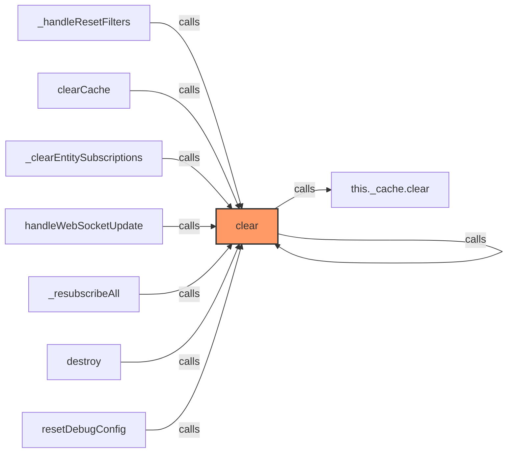

### `getInstance` (🌐 Public) {#getInstance}

**Returns:** `ParameterService`

**Called By:**

- From [[base-layout|base-layout]]:
  - `_safeGetParameterService`
  - `_loadData`
  - `getParts`
  - `updated`
  - `updateFilteredParts`
- From [[variant-handler|variant-handler]]:
  - `processItems`
- From [[detail-layout|detail-layout]]:
  - `_updateVisualModifiers`
- From [[grid-layout|grid-layout]]:
  - `_setupWebSocketConnection`
  - `_cleanupListeners`
  - `_actuallyFilterParts`
  - `_updateVisualModifiers`
  - `render`
- From [[list-layout|list-layout]]:
  - `_updateVisualModifiers`
  - `render`
- From [[parts-layout|parts-layout]]:
  - `loadPartsFromEntities`
  - `_updateVisualModifiers`
- From [[editor|editor]]:
  - `_renderDebuggingSection`
- From [[inventree-card|inventree-card]]:
  - `connectedCallback`
  - `_resetApiFailures`
  - `_initializeServices`
- From [[card-controller|card-controller]]:
  - `setHass`
  - `initializeServices`
  - `loadEntityData`
  - `getParts`
  - `getWebSocketService`
  - `initializeWebSocketPlugin`
  - `handleWebSocketMessage`
  - `getWebSocketDiagnostics`
- From [[parameter-service|parameter-service]]:
  - `getParameterValueFromPart`
  - `isDirectPartReference`
  - `getParameterValueWithDirectReference`
  - `findEntityForPart`
  - `storeOrphanedParameter`
  - `isOrphanedPart`
  - `getOrphanedPartIds`
  - `getOrphanedPartParameters`
  - `findParameterInWebSocketData`
  - `findParameterInApiData`
  - `findParameterInHassData`
  - `findParameterInAllEntities`
  - `syncApiDataToEntityState`
  - `getParameterFromEntity`
- From [[rendering-service|rendering-service]]:
  - `startIdleTimer`
- From [[variant-service|variant-service]]:
  - `processVariants`
- From [[websocket-plugin|websocket-plugin]]:
  - `_handleParameterUpdate`
- From [[websocket|websocket]]:
  - `_updateEntityState`

**Call Graph:**

```mermaid
flowchart LR
    getInstance[getInstance]:::current
    _safeGetParameterService[_safeGetParameterService]
    _safeGetParameterService -->|calls| getInstance
    _loadData[_loadData]
    _loadData -->|calls| getInstance
    getParts[getParts]
    getParts -->|calls| getInstance
    updated[updated]
    updated -->|calls| getInstance
    updateFilteredParts[updateFilteredParts]
    updateFilteredParts -->|calls| getInstance
    processItems[processItems]
    processItems -->|calls| getInstance
    _updateVisualModifiers[_updateVisualModifiers]
    _updateVisualModifiers -->|calls| getInstance
    _setupWebSocketConnection[_setupWebSocketConnection]
    _setupWebSocketConnection -->|calls| getInstance
    _cleanupListeners[_cleanupListeners]
    _cleanupListeners -->|calls| getInstance
    _actuallyFilterParts[_actuallyFilterParts]
    _actuallyFilterParts -->|calls| getInstance
    render[render]
    render -->|calls| getInstance
    loadPartsFromEntities[loadPartsFromEntities]
    loadPartsFromEntities -->|calls| getInstance
    _renderDebuggingSection[_renderDebuggingSection]
    _renderDebuggingSection -->|calls| getInstance
    connectedCallback[connectedCallback]
    connectedCallback -->|calls| getInstance
    _resetApiFailures[_resetApiFailures]
    _resetApiFailures -->|calls| getInstance
    _initializeServices[_initializeServices]
    _initializeServices -->|calls| getInstance
    setHass[setHass]
    setHass -->|calls| getInstance
    initializeServices[initializeServices]
    initializeServices -->|calls| getInstance
    loadEntityData[loadEntityData]
    loadEntityData -->|calls| getInstance
    getWebSocketService[getWebSocketService]
    getWebSocketService -->|calls| getInstance
    initializeWebSocketPlugin[initializeWebSocketPlugin]
    initializeWebSocketPlugin -->|calls| getInstance
    handleWebSocketMessage[handleWebSocketMessage]
    handleWebSocketMessage -->|calls| getInstance
    getWebSocketDiagnostics[getWebSocketDiagnostics]
    getWebSocketDiagnostics -->|calls| getInstance
    getParameterValueFromPart[getParameterValueFromPart]
    getParameterValueFromPart -->|calls| getInstance
    isDirectPartReference[isDirectPartReference]
    isDirectPartReference -->|calls| getInstance
    getParameterValueWithDirectReference[getParameterValueWithDirectReference]
    getParameterValueWithDirectReference -->|calls| getInstance
    findEntityForPart[findEntityForPart]
    findEntityForPart -->|calls| getInstance
    storeOrphanedParameter[storeOrphanedParameter]
    storeOrphanedParameter -->|calls| getInstance
    isOrphanedPart[isOrphanedPart]
    isOrphanedPart -->|calls| getInstance
    getOrphanedPartIds[getOrphanedPartIds]
    getOrphanedPartIds -->|calls| getInstance
    getOrphanedPartParameters[getOrphanedPartParameters]
    getOrphanedPartParameters -->|calls| getInstance
    findParameterInWebSocketData[findParameterInWebSocketData]
    findParameterInWebSocketData -->|calls| getInstance
    findParameterInApiData[findParameterInApiData]
    findParameterInApiData -->|calls| getInstance
    findParameterInHassData[findParameterInHassData]
    findParameterInHassData -->|calls| getInstance
    findParameterInAllEntities[findParameterInAllEntities]
    findParameterInAllEntities -->|calls| getInstance
    syncApiDataToEntityState[syncApiDataToEntityState]
    syncApiDataToEntityState -->|calls| getInstance
    getParameterFromEntity[getParameterFromEntity]
    getParameterFromEntity -->|calls| getInstance
    startIdleTimer[startIdleTimer]
    startIdleTimer -->|calls| getInstance
    processVariants[processVariants]
    processVariants -->|calls| getInstance
    _handleParameterUpdate[_handleParameterUpdate]
    _handleParameterUpdate -->|calls| getInstance
    _updateEntityState[_updateEntityState]
    _updateEntityState -->|calls| getInstance
    classDef current fill:#f96,stroke:#333,stroke-width:2px;
```

### `initialize` (🌐 Public) {#initialize}

**Parameters:**

- `hass`: `HomeAssistant`

**Returns:** `ParameterService`

### `hasInstance` (🌐 Public) {#hasInstance}

**Returns:** `boolean`

**Called By:**

- From [[base-layout|base-layout]]:
  - `_safeGetParameterService`
- From [[card-controller|card-controller]]:
  - `initializeServices`
- From [[websocket-plugin|websocket-plugin]]:
  - `_handleParameterUpdate`

**Call Graph:**

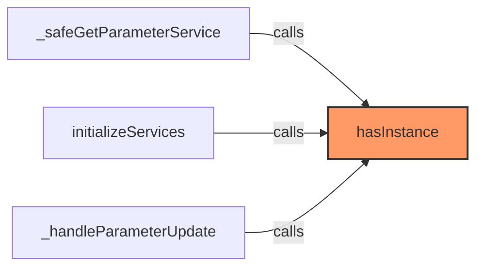

### `matchesConditionSyncVersion` (🌐 Public) {#matchesConditionSyncVersion}

**Parameters:**

- `part`: `InventreeItem`
- `condition`: `ParameterCondition`

**Returns:** `boolean`

**Calls:**

- [[inventree-state|inventree-state]]#getParameterValueFromPart
- [[parameter-service|parameter-service]]#checkValueMatch
- [[logger|logger]]#error

**Called By:**

- From [[base-layout|base-layout]]:
  - `_applyParameterFiltering`
  - `_applyParameterFilteringSync`
- From [[parameter-service|parameter-service]]:
  - `processConditions`
  - `shouldShowPart`

**Call Graph:**

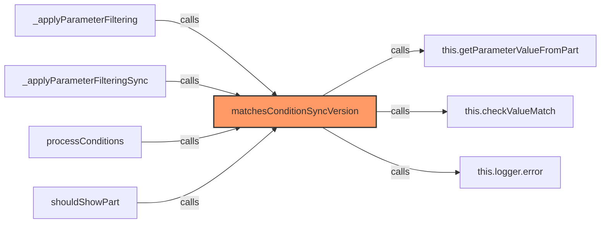

### `processConditions` (🌐 Public) {#processConditions}

**Parameters:**

- `part`: `InventreeItem`
- `conditions`: `ParameterCondition[]`

**Returns:** `VisualModifiers`

**Calls:**

- [[parameter-service|parameter-service]]#matchesConditionSyncVersion
- [[parameter-service|parameter-service]]#applyAction

**Called By:**

- From [[detail-layout|detail-layout]]:
  - `_updateVisualModifiers`
- From [[grid-layout|grid-layout]]:
  - `_updateVisualModifiers`
- From [[list-layout|list-layout]]:
  - `_updateVisualModifiers`
- From [[parts-layout|parts-layout]]:
  - `_updateVisualModifiers`
- From [[variant-layout|variant-layout]]:
  - `_updateVisualModifiers`

**Call Graph:**

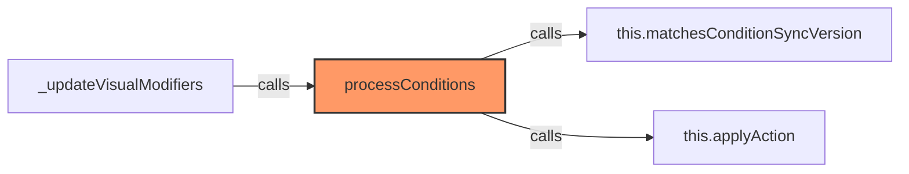

### `matchesCondition` (🌐 Public) {#matchesCondition}

**Parameters:**

- `part`: `InventreeItem`
- `condition`: `ParameterCondition`

**Returns:** `Promise<boolean>`

**Calls:**

- [[cache|cache]]#get
- [[inventree-state|inventree-state]]#isDirectPartReference
- [[inventree-state|inventree-state]]#getParameterValueWithDirectReference
- [[inventree-state|inventree-state]]#getParameterValueFromPart
- [[parameter-service|parameter-service]]#checkValueMatch
- [[cache|cache]]#set
- [[logger|logger]]#error

**Called By:**

- From [[base-layout|base-layout]]:
  - `updateFilteredParts`
- From [[parameter-service|parameter-service]]:
  - `checkCondition`

**Call Graph:**

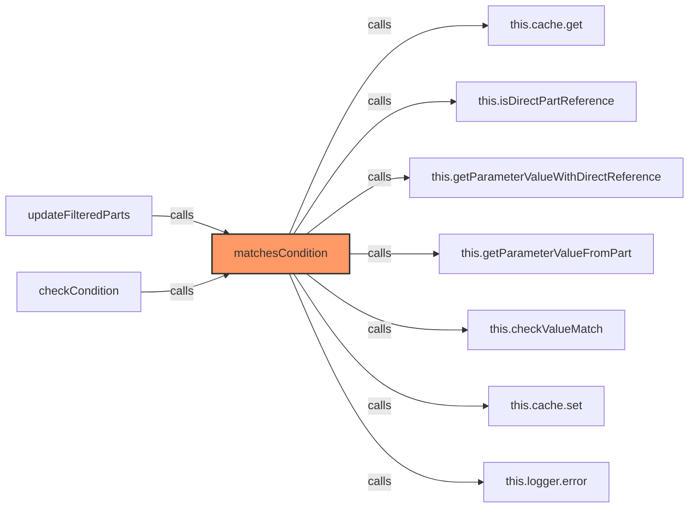

### `checkValueMatch` (🌐 Public) {#checkValueMatch}

**Parameters:**

- `value`: `string | null`
- `condition`: `ParameterCondition`

**Returns:** `boolean`

**Calls:**

- [[parameter-service|parameter-service]]#compareValues

**Called By:**

- From [[base-layout|base-layout]]:
  - `updateFilteredParts`
- From [[parameter-service|parameter-service]]:
  - `matchesConditionSyncVersion`
  - `matchesCondition`

**Call Graph:**

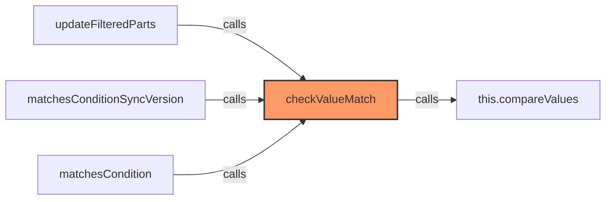

### `compareValues` (🌐 Public) {#compareValues}

**Parameters:**

- `value`: `string | null`
- `expectedValue`: `string`
- `operator`: `ParameterOperator`
- `verbose`: `boolean`

**Returns:** `boolean`

**Calls:**

- `String(value).toLowerCase`
- `String`
- `expectedValue.toLowerCase`
- [[logger|logger]]#log
- `valueStr.includes`
- `Number`
- [[logger|logger]]#warn

**Called By:**

- From [[base-layout|base-layout]]:
  - `_applyParameterFiltering`
- From [[parameter-service|parameter-service]]:
  - `checkValueMatch`

**Call Graph:**

```mermaid
flowchart LR
    compareValues[compareValues]:::current
    String_value__toLowerCase[String(value).toLowerCase]
    compareValues -->|calls| String_value__toLowerCase
    String[String]
    compareValues -->|calls| String
    expectedValue_toLowerCase[expectedValue.toLowerCase]
    compareValues -->|calls| expectedValue_toLowerCase
    this_logger_log[this.logger.log]
    compareValues -->|calls| this_logger_log
    valueStr_includes[valueStr.includes]
    compareValues -->|calls| valueStr_includes
    Number[Number]
    compareValues -->|calls| Number
    this_logger_warn[this.logger.warn]
    compareValues -->|calls| this_logger_warn
    _applyParameterFiltering[_applyParameterFiltering]
    _applyParameterFiltering -->|calls| compareValues
    checkValueMatch[checkValueMatch]
    checkValueMatch -->|calls| compareValues
    classDef current fill:#f96,stroke:#333,stroke-width:2px;
```

### `applyAction` (🌐 Public) {#applyAction}

**Parameters:**

- `modifiers`: `VisualModifiers`
- `action`: `ParameterAction | string | undefined`
- `value`: `string | undefined`

**Returns:** `void`

**Calls:**

- [[logger|logger]]#warn

**Called By:**

- From [[parameter-service|parameter-service]]:
  - `processConditions`

**Call Graph:**

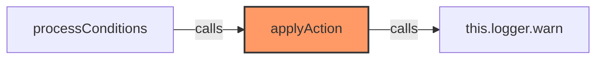

### `getActionButtons` (🌐 Public) {#getActionButtons}

**Parameters:**

- `part`: `string`
- `parameter`: `string`
- `actions`: `ParameterAction[]`

**Returns:** `ParameterAction[]`

**Calls:**

- `actions.filter`

**Called By:**

- From [[detail-layout|detail-layout]]:
  - `_updateVisualModifiers`
- From [[grid-layout|grid-layout]]:
  - `_updateVisualModifiers`
- From [[list-layout|list-layout]]:
  - `_updateVisualModifiers`
- From [[parts-layout|parts-layout]]:
  - `_updateVisualModifiers`
- From [[variant-layout|variant-layout]]:
  - `_updateVisualModifiers`
- From [[state|state]]:
  - `getActionButtons`

**Call Graph:**

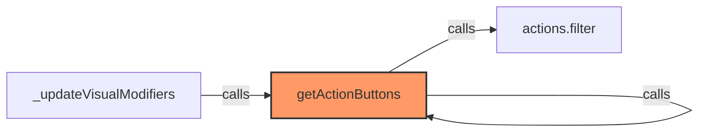

### `shouldShowPart` (🌐 Public) {#shouldShowPart}

**Parameters:**

- `part`: `InventreeItem`

**Returns:** `boolean`

**Calls:**

- `conditions.filter`
- `filterConditions.filter`
- [[parameter-service|parameter-service]]#matchesConditionSyncVersion

**Call Graph:**

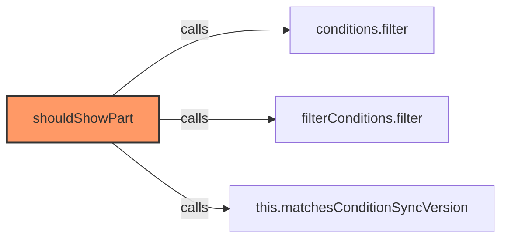

### `compareFilterValues` (🌐 Public) {#compareFilterValues}

**Parameters:**

- `value`: `any`
- `filterValue`: `string`
- `operator`: `string`

**Returns:** `boolean`

**Calls:**

- `String(value).toLowerCase`
- `String`
- `filterValue.toLowerCase`
- `valueStr.includes`
- `Number`

**Call Graph:**

```mermaid
flowchart LR
    compareFilterValues[compareFilterValues]:::current
    String_value__toLowerCase[String(value).toLowerCase]
    compareFilterValues -->|calls| String_value__toLowerCase
    String[String]
    compareFilterValues -->|calls| String
    filterValue_toLowerCase[filterValue.toLowerCase]
    compareFilterValues -->|calls| filterValue_toLowerCase
    valueStr_includes[valueStr.includes]
    compareFilterValues -->|calls| valueStr_includes
    Number[Number]
    compareFilterValues -->|calls| Number
    classDef current fill:#f96,stroke:#333,stroke-width:2px;
```

### `diagnosticDump` (🌐 Public) {#diagnosticDump}

**Returns:** `void`

**Calls:**

- [[logger|logger]]#log

**Call Graph:**

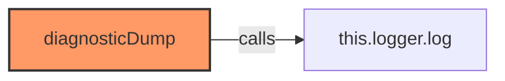

### `clearCache` (🌐 Public) {#clearCache}

**Returns:** `void`

**Calls:**

- [[cache|cache]]#clear
- [[logger|logger]]#log

**Call Graph:**

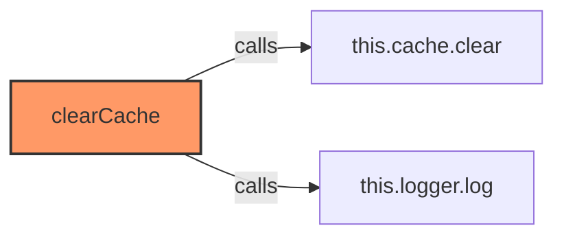

### `markParameterChanged` (🌐 Public) {#markParameterChanged}

**Parameters:**

- `entityId`: `string`
- `paramName`: `string`

**Returns:** `void`

**Calls:**

- `ParameterService.recentlyChangedParameters.add`
- `setTimeout`
- [[cache|cache]]#delete

**Called By:**

- From [[parameter-service|parameter-service]]:
  - `syncApiDataToEntityState`
- From [[websocket-plugin|websocket-plugin]]:
  - `_handleParameterUpdate`

**Call Graph:**

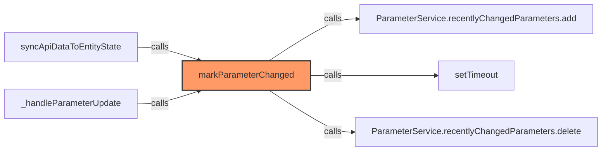

### `wasRecentlyChanged` (🌐 Public) {#wasRecentlyChanged}

**Parameters:**

- `entityId`: `string`
- `paramName`: `string`

**Returns:** `boolean`

**Calls:**

- [[cache|cache]]#has

**Call Graph:**

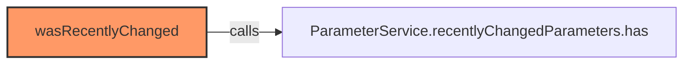

### `getParameterValueFromPart` (🌐 Public) {#getParameterValueFromPart}

**Parameters:**

- `part`: `InventreeItem`
- `paramName`: `string`

**Returns:** `string | null`

**Calls:**

- [[inventree-state|inventree-state]]#getInstance
- [[inventree-state|inventree-state]]#getParameterValueFromPart

**Called By:**

- From [[parts-layout|parts-layout]]:
  - `matchesParameterFilter`
- From [[inventree-state|inventree-state]]:
  - `getParameterValueWithDirectReference`
  - `findParameterInWebSocketData`
  - `findParameterInApiData`
  - `findParameterInHassData`
- From [[parameter-service|parameter-service]]:
  - `matchesConditionSyncVersion`
  - `matchesCondition`
  - `getParameterFromEntity`

**Call Graph:**

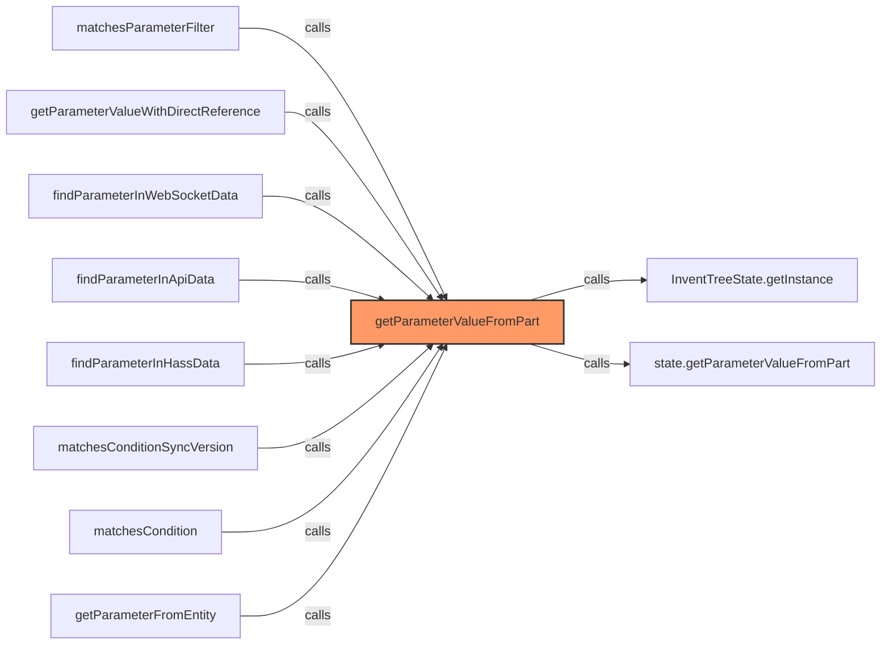

### `isDirectPartReference` (🌐 Public) {#isDirectPartReference}

**Parameters:**

- `reference`: `string`

**Returns:** `boolean`

**Calls:**

- [[inventree-state|inventree-state]]#getInstance
- [[inventree-state|inventree-state]]#isDirectPartReference

**Called By:**

- From [[base-layout|base-layout]]:
  - `_applyParameterFiltering`
  - `updateFilteredParts`
- From [[inventree-state|inventree-state]]:
  - `getParameterValueWithDirectReference`
- From [[card-controller|card-controller]]:
  - `handleWebSocketMessage`
- From [[parameter-service|parameter-service]]:
  - `matchesCondition`

**Call Graph:**

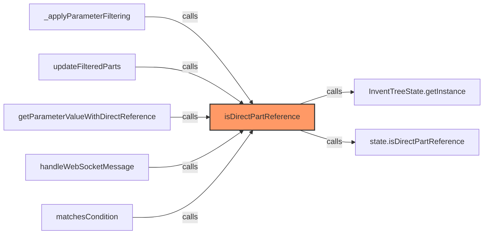

### `getParameterValueWithDirectReference` (🌐 Public) {#getParameterValueWithDirectReference}

**Parameters:**

- `reference`: `string`

**Returns:** `Promise<string | null>`

**Calls:**

- [[inventree-state|inventree-state]]#getInstance
- [[inventree-state|inventree-state]]#getParameterValueWithDirectReference

**Called By:**

- From [[base-layout|base-layout]]:
  - `_applyParameterFiltering`
  - `updateFilteredParts`
- From [[card-controller|card-controller]]:
  - `handleWebSocketMessage`
- From [[parameter-service|parameter-service]]:
  - `matchesCondition`

**Call Graph:**

```mermaid
flowchart LR
    getParameterValueWithDirectReference[getParameterValueWithDirectReference]:::current
    InventTreeState_getInstance[InventTreeState.getInstance]
    getParameterValueWithDirectReference -->|calls| InventTreeState_getInstance
    state_getParameterValueWithDirectReference[state.getParameterValueWithDirectReference]
    getParameterValueWithDirectReference -->|calls| state_getParameterValueWithDirectReference
    _applyParameterFiltering[_applyParameterFiltering]
    _applyParameterFiltering -->|calls| getParameterValueWithDirectReference
    updateFilteredParts[updateFilteredParts]
    updateFilteredParts -->|calls| getParameterValueWithDirectReference
    handleWebSocketMessage[handleWebSocketMessage]
    handleWebSocketMessage -->|calls| getParameterValueWithDirectReference
    matchesCondition[matchesCondition]
    matchesCondition -->|calls| getParameterValueWithDirectReference
    classDef current fill:#f96,stroke:#333,stroke-width:2px;
```

### `findEntityForPart` (🌐 Public) {#findEntityForPart}

**Parameters:**

- `partId`: `number`

**Returns:** `string | null`

**Calls:**

- [[inventree-state|inventree-state]]#getInstance
- [[inventree-state|inventree-state]]#findEntityForPart

**Called By:**

- From [[grid-layout|grid-layout]]:
  - `_handleWebSocketMessage`
- From [[inventree-state|inventree-state]]:
  - `findParameterInAllEntities`
  - `isOrphanedPart`
- From [[inventree-card|inventree-card]]:
  - `_testSpecificParameter`
- From [[parameter-service|parameter-service]]:
  - `syncApiDataToEntityState`
- From [[state|state]]:
  - `findEntityForPart`
- From [[websocket-plugin|websocket-plugin]]:
  - `_handleParameterUpdate`

**Call Graph:**

```mermaid
flowchart LR
    findEntityForPart[findEntityForPart]:::current
    InventTreeState_getInstance[InventTreeState.getInstance]
    findEntityForPart -->|calls| InventTreeState_getInstance
    state_findEntityForPart[state.findEntityForPart]
    findEntityForPart -->|calls| state_findEntityForPart
    _handleWebSocketMessage[_handleWebSocketMessage]
    _handleWebSocketMessage -->|calls| findEntityForPart
    findParameterInAllEntities[findParameterInAllEntities]
    findParameterInAllEntities -->|calls| findEntityForPart
    isOrphanedPart[isOrphanedPart]
    isOrphanedPart -->|calls| findEntityForPart
    _testSpecificParameter[_testSpecificParameter]
    _testSpecificParameter -->|calls| findEntityForPart
    syncApiDataToEntityState[syncApiDataToEntityState]
    syncApiDataToEntityState -->|calls| findEntityForPart
    findEntityForPart[findEntityForPart]
    findEntityForPart -->|calls| findEntityForPart
    _handleParameterUpdate[_handleParameterUpdate]
    _handleParameterUpdate -->|calls| findEntityForPart
    classDef current fill:#f96,stroke:#333,stroke-width:2px;
```

### `storeOrphanedParameter` (🌐 Public) {#storeOrphanedParameter}

**Parameters:**

- `partId`: `number`
- `paramName`: `string`
- `value`: `string`

**Returns:** `void`

**Calls:**

- [[inventree-state|inventree-state]]#getInstance
- [[inventree-state|inventree-state]]#storeOrphanedParameter

**Called By:**

- From [[card-controller|card-controller]]:
  - `handleWebSocketMessage`
- From [[parameter-service|parameter-service]]:
  - `updateParameter`
  - `syncApiDataToEntityState`

**Call Graph:**

```mermaid
flowchart LR
    storeOrphanedParameter[storeOrphanedParameter]:::current
    InventTreeState_getInstance[InventTreeState.getInstance]
    storeOrphanedParameter -->|calls| InventTreeState_getInstance
    state_storeOrphanedParameter[state.storeOrphanedParameter]
    storeOrphanedParameter -->|calls| state_storeOrphanedParameter
    handleWebSocketMessage[handleWebSocketMessage]
    handleWebSocketMessage -->|calls| storeOrphanedParameter
    updateParameter[updateParameter]
    updateParameter -->|calls| storeOrphanedParameter
    syncApiDataToEntityState[syncApiDataToEntityState]
    syncApiDataToEntityState -->|calls| storeOrphanedParameter
    classDef current fill:#f96,stroke:#333,stroke-width:2px;
```

### `isOrphanedPart` (🌐 Public) {#isOrphanedPart}

**Parameters:**

- `partId`: `number`

**Returns:** `boolean`

**Calls:**

- [[inventree-state|inventree-state]]#getInstance
- [[inventree-state|inventree-state]]#isOrphanedPart

**Call Graph:**

```mermaid
flowchart LR
    isOrphanedPart[isOrphanedPart]:::current
    InventTreeState_getInstance[InventTreeState.getInstance]
    isOrphanedPart -->|calls| InventTreeState_getInstance
    state_isOrphanedPart[state.isOrphanedPart]
    isOrphanedPart -->|calls| state_isOrphanedPart
    classDef current fill:#f96,stroke:#333,stroke-width:2px;
```

### `getOrphanedPartIds` (🌐 Public) {#getOrphanedPartIds}

**Returns:** `number[]`

**Calls:**

- [[inventree-state|inventree-state]]#getInstance
- [[inventree-state|inventree-state]]#getOrphanedPartIds

**Call Graph:**

```mermaid
flowchart LR
    getOrphanedPartIds[getOrphanedPartIds]:::current
    InventTreeState_getInstance[InventTreeState.getInstance]
    getOrphanedPartIds -->|calls| InventTreeState_getInstance
    state_getOrphanedPartIds[state.getOrphanedPartIds]
    getOrphanedPartIds -->|calls| state_getOrphanedPartIds
    classDef current fill:#f96,stroke:#333,stroke-width:2px;
```

### `getOrphanedPartParameters` (🌐 Public) {#getOrphanedPartParameters}

**Parameters:**

- `partId`: `number`

**Returns:** `Record<string, string> | null`

**Calls:**

- [[inventree-state|inventree-state]]#getInstance
- [[inventree-state|inventree-state]]#getOrphanedPartParameters

**Call Graph:**

```mermaid
flowchart LR
    getOrphanedPartParameters[getOrphanedPartParameters]:::current
    InventTreeState_getInstance[InventTreeState.getInstance]
    getOrphanedPartParameters -->|calls| InventTreeState_getInstance
    state_getOrphanedPartParameters[state.getOrphanedPartParameters]
    getOrphanedPartParameters -->|calls| state_getOrphanedPartParameters
    classDef current fill:#f96,stroke:#333,stroke-width:2px;
```

### `findParameterInWebSocketData` (🌐 Public) {#findParameterInWebSocketData}

**Parameters:**

- `partId`: `number`
- `parameterName`: `string`

**Returns:** `string | null`

**Calls:**

- [[inventree-state|inventree-state]]#getInstance
- [[inventree-state|inventree-state]]#findParameterInWebSocketData

**Called By:**

- From [[inventree-state|inventree-state]]:
  - `findParameterInAllEntities`

**Call Graph:**

```mermaid
flowchart LR
    findParameterInWebSocketData[findParameterInWebSocketData]:::current
    InventTreeState_getInstance[InventTreeState.getInstance]
    findParameterInWebSocketData -->|calls| InventTreeState_getInstance
    state_findParameterInWebSocketData[state.findParameterInWebSocketData]
    findParameterInWebSocketData -->|calls| state_findParameterInWebSocketData
    findParameterInAllEntities[findParameterInAllEntities]
    findParameterInAllEntities -->|calls| findParameterInWebSocketData
    classDef current fill:#f96,stroke:#333,stroke-width:2px;
```

### `findParameterInApiData` (🌐 Public) {#findParameterInApiData}

**Parameters:**

- `partId`: `number`
- `parameterName`: `string`

**Returns:** `string | null`

**Calls:**

- [[inventree-state|inventree-state]]#getInstance
- [[inventree-state|inventree-state]]#findParameterInApiData

**Called By:**

- From [[inventree-state|inventree-state]]:
  - `findParameterInAllEntities`

**Call Graph:**

```mermaid
flowchart LR
    findParameterInApiData[findParameterInApiData]:::current
    InventTreeState_getInstance[InventTreeState.getInstance]
    findParameterInApiData -->|calls| InventTreeState_getInstance
    state_findParameterInApiData[state.findParameterInApiData]
    findParameterInApiData -->|calls| state_findParameterInApiData
    findParameterInAllEntities[findParameterInAllEntities]
    findParameterInAllEntities -->|calls| findParameterInApiData
    classDef current fill:#f96,stroke:#333,stroke-width:2px;
```

### `findParameterInHassData` (🌐 Public) {#findParameterInHassData}

**Parameters:**

- `partId`: `number`
- `parameterName`: `string`

**Returns:** `string | null`

**Calls:**

- [[inventree-state|inventree-state]]#getInstance
- [[inventree-state|inventree-state]]#findParameterInHassData

**Called By:**

- From [[inventree-state|inventree-state]]:
  - `findParameterInAllEntities`

**Call Graph:**

```mermaid
flowchart LR
    findParameterInHassData[findParameterInHassData]:::current
    InventTreeState_getInstance[InventTreeState.getInstance]
    findParameterInHassData -->|calls| InventTreeState_getInstance
    state_findParameterInHassData[state.findParameterInHassData]
    findParameterInHassData -->|calls| state_findParameterInHassData
    findParameterInAllEntities[findParameterInAllEntities]
    findParameterInAllEntities -->|calls| findParameterInHassData
    classDef current fill:#f96,stroke:#333,stroke-width:2px;
```

### `findParameterInAllEntities` (🌐 Public) {#findParameterInAllEntities}

**Parameters:**

- `partId`: `number`
- `parameterName`: `string`

**Returns:** `Promise<string | null>`

**Calls:**

- [[inventree-state|inventree-state]]#getInstance
- [[inventree-state|inventree-state]]#findParameterInAllEntities

**Call Graph:**

```mermaid
flowchart LR
    findParameterInAllEntities[findParameterInAllEntities]:::current
    InventTreeState_getInstance[InventTreeState.getInstance]
    findParameterInAllEntities -->|calls| InventTreeState_getInstance
    state_findParameterInAllEntities[state.findParameterInAllEntities]
    findParameterInAllEntities -->|calls| state_findParameterInAllEntities
    classDef current fill:#f96,stroke:#333,stroke-width:2px;
```

### `updateHass` (🌐 Public) {#updateHass}

**Parameters:**

- `hass`: `HomeAssistant`

**Returns:** `void`

**Called By:**

- From [[base-layout|base-layout]]:
  - `_scheduleParameterServiceRetry`
  - `updated`
- From [[grid-layout|grid-layout]]:
  - `updated`
- From [[variant-layout|variant-layout]]:
  - `updated`
- From [[card-controller|card-controller]]:
  - `initializeServices`

**Call Graph:**

```mermaid
flowchart LR
    updateHass[updateHass]:::current
    _scheduleParameterServiceRetry[_scheduleParameterServiceRetry]
    _scheduleParameterServiceRetry -->|calls| updateHass
    updated[updated]
    updated -->|calls| updateHass
    initializeServices[initializeServices]
    initializeServices -->|calls| updateHass
    classDef current fill:#f96,stroke:#333,stroke-width:2px;
```

### `isApiConnected` (🌐 Public) {#isApiConnected}

**Returns:** `boolean`

**Calls:**

- [[api|api]]#isApiConnected

**Called By:**

- From [[inventree-card|inventree-card]]:
  - `_renderDiagnosticTools`
- From [[card-controller|card-controller]]:
  - `handleWebSocketMessage`
- From [[parameter-service|parameter-service]]:
  - `updateParameter`
  - `fetchParameterData`

**Call Graph:**

```mermaid
flowchart LR
    isApiConnected[isApiConnected]:::current
    this_directApi_isApiConnected[this.directApi.isApiConnected]
    isApiConnected -->|calls| this_directApi_isApiConnected
    _renderDiagnosticTools[_renderDiagnosticTools]
    _renderDiagnosticTools -->|calls| isApiConnected
    handleWebSocketMessage[handleWebSocketMessage]
    handleWebSocketMessage -->|calls| isApiConnected
    updateParameter[updateParameter]
    updateParameter -->|calls| isApiConnected
    fetchParameterData[fetchParameterData]
    fetchParameterData -->|calls| isApiConnected
    classDef current fill:#f96,stroke:#333,stroke-width:2px;
```

### `setDirectApi` (🌐 Public) {#setDirectApi}

**Parameters:**

- `apiInstance`: `InvenTreeDirectAPI | null`

**Returns:** `void`

**Called By:**

- From [[inventree-card|inventree-card]]:
  - `connectedCallback`
- From [[card-controller|card-controller]]:
  - `initializeApi`

**Call Graph:**

```mermaid
flowchart LR
    setDirectApi[setDirectApi]:::current
    connectedCallback[connectedCallback]
    connectedCallback -->|calls| setDirectApi
    initializeApi[initializeApi]
    initializeApi -->|calls| setDirectApi
    classDef current fill:#f96,stroke:#333,stroke-width:2px;
```

### `getApiStats` (🌐 Public) {#getApiStats}

**Returns:** `{ apiCalls: number, fallbackCalls: number }`

**Calls:**

- [[api|api]]#getApiStats

**Call Graph:**

```mermaid
flowchart LR
    getApiStats[getApiStats]:::current
    this_directApi_getApiStats[this.directApi.getApiStats]
    getApiStats -->|calls| this_directApi_getApiStats
    classDef current fill:#f96,stroke:#333,stroke-width:2px;
```

### `updateParameter` (🌐 Public) {#updateParameter}

**Parameters:**

- `part`: `InventreeItem`
- `paramName`: `string`
- `value`: `string`

**Returns:** `Promise<boolean>`

**Calls:**

- [[logger|logger]]#error
- [[logger|logger]]#log
- [[api|api]]#isApiConnected
- [[inventree-state|inventree-state]]#updateParameter
- [[inventree-state|inventree-state]]#storeOrphanedParameter

**Called By:**

- From [[inventree-card|inventree-card]]:
  - `_handleStockAdjustment`
  - `updateParameterWithImmediateRefresh`
- From [[card-controller|card-controller]]:
  - `handleWebSocketMessage`
- From [[parameter-service|parameter-service]]:
  - `syncApiDataToEntityState`
- From [[websocket-plugin|websocket-plugin]]:
  - `_handleParameterUpdate`

**Call Graph:**

```mermaid
flowchart LR
    updateParameter[updateParameter]:::current
    this_logger_error[this.logger.error]
    updateParameter -->|calls| this_logger_error
    this_logger_log[this.logger.log]
    updateParameter -->|calls| this_logger_log
    this_isApiConnected[this.isApiConnected]
    updateParameter -->|calls| this_isApiConnected
    this_directApi_updateParameter[this.directApi.updateParameter]
    updateParameter -->|calls| this_directApi_updateParameter
    this_storeOrphanedParameter[this.storeOrphanedParameter]
    updateParameter -->|calls| this_storeOrphanedParameter
    _handleStockAdjustment[_handleStockAdjustment]
    _handleStockAdjustment -->|calls| updateParameter
    updateParameterWithImmediateRefresh[updateParameterWithImmediateRefresh]
    updateParameterWithImmediateRefresh -->|calls| updateParameter
    handleWebSocketMessage[handleWebSocketMessage]
    handleWebSocketMessage -->|calls| updateParameter
    syncApiDataToEntityState[syncApiDataToEntityState]
    syncApiDataToEntityState -->|calls| updateParameter
    _handleParameterUpdate[_handleParameterUpdate]
    _handleParameterUpdate -->|calls| updateParameter
    classDef current fill:#f96,stroke:#333,stroke-width:2px;
```

### `fetchParameterData` (🌐 Public) {#fetchParameterData}

**Parameters:**

- `partId`: `number`
- `parameterName`: `string`

**Returns:** `Promise<void>`

**Calls:**

- [[logger|logger]]#error
- [[logger|logger]]#log
- [[api|api]]#isApiConnected
- [[api|api]]#fetchParameterData
- [[logger|logger]]#warn

**Called By:**

- From [[inventree-card|inventree-card]]:
  - `refreshParameterData`
  - `_fetchAllParameters`

**Call Graph:**

```mermaid
flowchart LR
    fetchParameterData[fetchParameterData]:::current
    this_logger_error[this.logger.error]
    fetchParameterData -->|calls| this_logger_error
    this_logger_log[this.logger.log]
    fetchParameterData -->|calls| this_logger_log
    this_isApiConnected[this.isApiConnected]
    fetchParameterData -->|calls| this_isApiConnected
    this_directApi_fetchParameterData[this.directApi.fetchParameterData]
    fetchParameterData -->|calls| this_directApi_fetchParameterData
    this_logger_warn[this.logger.warn]
    fetchParameterData -->|calls| this_logger_warn
    refreshParameterData[refreshParameterData]
    refreshParameterData -->|calls| fetchParameterData
    _fetchAllParameters[_fetchAllParameters]
    _fetchAllParameters -->|calls| fetchParameterData
    classDef current fill:#f96,stroke:#333,stroke-width:2px;
```

### `syncApiDataToEntityState` (🌐 Public) {#syncApiDataToEntityState}

**Parameters:**

- `partId`: `number`
- `paramName`: `string`
- `value`: `string`

**Returns:** `void`

**Calls:**

- [[logger|logger]]#warn
- [[inventree-state|inventree-state]]#findEntityForPart
- [[logger|logger]]#log
- [[inventree-state|inventree-state]]#getInstance
- [[inventree-state|inventree-state]]#updateParameter
- [[parameter-service|parameter-service]]#markParameterChanged
- [[inventree-state|inventree-state]]#storeOrphanedParameter

**Called By:**

- From [[api|api]]:
  - `getParameterValue`
  - `updateParameter`

**Call Graph:**

```mermaid
flowchart LR
    syncApiDataToEntityState[syncApiDataToEntityState]:::current
    this_logger_warn[this.logger.warn]
    syncApiDataToEntityState -->|calls| this_logger_warn
    this_findEntityForPart[this.findEntityForPart]
    syncApiDataToEntityState -->|calls| this_findEntityForPart
    this_logger_log[this.logger.log]
    syncApiDataToEntityState -->|calls| this_logger_log
    InventTreeState_getInstance[InventTreeState.getInstance]
    syncApiDataToEntityState -->|calls| InventTreeState_getInstance
    state_updateParameter[state.updateParameter]
    syncApiDataToEntityState -->|calls| state_updateParameter
    ParameterService_markParameterChanged[ParameterService.markParameterChanged]
    syncApiDataToEntityState -->|calls| ParameterService_markParameterChanged
    this_storeOrphanedParameter[this.storeOrphanedParameter]
    syncApiDataToEntityState -->|calls| this_storeOrphanedParameter
    getParameterValue[getParameterValue]
    getParameterValue -->|calls| syncApiDataToEntityState
    updateParameter[updateParameter]
    updateParameter -->|calls| syncApiDataToEntityState
    classDef current fill:#f96,stroke:#333,stroke-width:2px;
```

### `getParameterFromEntity` (🌐 Public) {#getParameterFromEntity}

**Parameters:**

- `entityId`: `string`
- `paramName`: `string`

**Returns:** `Promise<string | null>`

**Calls:**

- [[logger|logger]]#warn
- [[inventree-state|inventree-state]]#getInstance
- [[inventree-state|inventree-state]]#getNewestData
- [[inventree-state|inventree-state]]#getParameterValueFromPart

**Call Graph:**

```mermaid
flowchart LR
    getParameterFromEntity[getParameterFromEntity]:::current
    this_logger_warn[this.logger.warn]
    getParameterFromEntity -->|calls| this_logger_warn
    InventTreeState_getInstance[InventTreeState.getInstance]
    getParameterFromEntity -->|calls| InventTreeState_getInstance
    state_getNewestData[state.getNewestData]
    getParameterFromEntity -->|calls| state_getNewestData
    this_getParameterValueFromPart[this.getParameterValueFromPart]
    getParameterFromEntity -->|calls| this_getParameterValueFromPart
    classDef current fill:#f96,stroke:#333,stroke-width:2px;
```

### `setConfig` (🌐 Public) {#setConfig}

**Parameters:**

- `config`: `InventreeCardConfig | null`

**Returns:** `void`

**Called By:**

- From [[inventree-card|inventree-card]]:
  - `setConfig`
  - `updated`
- From [[card-controller|card-controller]]:
  - `initializeServices`

**Call Graph:**

```mermaid
flowchart LR
    setConfig[setConfig]:::current
    setConfig[setConfig]
    setConfig -->|calls| setConfig
    updated[updated]
    updated -->|calls| setConfig
    initializeServices[initializeServices]
    initializeServices -->|calls| setConfig
    classDef current fill:#f96,stroke:#333,stroke-width:2px;
```

### `setStrictWebSocketMode` (🌐 Public) {#setStrictWebSocketMode}

**Parameters:**

- `enabled`: `boolean`

**Returns:** `void`

**Calls:**

- [[logger|logger]]#log

**Called By:**

- From [[grid-layout|grid-layout]]:
  - `_setupWebSocketConnection`
  - `updated`
- From [[inventree-card|inventree-card]]:
  - `connectedCallback`
- From [[card-controller|card-controller]]:
  - `initializeApi`

**Call Graph:**

```mermaid
flowchart LR
    setStrictWebSocketMode[setStrictWebSocketMode]:::current
    this_logger_log[this.logger.log]
    setStrictWebSocketMode -->|calls| this_logger_log
    _setupWebSocketConnection[_setupWebSocketConnection]
    _setupWebSocketConnection -->|calls| setStrictWebSocketMode
    updated[updated]
    updated -->|calls| setStrictWebSocketMode
    connectedCallback[connectedCallback]
    connectedCallback -->|calls| setStrictWebSocketMode
    initializeApi[initializeApi]
    initializeApi -->|calls| setStrictWebSocketMode
    classDef current fill:#f96,stroke:#333,stroke-width:2px;
```

### `markAsWebSocketCall` (🌐 Public) {#markAsWebSocketCall}

**Returns:** `void`

**Called By:**

- From [[grid-layout|grid-layout]]:
  - `_handleWebSocketMessage`
  - `_actuallyFilterParts`
  - `_updateVisualModifiers`

**Call Graph:**

```mermaid
flowchart LR
    markAsWebSocketCall[markAsWebSocketCall]:::current
    _handleWebSocketMessage[_handleWebSocketMessage]
    _handleWebSocketMessage -->|calls| markAsWebSocketCall
    _actuallyFilterParts[_actuallyFilterParts]
    _actuallyFilterParts -->|calls| markAsWebSocketCall
    _updateVisualModifiers[_updateVisualModifiers]
    _updateVisualModifiers -->|calls| markAsWebSocketCall
    classDef current fill:#f96,stroke:#333,stroke-width:2px;
```

### `clearWebSocketCallMark` (🌐 Public) {#clearWebSocketCallMark}

**Returns:** `void`

**Called By:**

- From [[grid-layout|grid-layout]]:
  - `_handleWebSocketMessage`
  - `_actuallyFilterParts`
  - `_updateVisualModifiers`

**Call Graph:**

```mermaid
flowchart LR
    clearWebSocketCallMark[clearWebSocketCallMark]:::current
    _handleWebSocketMessage[_handleWebSocketMessage]
    _handleWebSocketMessage -->|calls| clearWebSocketCallMark
    _actuallyFilterParts[_actuallyFilterParts]
    _actuallyFilterParts -->|calls| clearWebSocketCallMark
    _updateVisualModifiers[_updateVisualModifiers]
    _updateVisualModifiers -->|calls| clearWebSocketCallMark
    classDef current fill:#f96,stroke:#333,stroke-width:2px;
```

### `isWebSocketCall` (🌐 Public) {#isWebSocketCall}

**Returns:** `boolean`

### `checkCondition` (🌐 Public) {#checkCondition}

**Parameters:**

- `condition`: `ParameterCondition`
- `part`: `any`

**Returns:** `Promise<boolean>`

**Calls:**

- [[parameter-service|parameter-service]]#matchesCondition

**Called By:**

- From [[grid-layout|grid-layout]]:
  - `_actuallyFilterParts`

**Call Graph:**

```mermaid
flowchart LR
    checkCondition[checkCondition]:::current
    this_matchesCondition[this.matchesCondition]
    checkCondition -->|calls| this_matchesCondition
    _actuallyFilterParts[_actuallyFilterParts]
    _actuallyFilterParts -->|calls| checkCondition
    classDef current fill:#f96,stroke:#333,stroke-width:2px;
```

## Dependencies

```mermaid
flowchart TD
    parameter-service[parameter-service.ts]:::current
    types[types.ts]
    parameter-service -->|imports| types
    logger[logger.ts]
    parameter-service -->|imports| logger
    api[api.ts]
    parameter-service -->|imports| api
    inventree_state[inventree-state.ts]
    parameter-service -->|imports| inventree_state
    types[types.ts]
    parameter-service -->|imports| types
    base_layout[base-layout.ts]
    base_layout -->|imports| parameter-service
    detail_layout[detail-layout.ts]
    detail_layout -->|imports| parameter-service
    grid_layout[grid-layout.ts]
    grid_layout -->|imports| parameter-service
    parts_layout[parts-layout.ts]
    parts_layout -->|imports| parameter-service
    variant_layout[variant-layout.ts]
    variant_layout -->|imports| parameter-service
    inventree_card[inventree-card.ts]
    inventree_card -->|imports| parameter-service
    card_controller[card-controller.ts]
    card_controller -->|imports| parameter-service
    state[state.ts]
    state -->|imports| parameter-service
    websocket_plugin[websocket-plugin.ts]
    websocket_plugin -->|imports| parameter-service
    classDef current fill:#f96,stroke:#333,stroke-width:2px;
```

