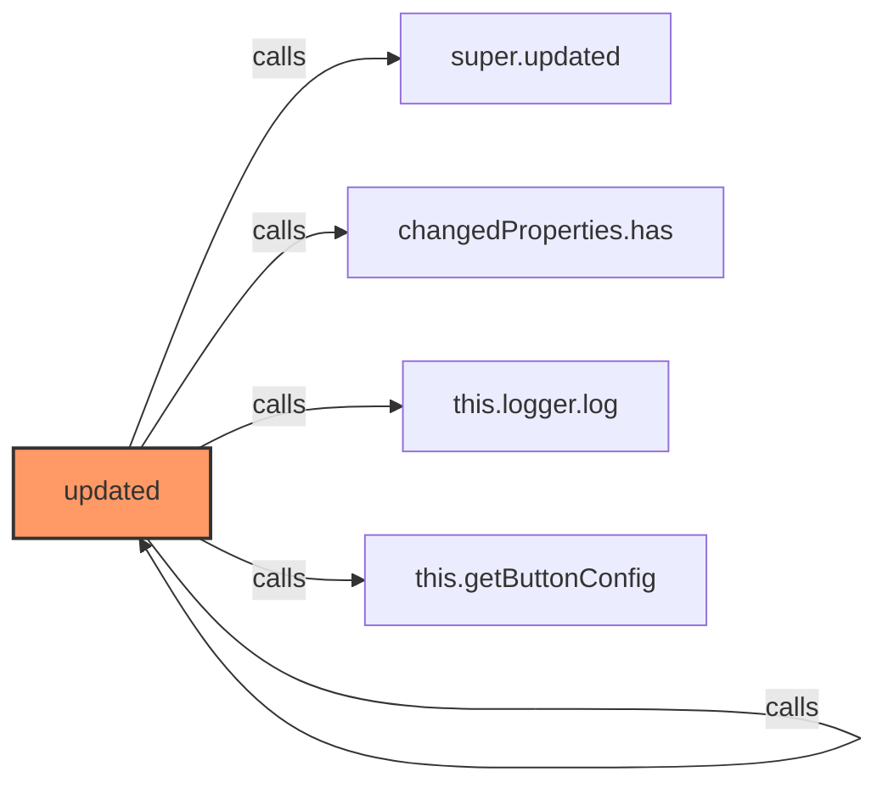
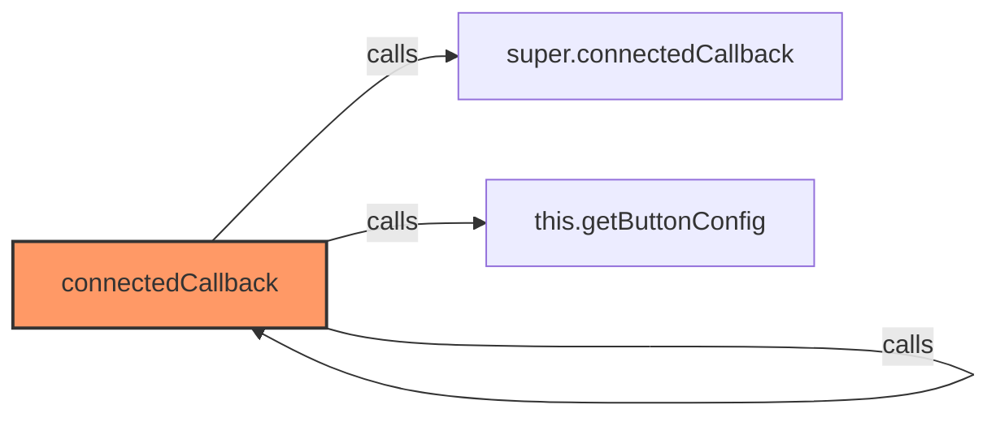
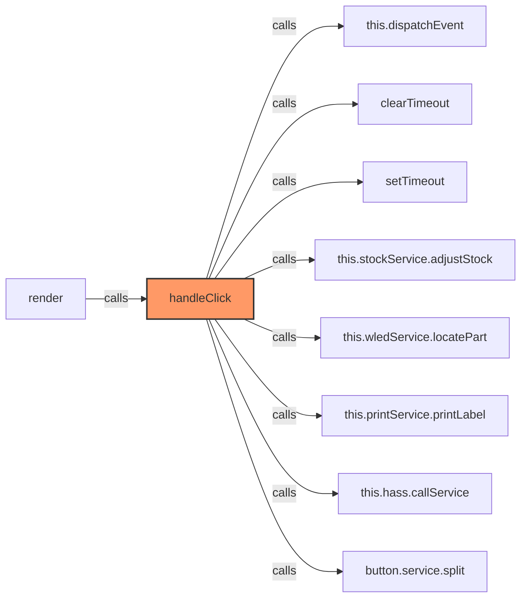
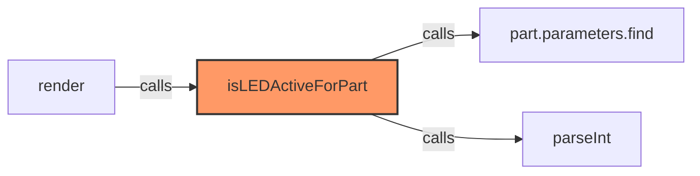
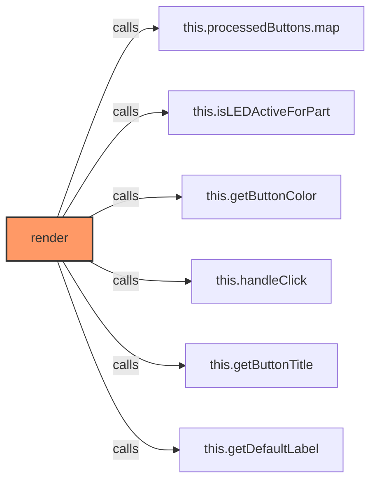
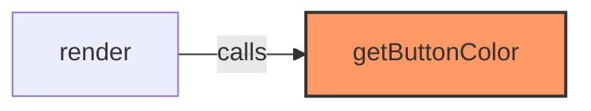
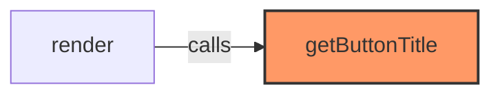
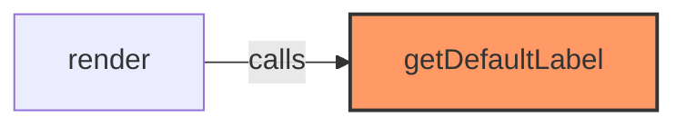
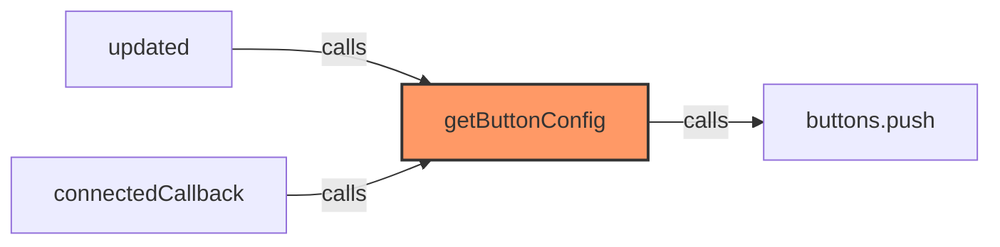
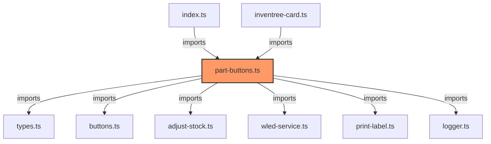

# part-buttons.ts

**Path:** `components/part/part-buttons.ts`  
**Line Count:** 351  
**Functions:** 9  

## Overview

This file is part of the `components/part` directory.

## Imports

- lit: LitElement, html, css
- lit/decorators.js: customElement, property, state
- lit: PropertyValues
- custom-card-helpers: HomeAssistant
- [[types|types]]: ButtonConfig, InvenTreePart, InventreeCardConfig
- [[buttons|buttons]]: buttonStyles
- [[adjust-stock|adjust-stock]]: StockService
- [[wled-service|wled-service]]: WLEDService
- [[print-label|print-label]]: PrintService
- [[logger|logger]]: Logger

## Exports

- `InvenTreePartButtons`

## Functions

### Class: InvenTreePartButtons

### `updated` (🌐 Public) {#updated}

**Parameters:**

- `changedProperties`: `PropertyValues`

**Returns:** `void`

**Calls:**

- [[base-layout|base-layout]]#updated
- [[cache|cache]]#has
- [[logger|logger]]#log
- [[grid-layout|grid-layout]]#getButtonConfig

**Called By:**

- From [[base-layout|base-layout]]:
  - `updated`
- From [[detail-layout|detail-layout]]:
  - `updated`
- From [[grid-layout|grid-layout]]:
  - `updated`
- From [[list-layout|list-layout]]:
  - `updated`
- From [[part-container|part-container]]:
  - `updated`
- From [[part-view|part-view]]:
  - `updated`
- From [[parts-layout|parts-layout]]:
  - `updated`
- From [[variant-layout|variant-layout]]:
  - `updated`
- From [[inventree-card|inventree-card]]:
  - `updated`

**Call Graph:**

### `connectedCallback` (🌐 Public) {#connectedCallback}

**Returns:** `void`

**Calls:**

- [[base-layout|base-layout]]#connectedCallback
- [[grid-layout|grid-layout]]#getButtonConfig

**Called By:**

- From [[base-layout|base-layout]]:
  - `connectedCallback`
- From [[grid-layout|grid-layout]]:
  - `connectedCallback`
- From [[variant-layout|variant-layout]]:
  - `connectedCallback`
- From [[inventree-card|inventree-card]]:
  - `connectedCallback`

**Call Graph:**

### `handleClick` (🌐 Public) {#handleClick}

**Parameters:**

- `button`: `ButtonConfig`

**Returns:** `void`

**Calls:**

- `this.dispatchEvent`
- `clearTimeout`
- `setTimeout`
- [[adjust-stock|adjust-stock]]#adjustStock
- [[wled-service|wled-service]]#locatePart
- [[print-label|print-label]]#printLabel
- `this.hass.callService`
- `button.service.split`

**Called By:**

- From [[part-buttons|part-buttons]]:
  - `render`

**Call Graph:**

### `isLEDActiveForPart` (🌐 Public) {#isLEDActiveForPart}

**Returns:** `boolean`

**Calls:**

- `part.parameters.find`
- `parseInt`

**Called By:**

- From [[part-buttons|part-buttons]]:
  - `render`

**Call Graph:**

### `render` (🌐 Public) {#render}

**Returns:** `void`

**Calls:**

- `this.processedButtons.map`
- [[part-buttons|part-buttons]]#isLEDActiveForPart
- [[part-buttons|part-buttons]]#getButtonColor
- [[part-buttons|part-buttons]]#handleClick
- [[part-buttons|part-buttons]]#getButtonTitle
- [[part-buttons|part-buttons]]#getDefaultLabel

**Call Graph:**

### `getButtonColor` (🌐 Public) {#getButtonColor}

**Parameters:**

- `type`: `string`
- `isActive`: `boolean`

**Returns:** `string`

**Called By:**

- From [[part-buttons|part-buttons]]:
  - `render`

**Call Graph:**

### `getButtonTitle` (🌐 Public) {#getButtonTitle}

**Parameters:**

- `button`: `ButtonConfig`

**Returns:** `string`

**Called By:**

- From [[part-buttons|part-buttons]]:
  - `render`

**Call Graph:**

### `getDefaultLabel` (🌐 Public) {#getDefaultLabel}

**Parameters:**

- `button`: `ButtonConfig`

**Returns:** `string`

**Called By:**

- From [[part-buttons|part-buttons]]:
  - `render`

**Call Graph:**

### `getButtonConfig` (🌐 Public) {#getButtonConfig}

**Returns:** `void`

**Calls:**

- `buttons.push`

**Called By:**

- From [[part-buttons|part-buttons]]:
  - `updated`
  - `connectedCallback`

**Call Graph:**

## Dependencies

