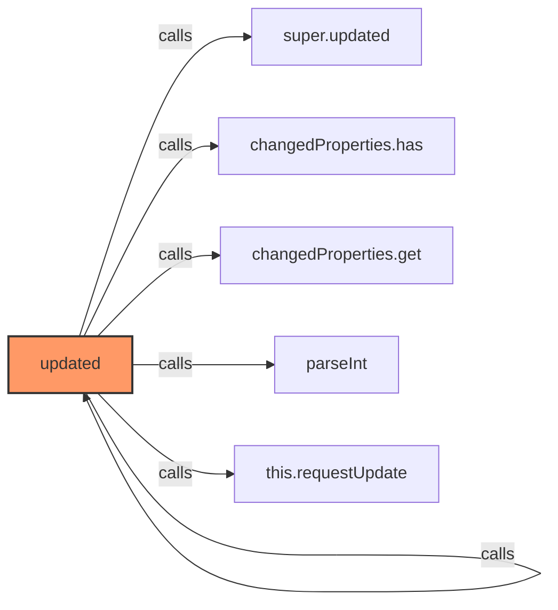
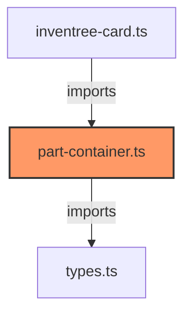

# part-container.ts

**Path:** `components/part/part-container.ts`  
**Line Count:** 238  
**Functions:** 3  

## Overview

This file is part of the `components/part` directory.

## Imports

- lit: LitElement, html, css
- lit/decorators.js: customElement, property
- lit: PropertyValues
- custom-card-helpers: HomeAssistant
- [[types|types]]: InventreeCardConfig, ViewType, InventreeItem

## Exports

- `InvenTreePartContainer`

## Functions

### Class: InvenTreePartContainer

### `updated` (🌐 Public) {#updated}

**Parameters:**

- `changedProperties`: `PropertyValues`

**Returns:** `void`

**Calls:**

- [[base-layout|base-layout]]#updated
- [[cache|cache]]#has
- [[cache|cache]]#get
- `parseInt`
- [[base-layout|base-layout]]#requestUpdate

**Called By:**

- From [[base-layout|base-layout]]:
  - `updated`
- From [[detail-layout|detail-layout]]:
  - `updated`
- From [[grid-layout|grid-layout]]:
  - `updated`
- From [[list-layout|list-layout]]:
  - `updated`
- From [[part-buttons|part-buttons]]:
  - `updated`
- From [[part-view|part-view]]:
  - `updated`
- From [[parts-layout|parts-layout]]:
  - `updated`
- From [[variant-layout|variant-layout]]:
  - `updated`
- From [[inventree-card|inventree-card]]:
  - `updated`

**Call Graph:**

### `render` (🌐 Public) {#render}

**Returns:** `void`

### `_handleImageError` (🔒 Private) {#_handleImageError}

**Parameters:**

- `e`: `Event`

**Returns:** `void`

## Dependencies

