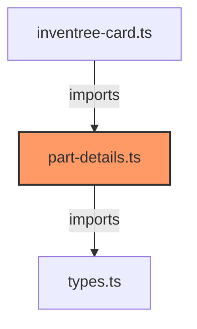

# part-details.ts

**Path:** `components/part/part-details.ts`  
**Line Count:** 96  
**Functions:** 1  

## Overview

This file is part of the `components/part` directory.

## Imports

- lit: LitElement, html, css
- lit/decorators.js: customElement, property
- [[types|types]]: InventreeItem, InventreeCardConfig

## Exports

- `InvenTreePartDetails`

## Functions

### Class: InvenTreePartDetails

### `render` (🌐 Public) {#render}

**Returns:** `void`

**Calls:**

- `this.partData.parameters.map`

**Call Graph:**

## Dependencies

