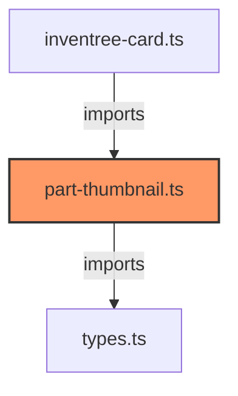

# part-thumbnail.ts

**Path:** `components/part/part-thumbnail.ts`  
**Line Count:** 84  
**Functions:** 1  

## Overview

This file is part of the `components/part` directory.

## Imports

- lit: LitElement, html, css
- lit/decorators.js: customElement, property
- [[types|types]]: InventreeItem, InventreeCardConfig

## Exports

- `InvenTreePartThumbnail`

## Functions

### Class: InvenTreePartThumbnail

### `render` (🌐 Public) {#render}

**Returns:** `void`

**Calls:**

- `this.partData.name.substring(0, 2).toUpperCase`
- `this.partData.name.substring`

**Call Graph:**

```mermaid
flowchart LR
    render[render]:::current
    this_partData_name_substring_0__2__toUpperCase[this.partData.name.substring(0, 2).toUpperCase]
    render -->|calls| this_partData_name_substring_0__2__toUpperCase
    this_partData_name_substring[this.partData.name.substring]
    render -->|calls| this_partData_name_substring
    classDef current fill:#f96,stroke:#333,stroke-width:2px;
```

## Dependencies



