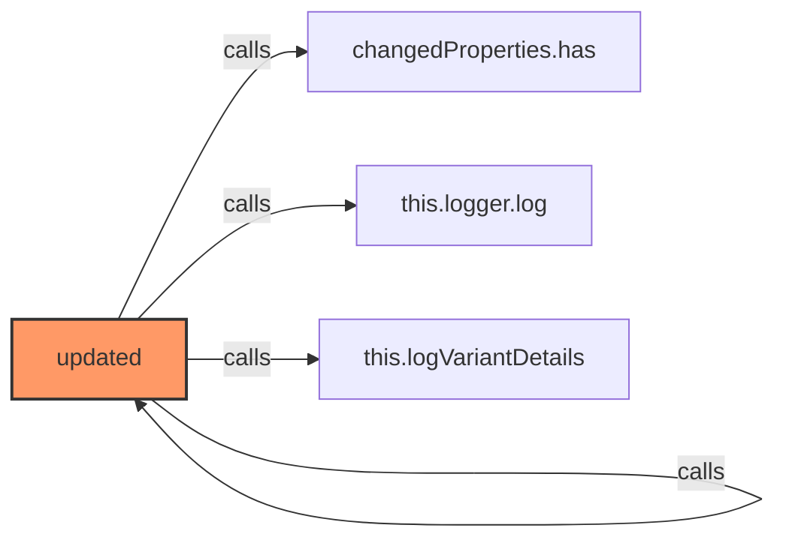
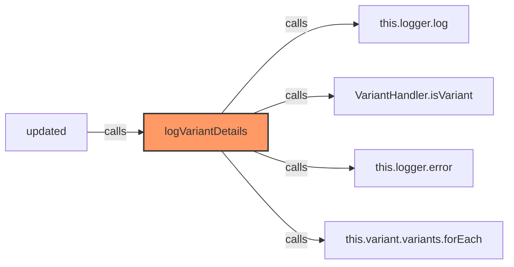
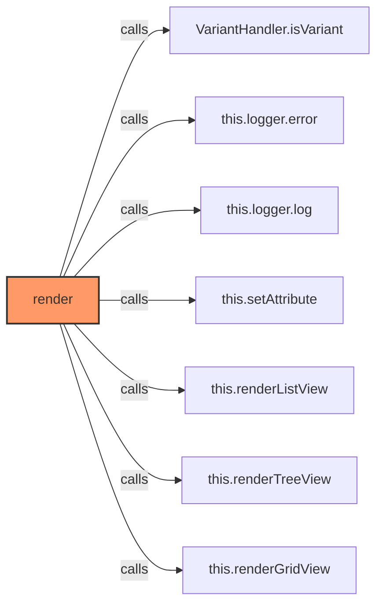
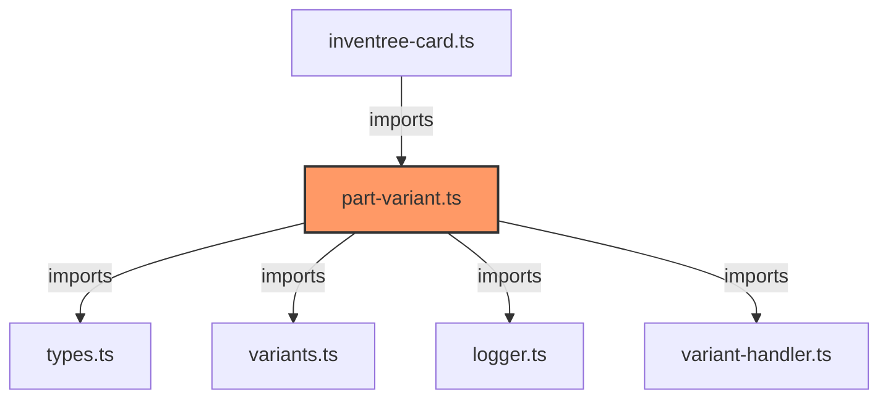

# part-variant.ts

**Path:** `components/part/part-variant.ts`  
**Line Count:** 227  
**Functions:** 6  

## Overview

This file is part of the `components/part` directory.

## Imports

- lit: LitElement, html
- lit/decorators.js: customElement, property
- custom-card-helpers: HomeAssistant
- [[types|types]]: InventreeCardConfig, ProcessedVariant, InventreeItem
- [[variants|variants]]: variantStyles
- [[logger|logger]]: Logger
- [[variant-handler|variant-handler]]: VariantHandler

## Exports

- `InvenTreePartVariant`

## Functions

### Class: InvenTreePartVariant

### `updated` (🌐 Public) {#updated}

**Parameters:**

- `changedProperties`: `Map<string, any>`

**Returns:** `void`

**Calls:**

- [[cache|cache]]#has
- [[logger|logger]]#log
- [[part-variant|part-variant]]#logVariantDetails

**Called By:**

- From [[base-layout|base-layout]]:
  - `updated`
- From [[detail-layout|detail-layout]]:
  - `updated`
- From [[grid-layout|grid-layout]]:
  - `updated`
- From [[list-layout|list-layout]]:
  - `updated`
- From [[part-buttons|part-buttons]]:
  - `updated`
- From [[part-container|part-container]]:
  - `updated`
- From [[part-view|part-view]]:
  - `updated`
- From [[parts-layout|parts-layout]]:
  - `updated`
- From [[variant-layout|variant-layout]]:
  - `updated`
- From [[inventree-card|inventree-card]]:
  - `updated`

**Call Graph:**

### `logVariantDetails` (🌐 Public) {#logVariantDetails}

**Returns:** `void`

**Calls:**

- [[logger|logger]]#log
- [[variant-handler|variant-handler]]#isVariant
- [[logger|logger]]#error
- `this.variant.variants.forEach`

**Called By:**

- From [[part-variant|part-variant]]:
  - `updated`

**Call Graph:**

### `render` (🌐 Public) {#render}

**Returns:** `void`

**Calls:**

- [[variant-handler|variant-handler]]#isVariant
- [[logger|logger]]#error
- [[logger|logger]]#log
- `this.setAttribute`
- [[part-variant|part-variant]]#renderListView
- [[part-variant|part-variant]]#renderTreeView
- [[part-variant|part-variant]]#renderGridView

**Call Graph:**

### `renderGridView` (🌐 Public) {#renderGridView}

**Returns:** `void`

**Calls:**

- `this.variant.variants.map`

**Called By:**

- From [[part-variant|part-variant]]:
  - `render`

**Call Graph:**

### `renderListView` (🌐 Public) {#renderListView}

**Returns:** `void`

**Calls:**

- `this.variant.variants.map`

**Called By:**

- From [[part-variant|part-variant]]:
  - `render`

**Call Graph:**

### `renderTreeView` (🌐 Public) {#renderTreeView}

**Returns:** `void`

**Calls:**

- `this.variant.variants.map`

**Called By:**

- From [[part-variant|part-variant]]:
  - `render`

**Call Graph:**

## Dependencies

