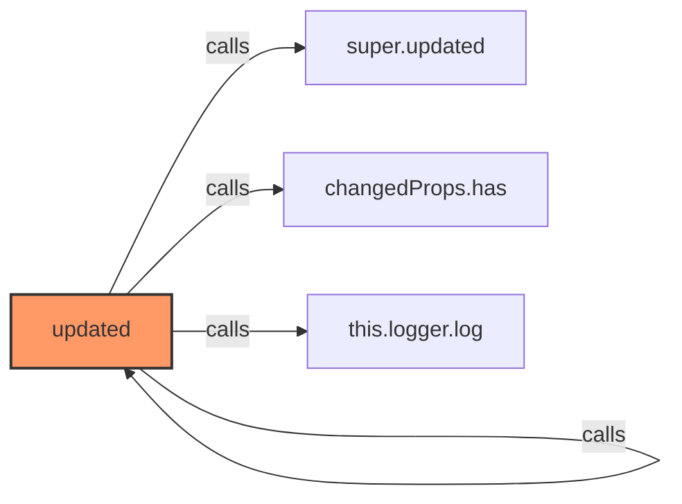
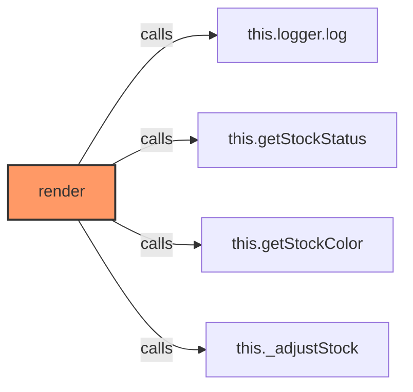
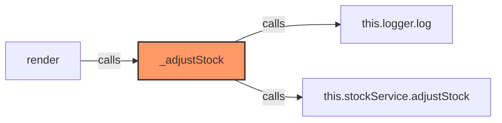
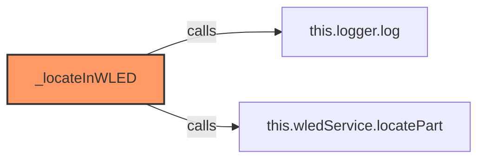
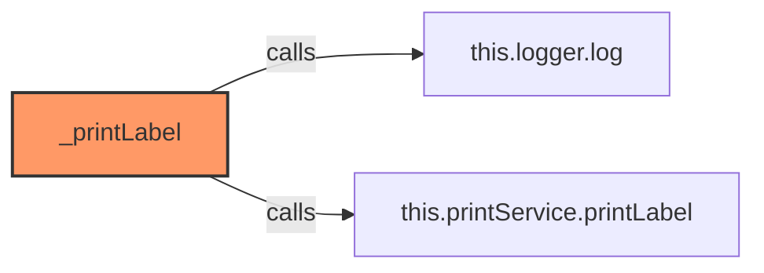
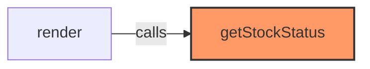
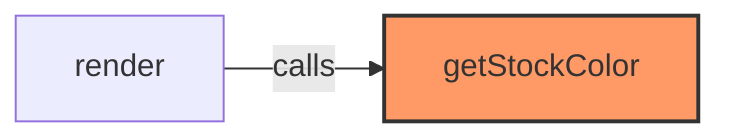
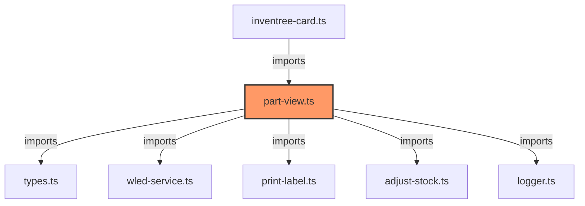

# part-view.ts

**Path:** `components/part/part-view.ts`  
**Line Count:** 272  
**Functions:** 7  

## Overview

This file is part of the `components/part` directory.

## Imports

- lit: LitElement, html, css
- lit/decorators.js: customElement, property
- custom-card-helpers: HomeAssistant
- [[types|types]]: InventreeItem, InventreeCardConfig
- [[wled-service|wled-service]]: WLEDService
- [[print-label|print-label]]: PrintService
- [[adjust-stock|adjust-stock]]: StockService
- [[logger|logger]]: Logger

## Exports

- `InvenTreePartView`

## Functions

### Class: InvenTreePartView

### `updated` (🌐 Public) {#updated}

**Parameters:**

- `changedProps`: `Map<string, unknown>`

**Returns:** `void`

**Calls:**

- [[base-layout|base-layout]]#updated
- [[cache|cache]]#has
- [[logger|logger]]#log

**Called By:**

- From [[base-layout|base-layout]]:
  - `updated`
- From [[detail-layout|detail-layout]]:
  - `updated`
- From [[grid-layout|grid-layout]]:
  - `updated`
- From [[list-layout|list-layout]]:
  - `updated`
- From [[part-buttons|part-buttons]]:
  - `updated`
- From [[part-container|part-container]]:
  - `updated`
- From [[parts-layout|parts-layout]]:
  - `updated`
- From [[variant-layout|variant-layout]]:
  - `updated`
- From [[inventree-card|inventree-card]]:
  - `updated`

**Call Graph:**

### `render` (🌐 Public) {#render}

**Returns:** `void`

**Calls:**

- [[logger|logger]]#log
- [[part-view|part-view]]#getStockStatus
- [[part-view|part-view]]#getStockColor
- [[part-view|part-view]]#_adjustStock

**Call Graph:**

### `_adjustStock` (🔒 Private) {#_adjustStock}

**Parameters:**

- `amount`: `number`

**Returns:** `void`

**Calls:**

- [[logger|logger]]#log
- [[adjust-stock|adjust-stock]]#adjustStock

**Called By:**

- From [[part-view|part-view]]:
  - `render`

**Call Graph:**

### `_locateInWLED` (🔒 Private) {#_locateInWLED}

**Returns:** `void`

**Calls:**

- [[logger|logger]]#log
- [[wled-service|wled-service]]#locatePart

**Call Graph:**

### `_printLabel` (🔒 Private) {#_printLabel}

**Returns:** `void`

**Calls:**

- [[logger|logger]]#log
- [[print-label|print-label]]#printLabel

**Call Graph:**

### `getStockStatus` (🌐 Public) {#getStockStatus}

**Returns:** `'none' | 'low' | 'good'`

**Called By:**

- From [[part-view|part-view]]:
  - `render`

**Call Graph:**

### `getStockColor` (🌐 Public) {#getStockColor}

**Parameters:**

- `status`: `'none' | 'low' | 'good'`

**Returns:** `string`

**Called By:**

- From [[part-view|part-view]]:
  - `render`

**Call Graph:**

## Dependencies

