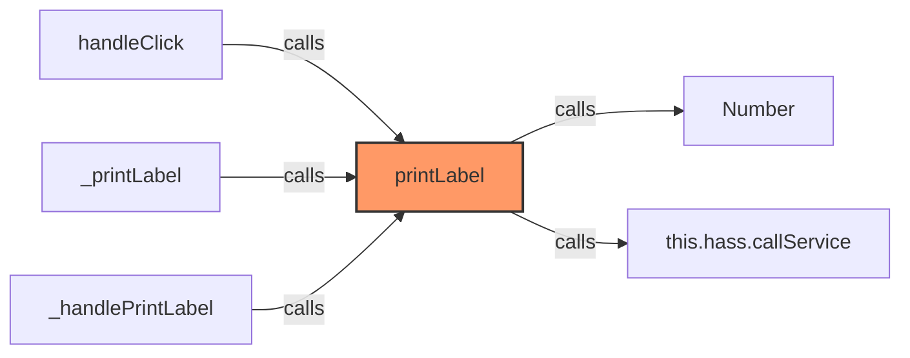
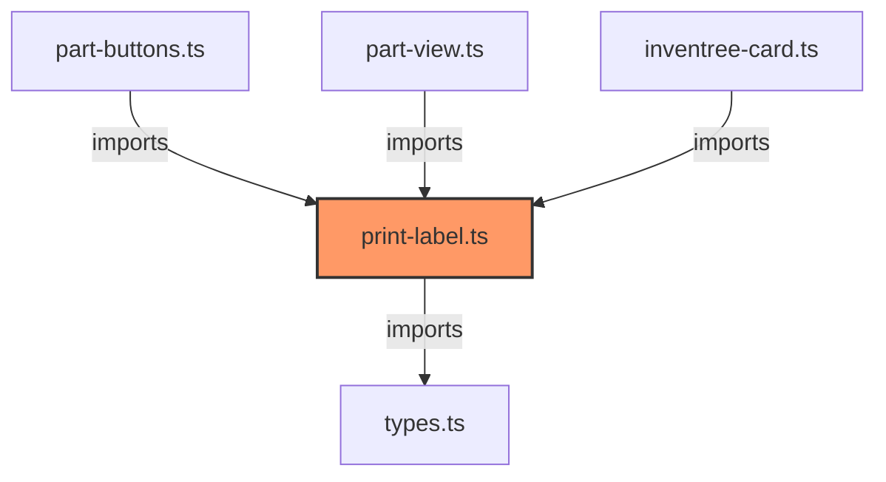

# print-label.ts

**Path:** `services/print-label.ts`  
**Line Count:** 48  
**Functions:** 1  

## Overview

This file is part of the `services` directory.

## Imports

- custom-card-helpers: HomeAssistant, forwardHaptic
- [[types|types]]: InvenTreePart, PrintConfig

## Exports

- `PrintService`

## Functions

### Class: PrintService

### `printLabel` (🌐 Public) {#printLabel}

**Parameters:**

- `part`: `InvenTreePart | number`
- `config`: `PrintConfig`

**Returns:** `Promise<void>`

**Calls:**

- `Number`
- `this.hass.callService`

**Called By:**

- From [[part-buttons|part-buttons]]:
  - `handleClick`
- From [[part-view|part-view]]:
  - `_printLabel`
- From [[inventree-card|inventree-card]]:
  - `_handlePrintLabel`

**Call Graph:**

## Dependencies

