# rendering-service.ts

**Path:** `services/rendering-service.ts`  
**Line Count:** 653  
**Functions:** 26  

## Overview

This file is part of the `services` directory.

## Imports

- [[types|types]]: DirectApiConfig
- [[inventree-state|inventree-state]]: InventTreeState
- [[logger|logger]]: Logger
- [[cache|cache]]: CacheService

## Exports

- `RenderingService`

## Functions

### Class: RenderingService

### `getInstance` (🌐 Public) {#getInstance}

**Returns:** `RenderingService`

**Called By:**

- From [[base-layout|base-layout]]:
  - `_safeGetParameterService`
  - `_loadData`
  - `getParts`
  - `updated`
  - `updateFilteredParts`
- From [[variant-handler|variant-handler]]:
  - `processItems`
- From [[detail-layout|detail-layout]]:
  - `_updateVisualModifiers`
- From [[grid-layout|grid-layout]]:
  - `_setupWebSocketConnection`
  - `_cleanupListeners`
  - `_actuallyFilterParts`
  - `_updateVisualModifiers`
  - `render`
- From [[list-layout|list-layout]]:
  - `_updateVisualModifiers`
  - `render`
- From [[parts-layout|parts-layout]]:
  - `loadPartsFromEntities`
  - `_updateVisualModifiers`
- From [[editor|editor]]:
  - `_renderDebuggingSection`
- From [[inventree-card|inventree-card]]:
  - `connectedCallback`
  - `_resetApiFailures`
  - `_initializeServices`
- From [[card-controller|card-controller]]:
  - `setHass`
  - `initializeServices`
  - `loadEntityData`
  - `getParts`
  - `getWebSocketService`
  - `initializeWebSocketPlugin`
  - `handleWebSocketMessage`
  - `getWebSocketDiagnostics`
- From [[parameter-service|parameter-service]]:
  - `getParameterValueFromPart`
  - `isDirectPartReference`
  - `getParameterValueWithDirectReference`
  - `findEntityForPart`
  - `storeOrphanedParameter`
  - `isOrphanedPart`
  - `getOrphanedPartIds`
  - `getOrphanedPartParameters`
  - `findParameterInWebSocketData`
  - `findParameterInApiData`
  - `findParameterInHassData`
  - `findParameterInAllEntities`
  - `syncApiDataToEntityState`
  - `getParameterFromEntity`
- From [[rendering-service|rendering-service]]:
  - `startIdleTimer`
- From [[variant-service|variant-service]]:
  - `processVariants`
- From [[websocket-plugin|websocket-plugin]]:
  - `_handleParameterUpdate`
- From [[websocket|websocket]]:
  - `_updateEntityState`

**Call Graph:**

```mermaid
flowchart LR
    getInstance[getInstance]:::current
    _safeGetParameterService[_safeGetParameterService]
    _safeGetParameterService -->|calls| getInstance
    _loadData[_loadData]
    _loadData -->|calls| getInstance
    getParts[getParts]
    getParts -->|calls| getInstance
    updated[updated]
    updated -->|calls| getInstance
    updateFilteredParts[updateFilteredParts]
    updateFilteredParts -->|calls| getInstance
    processItems[processItems]
    processItems -->|calls| getInstance
    _updateVisualModifiers[_updateVisualModifiers]
    _updateVisualModifiers -->|calls| getInstance
    _setupWebSocketConnection[_setupWebSocketConnection]
    _setupWebSocketConnection -->|calls| getInstance
    _cleanupListeners[_cleanupListeners]
    _cleanupListeners -->|calls| getInstance
    _actuallyFilterParts[_actuallyFilterParts]
    _actuallyFilterParts -->|calls| getInstance
    render[render]
    render -->|calls| getInstance
    loadPartsFromEntities[loadPartsFromEntities]
    loadPartsFromEntities -->|calls| getInstance
    _renderDebuggingSection[_renderDebuggingSection]
    _renderDebuggingSection -->|calls| getInstance
    connectedCallback[connectedCallback]
    connectedCallback -->|calls| getInstance
    _resetApiFailures[_resetApiFailures]
    _resetApiFailures -->|calls| getInstance
    _initializeServices[_initializeServices]
    _initializeServices -->|calls| getInstance
    setHass[setHass]
    setHass -->|calls| getInstance
    initializeServices[initializeServices]
    initializeServices -->|calls| getInstance
    loadEntityData[loadEntityData]
    loadEntityData -->|calls| getInstance
    getWebSocketService[getWebSocketService]
    getWebSocketService -->|calls| getInstance
    initializeWebSocketPlugin[initializeWebSocketPlugin]
    initializeWebSocketPlugin -->|calls| getInstance
    handleWebSocketMessage[handleWebSocketMessage]
    handleWebSocketMessage -->|calls| getInstance
    getWebSocketDiagnostics[getWebSocketDiagnostics]
    getWebSocketDiagnostics -->|calls| getInstance
    getParameterValueFromPart[getParameterValueFromPart]
    getParameterValueFromPart -->|calls| getInstance
    isDirectPartReference[isDirectPartReference]
    isDirectPartReference -->|calls| getInstance
    getParameterValueWithDirectReference[getParameterValueWithDirectReference]
    getParameterValueWithDirectReference -->|calls| getInstance
    findEntityForPart[findEntityForPart]
    findEntityForPart -->|calls| getInstance
    storeOrphanedParameter[storeOrphanedParameter]
    storeOrphanedParameter -->|calls| getInstance
    isOrphanedPart[isOrphanedPart]
    isOrphanedPart -->|calls| getInstance
    getOrphanedPartIds[getOrphanedPartIds]
    getOrphanedPartIds -->|calls| getInstance
    getOrphanedPartParameters[getOrphanedPartParameters]
    getOrphanedPartParameters -->|calls| getInstance
    findParameterInWebSocketData[findParameterInWebSocketData]
    findParameterInWebSocketData -->|calls| getInstance
    findParameterInApiData[findParameterInApiData]
    findParameterInApiData -->|calls| getInstance
    findParameterInHassData[findParameterInHassData]
    findParameterInHassData -->|calls| getInstance
    findParameterInAllEntities[findParameterInAllEntities]
    findParameterInAllEntities -->|calls| getInstance
    syncApiDataToEntityState[syncApiDataToEntityState]
    syncApiDataToEntityState -->|calls| getInstance
    getParameterFromEntity[getParameterFromEntity]
    getParameterFromEntity -->|calls| getInstance
    startIdleTimer[startIdleTimer]
    startIdleTimer -->|calls| getInstance
    processVariants[processVariants]
    processVariants -->|calls| getInstance
    _handleParameterUpdate[_handleParameterUpdate]
    _handleParameterUpdate -->|calls| getInstance
    _updateEntityState[_updateEntityState]
    _updateEntityState -->|calls| getInstance
    classDef current fill:#f96,stroke:#333,stroke-width:2px;
```

### `setupRendering` (🌐 Public) {#setupRendering}

**Parameters:**

- `config`: `DirectApiConfig`

**Returns:** `void`

**Calls:**

- [[logger|logger]]#log
- [[rendering-service|rendering-service]]#startIdleTimer
- [[rendering-service|rendering-service]]#startScheduler
- [[cache|cache]]#has
- [[cache|cache]]#set
- [[rendering-service|rendering-service]]#handleWebSocketUpdate
- [[rendering-service|rendering-service]]#restartIdleTimer

**Called By:**

- From [[inventree-card|inventree-card]]:
  - `updated`
  - `_initializeServices`
- From [[card-controller|card-controller]]:
  - `setConfig`

**Call Graph:**

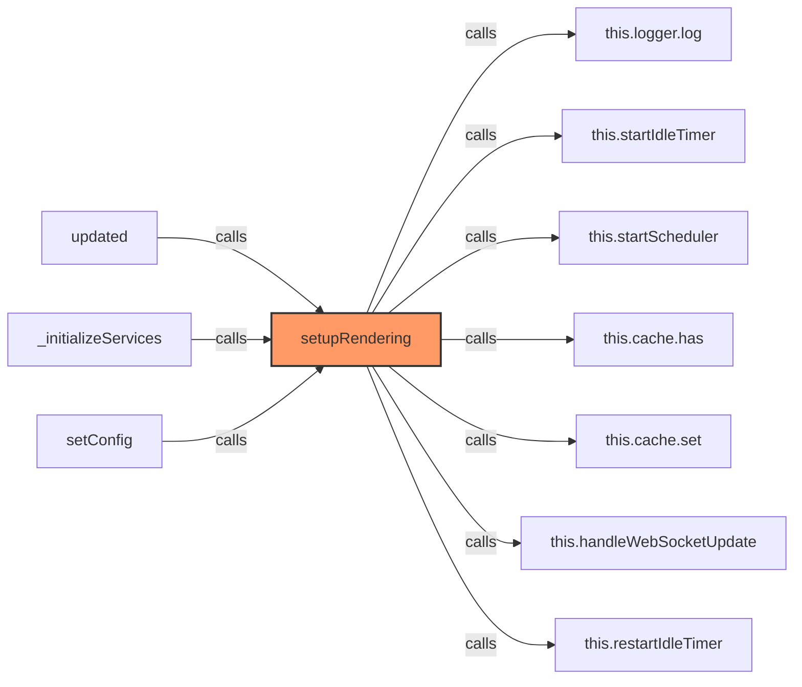

### `handleWebSocketUpdate` (🌐 Public) {#handleWebSocketUpdate}

**Parameters:**

- `detail`: `any`

**Returns:** `void`

**Calls:**

- [[rendering-service|rendering-service]]#restartIdleTimer
- `this._wsUpdateQueue.add`
- `clearTimeout`
- [[logger|logger]]#log
- `Array.from(this._wsUpdateQueue).join`
- `Array.from`
- [[cache|cache]]#has
- [[rendering-service|rendering-service]]#notifyRenderCallbacks
- [[cache|cache]]#set
- [[cache|cache]]#clear

**Called By:**

- From [[rendering-service|rendering-service]]:
  - `setupRendering`

**Call Graph:**

```mermaid
flowchart LR
    handleWebSocketUpdate[handleWebSocketUpdate]:::current
    this_restartIdleTimer[this.restartIdleTimer]
    handleWebSocketUpdate -->|calls| this_restartIdleTimer
    this__wsUpdateQueue_add[this._wsUpdateQueue.add]
    handleWebSocketUpdate -->|calls| this__wsUpdateQueue_add
    clearTimeout[clearTimeout]
    handleWebSocketUpdate -->|calls| clearTimeout
    this_logger_log[this.logger.log]
    handleWebSocketUpdate -->|calls| this_logger_log
    Array_from_this__wsUpdateQueue__join[Array.from(this._wsUpdateQueue).join]
    handleWebSocketUpdate -->|calls| Array_from_this__wsUpdateQueue__join
    Array_from[Array.from]
    handleWebSocketUpdate -->|calls| Array_from
    this_cache_has[this.cache.has]
    handleWebSocketUpdate -->|calls| this_cache_has
    this_notifyRenderCallbacks[this.notifyRenderCallbacks]
    handleWebSocketUpdate -->|calls| this_notifyRenderCallbacks
    this_cache_set[this.cache.set]
    handleWebSocketUpdate -->|calls| this_cache_set
    this__wsUpdateQueue_clear[this._wsUpdateQueue.clear]
    handleWebSocketUpdate -->|calls| this__wsUpdateQueue_clear
    setupRendering[setupRendering]
    setupRendering -->|calls| handleWebSocketUpdate
    classDef current fill:#f96,stroke:#333,stroke-width:2px;
```

### `startIdleTimer` (🌐 Public) {#startIdleTimer}

**Returns:** `void`

**Calls:**

- `clearTimeout`
- `Date.now`
- [[logger|logger]]#log
- [[inventree-state|inventree-state]]#getInstance
- [[inventree-state|inventree-state]]#setPriorityDataSource
- [[rendering-service|rendering-service]]#notifyRenderCallbacks

**Called By:**

- From [[rendering-service|rendering-service]]:
  - `setupRendering`
  - `restartIdleTimer`

**Call Graph:**

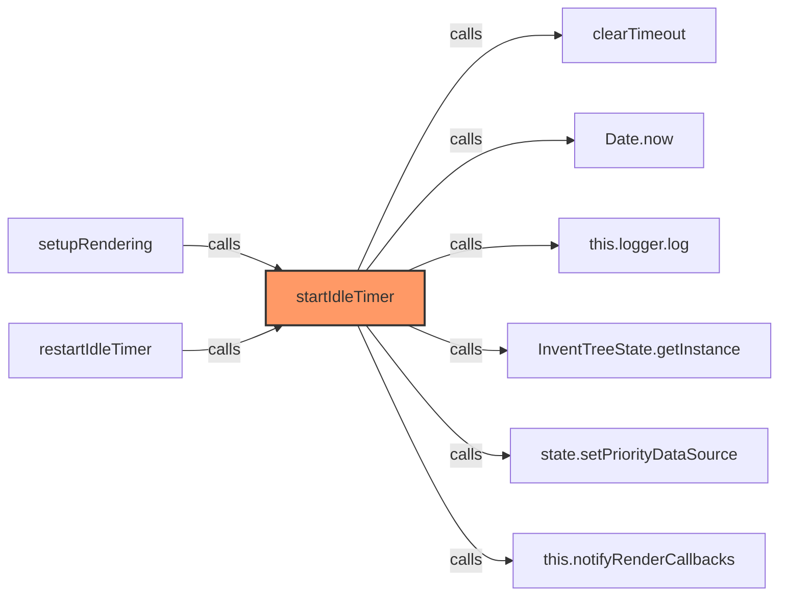

### `restartIdleTimer` (🌐 Public) {#restartIdleTimer}

**Returns:** `void`

**Calls:**

- [[rendering-service|rendering-service]]#startIdleTimer

**Called By:**

- From [[rendering-service|rendering-service]]:
  - `setupRendering`
  - `handleWebSocketUpdate`
- From [[websocket-plugin|websocket-plugin]]:
  - `_handleParameterUpdate`

**Call Graph:**

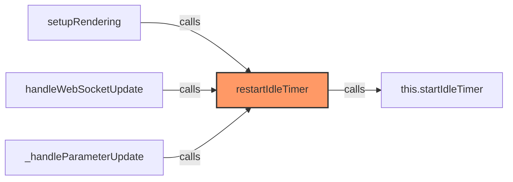

### `registerRenderCallback` (🌐 Public) {#registerRenderCallback}

**Parameters:**

- `callback`: `() => void`

**Returns:** `() => void`

**Calls:**

- `this._renderCallbacks.push`
- `this._renderCallbacks.indexOf`
- `this._renderCallbacks.splice`

**Called By:**

- From [[base-layout|base-layout]]:
  - `connectedCallback`

**Call Graph:**

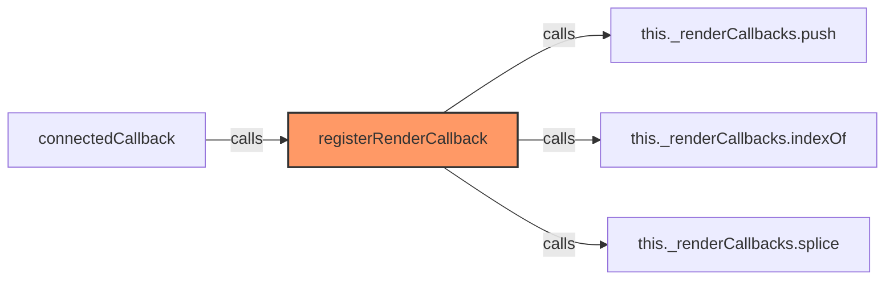

### `notifyRenderCallbacks` (🌐 Public) {#notifyRenderCallbacks}

**Returns:** `void`

**Calls:**

- `Date.now`
- `Math.random().toString(36).substring`
- `Math.random().toString`
- `Math.random`
- `this._pendingRenders.add`
- `setTimeout`
- [[cache|cache]]#delete
- [[rendering-service|rendering-service]]#executeRenderCallbacks
- [[logger|logger]]#log

**Called By:**

- From [[rendering-service|rendering-service]]:
  - `handleWebSocketUpdate`
  - `startIdleTimer`
  - `forceRender`

**Call Graph:**

```mermaid
flowchart LR
    notifyRenderCallbacks[notifyRenderCallbacks]:::current
    Date_now[Date.now]
    notifyRenderCallbacks -->|calls| Date_now
    Math_random___toString_36__substring[Math.random().toString(36).substring]
    notifyRenderCallbacks -->|calls| Math_random___toString_36__substring
    Math_random___toString[Math.random().toString]
    notifyRenderCallbacks -->|calls| Math_random___toString
    Math_random[Math.random]
    notifyRenderCallbacks -->|calls| Math_random
    this__pendingRenders_add[this._pendingRenders.add]
    notifyRenderCallbacks -->|calls| this__pendingRenders_add
    setTimeout[setTimeout]
    notifyRenderCallbacks -->|calls| setTimeout
    this__pendingRenders_delete[this._pendingRenders.delete]
    notifyRenderCallbacks -->|calls| this__pendingRenders_delete
    this_executeRenderCallbacks[this.executeRenderCallbacks]
    notifyRenderCallbacks -->|calls| this_executeRenderCallbacks
    this_logger_log[this.logger.log]
    notifyRenderCallbacks -->|calls| this_logger_log
    handleWebSocketUpdate[handleWebSocketUpdate]
    handleWebSocketUpdate -->|calls| notifyRenderCallbacks
    startIdleTimer[startIdleTimer]
    startIdleTimer -->|calls| notifyRenderCallbacks
    forceRender[forceRender]
    forceRender -->|calls| notifyRenderCallbacks
    classDef current fill:#f96,stroke:#333,stroke-width:2px;
```

### `executeRenderCallbacks` (🌐 Public) {#executeRenderCallbacks}

**Returns:** `void`

**Calls:**

- `Date.now`
- `callback`
- [[logger|logger]]#error

**Called By:**

- From [[rendering-service|rendering-service]]:
  - `notifyRenderCallbacks`

**Call Graph:**

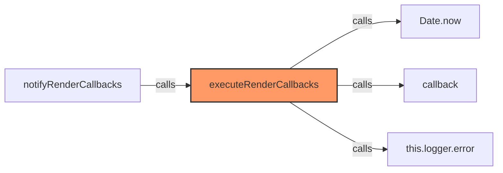

### `forceRender` (🌐 Public) {#forceRender}

**Returns:** `void`

**Calls:**

- [[rendering-service|rendering-service]]#notifyRenderCallbacks

**Called By:**

- From [[websocket-plugin|websocket-plugin]]:
  - `_handleParameterUpdate`

**Call Graph:**

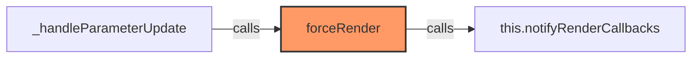

### `shouldRender` (🌐 Public) {#shouldRender}

**Parameters:**

- `entityId`: `string`
- `dataHash`: `string`

**Returns:** `boolean`

**Calls:**

- [[cache|cache]]#has
- [[logger|logger]]#log
- [[cache|cache]]#set

**Called By:**

- From [[base-layout|base-layout]]:
  - `requestUpdate`

**Call Graph:**

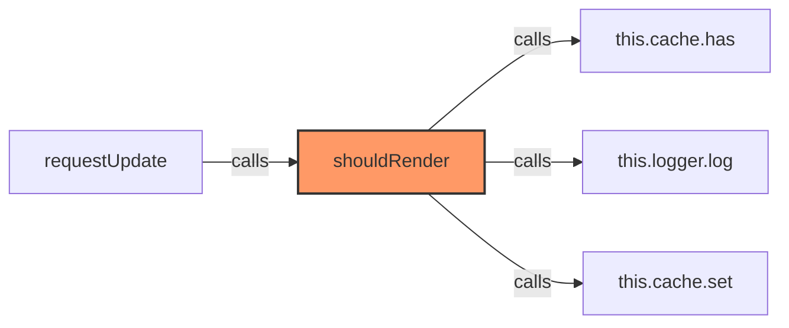

### `startScheduler` (🌐 Public) {#startScheduler}

**Returns:** `void`

**Calls:**

- `clearInterval`
- [[rendering-service|rendering-service]]#processScheduledJobs
- [[logger|logger]]#log

**Called By:**

- From [[rendering-service|rendering-service]]:
  - `setupRendering`

**Call Graph:**

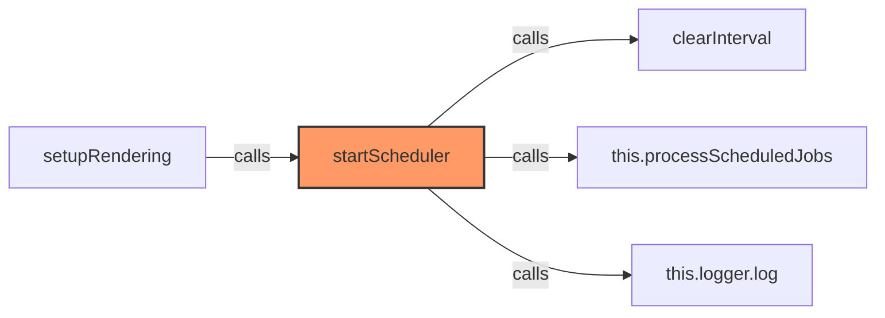

### `stopScheduler` (🌐 Public) {#stopScheduler}

**Returns:** `void`

**Calls:**

- `clearInterval`
- [[logger|logger]]#log

**Called By:**

- From [[rendering-service|rendering-service]]:
  - `destroy`

**Call Graph:**

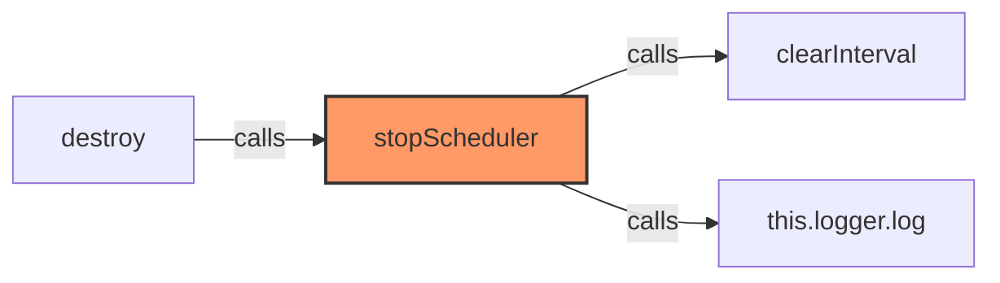

### `processScheduledJobs` (🌐 Public) {#processScheduledJobs}

**Returns:** `void`

**Calls:**

- [[rendering-service|rendering-service]]#shouldRunJob
- `now.getTime`
- [[rendering-service|rendering-service]]#calculateNextRunTime
- [[logger|logger]]#log
- `job.callback`
- [[logger|logger]]#error

**Called By:**

- From [[rendering-service|rendering-service]]:
  - `startScheduler`

**Call Graph:**

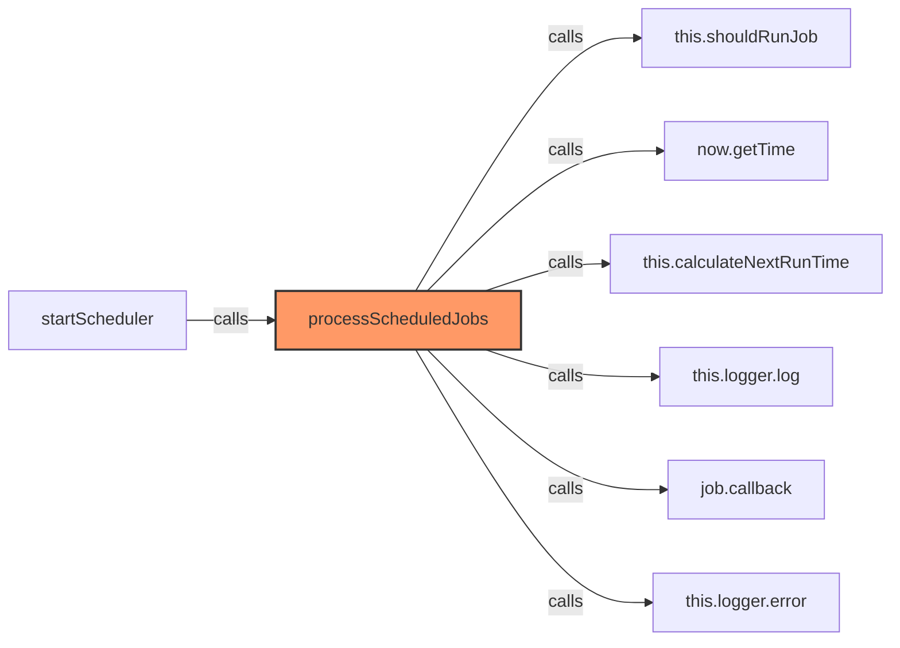

### `shouldRunJob` (🌐 Public) {#shouldRunJob}

**Parameters:**

- `job`: `ScheduledJobConfig`
- `now`: `Date`

**Returns:** `boolean`

**Calls:**

- `now.getTime`
- `now.getHours`
- `now.getMinutes`
- `currentHour.toString().padStart`
- `currentHour.toString`
- `currentMinute.toString().padStart`
- `currentMinute.toString`
- `job.times.includes`
- [[rendering-service|rendering-service]]#evaluateCronExpression
- [[logger|logger]]#error

**Called By:**

- From [[rendering-service|rendering-service]]:
  - `processScheduledJobs`

**Call Graph:**

```mermaid
flowchart LR
    shouldRunJob[shouldRunJob]:::current
    now_getTime[now.getTime]
    shouldRunJob -->|calls| now_getTime
    now_getHours[now.getHours]
    shouldRunJob -->|calls| now_getHours
    now_getMinutes[now.getMinutes]
    shouldRunJob -->|calls| now_getMinutes
    currentHour_toString___padStart[currentHour.toString().padStart]
    shouldRunJob -->|calls| currentHour_toString___padStart
    currentHour_toString[currentHour.toString]
    shouldRunJob -->|calls| currentHour_toString
    currentMinute_toString___padStart[currentMinute.toString().padStart]
    shouldRunJob -->|calls| currentMinute_toString___padStart
    currentMinute_toString[currentMinute.toString]
    shouldRunJob -->|calls| currentMinute_toString
    job_times_includes[job.times.includes]
    shouldRunJob -->|calls| job_times_includes
    this_evaluateCronExpression[this.evaluateCronExpression]
    shouldRunJob -->|calls| this_evaluateCronExpression
    this_logger_error[this.logger.error]
    shouldRunJob -->|calls| this_logger_error
    processScheduledJobs[processScheduledJobs]
    processScheduledJobs -->|calls| shouldRunJob
    classDef current fill:#f96,stroke:#333,stroke-width:2px;
```

### `evaluateCronExpression` (🌐 Public) {#evaluateCronExpression}

**Parameters:**

- `cronExpression`: `string`
- `now`: `Date`

**Returns:** `boolean`

**Calls:**

- `cronExpression.split`
- `now.getMinutes`
- `now.getHours`
- `now.getDate`
- `now.getMonth`
- `now.getDay`
- [[rendering-service|rendering-service]]#matchesCronPart

**Called By:**

- From [[rendering-service|rendering-service]]:
  - `shouldRunJob`

**Call Graph:**

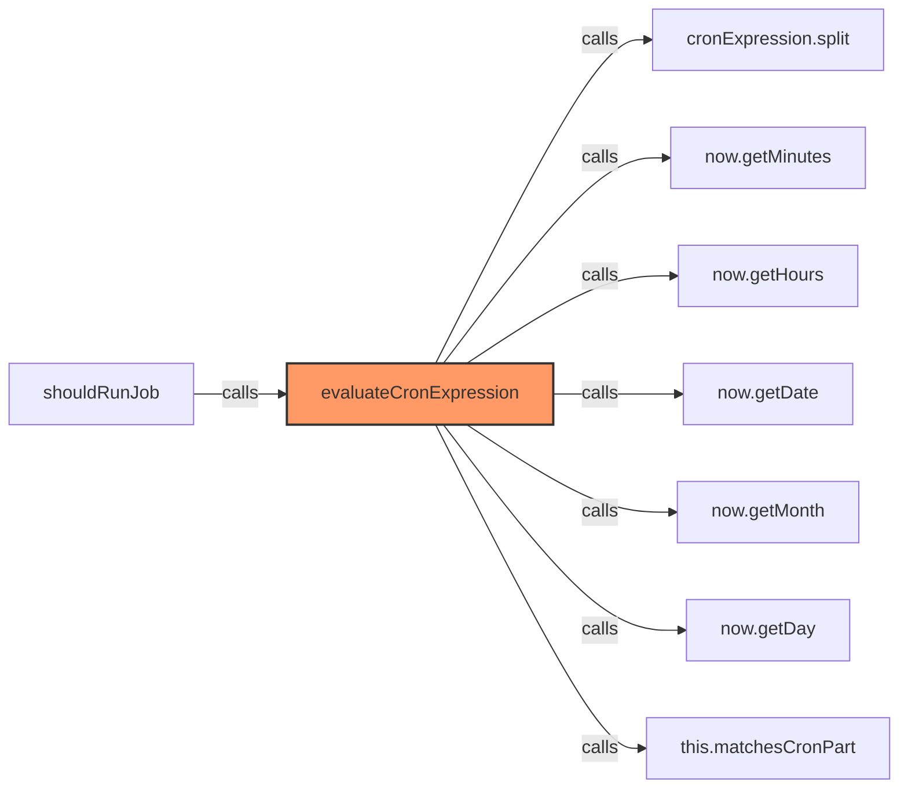

### `matchesCronPart` (🌐 Public) {#matchesCronPart}

**Parameters:**

- `cronPart`: `string`
- `currentValue`: `number`
- `min`: `number`
- `max`: `number`

**Returns:** `boolean`

**Calls:**

- `cronPart.includes`
- `cronPart.split(',').map`
- `cronPart.split`
- `parseInt`
- `values.includes`
- `cronPart.split('-').map`
- `range.includes`
- `range.split('-').map`
- `range.split`

**Called By:**

- From [[rendering-service|rendering-service]]:
  - `evaluateCronExpression`

**Call Graph:**

```mermaid
flowchart LR
    matchesCronPart[matchesCronPart]:::current
    cronPart_includes[cronPart.includes]
    matchesCronPart -->|calls| cronPart_includes
    cronPart_split______map[cronPart.split(',').map]
    matchesCronPart -->|calls| cronPart_split______map
    cronPart_split[cronPart.split]
    matchesCronPart -->|calls| cronPart_split
    parseInt[parseInt]
    matchesCronPart -->|calls| parseInt
    values_includes[values.includes]
    matchesCronPart -->|calls| values_includes
    cronPart_split______map[cronPart.split('-').map]
    matchesCronPart -->|calls| cronPart_split______map
    range_includes[range.includes]
    matchesCronPart -->|calls| range_includes
    range_split______map[range.split('-').map]
    matchesCronPart -->|calls| range_split______map
    range_split[range.split]
    matchesCronPart -->|calls| range_split
    evaluateCronExpression[evaluateCronExpression]
    evaluateCronExpression -->|calls| matchesCronPart
    classDef current fill:#f96,stroke:#333,stroke-width:2px;
```

### `calculateNextRunTime` (🌐 Public) {#calculateNextRunTime}

**Parameters:**

- `job`: `ScheduledJobConfig`
- `now`: `Date`

**Returns:** `number`

**Calls:**

- `now.getTime`

**Called By:**

- From [[rendering-service|rendering-service]]:
  - `processScheduledJobs`

**Call Graph:**

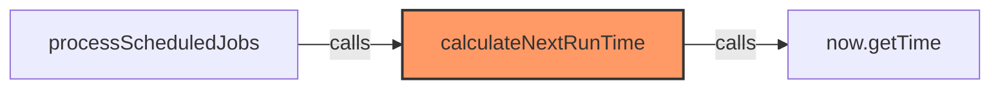

### `addScheduledJob` (🌐 Public) {#addScheduledJob}

**Parameters:**

- `jobConfig`: `ScheduledJobConfig`

**Returns:** `void`

**Calls:**

- [[cache|cache]]#set
- [[logger|logger]]#log

**Call Graph:**

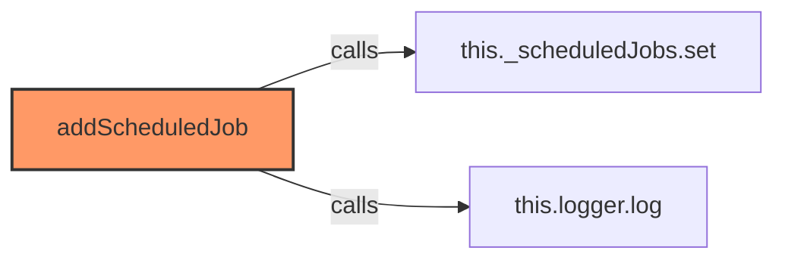

### `removeScheduledJob` (🌐 Public) {#removeScheduledJob}

**Parameters:**

- `jobId`: `string`

**Returns:** `boolean`

**Calls:**

- [[cache|cache]]#delete
- [[logger|logger]]#log

**Call Graph:**

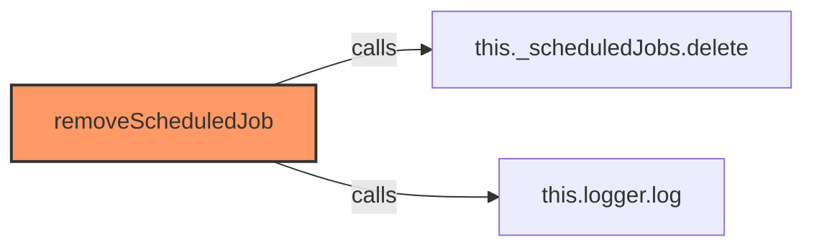

### `updateScheduledJob` (🌐 Public) {#updateScheduledJob}

**Parameters:**

- `jobId`: `string`
- `updates`: `Partial<ScheduledJobConfig>`

**Returns:** `boolean`

**Calls:**

- [[cache|cache]]#get
- `Object.assign`
- [[logger|logger]]#log

**Call Graph:**

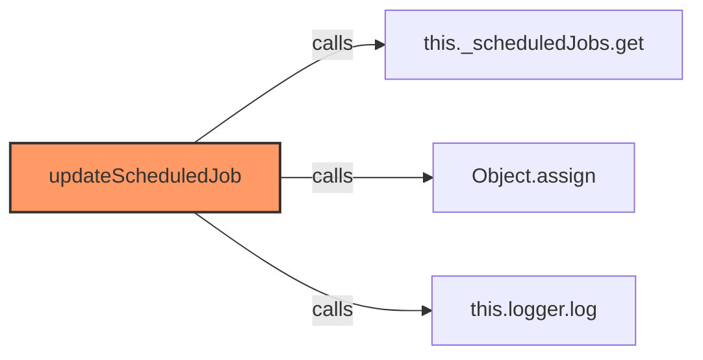

### `getScheduledJobs` (🌐 Public) {#getScheduledJobs}

**Returns:** `ScheduledJobConfig[]`

**Calls:**

- `Array.from`
- `this._scheduledJobs.values`

**Call Graph:**

```mermaid
flowchart LR
    getScheduledJobs[getScheduledJobs]:::current
    Array_from[Array.from]
    getScheduledJobs -->|calls| Array_from
    this__scheduledJobs_values[this._scheduledJobs.values]
    getScheduledJobs -->|calls| this__scheduledJobs_values
    classDef current fill:#f96,stroke:#333,stroke-width:2px;
```

### `getScheduledJob` (🌐 Public) {#getScheduledJob}

**Parameters:**

- `jobId`: `string`

**Returns:** `ScheduledJobConfig | undefined`

**Calls:**

- [[cache|cache]]#get

**Call Graph:**

```mermaid
flowchart LR
    getScheduledJob[getScheduledJob]:::current
    this__scheduledJobs_get[this._scheduledJobs.get]
    getScheduledJob -->|calls| this__scheduledJobs_get
    classDef current fill:#f96,stroke:#333,stroke-width:2px;
```

### `destroy` (🌐 Public) {#destroy}

**Returns:** `void`

**Calls:**

- `clearTimeout`
- [[rendering-service|rendering-service]]#stopScheduler
- [[logger|logger]]#log

**Called By:**

- From [[inventree-card|inventree-card]]:
  - `disconnectedCallback`

**Call Graph:**

```mermaid
flowchart LR
    destroy[destroy]:::current
    clearTimeout[clearTimeout]
    destroy -->|calls| clearTimeout
    this_stopScheduler[this.stopScheduler]
    destroy -->|calls| this_stopScheduler
    this_logger_log[this.logger.log]
    destroy -->|calls| this_logger_log
    disconnectedCallback[disconnectedCallback]
    disconnectedCallback -->|calls| destroy
    classDef current fill:#f96,stroke:#333,stroke-width:2px;
```

### `notifyRenderComplete` (🌐 Public) {#notifyRenderComplete}

**Returns:** `void`

**Calls:**

- `Date.now`
- [[logger|logger]]#log

**Called By:**

- From [[base-layout|base-layout]]:
  - `updateFilteredParts`
- From [[inventree-card|inventree-card]]:
  - `render`

**Call Graph:**

```mermaid
flowchart LR
    notifyRenderComplete[notifyRenderComplete]:::current
    Date_now[Date.now]
    notifyRenderComplete -->|calls| Date_now
    this_logger_log[this.logger.log]
    notifyRenderComplete -->|calls| this_logger_log
    updateFilteredParts[updateFilteredParts]
    updateFilteredParts -->|calls| notifyRenderComplete
    render[render]
    render -->|calls| notifyRenderComplete
    classDef current fill:#f96,stroke:#333,stroke-width:2px;
```

### `getIdleTimerStatus` (🌐 Public) {#getIdleTimerStatus}

**Returns:** `{active: boolean, timeRemaining: number}`

**Calls:**

- `Date.now`
- `Math.max`

**Call Graph:**

```mermaid
flowchart LR
    getIdleTimerStatus[getIdleTimerStatus]:::current
    Date_now[Date.now]
    getIdleTimerStatus -->|calls| Date_now
    Math_max[Math.max]
    getIdleTimerStatus -->|calls| Math_max
    classDef current fill:#f96,stroke:#333,stroke-width:2px;
```

### `getSchedulerStatus` (🌐 Public) {#getSchedulerStatus}

**Returns:** `{
    active: boolean,
    jobCount: number,
    nextJobs: Array<{id: string, description?: string, nextRun: number}>
  }`

**Calls:**

- `Array.from(this._scheduledJobs.values())
      .filter(job => job.enabled && job.nextRun !== undefined)
      .sort((a, b) => (a.nextRun || 0) - (b.nextRun || 0))
      .slice(0, 5).map`
- `Array.from(this._scheduledJobs.values())
      .filter(job => job.enabled && job.nextRun !== undefined)
      .sort((a, b) => (a.nextRun || 0) - (b.nextRun || 0)).slice`
- `Array.from(this._scheduledJobs.values())
      .filter(job => job.enabled && job.nextRun !== undefined).sort`
- `Array.from(this._scheduledJobs.values()).filter`
- `Array.from`
- `this._scheduledJobs.values`

**Call Graph:**

```mermaid
flowchart LR
    getSchedulerStatus[getSchedulerStatus]:::current
    Array_from_this__scheduledJobs_values___________filter_job____job_enabled____job_nextRun_____undefined_________sort__a__b______a_nextRun____0_____b_nextRun____0__________slice_0__5__map[Array.from(this._scheduledJobs.values())
      .filter(job => job.enabled && job.nextRun !== undefined)
      .sort((a, b) => (a.nextRun || 0) - (b.nextRun || 0))
      .slice(0, 5).map]
    getSchedulerStatus -->|calls| Array_from_this__scheduledJobs_values___________filter_job____job_enabled____job_nextRun_____undefined_________sort__a__b______a_nextRun____0_____b_nextRun____0__________slice_0__5__map
    Array_from_this__scheduledJobs_values___________filter_job____job_enabled____job_nextRun_____undefined_________sort__a__b______a_nextRun____0_____b_nextRun____0___slice[Array.from(this._scheduledJobs.values())
      .filter(job => job.enabled && job.nextRun !== undefined)
      .sort((a, b) => (a.nextRun || 0) - (b.nextRun || 0)).slice]
    getSchedulerStatus -->|calls| Array_from_this__scheduledJobs_values___________filter_job____job_enabled____job_nextRun_____undefined_________sort__a__b______a_nextRun____0_____b_nextRun____0___slice
    Array_from_this__scheduledJobs_values___________filter_job____job_enabled____job_nextRun_____undefined__sort[Array.from(this._scheduledJobs.values())
      .filter(job => job.enabled && job.nextRun !== undefined).sort]
    getSchedulerStatus -->|calls| Array_from_this__scheduledJobs_values___________filter_job____job_enabled____job_nextRun_____undefined__sort
    Array_from_this__scheduledJobs_values____filter[Array.from(this._scheduledJobs.values()).filter]
    getSchedulerStatus -->|calls| Array_from_this__scheduledJobs_values____filter
    Array_from[Array.from]
    getSchedulerStatus -->|calls| Array_from
    this__scheduledJobs_values[this._scheduledJobs.values]
    getSchedulerStatus -->|calls| this__scheduledJobs_values
    classDef current fill:#f96,stroke:#333,stroke-width:2px;
```

## Dependencies

```mermaid
flowchart TD
    rendering-service[rendering-service.ts]:::current
    types[types.ts]
    rendering-service -->|imports| types
    inventree_state[inventree-state.ts]
    rendering-service -->|imports| inventree_state
    logger[logger.ts]
    rendering-service -->|imports| logger
    cache[cache.ts]
    rendering-service -->|imports| cache
    base_layout[base-layout.ts]
    base_layout -->|imports| rendering-service
    inventree_card[inventree-card.ts]
    inventree_card -->|imports| rendering-service
    card_controller[card-controller.ts]
    card_controller -->|imports| rendering-service
    websocket_plugin[websocket-plugin.ts]
    websocket_plugin -->|imports| rendering-service
    classDef current fill:#f96,stroke:#333,stroke-width:2px;
```

