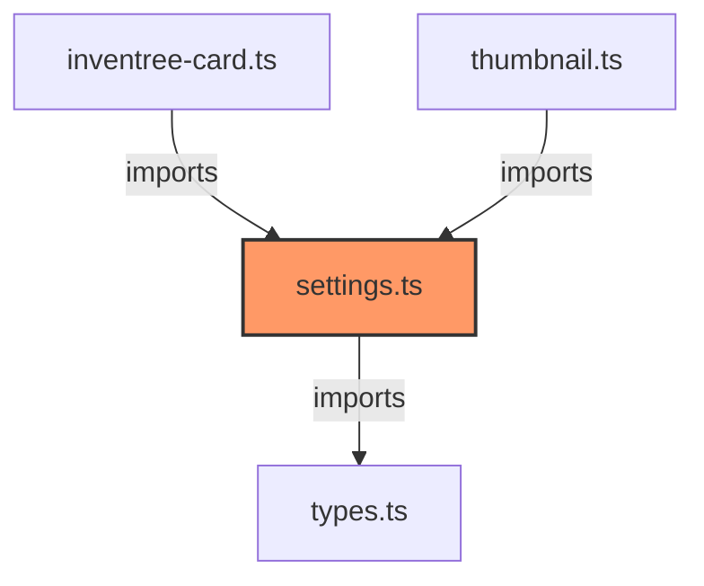

# settings.ts

**Path:** `core/settings.ts`  
**Line Count:** 199  
**Functions:** 2  

## Overview

This file is part of the `core` directory.

## Imports

- [[types|types]]: InventreeCardConfig

## Exports

- `SETTINGS_SCHEMA`
- `DEFAULT_CONFIG`
- `validateSetting`
- `getSettingGroup`

## Functions

### `validateSetting` (🌐 Public) {#validateSetting}

**Parameters:**

- `setting`: `string`

**Returns:** `boolean`

**Calls:**

- `Object.values(SETTINGS_SCHEMA).some`
- `Object.values`

**Call Graph:**

```mermaid
flowchart LR
    validateSetting[validateSetting]:::current
    Object_values_SETTINGS_SCHEMA__some[Object.values(SETTINGS_SCHEMA).some]
    validateSetting -->|calls| Object_values_SETTINGS_SCHEMA__some
    Object_values[Object.values]
    validateSetting -->|calls| Object_values
    classDef current fill:#f96,stroke:#333,stroke-width:2px;
```

### `getSettingGroup` (🌐 Public) {#getSettingGroup}

**Parameters:**

- `setting`: `string`

**Returns:** `string | null`

**Calls:**

- `Object.entries`

**Call Graph:**


## Dependencies



