# state.ts

**Path:** `services/state.ts`  
**Line Count:** 144  
**Functions:** 11  

## Overview

This file is part of the `services` directory.

## Imports

- [[types|types]]: InventreeItem, ParameterCondition
- custom-card-helpers: HomeAssistant
- [[logger|logger]]: Logger
- [[parameter-service|parameter-service]]: ParameterService
- [[websocket|websocket]]: WebSocketService
- [[websocket-manager|websocket-manager]]: WebSocketManager
- [[inventree-state|inventree-state]]: CoreInventTreeState

## Exports

- `InventTreeState`

## Functions

### Class: InventTreeState

### `getInstance` (🌐 Public) {#getInstance}

**Returns:** `InventTreeState`

**Called By:**

- From [[base-layout|base-layout]]:
  - `_safeGetParameterService`
  - `_loadData`
  - `getParts`
  - `updated`
  - `updateFilteredParts`
- From [[variant-handler|variant-handler]]:
  - `processItems`
- From [[detail-layout|detail-layout]]:
  - `_updateVisualModifiers`
- From [[grid-layout|grid-layout]]:
  - `_setupWebSocketConnection`
  - `_cleanupListeners`
  - `_actuallyFilterParts`
  - `_updateVisualModifiers`
  - `render`
- From [[list-layout|list-layout]]:
  - `_updateVisualModifiers`
  - `render`
- From [[parts-layout|parts-layout]]:
  - `loadPartsFromEntities`
  - `_updateVisualModifiers`
- From [[editor|editor]]:
  - `_renderDebuggingSection`
- From [[inventree-card|inventree-card]]:
  - `connectedCallback`
  - `_resetApiFailures`
  - `_initializeServices`
- From [[card-controller|card-controller]]:
  - `setHass`
  - `initializeServices`
  - `loadEntityData`
  - `getParts`
  - `getWebSocketService`
  - `initializeWebSocketPlugin`
  - `handleWebSocketMessage`
  - `getWebSocketDiagnostics`
- From [[parameter-service|parameter-service]]:
  - `getParameterValueFromPart`
  - `isDirectPartReference`
  - `getParameterValueWithDirectReference`
  - `findEntityForPart`
  - `storeOrphanedParameter`
  - `isOrphanedPart`
  - `getOrphanedPartIds`
  - `getOrphanedPartParameters`
  - `findParameterInWebSocketData`
  - `findParameterInApiData`
  - `findParameterInHassData`
  - `findParameterInAllEntities`
  - `syncApiDataToEntityState`
  - `getParameterFromEntity`
- From [[rendering-service|rendering-service]]:
  - `startIdleTimer`
- From [[variant-service|variant-service]]:
  - `processVariants`
- From [[websocket-plugin|websocket-plugin]]:
  - `_handleParameterUpdate`
- From [[websocket|websocket]]:
  - `_updateEntityState`

**Call Graph:**

```mermaid
flowchart LR
    getInstance[getInstance]:::current
    _safeGetParameterService[_safeGetParameterService]
    _safeGetParameterService -->|calls| getInstance
    _loadData[_loadData]
    _loadData -->|calls| getInstance
    getParts[getParts]
    getParts -->|calls| getInstance
    updated[updated]
    updated -->|calls| getInstance
    updateFilteredParts[updateFilteredParts]
    updateFilteredParts -->|calls| getInstance
    processItems[processItems]
    processItems -->|calls| getInstance
    _updateVisualModifiers[_updateVisualModifiers]
    _updateVisualModifiers -->|calls| getInstance
    _setupWebSocketConnection[_setupWebSocketConnection]
    _setupWebSocketConnection -->|calls| getInstance
    _cleanupListeners[_cleanupListeners]
    _cleanupListeners -->|calls| getInstance
    _actuallyFilterParts[_actuallyFilterParts]
    _actuallyFilterParts -->|calls| getInstance
    render[render]
    render -->|calls| getInstance
    loadPartsFromEntities[loadPartsFromEntities]
    loadPartsFromEntities -->|calls| getInstance
    _renderDebuggingSection[_renderDebuggingSection]
    _renderDebuggingSection -->|calls| getInstance
    connectedCallback[connectedCallback]
    connectedCallback -->|calls| getInstance
    _resetApiFailures[_resetApiFailures]
    _resetApiFailures -->|calls| getInstance
    _initializeServices[_initializeServices]
    _initializeServices -->|calls| getInstance
    setHass[setHass]
    setHass -->|calls| getInstance
    initializeServices[initializeServices]
    initializeServices -->|calls| getInstance
    loadEntityData[loadEntityData]
    loadEntityData -->|calls| getInstance
    getWebSocketService[getWebSocketService]
    getWebSocketService -->|calls| getInstance
    initializeWebSocketPlugin[initializeWebSocketPlugin]
    initializeWebSocketPlugin -->|calls| getInstance
    handleWebSocketMessage[handleWebSocketMessage]
    handleWebSocketMessage -->|calls| getInstance
    getWebSocketDiagnostics[getWebSocketDiagnostics]
    getWebSocketDiagnostics -->|calls| getInstance
    getParameterValueFromPart[getParameterValueFromPart]
    getParameterValueFromPart -->|calls| getInstance
    isDirectPartReference[isDirectPartReference]
    isDirectPartReference -->|calls| getInstance
    getParameterValueWithDirectReference[getParameterValueWithDirectReference]
    getParameterValueWithDirectReference -->|calls| getInstance
    findEntityForPart[findEntityForPart]
    findEntityForPart -->|calls| getInstance
    storeOrphanedParameter[storeOrphanedParameter]
    storeOrphanedParameter -->|calls| getInstance
    isOrphanedPart[isOrphanedPart]
    isOrphanedPart -->|calls| getInstance
    getOrphanedPartIds[getOrphanedPartIds]
    getOrphanedPartIds -->|calls| getInstance
    getOrphanedPartParameters[getOrphanedPartParameters]
    getOrphanedPartParameters -->|calls| getInstance
    findParameterInWebSocketData[findParameterInWebSocketData]
    findParameterInWebSocketData -->|calls| getInstance
    findParameterInApiData[findParameterInApiData]
    findParameterInApiData -->|calls| getInstance
    findParameterInHassData[findParameterInHassData]
    findParameterInHassData -->|calls| getInstance
    findParameterInAllEntities[findParameterInAllEntities]
    findParameterInAllEntities -->|calls| getInstance
    syncApiDataToEntityState[syncApiDataToEntityState]
    syncApiDataToEntityState -->|calls| getInstance
    getParameterFromEntity[getParameterFromEntity]
    getParameterFromEntity -->|calls| getInstance
    startIdleTimer[startIdleTimer]
    startIdleTimer -->|calls| getInstance
    processVariants[processVariants]
    processVariants -->|calls| getInstance
    _handleParameterUpdate[_handleParameterUpdate]
    _handleParameterUpdate -->|calls| getInstance
    _updateEntityState[_updateEntityState]
    _updateEntityState -->|calls| getInstance
    classDef current fill:#f96,stroke:#333,stroke-width:2px;
```

### `setHass` (🌐 Public) {#setHass}

**Parameters:**

- `hass`: `HomeAssistant`

**Returns:** `void`

**Calls:**

- [[inventree-state|inventree-state]]#setHass

**Called By:**

- From [[inventree-card|inventree-card]]:
  - `connectedCallback`
  - `_initializeServices`
- From [[card-controller|card-controller]]:
  - `setHass`
  - `initializeServices`

**Call Graph:**

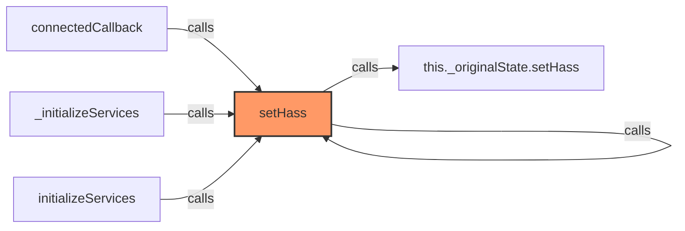

### `getFilteredParts` (🌐 Public) {#getFilteredParts}

**Parameters:**

- `entityId`: `string`

**Returns:** `InventreeItem[]`

**Calls:**

- [[inventree-state|inventree-state]]#getNewestData

**Called By:**

- From [[grid-layout|grid-layout]]:
  - `render`

**Call Graph:**

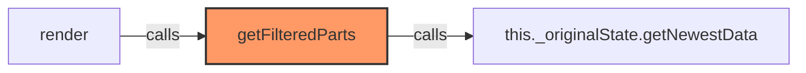

### `getAllParts` (🌐 Public) {#getAllParts}

**Parameters:**

- `entityId`: `string`

**Returns:** `InventreeItem[]`

**Calls:**

- [[inventree-state|inventree-state]]#getNewestData

**Call Graph:**

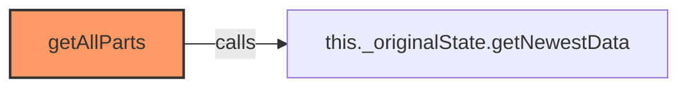

### `findEntityForPart` (🌐 Public) {#findEntityForPart}

**Parameters:**

- `partId`: `number`

**Returns:** `string | undefined`

**Calls:**

- [[inventree-state|inventree-state]]#findEntityForPart

**Called By:**

- From [[grid-layout|grid-layout]]:
  - `_handleWebSocketMessage`
- From [[inventree-state|inventree-state]]:
  - `findParameterInAllEntities`
  - `isOrphanedPart`
- From [[inventree-card|inventree-card]]:
  - `_testSpecificParameter`
- From [[parameter-service|parameter-service]]:
  - `findEntityForPart`
  - `syncApiDataToEntityState`
- From [[websocket-plugin|websocket-plugin]]:
  - `_handleParameterUpdate`

**Call Graph:**

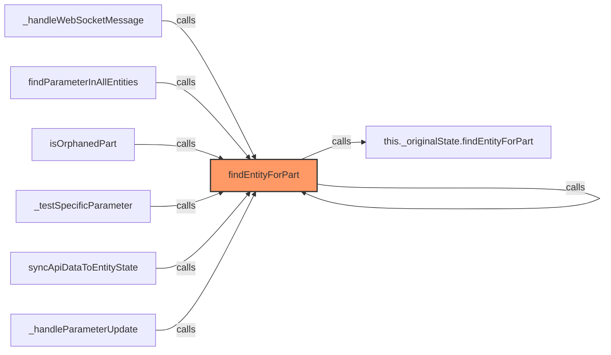

### `updateEntityParts` (🌐 Public) {#updateEntityParts}

**Parameters:**

- `entityId`: `string`
- `parts`: `InventreeItem[]`

**Returns:** `void`

**Calls:**

- [[inventree-state|inventree-state]]#setWebSocketData

**Call Graph:**

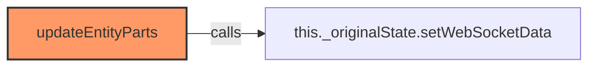

### `subscribe` (🌐 Public) {#subscribe}

**Parameters:**

- `entityId`: `string`
- `callback`: `() => void`

**Returns:** `() => void`

**Calls:**

- `setInterval`
- `callback`
- `clearInterval`

**Call Graph:**

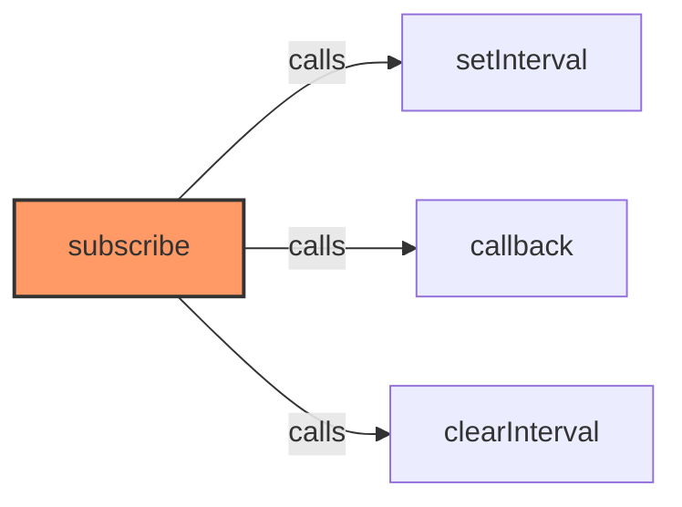

### `shouldShowPart` (🌐 Public) {#shouldShowPart}

**Parameters:**

- `part`: `InventreeItem`
- `paramName`: `string`
- `operator`: `string`
- `value`: `string`

**Returns:** `boolean`

**Calls:**

- [[state|state]]#checkConditionForPart

**Call Graph:**

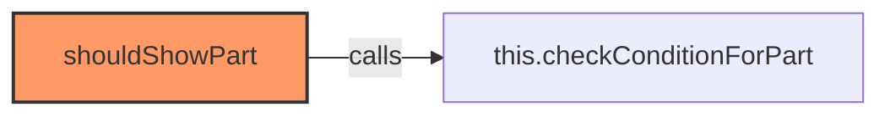

### `checkConditionForPart` (🌐 Public) {#checkConditionForPart}

**Parameters:**

- `part`: `InventreeItem`
- `condition`: `ParameterCondition`

**Returns:** `boolean`

**Calls:**

- `part.parameters.find`
- `p.template_detail?.name.toLowerCase`
- `paramName.toLowerCase`
- `value.includes`
- `Number`

**Called By:**

- From [[state|state]]:
  - `shouldShowPart`

**Call Graph:**

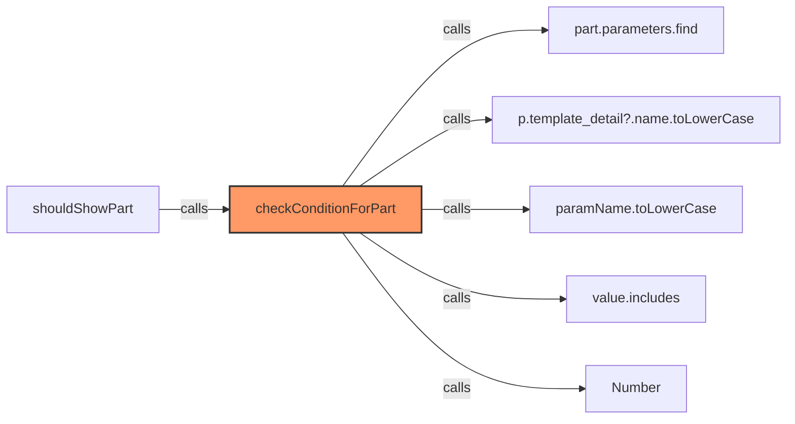

### `_getParameterService` (🔒 Private) {#_getParameterService}

**Returns:** `ParameterService | null`

**Calls:**

- [[logger|logger]]#log
- [[logger|logger]]#error

**Called By:**

- From [[state|state]]:
  - `getActionButtons`

**Call Graph:**

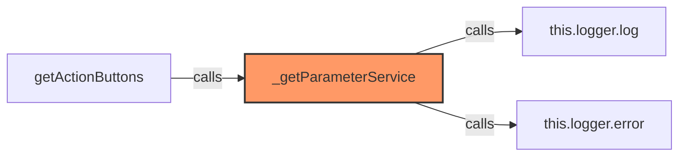

### `getActionButtons` (🌐 Public) {#getActionButtons}

**Parameters:**

- `part`: `any`
- `actions`: `any[]`

**Returns:** `any[]`

**Calls:**

- [[state|state]]#_getParameterService
- `String`
- [[parameter-service|parameter-service]]#getActionButtons

**Called By:**

- From [[detail-layout|detail-layout]]:
  - `_updateVisualModifiers`
- From [[grid-layout|grid-layout]]:
  - `_updateVisualModifiers`
- From [[list-layout|list-layout]]:
  - `_updateVisualModifiers`
- From [[parts-layout|parts-layout]]:
  - `_updateVisualModifiers`
- From [[variant-layout|variant-layout]]:
  - `_updateVisualModifiers`

**Call Graph:**

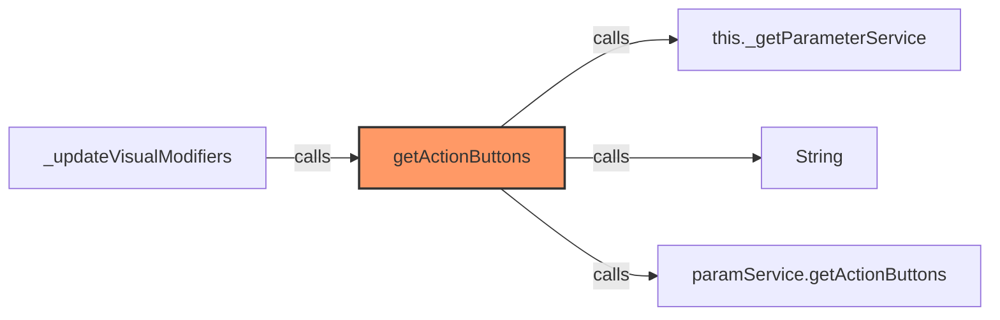

## Dependencies

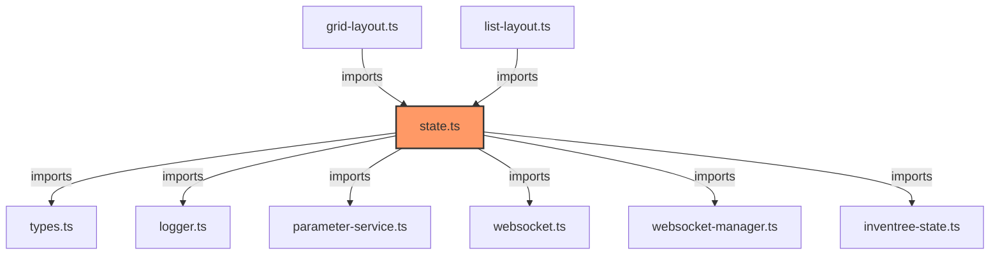

