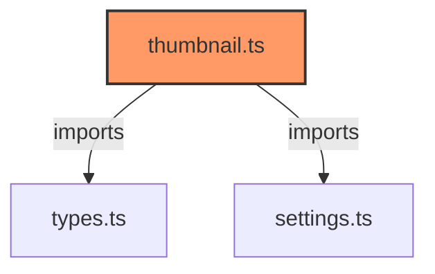

# thumbnail.ts

**Path:** `services/thumbnail.ts`  
**Line Count:** 33  
**Functions:** 1  

## Overview

This file is part of the `services` directory.

## Imports

- [[types|types]]: InventreeItem, InventreeCardConfig
- [[settings|settings]]: DEFAULT_CONFIG

## Exports

- `ThumbnailService`

## Functions

### Class: ThumbnailService

### `getThumbnailPath` (🌐 Public) {#getThumbnailPath}

**Parameters:**

- `item`: `InventreeItem`
- `config`: `InventreeCardConfig`

**Returns:** `string`

## Dependencies

