# types.ts

**Path:** `core/types.ts`  
**Line Count:** 511  
**Functions:** 0  

## Overview

This file is part of the `core` directory.

## Imports

- lit: LitElement
- custom-card-helpers: ActionConfig, LovelaceCard, LovelaceCardConfig, LovelaceCardEditor, HASSDomEvent

## Dependencies

```mermaid
flowchart TD
    types[types.ts]:::current
    base_layout[base-layout.ts]
    base_layout -->|imports| types
    variant_handler[variant-handler.ts]
    variant_handler -->|imports| types
    detail_layout[detail-layout.ts]
    detail_layout -->|imports| types
    grid_layout[grid-layout.ts]
    grid_layout -->|imports| types
    list_layout[list-layout.ts]
    list_layout -->|imports| types
    part_buttons[part-buttons.ts]
    part_buttons -->|imports| types
    part_container[part-container.ts]
    part_container -->|imports| types
    part_details[part-details.ts]
    part_details -->|imports| types
    part_thumbnail[part-thumbnail.ts]
    part_thumbnail -->|imports| types
    part_variant[part-variant.ts]
    part_variant -->|imports| types
    part_view[part-view.ts]
    part_view -->|imports| types
    parts_layout[parts-layout.ts]
    parts_layout -->|imports| types
    variant_layout[variant-layout.ts]
    variant_layout -->|imports| types
    inventree_state[inventree-state.ts]
    inventree_state -->|imports| types
    settings[settings.ts]
    settings -->|imports| types
    editor[editor.ts]
    editor -->|imports| types
    inventree_card[inventree-card.ts]
    inventree_card -->|imports| types
    adjust_stock[adjust-stock.ts]
    adjust_stock -->|imports| types
    cache[cache.ts]
    cache -->|imports| types
    card_controller[card-controller.ts]
    card_controller -->|imports| types
    parameter_service[parameter-service.ts]
    parameter_service -->|imports| types
    print_label[print-label.ts]
    print_label -->|imports| types
    rendering_service[rendering-service.ts]
    rendering_service -->|imports| types
    state[state.ts]
    state -->|imports| types
    thumbnail[thumbnail.ts]
    thumbnail -->|imports| types
    variant_service[variant-service.ts]
    variant_service -->|imports| types
    websocket[websocket.ts]
    websocket -->|imports| types
    wled_service[wled-service.ts]
    wled_service -->|imports| types
    helpers[helpers.ts]
    helpers -->|imports| types
    classDef current fill:#f96,stroke:#333,stroke-width:2px;
```

