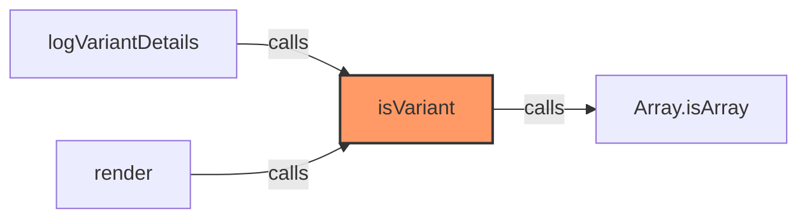
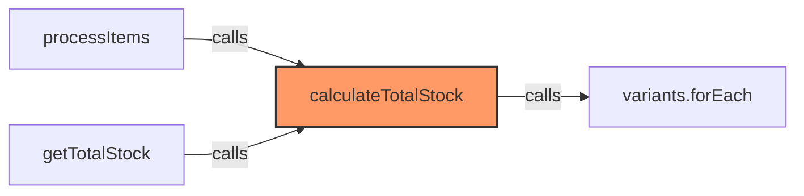
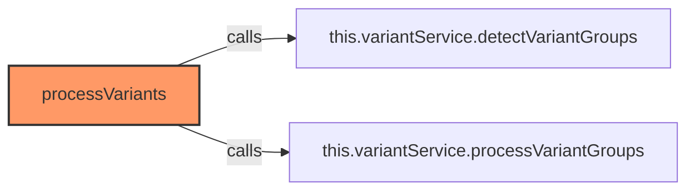
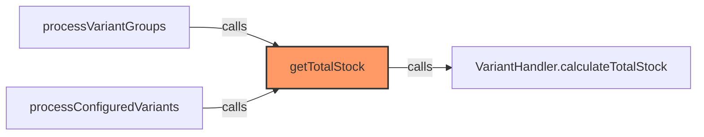
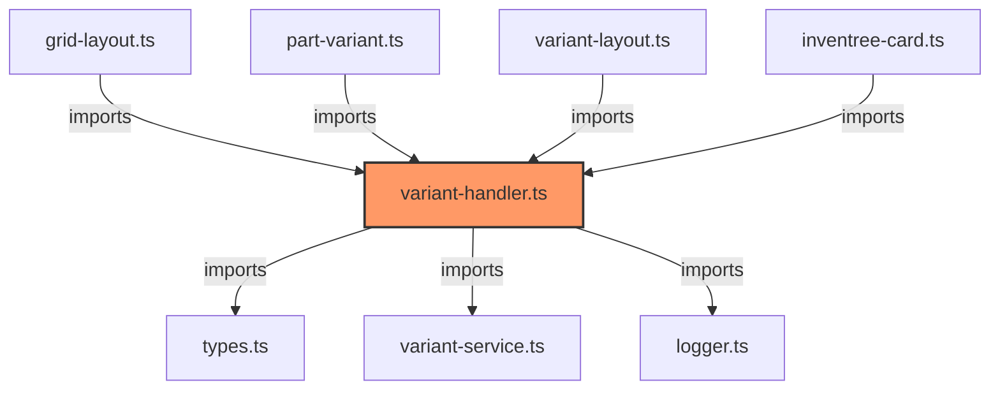

# variant-handler.ts

**Path:** `components/common/variant-handler.ts`  
**Line Count:** 165  
**Functions:** 5  

## Overview

This file is part of the `components/common` directory.

## Imports

- custom-card-helpers: HomeAssistant
- [[types|types]]: InventreeItem, InventreeCardConfig, ProcessedVariant, VariantGroup
- [[variant-service|variant-service]]: VariantService
- [[logger|logger]]: Logger

## Exports

- `VariantHandler`

## Functions

### Class: VariantHandler

### `processItems` (🌐 Public) {#processItems}

**Parameters:**

- `items`: `InventreeItem[]`
- `config`: `InventreeCardConfig`

**Returns:** `(InventreeItem | ProcessedVariant)[]`

**Calls:**

- [[inventree-state|inventree-state]]#getInstance
- `allItems.filter`
- `variantParts.forEach`
- `variantGroups[part.variant_of].push`
- `Object.keys(variantGroups).forEach`
- `Object.keys`
- `Number`
- `allItems.find`
- `processedItems.push`
- [[variant-handler|variant-handler]]#calculateTotalStock
- `processedPks.add`
- `variants.forEach`
- [[logger|logger]]#log
- `config.variants.variant_groups.forEach`
- `variantPks.includes`
- [[cache|cache]]#has
- [[logger|logger]]#error

**Call Graph:**

```mermaid
flowchart LR
    processItems[processItems]:::current
    Logger_getInstance[Logger.getInstance]
    processItems -->|calls| Logger_getInstance
    allItems_filter[allItems.filter]
    processItems -->|calls| allItems_filter
    variantParts_forEach[variantParts.forEach]
    processItems -->|calls| variantParts_forEach
    variantGroups_part_variant_of__push[variantGroups[part.variant_of].push]
    processItems -->|calls| variantGroups_part_variant_of__push
    Object_keys_variantGroups__forEach[Object.keys(variantGroups).forEach]
    processItems -->|calls| Object_keys_variantGroups__forEach
    Object_keys[Object.keys]
    processItems -->|calls| Object_keys
    Number[Number]
    processItems -->|calls| Number
    allItems_find[allItems.find]
    processItems -->|calls| allItems_find
    processedItems_push[processedItems.push]
    processItems -->|calls| processedItems_push
    VariantHandler_calculateTotalStock[VariantHandler.calculateTotalStock]
    processItems -->|calls| VariantHandler_calculateTotalStock
    processedPks_add[processedPks.add]
    processItems -->|calls| processedPks_add
    variants_forEach[variants.forEach]
    processItems -->|calls| variants_forEach
    logger_log[logger.log]
    processItems -->|calls| logger_log
    config_variants_variant_groups_forEach[config.variants.variant_groups.forEach]
    processItems -->|calls| config_variants_variant_groups_forEach
    variantPks_includes[variantPks.includes]
    processItems -->|calls| variantPks_includes
    processedPks_has[processedPks.has]
    processItems -->|calls| processedPks_has
    Logger_getInstance___error[Logger.getInstance().error]
    processItems -->|calls| Logger_getInstance___error
    classDef current fill:#f96,stroke:#333,stroke-width:2px;
```

### `isVariant` (🌐 Public) {#isVariant}

**Parameters:**

- `item`: `InventreeItem | ProcessedVariant`

**Returns:** `item is ProcessedVariant`

**Calls:**

- `Array.isArray`

**Called By:**

- From [[part-variant|part-variant]]:
  - `logVariantDetails`
  - `render`

**Call Graph:**



### `calculateTotalStock` (🌐 Public) {#calculateTotalStock}

**Parameters:**

- `template`: `InventreeItem`
- `variants`: `InventreeItem[]`

**Returns:** `number`

**Calls:**

- `variants.forEach`

**Called By:**

- From [[variant-handler|variant-handler]]:
  - `processItems`
  - `getTotalStock`

**Call Graph:**



### `processVariants` (🌐 Public) {#processVariants}

**Parameters:**

- `items`: `InventreeItem[]`
- `config`: `InventreeCardConfig`

**Returns:** `InventreeItem[]`

**Calls:**

- [[variant-service|variant-service]]#detectVariantGroups
- [[variant-service|variant-service]]#processVariantGroups

**Call Graph:**



### `getTotalStock` (🌐 Public) {#getTotalStock}

**Parameters:**

- `template`: `InventreeItem`
- `variants`: `InventreeItem[]`

**Returns:** `number`

**Calls:**

- [[variant-handler|variant-handler]]#calculateTotalStock

**Called By:**

- From [[variant-service|variant-service]]:
  - `processVariantGroups`
  - `processConfiguredVariants`

**Call Graph:**



## Dependencies



