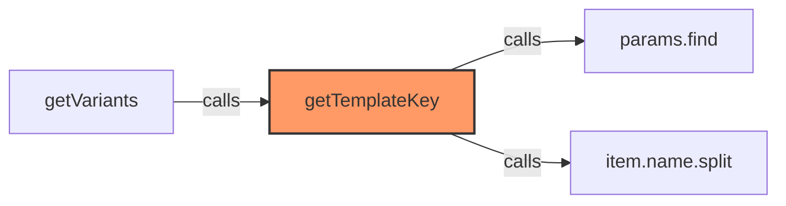
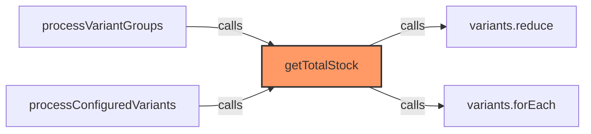
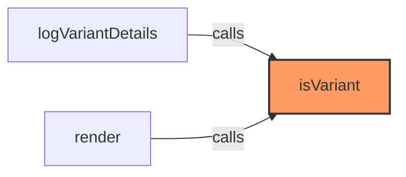
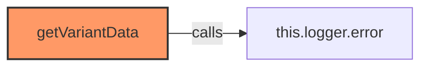
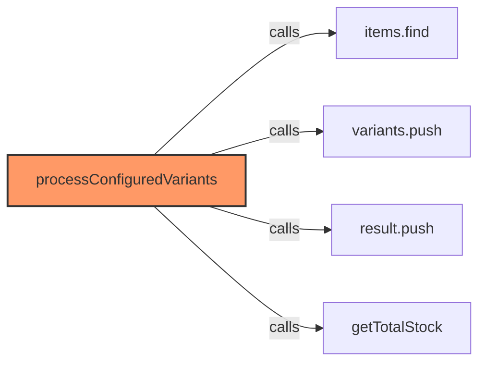
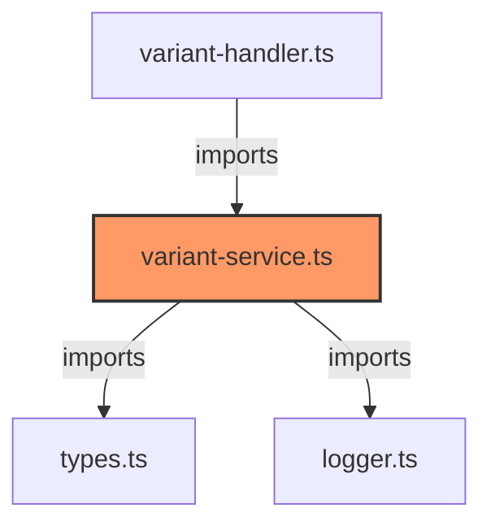

# variant-service.ts

**Path:** `services/variant-service.ts`  
**Line Count:** 300  
**Functions:** 15  

## Overview

This file is part of the `services` directory.

## Imports

- custom-card-helpers: HomeAssistant
- [[types|types]]: InventreeCardConfig, VariantGroup, InventreeItem
- [[logger|logger]]: Logger

## Exports

- `VariantService`
- `detectVariantGroups`
- `getTotalStock`
- `processConfiguredVariants`

## Functions

### Class: VariantService

### `getTemplateKey` (🌐 Public) {#getTemplateKey}

**Parameters:**

- `item`: `InventreeItem`

**Returns:** `string`

**Calls:**

- `params.find`
- `item.name.split`

**Called By:**

- From [[variant-service|variant-service]]:
  - `getVariants`

**Call Graph:**



### `getVariants` (🌐 Public) {#getVariants}

**Parameters:**

- `items`: `InventreeItem[]`

**Returns:** `Record<string, InventreeItem[]>`

**Calls:**

- `items.forEach`
- [[variant-service|variant-service]]#getTemplateKey
- `groups[template].push`
- [[logger|logger]]#error

**Call Graph:**

```mermaid
flowchart LR
    getVariants[getVariants]:::current
    items_forEach[items.forEach]
    getVariants -->|calls| items_forEach
    this_getTemplateKey[this.getTemplateKey]
    getVariants -->|calls| this_getTemplateKey
    groups_template__push[groups[template].push]
    getVariants -->|calls| groups_template__push
    this_logger_error[this.logger.error]
    getVariants -->|calls| this_logger_error
    classDef current fill:#f96,stroke:#333,stroke-width:2px;
```

### `groupVariants` (🌐 Public) {#groupVariants}

**Parameters:**

- `items`: `InventreeItem[]`
- `config`: `InventreeCardConfig`

**Returns:** `Record<number, InventreeItem[]>`

**Calls:**

- `variantGroups.forEach`
- `items.find`
- `items.filter`
- `(group.variantPks || []).includes`

**Called By:**

- From [[variant-service|variant-service]]:
  - `processVariants`

**Call Graph:**

```mermaid
flowchart LR
    groupVariants[groupVariants]:::current
    variantGroups_forEach[variantGroups.forEach]
    groupVariants -->|calls| variantGroups_forEach
    items_find[items.find]
    groupVariants -->|calls| items_find
    items_filter[items.filter]
    groupVariants -->|calls| items_filter
    _group_variantPks________includes[(group.variantPks || []).includes]
    groupVariants -->|calls| _group_variantPks________includes
    processVariants[processVariants]
    processVariants -->|calls| groupVariants
    classDef current fill:#f96,stroke:#333,stroke-width:2px;
```

### `processVariants` (🌐 Public) {#processVariants}

**Parameters:**

- `items`: `InventreeItem[]`
- `config`: `InventreeCardConfig`

**Returns:** `InventreeItem[]`

**Calls:**

- [[variant-service|variant-service]]#groupVariants
- [[logger|logger]]#error
- [[inventree-state|inventree-state]]#getInstance

**Call Graph:**

```mermaid
flowchart LR
    processVariants[processVariants]:::current
    this_groupVariants[this.groupVariants]
    processVariants -->|calls| this_groupVariants
    Logger_getInstance___error[Logger.getInstance().error]
    processVariants -->|calls| Logger_getInstance___error
    Logger_getInstance[Logger.getInstance]
    processVariants -->|calls| Logger_getInstance
    classDef current fill:#f96,stroke:#333,stroke-width:2px;
```

### `getTotalStock` (🌐 Public) {#getTotalStock}

**Parameters:**

- `template`: `InventreeItem`
- `variants`: `InventreeItem[]`

**Returns:** `number`

**Calls:**

- `variants.reduce`
- `variants.forEach`

**Called By:**

- From [[variant-service|variant-service]]:
  - `processVariantGroups`
  - `processConfiguredVariants`

**Call Graph:**



### `isVariant` (🌐 Public) {#isVariant}

**Parameters:**

- `item`: `InventreeItem`

**Returns:** `boolean`

**Called By:**

- From [[part-variant|part-variant]]:
  - `logVariantDetails`
  - `render`

**Call Graph:**



### `isTemplate` (🌐 Public) {#isTemplate}

**Parameters:**

- `item`: `InventreeItem`

**Returns:** `boolean`

### `getVariants` (🌐 Public) {#getVariants}

**Parameters:**

- `config`: `InventreeCardConfig`

**Returns:** `Promise<VariantGroup[]>`

**Calls:**

- `items.forEach`
- [[variant-service|variant-service]]#getTemplateKey
- `groups[template].push`
- [[logger|logger]]#error

**Call Graph:**

```mermaid
flowchart LR
    getVariants[getVariants]:::current
    items_forEach[items.forEach]
    getVariants -->|calls| items_forEach
    this_getTemplateKey[this.getTemplateKey]
    getVariants -->|calls| this_getTemplateKey
    groups_template__push[groups[template].push]
    getVariants -->|calls| groups_template__push
    this_logger_error[this.logger.error]
    getVariants -->|calls| this_logger_error
    classDef current fill:#f96,stroke:#333,stroke-width:2px;
```

### `detectVariantGroups` (🌐 Public) {#detectVariantGroups}

**Parameters:**

- `parts`: `InventreeItem[]`

**Returns:** `VariantGroup[]`

**Calls:**

- [[logger|logger]]#log
- `parts.filter`
- `variantParts.forEach`
- `variantGroups[part.variant_of].push`
- `Object.keys(variantGroups).map`
- `Object.keys`
- `Number`
- `parts.find`
- `variants.map`
- `parts.forEach`
- `parseInt`
- `variantGroups[parentPk].push`
- `Object.values`

**Called By:**

- From [[variant-handler|variant-handler]]:
  - `processVariants`

**Call Graph:**

```mermaid
flowchart LR
    detectVariantGroups[detectVariantGroups]:::current
    this_logger_log[this.logger.log]
    detectVariantGroups -->|calls| this_logger_log
    parts_filter[parts.filter]
    detectVariantGroups -->|calls| parts_filter
    variantParts_forEach[variantParts.forEach]
    detectVariantGroups -->|calls| variantParts_forEach
    variantGroups_part_variant_of__push[variantGroups[part.variant_of].push]
    detectVariantGroups -->|calls| variantGroups_part_variant_of__push
    Object_keys_variantGroups__map[Object.keys(variantGroups).map]
    detectVariantGroups -->|calls| Object_keys_variantGroups__map
    Object_keys[Object.keys]
    detectVariantGroups -->|calls| Object_keys
    Number[Number]
    detectVariantGroups -->|calls| Number
    parts_find[parts.find]
    detectVariantGroups -->|calls| parts_find
    variants_map[variants.map]
    detectVariantGroups -->|calls| variants_map
    parts_forEach[parts.forEach]
    detectVariantGroups -->|calls| parts_forEach
    parseInt[parseInt]
    detectVariantGroups -->|calls| parseInt
    variantGroups_parentPk__push[variantGroups[parentPk].push]
    detectVariantGroups -->|calls| variantGroups_parentPk__push
    Object_values[Object.values]
    detectVariantGroups -->|calls| Object_values
    processVariants[processVariants]
    processVariants -->|calls| detectVariantGroups
    classDef current fill:#f96,stroke:#333,stroke-width:2px;
```

### `processVariantGroups` (🌐 Public) {#processVariantGroups}

**Parameters:**

- `parts`: `InventreeItem[]`
- `variantGroups`: `VariantGroup[]`

**Returns:** `InventreeItem[]`

**Calls:**

- `parts.forEach`
- `variantGroups.map(group => {
            const templatePart = partMap[group.template_id];
            
            if (!templatePart) {
                this.logger.warn('VariantService', `Template part not found for group ${group.template_id}`);
                return null;
            }
            
            const variantParts = (group.parts || [])
                .map(partId => partMap[partId])
                .filter(part => part !== undefined);
            
            const totalStock = this.getTotalStock(templatePart, variantParts);
            
            return {
                ...templatePart,
                variants: variantParts,
                is_variant_group: true,
                totalStock: totalStock
            };
        }).filter`
- `variantGroups.map`
- [[logger|logger]]#warn
- `(group.parts || [])
                .map(partId => partMap[partId]).filter`
- `(group.parts || []).map`
- [[variant-handler|variant-handler]]#getTotalStock
- `processedGroups.forEach`
- `usedPartIds.add`
- `group.variants.forEach`
- `parts.filter`
- [[cache|cache]]#has

**Called By:**

- From [[variant-handler|variant-handler]]:
  - `processVariants`

**Call Graph:**

```mermaid
flowchart LR
    processVariantGroups[processVariantGroups]:::current
    parts_forEach[parts.forEach]
    processVariantGroups -->|calls| parts_forEach
    variantGroups_map_group__________________const_templatePart___partMap_group_template_id____________________________if___templatePart____________________this_logger_warn__VariantService____Template_part_not_found_for_group___group_template_id_____________________return_null_________________________________________const_variantParts____group_parts_________________________map_partId____partMap_partId____________________filter_part____part_____undefined____________________________const_totalStock___this_getTotalStock_templatePart__variantParts____________________________return______________________templatePart__________________variants__variantParts__________________is_variant_group__true__________________totalStock__totalStock___________________________filter[variantGroups.map(group => {
            const templatePart = partMap[group.template_id];
            
            if (!templatePart) {
                this.logger.warn('VariantService', `Template part not found for group ${group.template_id}`);
                return null;
            }
            
            const variantParts = (group.parts || [])
                .map(partId => partMap[partId])
                .filter(part => part !== undefined);
            
            const totalStock = this.getTotalStock(templatePart, variantParts);
            
            return {
                ...templatePart,
                variants: variantParts,
                is_variant_group: true,
                totalStock: totalStock
            };
        }).filter]
    processVariantGroups -->|calls| variantGroups_map_group__________________const_templatePart___partMap_group_template_id____________________________if___templatePart____________________this_logger_warn__VariantService____Template_part_not_found_for_group___group_template_id_____________________return_null_________________________________________const_variantParts____group_parts_________________________map_partId____partMap_partId____________________filter_part____part_____undefined____________________________const_totalStock___this_getTotalStock_templatePart__variantParts____________________________return______________________templatePart__________________variants__variantParts__________________is_variant_group__true__________________totalStock__totalStock___________________________filter
    variantGroups_map[variantGroups.map]
    processVariantGroups -->|calls| variantGroups_map
    this_logger_warn[this.logger.warn]
    processVariantGroups -->|calls| this_logger_warn
    _group_parts_________________________map_partId____partMap_partId___filter[(group.parts || [])
                .map(partId => partMap[partId]).filter]
    processVariantGroups -->|calls| _group_parts_________________________map_partId____partMap_partId___filter
    _group_parts________map[(group.parts || []).map]
    processVariantGroups -->|calls| _group_parts________map
    this_getTotalStock[this.getTotalStock]
    processVariantGroups -->|calls| this_getTotalStock
    processedGroups_forEach[processedGroups.forEach]
    processVariantGroups -->|calls| processedGroups_forEach
    usedPartIds_add[usedPartIds.add]
    processVariantGroups -->|calls| usedPartIds_add
    group_variants_forEach[group.variants.forEach]
    processVariantGroups -->|calls| group_variants_forEach
    parts_filter[parts.filter]
    processVariantGroups -->|calls| parts_filter
    usedPartIds_has[usedPartIds.has]
    processVariantGroups -->|calls| usedPartIds_has
    processVariants[processVariants]
    processVariants -->|calls| processVariantGroups
    classDef current fill:#f96,stroke:#333,stroke-width:2px;
```

### `getTotalStock` (🌐 Public) {#getTotalStock}

**Parameters:**

- `template`: `InventreeItem`
- `variants`: `InventreeItem[]`

**Returns:** `number`

**Calls:**

- `variants.reduce`
- `variants.forEach`

**Called By:**

- From [[variant-service|variant-service]]:
  - `processVariantGroups`
  - `processConfiguredVariants`

**Call Graph:**


### `getVariantData` (🌐 Public) {#getVariantData}

**Parameters:**

- `entityId`: `string`

**Returns:** `Promise<InventreeItem[]>`

**Calls:**

- [[logger|logger]]#error

**Call Graph:**



### `detectVariantGroups` (🌐 Public | 📤 Exported) {#detectVariantGroups}

Detect variant groups from a list of parts

**Parameters:**

- `parts`: `InventreeItem[]` - List of parts to analyze

**Returns:** `number[][]` - Array of arrays, each containing PKs of parts in a variant group

**Calls:**

- [[logger|logger]]#log
- `parts.filter`
- `variantParts.forEach`
- `variantGroups[part.variant_of].push`
- `Object.keys(variantGroups).map`
- `Object.keys`
- `Number`
- `parts.find`
- `variants.map`
- `parts.forEach`
- `parseInt`
- `variantGroups[parentPk].push`
- `Object.values`

**Called By:**

- From [[variant-handler|variant-handler]]:
  - `processVariants`

**Call Graph:**

```mermaid
flowchart LR
    detectVariantGroups[detectVariantGroups]:::current
    this_logger_log[this.logger.log]
    detectVariantGroups -->|calls| this_logger_log
    parts_filter[parts.filter]
    detectVariantGroups -->|calls| parts_filter
    variantParts_forEach[variantParts.forEach]
    detectVariantGroups -->|calls| variantParts_forEach
    variantGroups_part_variant_of__push[variantGroups[part.variant_of].push]
    detectVariantGroups -->|calls| variantGroups_part_variant_of__push
    Object_keys_variantGroups__map[Object.keys(variantGroups).map]
    detectVariantGroups -->|calls| Object_keys_variantGroups__map
    Object_keys[Object.keys]
    detectVariantGroups -->|calls| Object_keys
    Number[Number]
    detectVariantGroups -->|calls| Number
    parts_find[parts.find]
    detectVariantGroups -->|calls| parts_find
    variants_map[variants.map]
    detectVariantGroups -->|calls| variants_map
    parts_forEach[parts.forEach]
    detectVariantGroups -->|calls| parts_forEach
    parseInt[parseInt]
    detectVariantGroups -->|calls| parseInt
    variantGroups_parentPk__push[variantGroups[parentPk].push]
    detectVariantGroups -->|calls| variantGroups_parentPk__push
    Object_values[Object.values]
    detectVariantGroups -->|calls| Object_values
    processVariants[processVariants]
    processVariants -->|calls| detectVariantGroups
    classDef current fill:#f96,stroke:#333,stroke-width:2px;
```

### `getTotalStock` (🌐 Public | 📤 Exported) {#getTotalStock}

Calculate the total stock for a template part and its variants

**Parameters:**

- `template`: `InventreeItem` - The template part
- `variants`: `InventreeItem[]` - Array of variant parts

**Returns:** `number` - Total stock across all variants

**Calls:**

- `variants.reduce`
- `variants.forEach`

**Called By:**

- From [[variant-service|variant-service]]:
  - `processVariantGroups`
  - `processConfiguredVariants`

**Call Graph:**


### `processConfiguredVariants` (🌐 Public | 📤 Exported) {#processConfiguredVariants}

Process variant groups from configuration

**Parameters:**

- `items`: `InventreeItem[]` - All available items
- `variantGroups`: `VariantGroup[]` - Configured variant groups

**Returns:** `void` - Processed variant groups

**Calls:**

- `items.find`
- `variants.push`
- `result.push`
- [[variant-handler|variant-handler]]#getTotalStock

**Call Graph:**



## Dependencies



