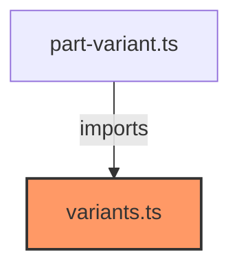

# variants.ts

**Path:** `styles/components/variants.ts`  
**Line Count:** 174  
**Functions:** 0  

## Overview

This file is part of the `styles/components` directory.

## Imports

- lit: css

## Exports

- `variantStyles`

## Dependencies

