# websocket-manager.ts

**Path:** `services/websocket-manager.ts`  
**Line Count:** 412  
**Functions:** 19  

## Overview

This file is part of the `services` directory.

## Imports

- [[logger|logger]]: Logger

## Exports

- `WebSocketManager`

## Functions

### Class: WebSocketManager

### `getInstance` (🌐 Public) {#getInstance}

**Returns:** `WebSocketManager`

**Called By:**

- From [[base-layout|base-layout]]:
  - `_safeGetParameterService`
  - `_loadData`
  - `getParts`
  - `updated`
  - `updateFilteredParts`
- From [[variant-handler|variant-handler]]:
  - `processItems`
- From [[detail-layout|detail-layout]]:
  - `_updateVisualModifiers`
- From [[grid-layout|grid-layout]]:
  - `_setupWebSocketConnection`
  - `_cleanupListeners`
  - `_actuallyFilterParts`
  - `_updateVisualModifiers`
  - `render`
- From [[list-layout|list-layout]]:
  - `_updateVisualModifiers`
  - `render`
- From [[parts-layout|parts-layout]]:
  - `loadPartsFromEntities`
  - `_updateVisualModifiers`
- From [[editor|editor]]:
  - `_renderDebuggingSection`
- From [[inventree-card|inventree-card]]:
  - `connectedCallback`
  - `_resetApiFailures`
  - `_initializeServices`
- From [[card-controller|card-controller]]:
  - `setHass`
  - `initializeServices`
  - `loadEntityData`
  - `getParts`
  - `getWebSocketService`
  - `initializeWebSocketPlugin`
  - `handleWebSocketMessage`
  - `getWebSocketDiagnostics`
- From [[parameter-service|parameter-service]]:
  - `getParameterValueFromPart`
  - `isDirectPartReference`
  - `getParameterValueWithDirectReference`
  - `findEntityForPart`
  - `storeOrphanedParameter`
  - `isOrphanedPart`
  - `getOrphanedPartIds`
  - `getOrphanedPartParameters`
  - `findParameterInWebSocketData`
  - `findParameterInApiData`
  - `findParameterInHassData`
  - `findParameterInAllEntities`
  - `syncApiDataToEntityState`
  - `getParameterFromEntity`
- From [[rendering-service|rendering-service]]:
  - `startIdleTimer`
- From [[variant-service|variant-service]]:
  - `processVariants`
- From [[websocket-plugin|websocket-plugin]]:
  - `_handleParameterUpdate`
- From [[websocket|websocket]]:
  - `_updateEntityState`

**Call Graph:**

```mermaid
flowchart LR
    getInstance[getInstance]:::current
    _safeGetParameterService[_safeGetParameterService]
    _safeGetParameterService -->|calls| getInstance
    _loadData[_loadData]
    _loadData -->|calls| getInstance
    getParts[getParts]
    getParts -->|calls| getInstance
    updated[updated]
    updated -->|calls| getInstance
    updateFilteredParts[updateFilteredParts]
    updateFilteredParts -->|calls| getInstance
    processItems[processItems]
    processItems -->|calls| getInstance
    _updateVisualModifiers[_updateVisualModifiers]
    _updateVisualModifiers -->|calls| getInstance
    _setupWebSocketConnection[_setupWebSocketConnection]
    _setupWebSocketConnection -->|calls| getInstance
    _cleanupListeners[_cleanupListeners]
    _cleanupListeners -->|calls| getInstance
    _actuallyFilterParts[_actuallyFilterParts]
    _actuallyFilterParts -->|calls| getInstance
    render[render]
    render -->|calls| getInstance
    loadPartsFromEntities[loadPartsFromEntities]
    loadPartsFromEntities -->|calls| getInstance
    _renderDebuggingSection[_renderDebuggingSection]
    _renderDebuggingSection -->|calls| getInstance
    connectedCallback[connectedCallback]
    connectedCallback -->|calls| getInstance
    _resetApiFailures[_resetApiFailures]
    _resetApiFailures -->|calls| getInstance
    _initializeServices[_initializeServices]
    _initializeServices -->|calls| getInstance
    setHass[setHass]
    setHass -->|calls| getInstance
    initializeServices[initializeServices]
    initializeServices -->|calls| getInstance
    loadEntityData[loadEntityData]
    loadEntityData -->|calls| getInstance
    getWebSocketService[getWebSocketService]
    getWebSocketService -->|calls| getInstance
    initializeWebSocketPlugin[initializeWebSocketPlugin]
    initializeWebSocketPlugin -->|calls| getInstance
    handleWebSocketMessage[handleWebSocketMessage]
    handleWebSocketMessage -->|calls| getInstance
    getWebSocketDiagnostics[getWebSocketDiagnostics]
    getWebSocketDiagnostics -->|calls| getInstance
    getParameterValueFromPart[getParameterValueFromPart]
    getParameterValueFromPart -->|calls| getInstance
    isDirectPartReference[isDirectPartReference]
    isDirectPartReference -->|calls| getInstance
    getParameterValueWithDirectReference[getParameterValueWithDirectReference]
    getParameterValueWithDirectReference -->|calls| getInstance
    findEntityForPart[findEntityForPart]
    findEntityForPart -->|calls| getInstance
    storeOrphanedParameter[storeOrphanedParameter]
    storeOrphanedParameter -->|calls| getInstance
    isOrphanedPart[isOrphanedPart]
    isOrphanedPart -->|calls| getInstance
    getOrphanedPartIds[getOrphanedPartIds]
    getOrphanedPartIds -->|calls| getInstance
    getOrphanedPartParameters[getOrphanedPartParameters]
    getOrphanedPartParameters -->|calls| getInstance
    findParameterInWebSocketData[findParameterInWebSocketData]
    findParameterInWebSocketData -->|calls| getInstance
    findParameterInApiData[findParameterInApiData]
    findParameterInApiData -->|calls| getInstance
    findParameterInHassData[findParameterInHassData]
    findParameterInHassData -->|calls| getInstance
    findParameterInAllEntities[findParameterInAllEntities]
    findParameterInAllEntities -->|calls| getInstance
    syncApiDataToEntityState[syncApiDataToEntityState]
    syncApiDataToEntityState -->|calls| getInstance
    getParameterFromEntity[getParameterFromEntity]
    getParameterFromEntity -->|calls| getInstance
    startIdleTimer[startIdleTimer]
    startIdleTimer -->|calls| getInstance
    processVariants[processVariants]
    processVariants -->|calls| getInstance
    _handleParameterUpdate[_handleParameterUpdate]
    _handleParameterUpdate -->|calls| getInstance
    _updateEntityState[_updateEntityState]
    _updateEntityState -->|calls| getInstance
    classDef current fill:#f96,stroke:#333,stroke-width:2px;
```

### `getConnection` (🌐 Public) {#getConnection}

**Parameters:**

- `url`: `string`
- `onOpen`: `(event: Event) => void`
- `onMessage`: `(event: MessageEvent) => void`

**Returns:** `WebSocket | null`

**Calls:**

- [[cache|cache]]#has
- [[cache|cache]]#get
- [[websocket-manager|websocket-manager]]#addOpenCallback
- [[websocket-manager|websocket-manager]]#addMessageCallback
- [[logger|logger]]#log
- [[websocket-manager|websocket-manager]]#closeConnection
- [[cache|cache]]#set
- [[cache|cache]]#set
- [[websocket-manager|websocket-manager]]#handleOpen
- [[websocket-manager|websocket-manager]]#handleMessage
- [[websocket-manager|websocket-manager]]#handleError
- [[websocket-manager|websocket-manager]]#handleClose
- [[websocket-manager|websocket-manager]]#setupKeepAlive
- [[logger|logger]]#error

**Called By:**

- From [[grid-layout|grid-layout]]:
  - `_setupWebSocketConnection`
- From [[websocket-manager|websocket-manager]]:
  - `handleClose`
- From [[websocket-plugin|websocket-plugin]]:
  - `connect`

**Call Graph:**

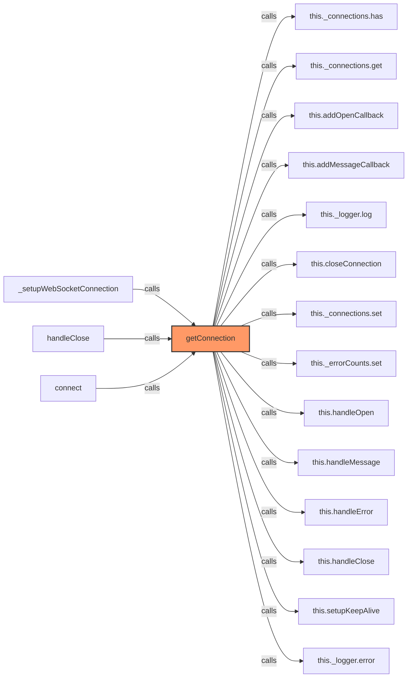

### `addOpenCallback` (🌐 Public) {#addOpenCallback}

**Parameters:**

- `url`: `string`
- `callback`: `(event: Event) => void`

**Returns:** `void`

**Calls:**

- [[cache|cache]]#has
- [[cache|cache]]#set
- `this._openCallbacks.get(url).add`
- [[cache|cache]]#get

**Called By:**

- From [[websocket-manager|websocket-manager]]:
  - `getConnection`
  - `handleClose`

**Call Graph:**

```mermaid
flowchart LR
    addOpenCallback[addOpenCallback]:::current
    this__openCallbacks_has[this._openCallbacks.has]
    addOpenCallback -->|calls| this__openCallbacks_has
    this__openCallbacks_set[this._openCallbacks.set]
    addOpenCallback -->|calls| this__openCallbacks_set
    this__openCallbacks_get_url__add[this._openCallbacks.get(url).add]
    addOpenCallback -->|calls| this__openCallbacks_get_url__add
    this__openCallbacks_get[this._openCallbacks.get]
    addOpenCallback -->|calls| this__openCallbacks_get
    getConnection[getConnection]
    getConnection -->|calls| addOpenCallback
    handleClose[handleClose]
    handleClose -->|calls| addOpenCallback
    classDef current fill:#f96,stroke:#333,stroke-width:2px;
```

### `addMessageCallback` (🌐 Public) {#addMessageCallback}

**Parameters:**

- `url`: `string`
- `callback`: `(event: MessageEvent) => void`

**Returns:** `void`

**Calls:**

- [[cache|cache]]#has
- [[cache|cache]]#set
- `this._messageCallbacks.get(url).add`
- [[cache|cache]]#get

**Called By:**

- From [[websocket-manager|websocket-manager]]:
  - `getConnection`
  - `handleClose`

**Call Graph:**

```mermaid
flowchart LR
    addMessageCallback[addMessageCallback]:::current
    this__messageCallbacks_has[this._messageCallbacks.has]
    addMessageCallback -->|calls| this__messageCallbacks_has
    this__messageCallbacks_set[this._messageCallbacks.set]
    addMessageCallback -->|calls| this__messageCallbacks_set
    this__messageCallbacks_get_url__add[this._messageCallbacks.get(url).add]
    addMessageCallback -->|calls| this__messageCallbacks_get_url__add
    this__messageCallbacks_get[this._messageCallbacks.get]
    addMessageCallback -->|calls| this__messageCallbacks_get
    getConnection[getConnection]
    getConnection -->|calls| addMessageCallback
    handleClose[handleClose]
    handleClose -->|calls| addMessageCallback
    classDef current fill:#f96,stroke:#333,stroke-width:2px;
```

### `removeCallbacks` (🌐 Public) {#removeCallbacks}

**Parameters:**

- `url`: `string`
- `openCallback`: `(event: Event) => void`
- `messageCallback`: `(event: MessageEvent) => void`

**Returns:** `void`

**Calls:**

- [[cache|cache]]#has
- [[cache|cache]]#delete
- [[cache|cache]]#get
- [[cache|cache]]#has
- [[cache|cache]]#delete
- [[cache|cache]]#get
- [[logger|logger]]#log
- [[websocket-manager|websocket-manager]]#closeConnection

**Called By:**

- From [[grid-layout|grid-layout]]:
  - `_cleanupListeners`

**Call Graph:**

```mermaid
flowchart LR
    removeCallbacks[removeCallbacks]:::current
    this__openCallbacks_has[this._openCallbacks.has]
    removeCallbacks -->|calls| this__openCallbacks_has
    this__openCallbacks_get_url__delete[this._openCallbacks.get(url).delete]
    removeCallbacks -->|calls| this__openCallbacks_get_url__delete
    this__openCallbacks_get[this._openCallbacks.get]
    removeCallbacks -->|calls| this__openCallbacks_get
    this__messageCallbacks_has[this._messageCallbacks.has]
    removeCallbacks -->|calls| this__messageCallbacks_has
    this__messageCallbacks_get_url__delete[this._messageCallbacks.get(url).delete]
    removeCallbacks -->|calls| this__messageCallbacks_get_url__delete
    this__messageCallbacks_get[this._messageCallbacks.get]
    removeCallbacks -->|calls| this__messageCallbacks_get
    this__logger_log[this._logger.log]
    removeCallbacks -->|calls| this__logger_log
    this_closeConnection[this.closeConnection]
    removeCallbacks -->|calls| this_closeConnection
    _cleanupListeners[_cleanupListeners]
    _cleanupListeners -->|calls| removeCallbacks
    classDef current fill:#f96,stroke:#333,stroke-width:2px;
```

### `closeConnection` (🌐 Public) {#closeConnection}

**Parameters:**

- `url`: `string`

**Returns:** `void`

**Calls:**

- [[cache|cache]]#get
- `connection.close`
- [[cache|cache]]#delete
- [[cache|cache]]#has
- [[cache|cache]]#get
- [[cache|cache]]#delete
- [[cache|cache]]#has
- [[cache|cache]]#get
- [[cache|cache]]#delete
- [[cache|cache]]#delete
- [[cache|cache]]#delete

**Called By:**

- From [[websocket-manager|websocket-manager]]:
  - `getConnection`
  - `removeCallbacks`
  - `closeAllConnections`
- From [[websocket-plugin|websocket-plugin]]:
  - `disconnect`

**Call Graph:**

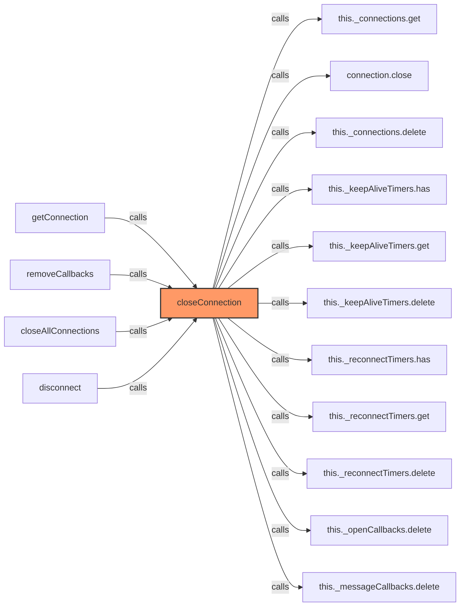

### `closeAllConnections` (🌐 Public) {#closeAllConnections}

**Returns:** `void`

**Calls:**

- `this._connections.keys`
- [[websocket-manager|websocket-manager]]#closeConnection
- [[logger|logger]]#log

**Called By:**

- From [[websocket-manager|websocket-manager]]:
  - `destroy`

**Call Graph:**

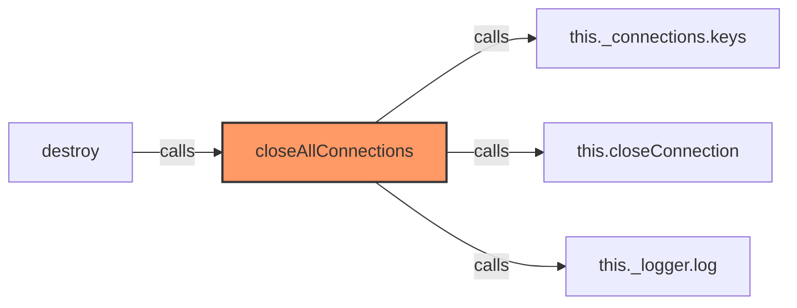

### `handleOpen` (🌐 Public) {#handleOpen}

**Parameters:**

- `event`: `Event`
- `url`: `string`

**Returns:** `void`

**Calls:**

- [[logger|logger]]#log
- [[cache|cache]]#set
- [[cache|cache]]#has
- [[cache|cache]]#get
- `callback`
- [[logger|logger]]#error

**Called By:**

- From [[websocket-manager|websocket-manager]]:
  - `getConnection`

**Call Graph:**

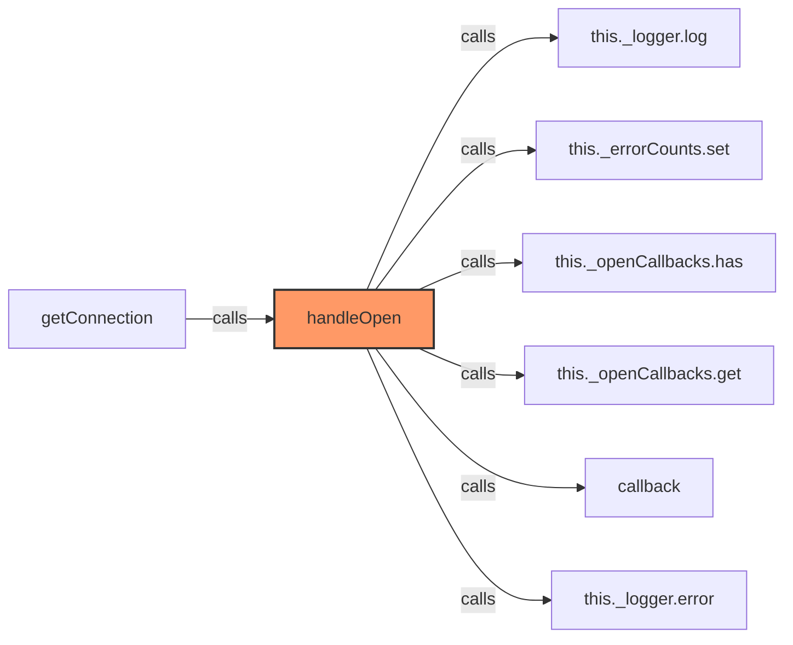

### `handleMessage` (🌐 Public) {#handleMessage}

**Parameters:**

- `event`: `MessageEvent`
- `url`: `string`

**Returns:** `void`

**Calls:**

- `JSON.parse`
- [[websocket-manager|websocket-manager]]#_handleBasicMessage
- [[cache|cache]]#has
- [[logger|logger]]#log
- `this._processingMessages.add`
- `setTimeout`
- [[cache|cache]]#delete
- [[cache|cache]]#has
- [[cache|cache]]#get
- `callback`
- [[logger|logger]]#error

**Called By:**

- From [[websocket-manager|websocket-manager]]:
  - `getConnection`

**Call Graph:**

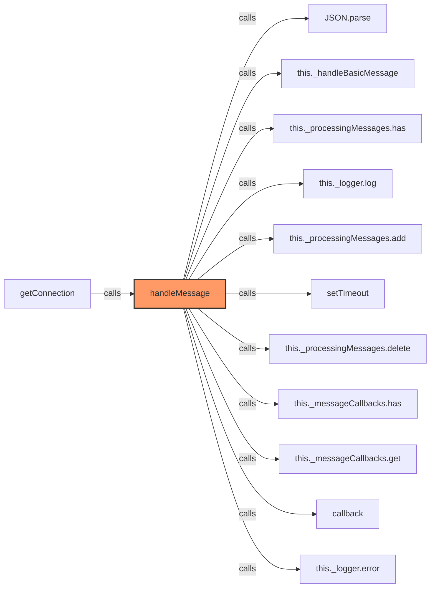

### `_handleBasicMessage` (🔒 Private) {#_handleBasicMessage}

**Parameters:**

- `message`: `any`
- `url`: `string`

**Returns:** `void`

**Calls:**

- [[cache|cache]]#get
- `connection.send`
- `JSON.stringify`
- `Date.now`
- [[logger|logger]]#error

**Called By:**

- From [[websocket-manager|websocket-manager]]:
  - `handleMessage`

**Call Graph:**

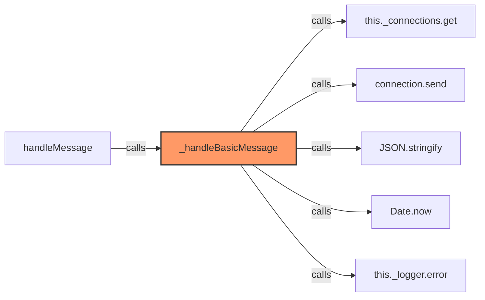

### `handleError` (🌐 Public) {#handleError}

**Parameters:**

- `event`: `Event`
- `url`: `string`

**Returns:** `void`

**Calls:**

- [[cache|cache]]#get
- [[cache|cache]]#set
- [[logger|logger]]#error

**Called By:**

- From [[websocket-manager|websocket-manager]]:
  - `getConnection`

**Call Graph:**

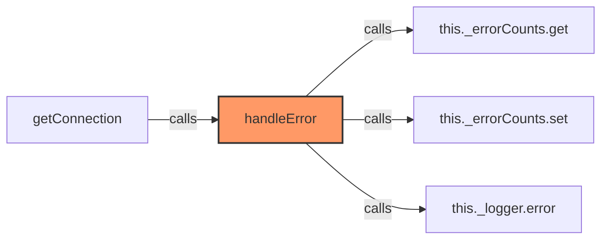

### `handleClose` (🌐 Public) {#handleClose}

**Parameters:**

- `event`: `CloseEvent`
- `url`: `string`

**Returns:** `void`

**Calls:**

- [[logger|logger]]#log
- [[cache|cache]]#delete
- [[cache|cache]]#has
- [[cache|cache]]#get
- [[cache|cache]]#delete
- [[cache|cache]]#get
- `Math.min`
- `Math.pow`
- [[cache|cache]]#get
- [[cache|cache]]#get
- [[cache|cache]]#delete
- [[cache|cache]]#delete
- [[websocket-manager|websocket-manager]]#getConnection
- [[websocket-manager|websocket-manager]]#addOpenCallback
- [[websocket-manager|websocket-manager]]#addMessageCallback
- [[cache|cache]]#set

**Called By:**

- From [[websocket-manager|websocket-manager]]:
  - `getConnection`

**Call Graph:**

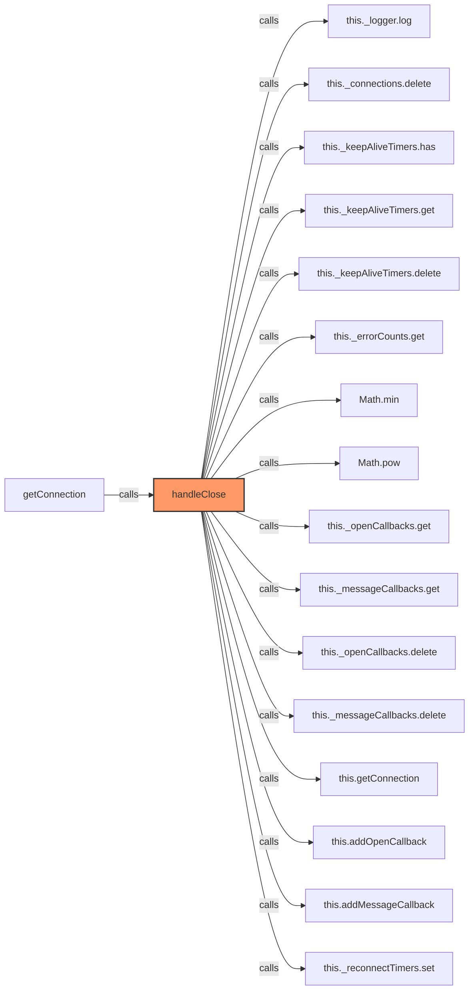

### `setupKeepAlive` (🌐 Public) {#setupKeepAlive}

**Parameters:**

- `url`: `string`

**Returns:** `void`

**Calls:**

- [[cache|cache]]#has
- [[cache|cache]]#get
- [[cache|cache]]#get
- `connection.send`
- `JSON.stringify`
- `Date.now`
- [[logger|logger]]#error
- [[cache|cache]]#set

**Called By:**

- From [[websocket-manager|websocket-manager]]:
  - `getConnection`

**Call Graph:**

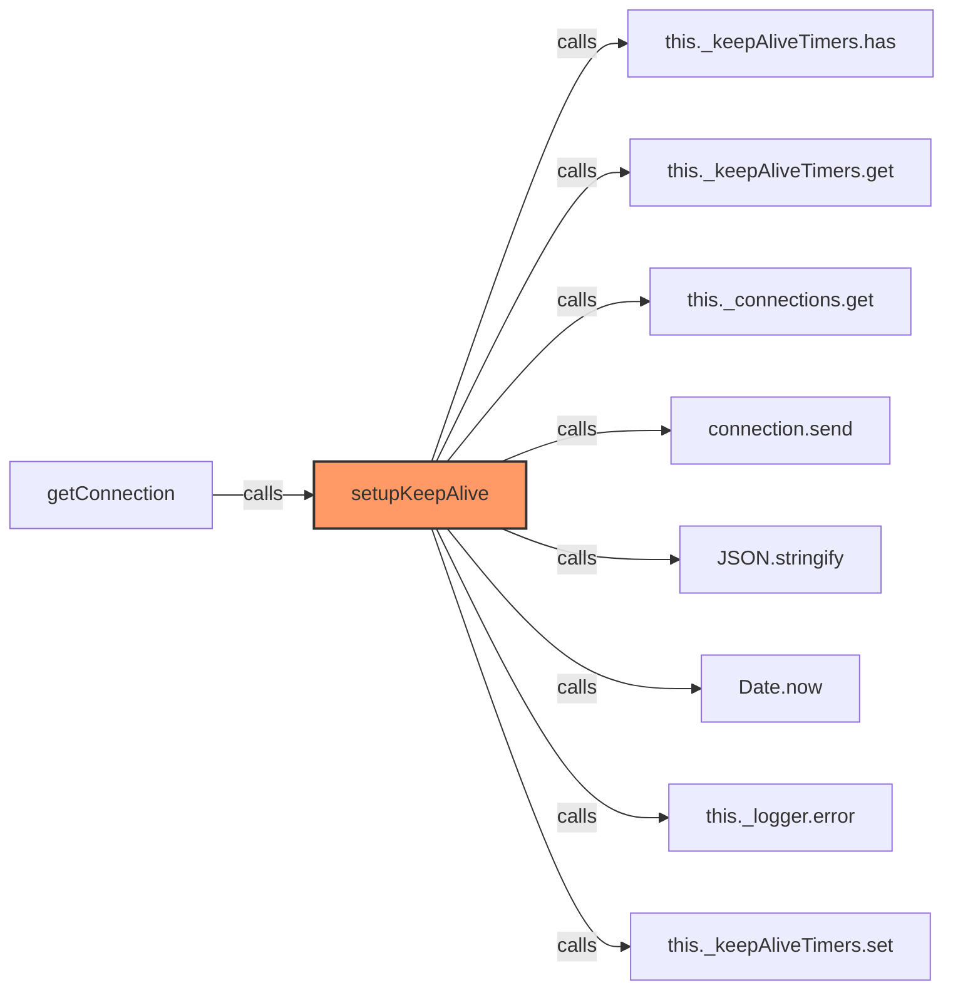

### `destroy` (🌐 Public) {#destroy}

**Returns:** `void`

**Calls:**

- [[websocket-manager|websocket-manager]]#closeAllConnections

**Called By:**

- From [[inventree-card|inventree-card]]:
  - `disconnectedCallback`

**Call Graph:**

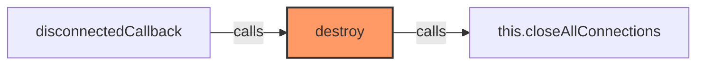

### `isConnected` (🌐 Public) {#isConnected}

**Parameters:**

- `url`: `string`

**Returns:** `boolean`

**Calls:**

- [[cache|cache]]#has
- [[cache|cache]]#get

**Called By:**

- From [[websocket|websocket]]:
  - `getDiagnostics`
  - `getConnectionStatus`

**Call Graph:**

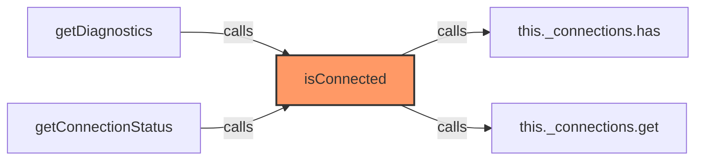

### `getStats` (🌐 Public) {#getStats}

**Returns:** `{ activeConnections: number, connections: Record<string, any> }`

**Calls:**

- `this._connections.entries`
- [[websocket-manager|websocket-manager]]#getReadyStateString
- [[cache|cache]]#get
- [[cache|cache]]#get
- [[cache|cache]]#get
- [[cache|cache]]#has
- [[cache|cache]]#has

**Called By:**

- From [[card-controller|card-controller]]:
  - `getWebSocketDiagnostics`
- From [[websocket-manager|websocket-manager]]:
  - `getEnhancedStats`

**Call Graph:**

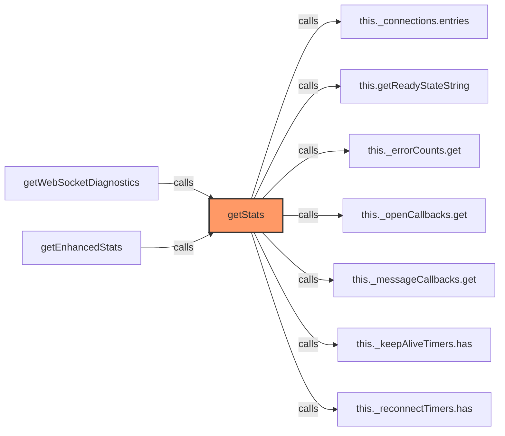

### `getReadyStateString` (🌐 Public) {#getReadyStateString}

**Parameters:**

- `state`: `number`

**Returns:** `string`

**Called By:**

- From [[websocket-manager|websocket-manager]]:
  - `getStats`

**Call Graph:**

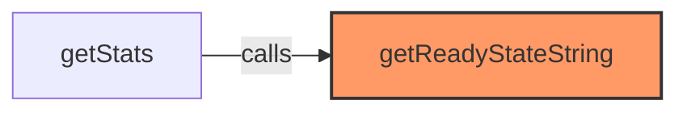

### `_recordActivity` (🔒 Private) {#_recordActivity}

**Parameters:**

- `url`: `string`
- `type`: `'received' | 'sent' | 'error'`

**Returns:** `void`

**Calls:**

- [[cache|cache]]#has
- [[cache|cache]]#set
- `Date.now`
- [[cache|cache]]#get

**Call Graph:**

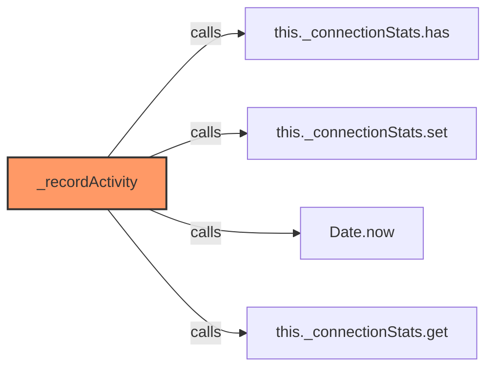

### `getEnhancedStats` (🌐 Public) {#getEnhancedStats}

**Returns:** `{ activeConnections: number, connections: Record<string, any> }`

**Calls:**

- [[cache|cache]]#getStats
- `this._connections.entries`
- [[cache|cache]]#get

**Call Graph:**

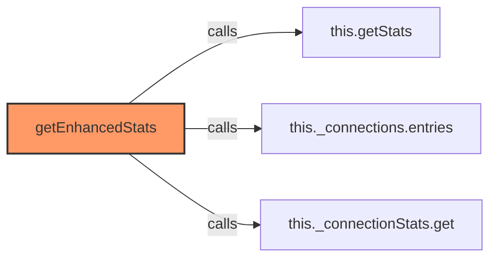

## Dependencies

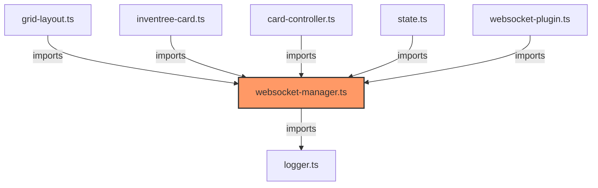

