# websocket-plugin.ts

**Path:** `services/websocket-plugin.ts`  
**Line Count:** 413  
**Functions:** 13  

## Overview

This file is part of the `services` directory.

## Imports

- [[inventree-state|inventree-state]]: InventTreeState
- [[websocket-manager|websocket-manager]]: WebSocketManager
- [[rendering-service|rendering-service]]: RenderingService
- [[logger|logger]]: Logger
- [[cache|cache]]: CacheService
- [[parameter-service|parameter-service]]: ParameterService

## Exports

- `WebSocketPlugin`

## Functions

### Class: WebSocketPlugin

### `getInstance` (🌐 Public) {#getInstance}

**Returns:** `WebSocketPlugin`

**Called By:**

- From [[base-layout|base-layout]]:
  - `_safeGetParameterService`
  - `_loadData`
  - `getParts`
  - `updated`
  - `updateFilteredParts`
- From [[variant-handler|variant-handler]]:
  - `processItems`
- From [[detail-layout|detail-layout]]:
  - `_updateVisualModifiers`
- From [[grid-layout|grid-layout]]:
  - `_setupWebSocketConnection`
  - `_cleanupListeners`
  - `_actuallyFilterParts`
  - `_updateVisualModifiers`
  - `render`
- From [[list-layout|list-layout]]:
  - `_updateVisualModifiers`
  - `render`
- From [[parts-layout|parts-layout]]:
  - `loadPartsFromEntities`
  - `_updateVisualModifiers`
- From [[editor|editor]]:
  - `_renderDebuggingSection`
- From [[inventree-card|inventree-card]]:
  - `connectedCallback`
  - `_resetApiFailures`
  - `_initializeServices`
- From [[card-controller|card-controller]]:
  - `setHass`
  - `initializeServices`
  - `loadEntityData`
  - `getParts`
  - `getWebSocketService`
  - `initializeWebSocketPlugin`
  - `handleWebSocketMessage`
  - `getWebSocketDiagnostics`
- From [[parameter-service|parameter-service]]:
  - `getParameterValueFromPart`
  - `isDirectPartReference`
  - `getParameterValueWithDirectReference`
  - `findEntityForPart`
  - `storeOrphanedParameter`
  - `isOrphanedPart`
  - `getOrphanedPartIds`
  - `getOrphanedPartParameters`
  - `findParameterInWebSocketData`
  - `findParameterInApiData`
  - `findParameterInHassData`
  - `findParameterInAllEntities`
  - `syncApiDataToEntityState`
  - `getParameterFromEntity`
- From [[rendering-service|rendering-service]]:
  - `startIdleTimer`
- From [[variant-service|variant-service]]:
  - `processVariants`
- From [[websocket-plugin|websocket-plugin]]:
  - `_handleParameterUpdate`
- From [[websocket|websocket]]:
  - `_updateEntityState`

**Call Graph:**

```mermaid
flowchart LR
    getInstance[getInstance]:::current
    _safeGetParameterService[_safeGetParameterService]
    _safeGetParameterService -->|calls| getInstance
    _loadData[_loadData]
    _loadData -->|calls| getInstance
    getParts[getParts]
    getParts -->|calls| getInstance
    updated[updated]
    updated -->|calls| getInstance
    updateFilteredParts[updateFilteredParts]
    updateFilteredParts -->|calls| getInstance
    processItems[processItems]
    processItems -->|calls| getInstance
    _updateVisualModifiers[_updateVisualModifiers]
    _updateVisualModifiers -->|calls| getInstance
    _setupWebSocketConnection[_setupWebSocketConnection]
    _setupWebSocketConnection -->|calls| getInstance
    _cleanupListeners[_cleanupListeners]
    _cleanupListeners -->|calls| getInstance
    _actuallyFilterParts[_actuallyFilterParts]
    _actuallyFilterParts -->|calls| getInstance
    render[render]
    render -->|calls| getInstance
    loadPartsFromEntities[loadPartsFromEntities]
    loadPartsFromEntities -->|calls| getInstance
    _renderDebuggingSection[_renderDebuggingSection]
    _renderDebuggingSection -->|calls| getInstance
    connectedCallback[connectedCallback]
    connectedCallback -->|calls| getInstance
    _resetApiFailures[_resetApiFailures]
    _resetApiFailures -->|calls| getInstance
    _initializeServices[_initializeServices]
    _initializeServices -->|calls| getInstance
    setHass[setHass]
    setHass -->|calls| getInstance
    initializeServices[initializeServices]
    initializeServices -->|calls| getInstance
    loadEntityData[loadEntityData]
    loadEntityData -->|calls| getInstance
    getWebSocketService[getWebSocketService]
    getWebSocketService -->|calls| getInstance
    initializeWebSocketPlugin[initializeWebSocketPlugin]
    initializeWebSocketPlugin -->|calls| getInstance
    handleWebSocketMessage[handleWebSocketMessage]
    handleWebSocketMessage -->|calls| getInstance
    getWebSocketDiagnostics[getWebSocketDiagnostics]
    getWebSocketDiagnostics -->|calls| getInstance
    getParameterValueFromPart[getParameterValueFromPart]
    getParameterValueFromPart -->|calls| getInstance
    isDirectPartReference[isDirectPartReference]
    isDirectPartReference -->|calls| getInstance
    getParameterValueWithDirectReference[getParameterValueWithDirectReference]
    getParameterValueWithDirectReference -->|calls| getInstance
    findEntityForPart[findEntityForPart]
    findEntityForPart -->|calls| getInstance
    storeOrphanedParameter[storeOrphanedParameter]
    storeOrphanedParameter -->|calls| getInstance
    isOrphanedPart[isOrphanedPart]
    isOrphanedPart -->|calls| getInstance
    getOrphanedPartIds[getOrphanedPartIds]
    getOrphanedPartIds -->|calls| getInstance
    getOrphanedPartParameters[getOrphanedPartParameters]
    getOrphanedPartParameters -->|calls| getInstance
    findParameterInWebSocketData[findParameterInWebSocketData]
    findParameterInWebSocketData -->|calls| getInstance
    findParameterInApiData[findParameterInApiData]
    findParameterInApiData -->|calls| getInstance
    findParameterInHassData[findParameterInHassData]
    findParameterInHassData -->|calls| getInstance
    findParameterInAllEntities[findParameterInAllEntities]
    findParameterInAllEntities -->|calls| getInstance
    syncApiDataToEntityState[syncApiDataToEntityState]
    syncApiDataToEntityState -->|calls| getInstance
    getParameterFromEntity[getParameterFromEntity]
    getParameterFromEntity -->|calls| getInstance
    startIdleTimer[startIdleTimer]
    startIdleTimer -->|calls| getInstance
    processVariants[processVariants]
    processVariants -->|calls| getInstance
    _handleParameterUpdate[_handleParameterUpdate]
    _handleParameterUpdate -->|calls| getInstance
    _updateEntityState[_updateEntityState]
    _updateEntityState -->|calls| getInstance
    classDef current fill:#f96,stroke:#333,stroke-width:2px;
```

### `configure` (🌐 Public) {#configure}

**Parameters:**

- `config`: `InvenTreeWebSocketConfig`

**Returns:** `void`

**Calls:**

- [[websocket-plugin|websocket-plugin]]#connect
- [[websocket-plugin|websocket-plugin]]#disconnect

**Called By:**

- From [[inventree-card|inventree-card]]:
  - `connectedCallback`
  - `_initializeServices`
- From [[card-controller|card-controller]]:
  - `initializeWebSocketPlugin`

**Call Graph:**

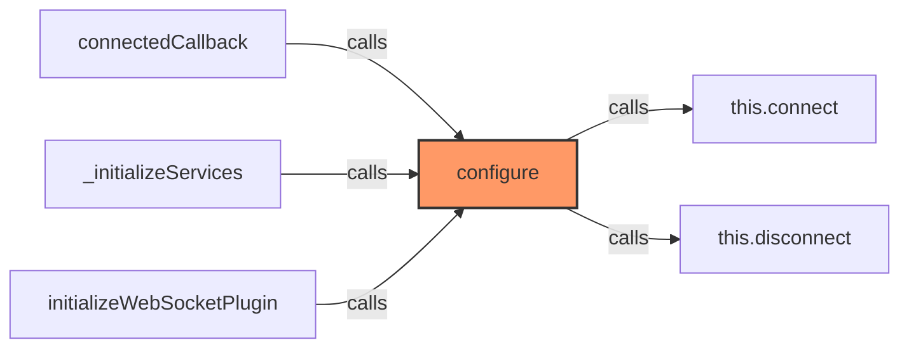

### `connect` (🌐 Public) {#connect}

**Returns:** `void`

**Calls:**

- [[logger|logger]]#warn
- [[logger|logger]]#log
- [[websocket-manager|websocket-manager]]#getConnection
- `this._handleOpen.bind`
- `this._handleMessage.bind`
- [[logger|logger]]#error
- [[websocket-plugin|websocket-plugin]]#_scheduleReconnect

**Called By:**

- From [[card-controller|card-controller]]:
  - `initializeWebSocketPlugin`
- From [[websocket-plugin|websocket-plugin]]:
  - `configure`
  - `_scheduleReconnect`

**Call Graph:**

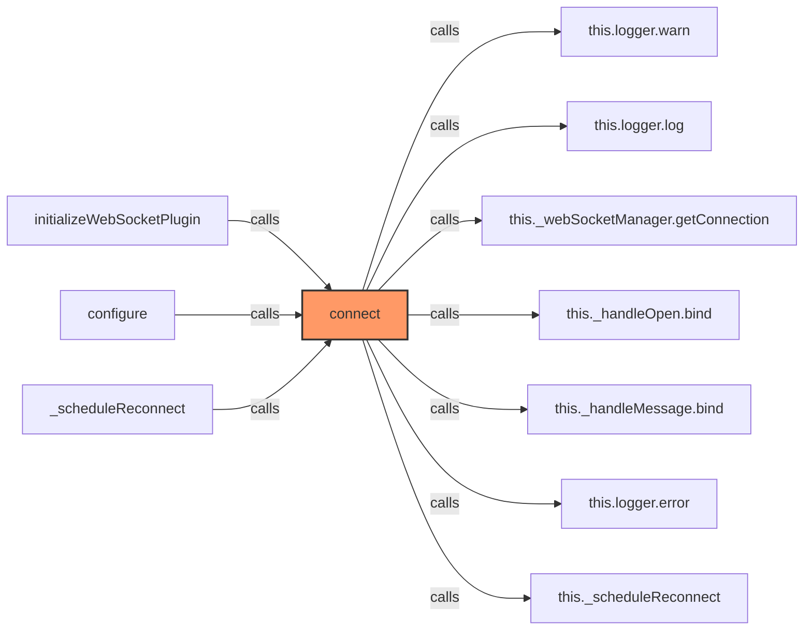

### `disconnect` (🌐 Public) {#disconnect}

**Returns:** `void`

**Calls:**

- [[websocket-manager|websocket-manager]]#closeConnection
- [[logger|logger]]#log

**Called By:**

- From [[websocket-plugin|websocket-plugin]]:
  - `configure`

**Call Graph:**

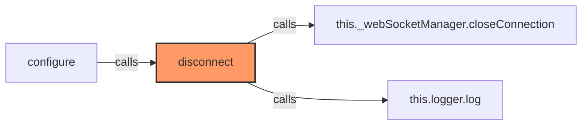

### `onMessage` (🌐 Public) {#onMessage}

**Parameters:**

- `callback`: `(message: any) => void`

**Returns:** `() => void`

**Calls:**

- `this._messageCallbacks.push`
- `this._messageCallbacks.indexOf`
- `this._messageCallbacks.splice`

**Called By:**

- From [[card-controller|card-controller]]:
  - `initializeWebSocketPlugin`

**Call Graph:**

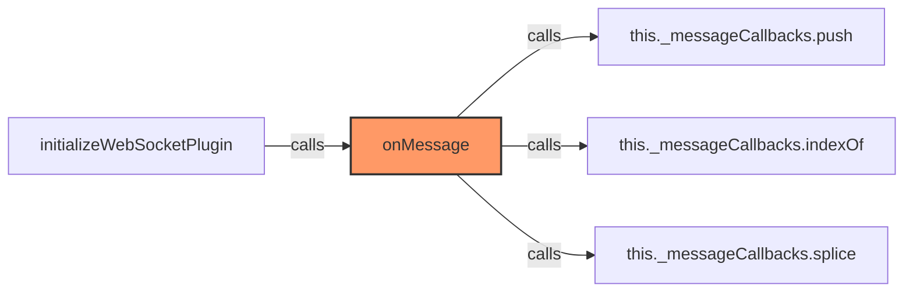

### `_handleOpen` (🔒 Private) {#_handleOpen}

**Parameters:**

- `event`: `Event`

**Returns:** `void`

**Calls:**

- [[logger|logger]]#log

**Call Graph:**

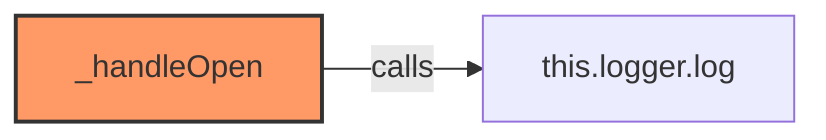

### `_handleMessage` (🔒 Private) {#_handleMessage}

**Parameters:**

- `event`: `MessageEvent`

**Returns:** `void`

**Calls:**

- `JSON.parse`
- `Date.now`
- [[websocket-plugin|websocket-plugin]]#_getMessageId
- [[cache|cache]]#has
- [[logger|logger]]#log
- [[cache|cache]]#set
- `this._messageCallbacks.forEach`
- `callback`
- [[logger|logger]]#error
- [[websocket-plugin|websocket-plugin]]#_processMessage

**Call Graph:**

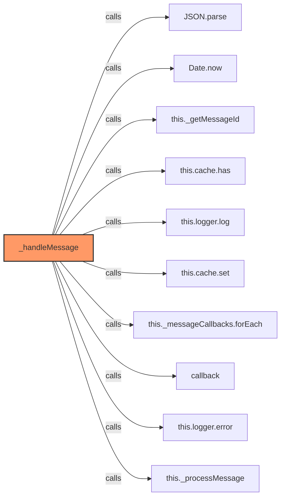

### `_getMessageId` (🔒 Private) {#_getMessageId}

**Parameters:**

- `message`: `any`

**Returns:** `string | null`

**Called By:**

- From [[websocket-plugin|websocket-plugin]]:
  - `_handleMessage`

**Call Graph:**

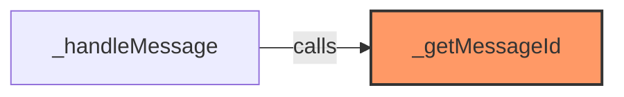

### `_processMessage` (🔒 Private) {#_processMessage}

**Parameters:**

- `message`: `any`

**Returns:** `void`

**Calls:**

- [[logger|logger]]#log
- `JSON.stringify(message).substring`
- `JSON.stringify`
- [[websocket-plugin|websocket-plugin]]#_handleParameterUpdate
- [[logger|logger]]#warn

**Called By:**

- From [[websocket-plugin|websocket-plugin]]:
  - `_handleMessage`
- From [[websocket|websocket]]:
  - `_handleEntityMessage`

**Call Graph:**

```mermaid
flowchart LR
    _processMessage[_processMessage]:::current
    this_logger_log[this.logger.log]
    _processMessage -->|calls| this_logger_log
    JSON_stringify_message__substring[JSON.stringify(message).substring]
    _processMessage -->|calls| JSON_stringify_message__substring
    JSON_stringify[JSON.stringify]
    _processMessage -->|calls| JSON_stringify
    this__handleParameterUpdate[this._handleParameterUpdate]
    _processMessage -->|calls| this__handleParameterUpdate
    this_logger_warn[this.logger.warn]
    _processMessage -->|calls| this_logger_warn
    _handleMessage[_handleMessage]
    _handleMessage -->|calls| _processMessage
    _handleEntityMessage[_handleEntityMessage]
    _handleEntityMessage -->|calls| _processMessage
    classDef current fill:#f96,stroke:#333,stroke-width:2px;
```

### `_handleParameterUpdate` (🔒 Private) {#_handleParameterUpdate}

**Parameters:**

- `message`: `any`

**Returns:** `void`

**Calls:**

- `String`
- [[logger|logger]]#warn
- [[logger|logger]]#log
- [[inventree-state|inventree-state]]#getInstance
- [[inventree-state|inventree-state]]#getInstance
- [[inventree-state|inventree-state]]#updateParameter
- [[rendering-service|rendering-service]]#restartIdleTimer
- [[parameter-service|parameter-service]]#hasInstance
- [[inventree-state|inventree-state]]#getInstance
- [[inventree-state|inventree-state]]#findEntityForPart
- [[parameter-service|parameter-service]]#markParameterChanged
- [[rendering-service|rendering-service]]#forceRender
- [[logger|logger]]#error

**Called By:**

- From [[websocket-plugin|websocket-plugin]]:
  - `_processMessage`

**Call Graph:**

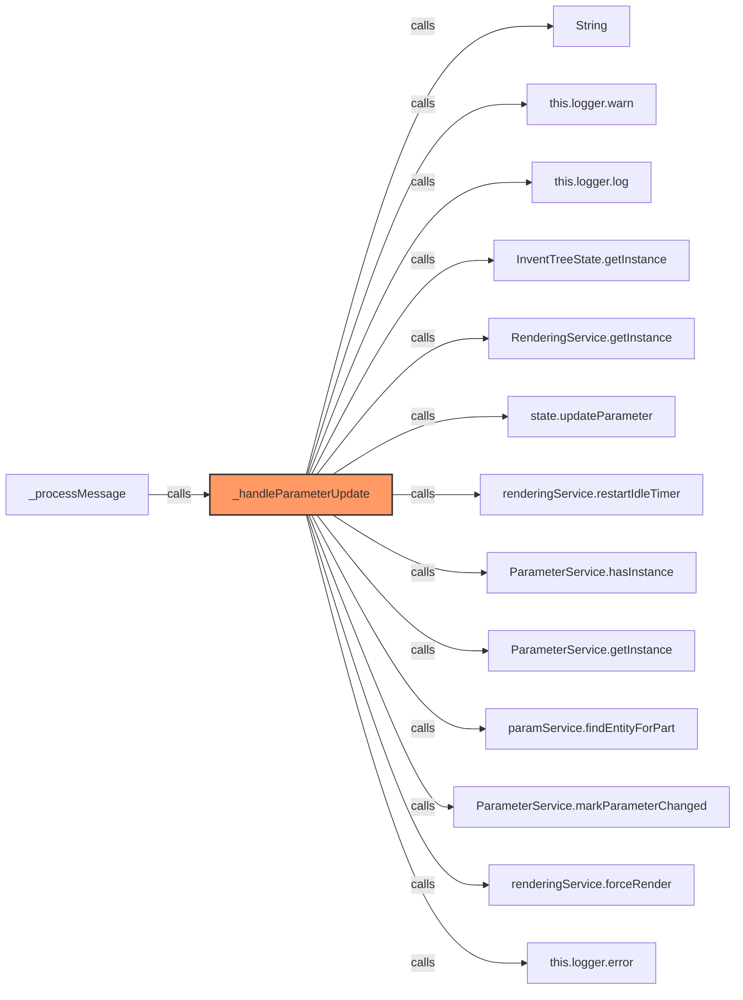

### `_scheduleReconnect` (🔒 Private) {#_scheduleReconnect}

**Returns:** `void`

**Calls:**

- [[logger|logger]]#log
- [[websocket-plugin|websocket-plugin]]#connect

**Called By:**

- From [[websocket-plugin|websocket-plugin]]:
  - `connect`

**Call Graph:**

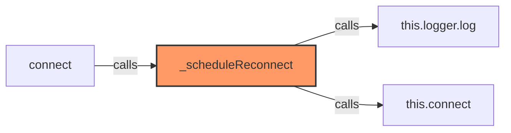

### `isConnected` (🌐 Public) {#isConnected}

**Returns:** `boolean`

**Called By:**

- From [[websocket|websocket]]:
  - `getDiagnostics`
  - `getConnectionStatus`

**Call Graph:**

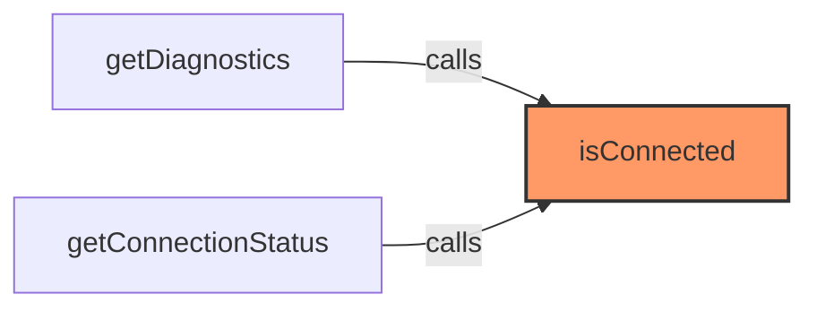

### `getStats` (🌐 Public) {#getStats}

**Returns:** `{
    isConnected: boolean;
    messageCount: number;
    errorCount: number;
    lastMessageTime: number;
  }`

**Called By:**

- From [[card-controller|card-controller]]:
  - `getWebSocketDiagnostics`
- From [[websocket-manager|websocket-manager]]:
  - `getEnhancedStats`

**Call Graph:**

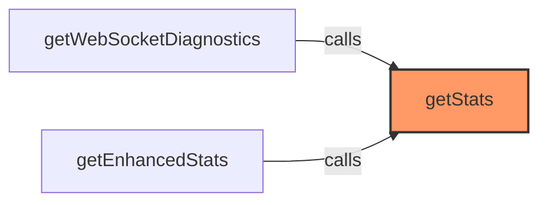

## Dependencies

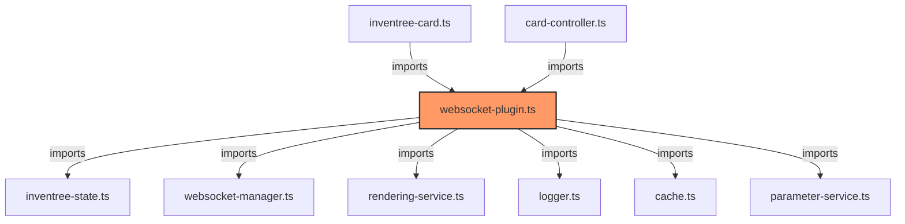

