# websocket.ts

**Path:** `services/websocket.ts`  
**Line Count:** 445  
**Functions:** 20  

## Overview

This file is part of the `services` directory.

## Imports

- custom-card-helpers: HomeAssistant
- [[logger|logger]]: Logger
- [[types|types]]: InventreeItem
- [[inventree-state|inventree-state]]: InventTreeState
- [[api|api]]: InvenTreeDirectAPI

## Exports

- `WebSocketService`

## Functions

### Class: WebSocketService

### `getInstance` (🌐 Public) {#getInstance}

**Returns:** `WebSocketService`

**Called By:**

- From [[base-layout|base-layout]]:
  - `_safeGetParameterService`
  - `_loadData`
  - `getParts`
  - `updated`
  - `updateFilteredParts`
- From [[variant-handler|variant-handler]]:
  - `processItems`
- From [[detail-layout|detail-layout]]:
  - `_updateVisualModifiers`
- From [[grid-layout|grid-layout]]:
  - `_setupWebSocketConnection`
  - `_cleanupListeners`
  - `_actuallyFilterParts`
  - `_updateVisualModifiers`
  - `render`
- From [[list-layout|list-layout]]:
  - `_updateVisualModifiers`
  - `render`
- From [[parts-layout|parts-layout]]:
  - `loadPartsFromEntities`
  - `_updateVisualModifiers`
- From [[editor|editor]]:
  - `_renderDebuggingSection`
- From [[inventree-card|inventree-card]]:
  - `connectedCallback`
  - `_resetApiFailures`
  - `_initializeServices`
- From [[card-controller|card-controller]]:
  - `setHass`
  - `initializeServices`
  - `loadEntityData`
  - `getParts`
  - `getWebSocketService`
  - `initializeWebSocketPlugin`
  - `handleWebSocketMessage`
  - `getWebSocketDiagnostics`
- From [[parameter-service|parameter-service]]:
  - `getParameterValueFromPart`
  - `isDirectPartReference`
  - `getParameterValueWithDirectReference`
  - `findEntityForPart`
  - `storeOrphanedParameter`
  - `isOrphanedPart`
  - `getOrphanedPartIds`
  - `getOrphanedPartParameters`
  - `findParameterInWebSocketData`
  - `findParameterInApiData`
  - `findParameterInHassData`
  - `findParameterInAllEntities`
  - `syncApiDataToEntityState`
  - `getParameterFromEntity`
- From [[rendering-service|rendering-service]]:
  - `startIdleTimer`
- From [[variant-service|variant-service]]:
  - `processVariants`
- From [[websocket-plugin|websocket-plugin]]:
  - `_handleParameterUpdate`
- From [[websocket|websocket]]:
  - `_updateEntityState`

**Call Graph:**

```mermaid
flowchart LR
    getInstance[getInstance]:::current
    _safeGetParameterService[_safeGetParameterService]
    _safeGetParameterService -->|calls| getInstance
    _loadData[_loadData]
    _loadData -->|calls| getInstance
    getParts[getParts]
    getParts -->|calls| getInstance
    updated[updated]
    updated -->|calls| getInstance
    updateFilteredParts[updateFilteredParts]
    updateFilteredParts -->|calls| getInstance
    processItems[processItems]
    processItems -->|calls| getInstance
    _updateVisualModifiers[_updateVisualModifiers]
    _updateVisualModifiers -->|calls| getInstance
    _setupWebSocketConnection[_setupWebSocketConnection]
    _setupWebSocketConnection -->|calls| getInstance
    _cleanupListeners[_cleanupListeners]
    _cleanupListeners -->|calls| getInstance
    _actuallyFilterParts[_actuallyFilterParts]
    _actuallyFilterParts -->|calls| getInstance
    render[render]
    render -->|calls| getInstance
    loadPartsFromEntities[loadPartsFromEntities]
    loadPartsFromEntities -->|calls| getInstance
    _renderDebuggingSection[_renderDebuggingSection]
    _renderDebuggingSection -->|calls| getInstance
    connectedCallback[connectedCallback]
    connectedCallback -->|calls| getInstance
    _resetApiFailures[_resetApiFailures]
    _resetApiFailures -->|calls| getInstance
    _initializeServices[_initializeServices]
    _initializeServices -->|calls| getInstance
    setHass[setHass]
    setHass -->|calls| getInstance
    initializeServices[initializeServices]
    initializeServices -->|calls| getInstance
    loadEntityData[loadEntityData]
    loadEntityData -->|calls| getInstance
    getWebSocketService[getWebSocketService]
    getWebSocketService -->|calls| getInstance
    initializeWebSocketPlugin[initializeWebSocketPlugin]
    initializeWebSocketPlugin -->|calls| getInstance
    handleWebSocketMessage[handleWebSocketMessage]
    handleWebSocketMessage -->|calls| getInstance
    getWebSocketDiagnostics[getWebSocketDiagnostics]
    getWebSocketDiagnostics -->|calls| getInstance
    getParameterValueFromPart[getParameterValueFromPart]
    getParameterValueFromPart -->|calls| getInstance
    isDirectPartReference[isDirectPartReference]
    isDirectPartReference -->|calls| getInstance
    getParameterValueWithDirectReference[getParameterValueWithDirectReference]
    getParameterValueWithDirectReference -->|calls| getInstance
    findEntityForPart[findEntityForPart]
    findEntityForPart -->|calls| getInstance
    storeOrphanedParameter[storeOrphanedParameter]
    storeOrphanedParameter -->|calls| getInstance
    isOrphanedPart[isOrphanedPart]
    isOrphanedPart -->|calls| getInstance
    getOrphanedPartIds[getOrphanedPartIds]
    getOrphanedPartIds -->|calls| getInstance
    getOrphanedPartParameters[getOrphanedPartParameters]
    getOrphanedPartParameters -->|calls| getInstance
    findParameterInWebSocketData[findParameterInWebSocketData]
    findParameterInWebSocketData -->|calls| getInstance
    findParameterInApiData[findParameterInApiData]
    findParameterInApiData -->|calls| getInstance
    findParameterInHassData[findParameterInHassData]
    findParameterInHassData -->|calls| getInstance
    findParameterInAllEntities[findParameterInAllEntities]
    findParameterInAllEntities -->|calls| getInstance
    syncApiDataToEntityState[syncApiDataToEntityState]
    syncApiDataToEntityState -->|calls| getInstance
    getParameterFromEntity[getParameterFromEntity]
    getParameterFromEntity -->|calls| getInstance
    startIdleTimer[startIdleTimer]
    startIdleTimer -->|calls| getInstance
    processVariants[processVariants]
    processVariants -->|calls| getInstance
    _handleParameterUpdate[_handleParameterUpdate]
    _handleParameterUpdate -->|calls| getInstance
    _updateEntityState[_updateEntityState]
    _updateEntityState -->|calls| getInstance
    classDef current fill:#f96,stroke:#333,stroke-width:2px;
```

### `getConnectionId` (🌐 Public) {#getConnectionId}

**Parameters:**

- `hass`: `HomeAssistant`

**Returns:** `string`

**Calls:**

- `Date.now`

**Called By:**

- From [[websocket|websocket]]:
  - `setHass`

**Call Graph:**

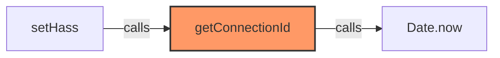

### `setHass` (🌐 Public) {#setHass}

**Parameters:**

- `hass`: `HomeAssistant`

**Returns:** `void`

**Calls:**

- `Date.now`
- [[websocket|websocket]]#getConnectionId
- [[logger|logger]]#log
- [[websocket|websocket]]#_resubscribeAll

**Called By:**

- From [[inventree-card|inventree-card]]:
  - `connectedCallback`
  - `_initializeServices`
- From [[card-controller|card-controller]]:
  - `setHass`
  - `initializeServices`
- From [[state|state]]:
  - `setHass`

**Call Graph:**

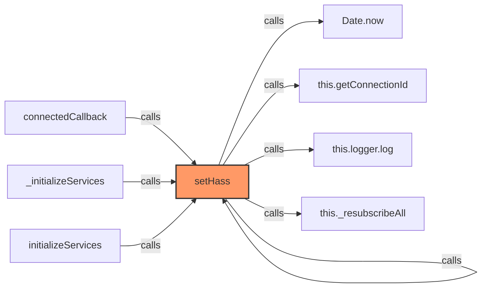

### `subscribeToEntity` (🌐 Public) {#subscribeToEntity}

**Parameters:**

- `entityId`: `string`
- `callback`: `(data: any) => void`

**Returns:** `() => void`

**Calls:**

- [[logger|logger]]#log
- [[logger|logger]]#warn
- [[cache|cache]]#has
- [[cache|cache]]#set
- [[websocket|websocket]]#_subscribeToEntity
- [[cache|cache]]#get
- `callbacks.add`
- [[cache|cache]]#delete
- [[websocket|websocket]]#_unsubscribeFromEntity
- [[cache|cache]]#delete

**Called By:**

- From [[websocket|websocket]]:
  - `subscribeToParts`

**Call Graph:**

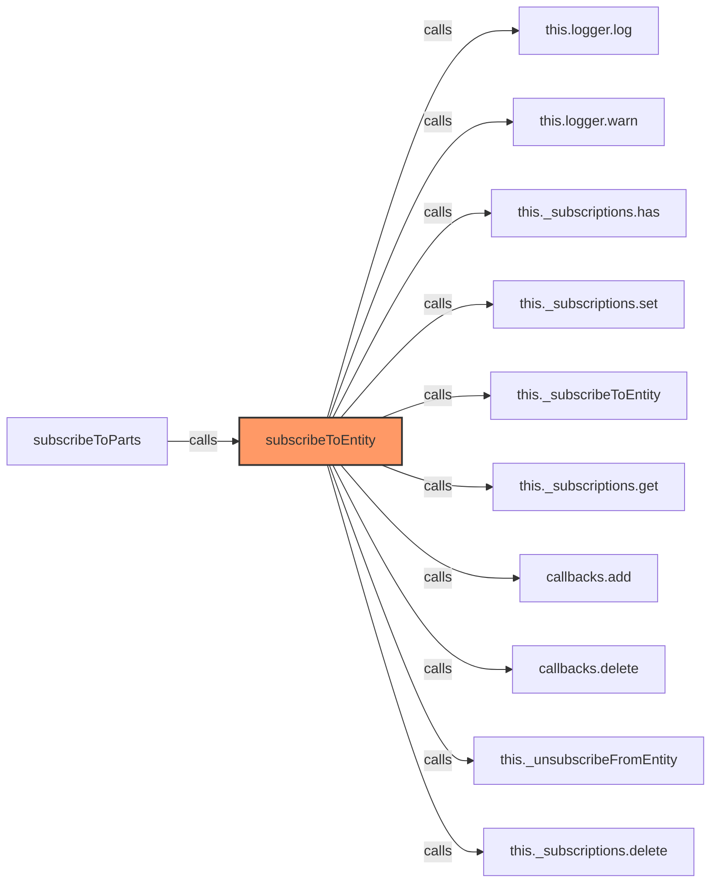

### `subscribeToParts` (🌐 Public) {#subscribeToParts}

**Parameters:**

- `entityId`: `string`
- `callback`: `(parts: any[]) => void`

**Returns:** `() => void`

**Calls:**

- [[logger|logger]]#log
- [[websocket|websocket]]#subscribeToEntity
- `Array.isArray`
- `callback`

**Called By:**

- From [[inventree-card|inventree-card]]:
  - `connectedCallback`
- From [[card-controller|card-controller]]:
  - `subscribeToEntityChanges`

**Call Graph:**

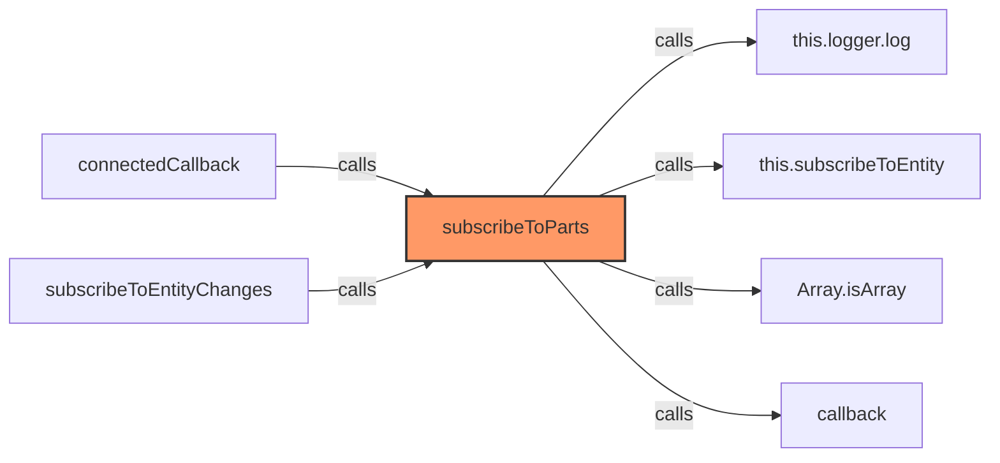

### `_handleEntityMessage` (🔒 Private) {#_handleEntityMessage}

**Parameters:**

- `entityId`: `string`
- `callback`: `SubscriptionCallback`
- `event`: `MessageEvent`

**Returns:** `void`

**Calls:**

- `JSON.parse`
- [[websocket|websocket]]#_isMessageForEntity
- `callback`
- [[websocket-plugin|websocket-plugin]]#_processMessage
- [[logger|logger]]#error

**Call Graph:**

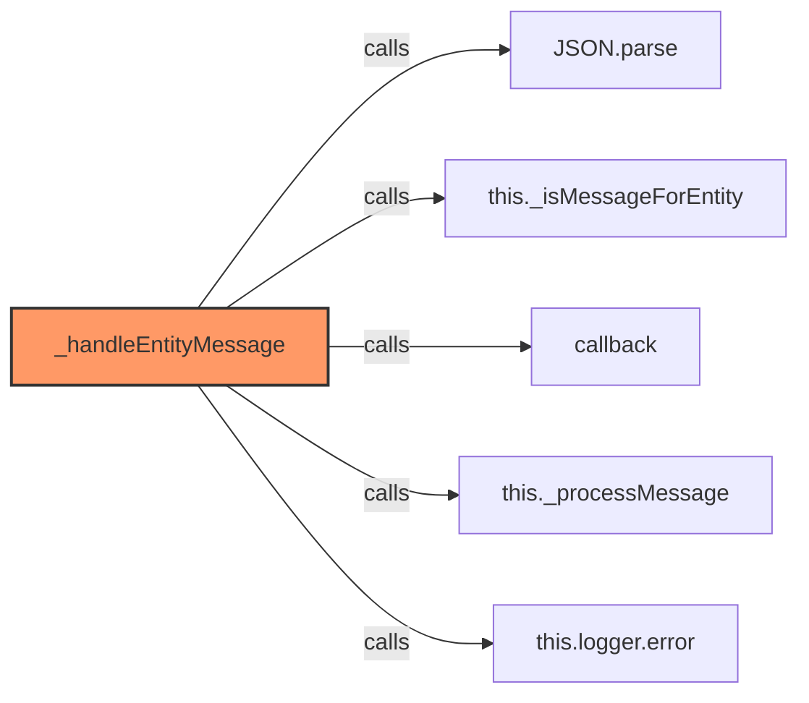

### `_subscribeToEntity` (🔒 Private) {#_subscribeToEntity}

**Parameters:**

- `entityId`: `string`

**Returns:** `void`

**Calls:**

- [[logger|logger]]#warn
- [[logger|logger]]#log
- [[cache|cache]]#get
- `callbacks.forEach`
- `callback`
- [[logger|logger]]#error
- [[websocket|websocket]]#_updateEntityState

**Called By:**

- From [[websocket|websocket]]:
  - `subscribeToEntity`
  - `_resubscribeAll`

**Call Graph:**

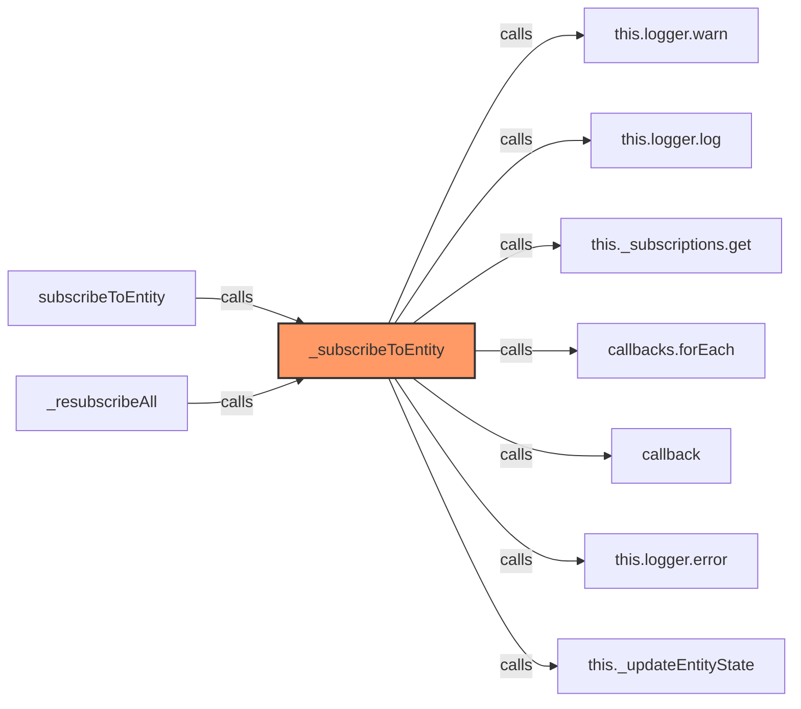

### `_unsubscribeFromEntity` (🔒 Private) {#_unsubscribeFromEntity}

**Parameters:**

- `entityId`: `string`

**Returns:** `void`

**Calls:**

- [[cache|cache]]#get
- [[logger|logger]]#log
- `subscription`
- [[cache|cache]]#delete
- [[logger|logger]]#error

**Called By:**

- From [[websocket|websocket]]:
  - `subscribeToEntity`
  - `destroy`

**Call Graph:**

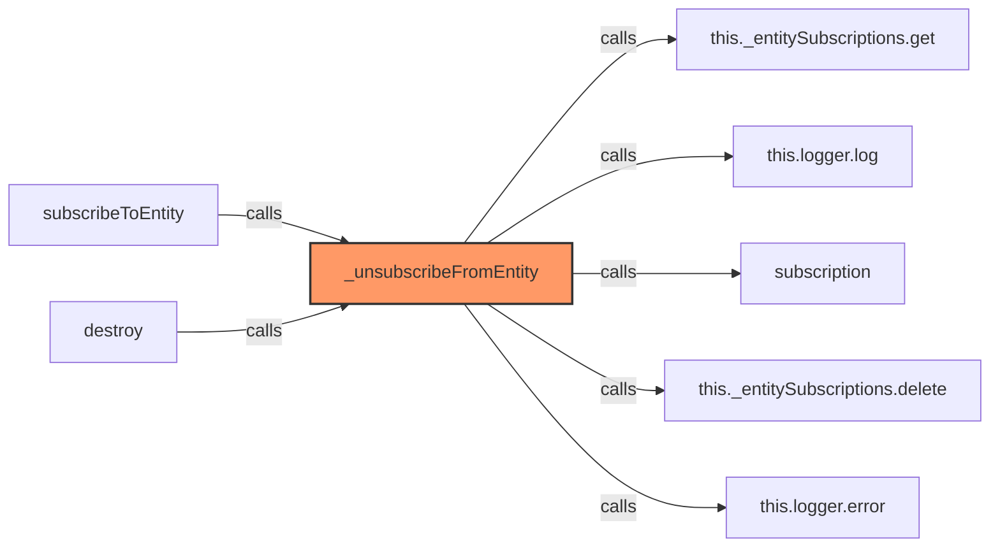

### `_resubscribeAll` (🔒 Private) {#_resubscribeAll}

**Returns:** `void`

**Calls:**

- [[logger|logger]]#log
- `this._entitySubscriptions.entries`
- `subscription`
- [[logger|logger]]#error
- [[cache|cache]]#clear
- `this._subscriptions.keys`
- [[websocket|websocket]]#_subscribeToEntity

**Called By:**

- From [[websocket|websocket]]:
  - `setHass`

**Call Graph:**

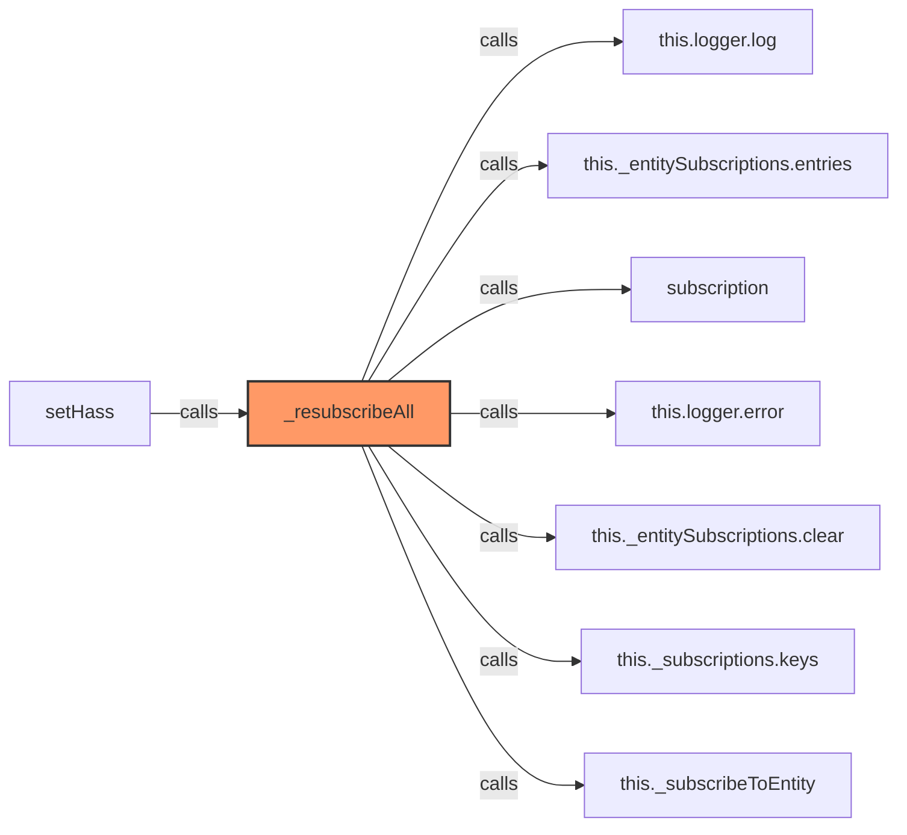

### `_updateEntityState` (🔒 Private) {#_updateEntityState}

**Parameters:**

- `entityId`: `string`
- `data`: `any`

**Returns:** `void`

**Calls:**

- `Array.isArray`
- [[inventree-state|inventree-state]]#getInstance
- [[inventree-state|inventree-state]]#setHassData
- [[inventree-state|inventree-state]]#trackLastUpdate
- [[logger|logger]]#error

**Called By:**

- From [[websocket|websocket]]:
  - `_subscribeToEntity`
  - `_startHealthCheck`

**Call Graph:**

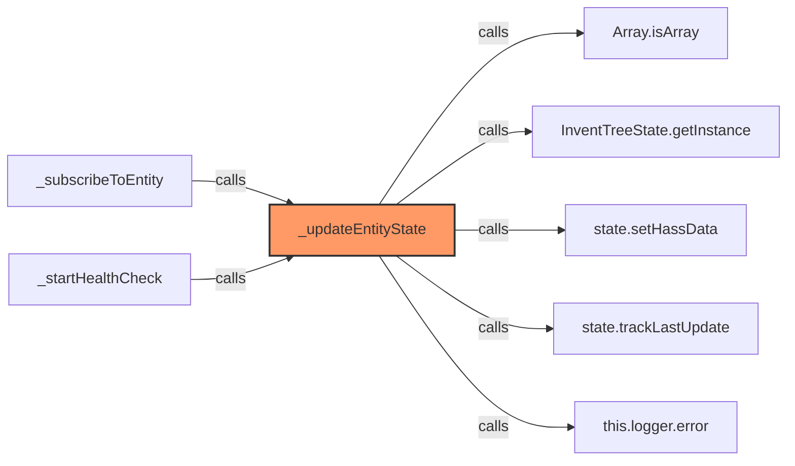

### `_isMessageForEntity` (🔒 Private) {#_isMessageForEntity}

**Parameters:**

- `message`: `any`
- `entityId`: `string`

**Returns:** `boolean`

**Calls:**

- `message.result.includes`

**Called By:**

- From [[websocket|websocket]]:
  - `_handleEntityMessage`

**Call Graph:**

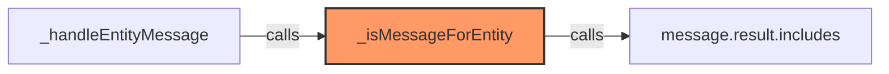

### `_processMessage` (🔒 Private) {#_processMessage}

**Parameters:**

- `message`: `any`

**Returns:** `any`

**Called By:**

- From [[websocket-plugin|websocket-plugin]]:
  - `_handleMessage`
- From [[websocket|websocket]]:
  - `_handleEntityMessage`

**Call Graph:**

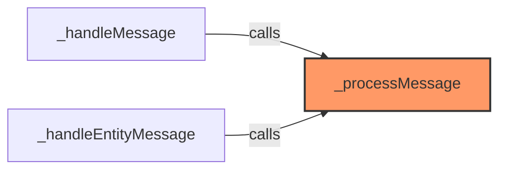

### `_startHealthCheck` (🔒 Private) {#_startHealthCheck}

**Returns:** `void`

**Calls:**

- `clearInterval`
- `setInterval`
- `this._subscriptions.forEach`
- [[websocket|websocket]]#_updateEntityState

**Call Graph:**

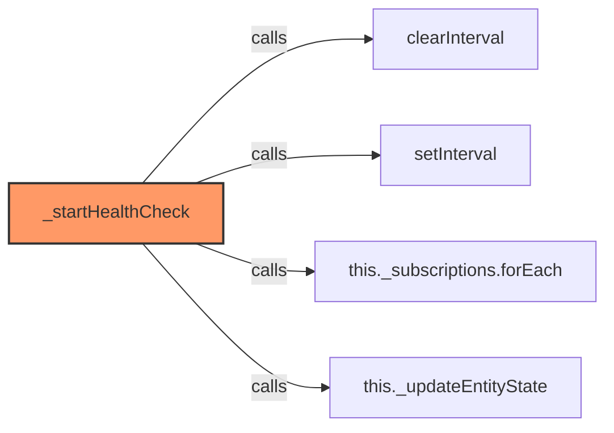

### `isConnected` (🌐 Public) {#isConnected}

**Returns:** `boolean`

**Called By:**

- From [[websocket|websocket]]:
  - `getDiagnostics`
  - `getConnectionStatus`

**Call Graph:**

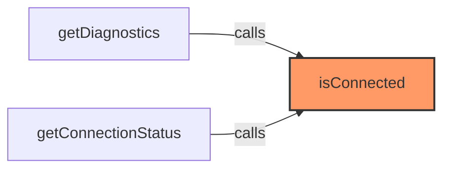

### `getDiagnostics` (🌐 Public) {#getDiagnostics}

**Returns:** `object`

**Calls:**

- [[websocket-manager|websocket-manager]]#isConnected
- `Array.from`
- `this._subscriptions.keys`

**Call Graph:**

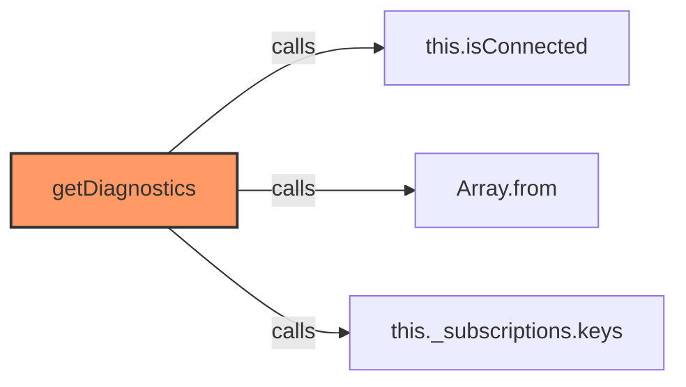

### `destroy` (🌐 Public) {#destroy}

**Returns:** `void`

**Calls:**

- `clearInterval`
- `this._subscriptions.forEach`
- [[websocket|websocket]]#_unsubscribeFromEntity
- [[cache|cache]]#clear
- [[cache|cache]]#clear
- [[logger|logger]]#log

**Called By:**

- From [[inventree-card|inventree-card]]:
  - `disconnectedCallback`

**Call Graph:**

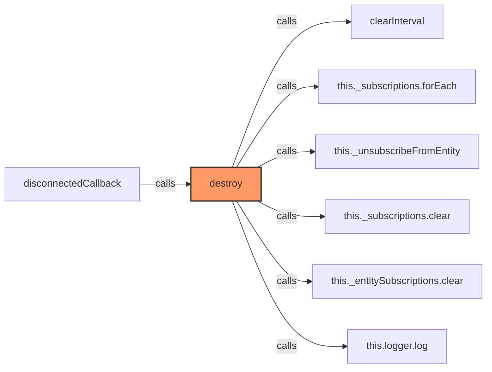

### `getConnectionStatus` (🌐 Public) {#getConnectionStatus}

**Returns:** `Record<string, boolean>`

**Calls:**

- [[websocket-manager|websocket-manager]]#isConnected

**Called By:**

- From [[card-controller|card-controller]]:
  - `getWebSocketDiagnostics`

**Call Graph:**

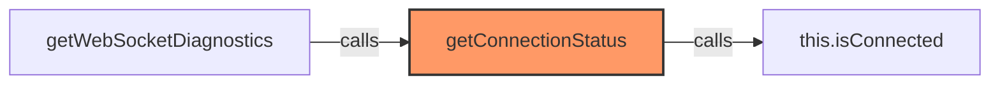

### `getApiStatus` (🌐 Public) {#getApiStatus}

**Returns:** `{ 
    failureCount: number, 
    usingFallback: boolean, 
    recentSuccess: boolean 
  }`

**Called By:**

- From [[card-controller|card-controller]]:
  - `getWebSocketDiagnostics`

**Call Graph:**

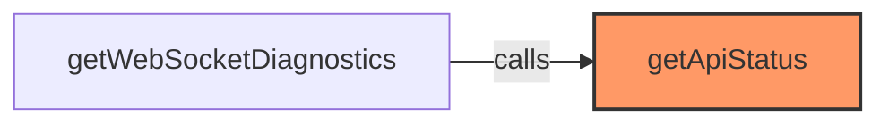

### `setDirectApi` (🌐 Public) {#setDirectApi}

**Parameters:**

- `api`: `InvenTreeDirectAPI | null`

**Returns:** `void`

**Calls:**

- [[logger|logger]]#log

**Called By:**

- From [[inventree-card|inventree-card]]:
  - `connectedCallback`
- From [[card-controller|card-controller]]:
  - `initializeApi`

**Call Graph:**

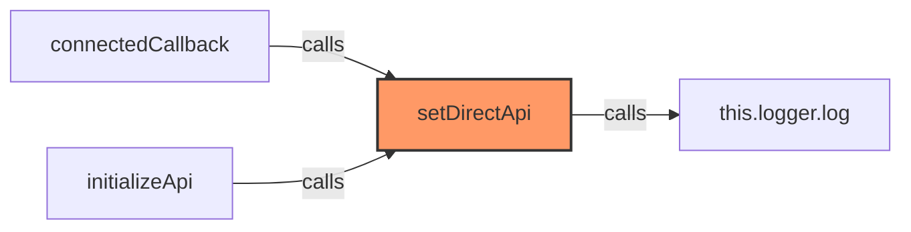

### `getDirectApi` (🌐 Public) {#getDirectApi}

**Returns:** `InvenTreeDirectAPI | null`

## Dependencies

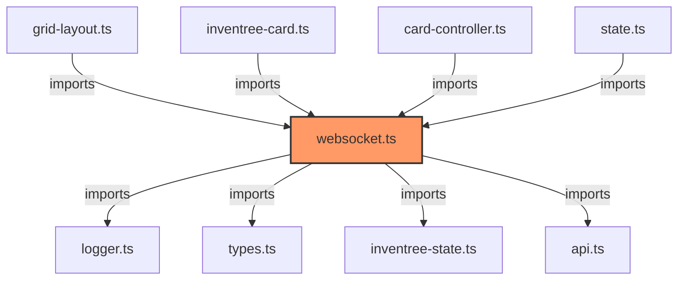

