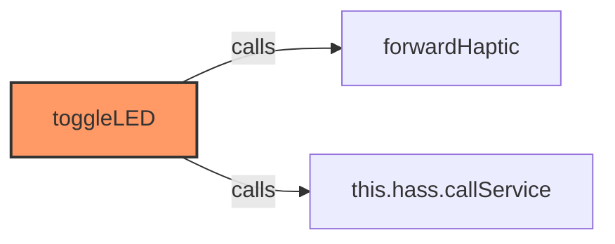
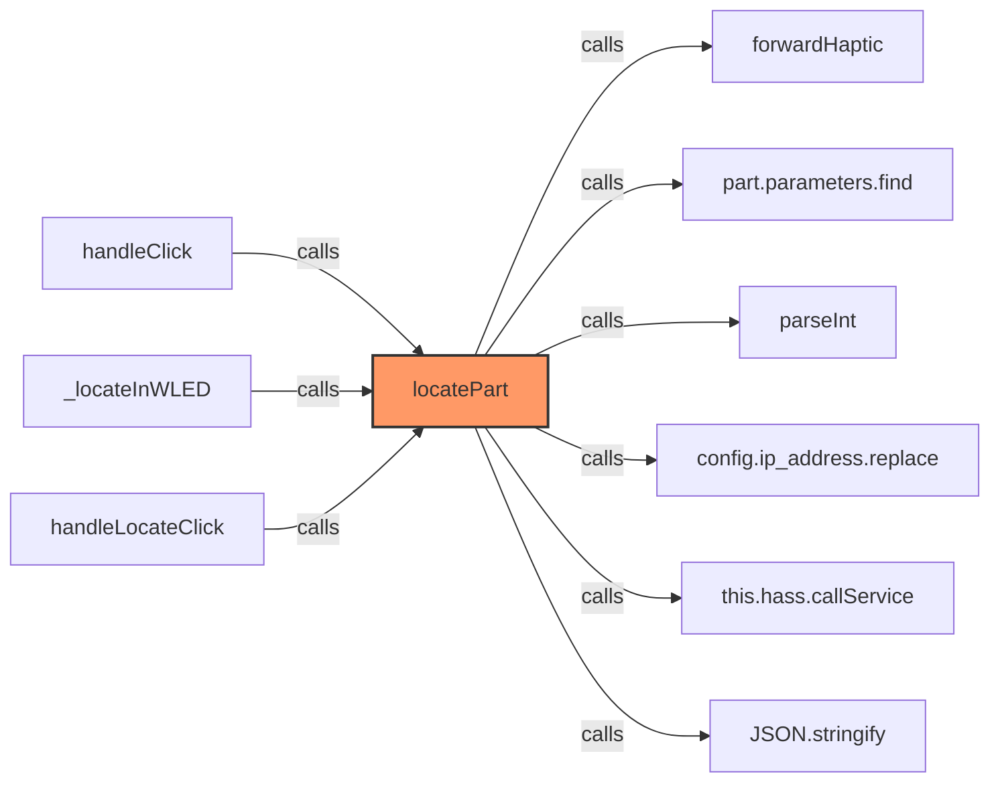
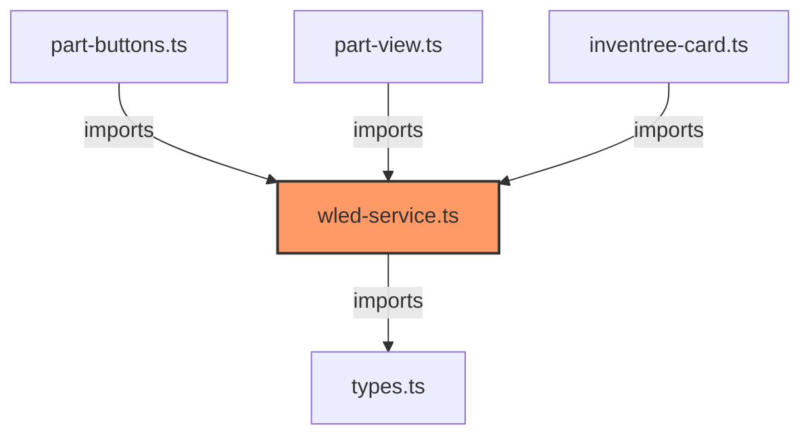

# wled-service.ts

**Path:** `services/wled-service.ts`  
**Line Count:** 102  
**Functions:** 2  

## Overview

This file is part of the `services` directory.

## Imports

- custom-card-helpers: HomeAssistant, forwardHaptic
- [[types|types]]: InvenTreePart, WLEDConfig

## Exports

- `WLEDService`

## Functions

### Class: WLEDService

### `toggleLED` (🌐 Public) {#toggleLED}

**Parameters:**

- `entityId`: `string`

**Returns:** `Promise<void>`

**Calls:**

- `forwardHaptic`
- `this.hass.callService`

**Call Graph:**

### `locatePart` (🌐 Public) {#locatePart}

**Parameters:**

- `part`: `InvenTreePart`
- `config`: `WLEDConfig`

**Returns:** `Promise<void>`

**Calls:**

- `forwardHaptic`
- `part.parameters.find`
- `parseInt`
- `config.ip_address.replace`
- `this.hass.callService`
- `JSON.stringify`

**Called By:**

- From [[part-buttons|part-buttons]]:
  - `handleClick`
- From [[part-view|part-view]]:
  - `_locateInWLED`
- From [[inventree-card|inventree-card]]:
  - `handleLocateClick`

**Call Graph:**

## Dependencies

