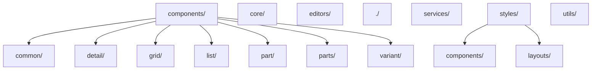
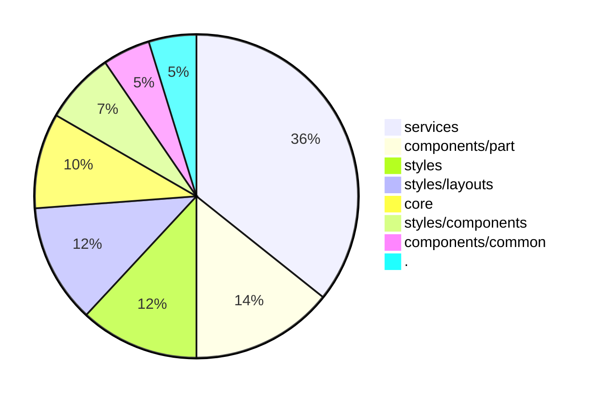

# Codebase Documentation

Welcome to the codebase documentation. This Obsidian vault contains comprehensive documentation of the codebase structure, functions, and dependencies.

## Overview

- **Total Files:** 50
- **Total Functions:** 479
- **Total Function Calls:** 2108

## Navigation

- [Files](files/index.md) - Documentation for all source files
- [Services](services/index.md) - Service layer documentation
- [Components](components/index.md) - UI components and layouts
- [Pipelines](pipelines/index.md) - Data and control flow pipelines

## Directory Structure



## Project Statistics

### Files by Directory



### Top 10 Files by Function Count

```mermaid
bar
    title Top 10 Files by Function Count
    x-axis [Files]
    y-axis [Function Count]
    "parameter-service.ts" : 45
    "editor.ts" : 39
    "inventree-card.ts" : 38
    "inventree-state.ts" : 34
    "variant-layout.ts" : 32
    "grid-layout.ts" : 27
    "rendering-service.ts" : 26
    "logger.ts" : 25
    "api.ts" : 24
    "websocket.ts" : 20
```

