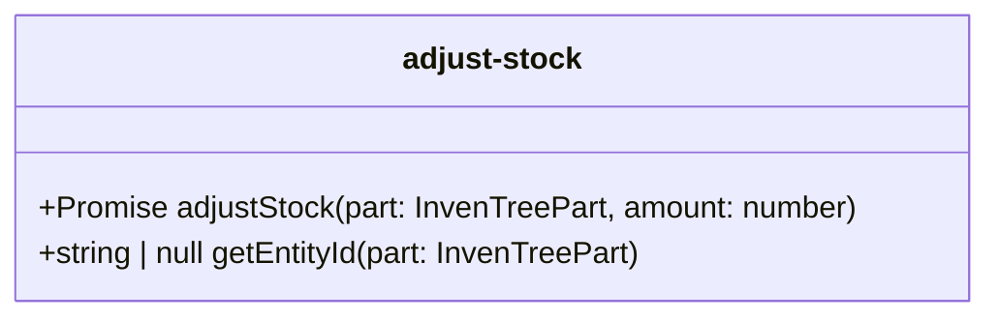

# adjust-stock.ts

**Path:** `services/adjust-stock.ts`  
**Line Count:** 45  
**Functions:** 2  

## Overview

This service is part of the `services` directory.

## Public Interface

- `adjustStock`
- `getEntityId`

## Service Interface

## Service Usage

- **[[adjust-stock|adjust-stock]]** uses:
  - `getEntityId`

## Detailed Documentation

For full implementation details, see the [adjust-stock.ts](../files/adjust-stock.md) file documentation.

