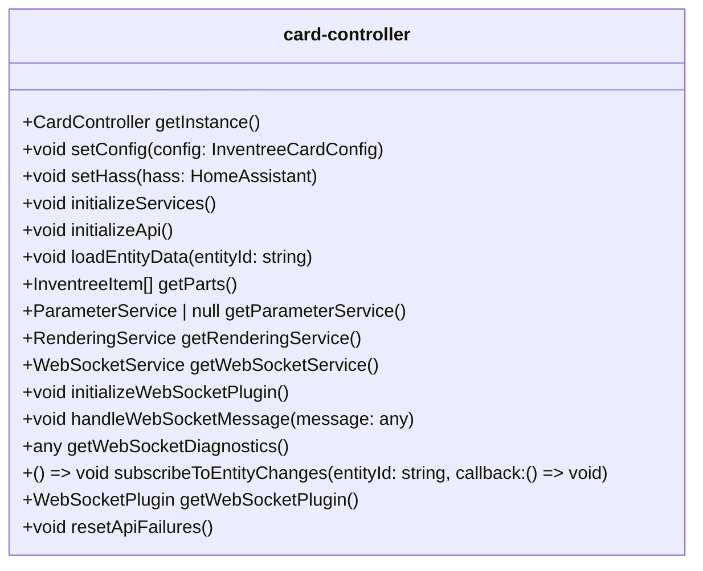

# card-controller.ts

**Path:** `services/card-controller.ts`  
**Line Count:** 680  
**Functions:** 16  

## Overview

This service is part of the `services` directory.

## Public Interface

- `getInstance`
- `setConfig`
- `setHass`
- `initializeServices`
- `initializeApi`
- `loadEntityData`
- `getParts`
- `getParameterService`
- `getRenderingService`
- `getWebSocketService`
- `initializeWebSocketPlugin`
- `handleWebSocketMessage`
- `getWebSocketDiagnostics`
- `subscribeToEntityChanges`
- `getWebSocketPlugin`
- `resetApiFailures`

## Service Interface

## Service Usage

- **[[card-controller|card-controller]]** uses:
  - `getWebSocketService`
  - `handleWebSocketMessage`
  - `initializeApi`
  - `initializeServices`
  - `initializeWebSocketPlugin`
  - `loadEntityData`

## Detailed Documentation

For full implementation details, see the [card-controller.ts](../files/card-controller.md) file documentation.

